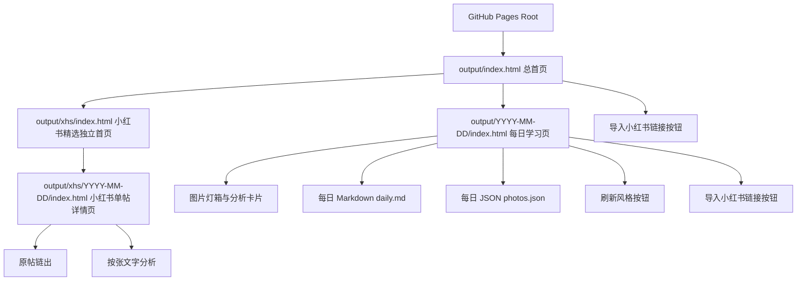
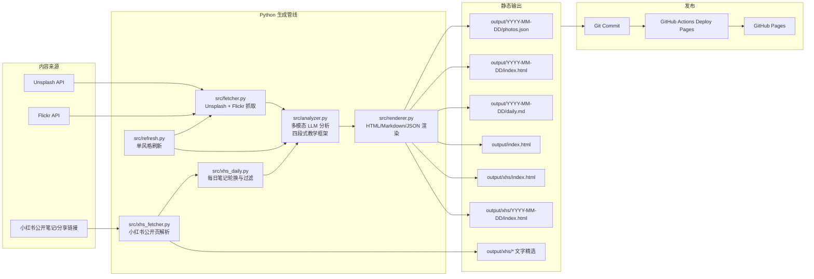
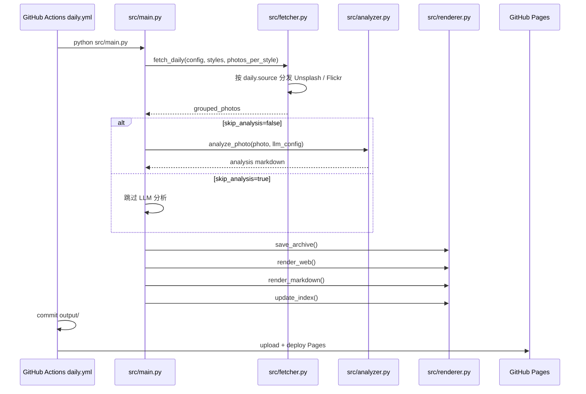
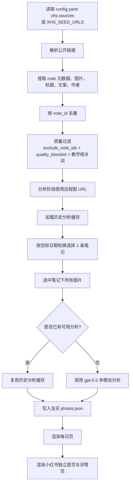
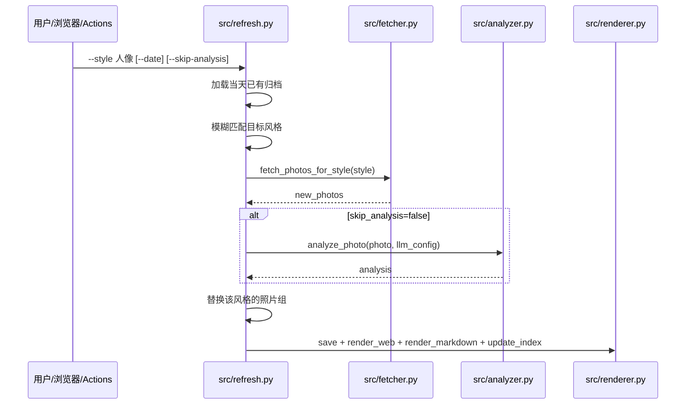
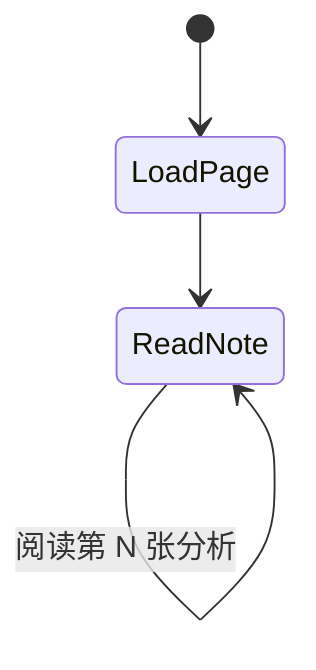
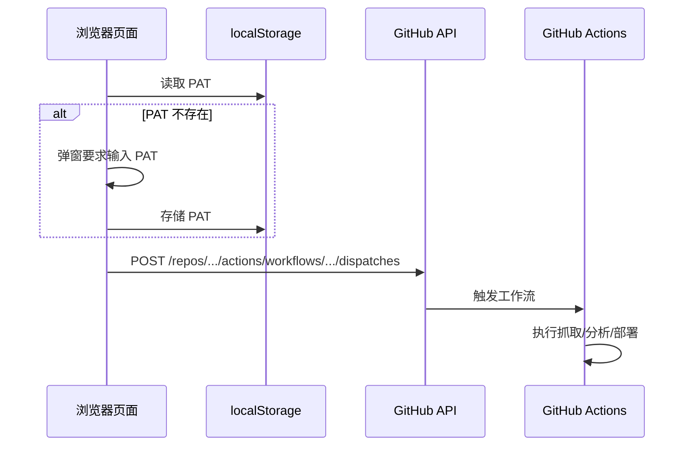
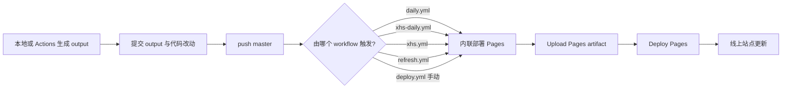
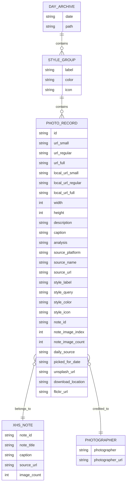

# Daily Photo Coach PRD

版本：v2.2
最近同步日期：2026-08-14
最近同步实现提交：基于 `master` 分支全量代码审查
线上站点：https://krisaruz.github.io/daily-photo-coach/

## 1. 文档维护规则

本 PRD 是 Daily Photo Coach 的产品事实源。任何会改变用户体验、数据流、自动化流程、外部集成、配置项、输出格式、页面结构、分析策略或内容质量策略的改动，都必须在同一次改动中同步更新本文件。

不需要更新 PRD 的改动仅限于：

- 纯日志、临时脚本、一次性本地调试文件。
- 不改变产品行为的格式化、注释修正、拼写修正。
- 只刷新 `output/` 中当天内容，且没有改变生成规则或页面结构。

如果一次改动被判断为"不需要更新 PRD"，提交或 PR 说明里必须明确写出原因。

## 2. 产品概述

Daily Photo Coach 是一个每日摄影学习内容生成与发布系统。它从高质量摄影来源获取图片，结合图片元数据、作者信息、帖子文案与多模态大模型分析，生成可浏览的静态摄影学习站点。

当前产品由两条内容线组成：

1. Unsplash 每日摄影教练：按风格抓取摄影作品，生成每日多风格学习页。
2. 小红书摄影精选：按公开笔记池每日轮换一条摄影帖子，抓取该帖多张图片，并逐张生成分析，独立呈现在小红书学习站中。

系统最终输出静态文件到 `output/`，由 GitHub Pages 发布。

## 3. 背景与问题

用户希望每天看到可直接学习的摄影案例，而不是泛泛的图片推荐。早期 Unsplash 图片质量稳定，但内容与国内摄影表达、社交平台拍法和人像写真场景有距离。小红书上有大量摄影博主会直接分享拍摄机位、文案、氛围和拍法，因此系统需要支持从公开小红书笔记中获取多图素材并结合文案分析。

小红书公开网页存在反爬、登录风控和分享链接跳转不稳定的问题。项目因此不做无限制搜索式爬取，而采用「可信公开笔记池 + 每日轮换 + 质量过滤 + 链出原文」的策略。公开站点不托管、不热链小红书原图。

## 4. 产品目标

- 每天自动生成一个可浏览的摄影学习站点。
- 为每张照片提供结构化、可复刻的摄影教学分析。
- 支持 Unsplash 多风格图片与小红书多图帖子两种来源。
- 可选支持 Flickr 作为替代图片来源。
- 小红书内容每天对应一条帖子，并分析帖子里的全部可用图片。
- 小红书学习入口独立于主日报，避免日期跳转和内容混杂。
- 页面可直接托管到 GitHub Pages，无需后端服务。
- 内容生成流程可在本地和 GitHub Actions 中运行。
- 浏览器内可直接触发 GitHub Actions 工作流（导入小红书链接、刷新风格），无需打开 GitHub。

## 5. 非目标

- 不实现绕过登录、验证码、付费墙或访问控制的爬取。
- 不承诺小红书公开搜索或主页可以稳定大规模抓取。
- 不做用户账号系统、评论系统、数据库后台或服务端管理台。
- 不把项目变成图片存储平台。Unsplash 继续引用远端图片；小红书原图不在本站托管或热链展示。
- 不保证大模型分析结果是摄影事实的唯一标准，输出定位为学习辅助。

## 6. 目标用户

| 用户 | 需求 | 关键场景 |
| --- | --- | --- |
| 摄影学习者 | 每天看几张照片，学习构图、光线、色彩和拍法 | 打开 GitHub Pages 学习当天内容 |
| 博客维护者 | 自动生成内容并发布到博客 | 定时任务生成、提交、部署 |
| 内容策展者 | 把认可的小红书公开帖子加入学习池 | 配置 `xhs.sources` 或 GitHub Secret |
| 开发维护者 | 快速调整抓取、分析、渲染逻辑 | 本地运行脚本、修改模板、验证输出 |

## 7. 当前范围

### 7.1 Unsplash 每日摄影教练

系统根据 `config.yaml` 或环境变量里的 `daily.styles` 和 `photos_per_style`，从 Unsplash 拉取不同风格的图片，并写入当天目录。

当前默认风格包括：

- 风光/自然
- 人像/质感
- 街头/人文
- 极简/建筑
- 美食/静物
- 夜景/城市
- 微距/特写
- 黑白/光影

每张 Unsplash 图片需要包含：

- 图片 ID
- small / regular / full 图片 URL
- 作者名、作者链接、Unsplash 原链接
- 下载跟踪链接
- EXIF 元数据
- 图片尺寸与描述
- 风格标签、颜色和图标
- LLM 分析文本

#### Unsplash 抓取能力

- 优先使用 Unsplash Search（`order_by=relevant`，每方向最多 30 张）组成候选池，再按教学评分取 Top N；Search 不足时才补充 `/photos/random`。
- 支持 `query` 关键词搜索和 `topics` 官方精选集两种方式。Search 使用 query；random 补充阶段可带 topics / featured。
- `query` 字段支持单个字符串或字符串列表；使用列表时，按轮换方式交替使用不同关键词。
- 支持 `orientation` 轮换（landscape / portrait），同一风格混入横图与竖图候选。
- 支持 `unsplash.featured: true` 配置，仅在 random 补充抓取时生效。
- 支持 `content_filter: high` 保证内容质量。
- 支持全局历史 ID 去重，扫描所有历史 `photos.json` 避免重复。
- 质量门槛：长边 ≥ 1600、likes ≥ 40、拒绝赞助图和“tag me on instagram”类引流文案。
- 评分偏好：高 likes、高分辨率、有相机 EXIF；风光/建筑偏横图，人像偏竖图；正方形构图降权。
- 同一风格优先选择不同摄影师，避免一天内连续出现同一作者。

### 7.2 Flickr 备选数据源

系统可选使用 Flickr 替代 Unsplash 作为图片来源。通过 `daily.source: "flickr"` 切换。

Flickr 抓取能力：

- 使用 `flickr.photos.search` API 按 interestingness-desc 排序获取高质量照片。
- 支持 `flickr.photos.getExif` API 获取照片 EXIF 元数据。
- 支持 orientation 过滤（按宽高比判断 landscape / portrait / squarish）。
- 支持全局 ID 去重。
- 输出 PhotoRecord 结构与 Unsplash 兼容，下游 analyzer 和 renderer 无需区分来源。

### 7.3 小红书摄影精选

系统从配置或环境变量读取小红书公开笔记/分享链接，构建候选池。每日任务在 `note` 模式下选择一条笔记，并写入该笔记下的多张图片。每张图独立调用模型分析。

当前关键策略：

- 每天选择 1 条小红书帖子。
- 每条帖子最多解析 18 张图片。
- 默认使用 `gpt-5.5` 分析小红书内容。
- 支持 `exclude_note_ids` 排除已知低质量或不适合教学的笔记。
- 支持 `quality_blocklist` 过滤文案明显不适合作为摄影教学样本的内容。
- 纯旅行「攻略」且不含摄影关键词的笔记会被丢掉；人像/写真/妆造等关键词加权。
- 近 6 天用过的 `note_id` 大幅降权，避免连续重复。
- 公开页若被平台 404 / 返回小红书 Logo 占位图，不得当作作品图；改为从历史归档里已有分析文字的笔记元数据回退。
- 支持复用历史分析缓存，避免同一图片反复调用模型。
- 分析阶段可把远程图片 URL 交给模型；公开 HTML / Markdown 只保留学习笔记和原帖链接，不展示、不托管小红书照片。

### 7.4 LLM 分析教学框架

当前 Prompt 采用 **四段式教学结构**，以佳能 Canon EOS R10 用户为目标学员，总字数 250–400 字：

| 段落 | 内容 |
| --- | --- |
| 直觉 | 1-2 句话，这张照片最打动你的点 |
| 技法拆解 | 3-5 个要点，挑最值得说的（曝光/构图/光线/色彩），结合 EXIF 实际参数 |
| 实拍操作（佳能 R10） | 手把手告诉学员怎么拍：模式拨盘选择、推荐参数、镜头焦段建议（RF-S / RF）、现场操作 2-3 步 |
| 后期思路 | 2-3 句话说明后期方向，调什么、往什么感觉走，点到即止 |

分析时输入的上下文包括：

- 图片 URL（high detail）
- 风格分类
- 图片来源名称
- 照片描述
- 博主标题（小红书）
- 博主文案（小红书，作为拍摄语境参考）
- EXIF 数据

### 7.5 单风格刷新

`src/refresh.py` 提供单风格刷新能力：仅重新抓取并分析指定风格的照片，保留当天其他风格不变。

- 支持 `--style` 关键词模糊匹配。
- 支持 `--skip-analysis` 仅抓取不分析。
- 支持 `--date` 指定日期。
- 抓取完成后自动合并到当天归档并重新渲染。

### 7.6 静态页面

系统生成以下静态页面：

| 页面 | 路径 | 作用 |
| --- | --- | --- |
| 总首页 | `output/index.html` | 查看历史日报、风格统计、小红书精选入口 |
| 每日页 | `output/YYYY-MM-DD/index.html` | 查看当天 Unsplash 与小红书栏目内容 |
| 每日 Markdown | `output/YYYY-MM-DD/daily.md` | 归档当天分析全文 |
| 每日 JSON | `output/YYYY-MM-DD/photos.json` | 结构化数据源 |
| 小红书独立首页 | `output/xhs/index.html` | 只浏览小红书每日帖子 |
| 小红书详情页 | `output/xhs/YYYY-MM-DD/index.html` | 浏览某天小红书单帖多图分析 |

小红书详情页当前布局要求：

- 不展示小红书原图。
- Hero 为标题、作者、说明和「在小红书查看原图」按钮。
- 下方按「第 N / M 张」列出已有分析文字。
- 注明本站不转载、不托管照片；原帖若可能已无法公开浏览，需提示。

### 7.7 浏览器触发 GitHub Actions

首页和每日页提供浏览器按钮，可直接触发 GitHub Actions 工作流，无需打开 GitHub：

| 按钮 | 触发的 Workflow | 功能 |
| --- | --- | --- |
| 导入小红书链接 | `xhs.yml` | 输入公开小红书链接，由 Actions 抓取、分析并部署 |
| 刷新风格 | `refresh.yml` | 重新抓取指定风格的 Unsplash 照片 |

实现方式：

- 首次使用需在浏览器输入 GitHub PAT（仅需 Actions write 权限）。
- PAT 存储在浏览器 `localStorage` 中。
- 通过 `api.github.com/repos/.../actions/workflows/.../dispatches` 触发。

## 8. 信息架构



## 9. 系统架构



## 10. 核心流程

### 10.1 Unsplash 每日生成流程



### 10.2 小红书每日轮换流程



### 10.3 单风格刷新流程



### 10.4 小红书单帖详情页交互流程



### 10.5 浏览器触发 Actions 流程



### 10.6 发布流程



## 11. 数据模型

### 11.1 PhotoRecord

`photos.json` 当前以风格标签分组，核心结构如下：



### 11.2 小红书字段约定

| 字段 | 含义 |
| --- | --- |
| `source_platform` | 小红书图片固定为 `xhs` |
| `source_name` | 展示来源名，通常为 `小红书` |
| `source_url` | 原始公开笔记链接 |
| `note_id` | 小红书笔记 ID |
| `note_title` | 笔记标题 |
| `caption` | 博主文案 |
| `note_image_index` | 当前图片在该帖中的序号，从 1 开始 |
| `note_image_count` | 该帖总图片数 |
| `local_url_*` | 已废弃；重建归档时删除，渲染器忽略 |
| `daily_source` | 每日轮换写入的图片标记为 `xhs_daily` |
| `picked_for_date` | 该图片被选入的日期 |

### 11.3 Flickr 字段约定

Flickr 图片的 PhotoRecord 与 Unsplash 兼容，额外包含：

| 字段 | 含义 |
| --- | --- |
| `flickr_url` | Flickr 照片页链接 |
| `unsplash_url` | 复用字段名，存放 Flickr 照片链接以兼容 renderer |

### 11.4 EXIF 子结构

| 字段 | 含义 |
| --- | --- |
| `make` | 相机厂商 |
| `model` | 相机型号 |
| `aperture` | 光圈值 |
| `exposure_time` | 快门速度 |
| `focal_length` | 焦距 |
| `iso` | ISO 感光度 |

## 12. 功能需求

### 12.1 内容抓取

| 编号 | 需求 | 优先级 |
| --- | --- | --- |
| F-001 | 支持从 Unsplash 按风格 query 抓取图片 | P0 |
| F-002 | 支持读取历史图片 ID，降低重复 | P0 |
| F-003 | 支持从小红书公开分享链接或笔记链接解析图片 | P0 |
| F-004 | 公开站不托管、不热链展示小红书原图；只保留笔记和分析 | P0 |
| F-005 | 支持通过配置或 `XHS_SEED_URLS` 扩展小红书来源池 | P0 |
| F-006 | 支持过滤已知低质量或不适合教学的小红书笔记 | P0 |
| F-007 | 不绕过登录、验证码或访问控制 | P0 |
| F-008 | 支持 Unsplash Topics 官方精选集抓取，优先于 query | P1 |
| F-009 | 支持 query 字段为字符串列表，轮换使用多个关键词 | P1 |
| F-010 | 支持 Flickr 作为替代数据源（`daily.source: "flickr"`） | P1 |
| F-011 | Flickr 支持 EXIF 元数据获取 | P1 |
| F-012 | 支持 `unsplash.featured` 仅抓取编辑精选照片 | P1 |

### 12.2 分析生成

| 编号 | 需求 | 优先级 |
| --- | --- | --- |
| F-101 | 支持多模态 LLM 分析图片 | P0 |
| F-102 | 支持将 EXIF、标题、文案、作者信息输入模型 | P0 |
| F-103 | 小红书默认使用 `gpt-5.5` | P0 |
| F-104 | 支持跳过分析，仅抓取和渲染 | P1 |
| F-105 | 支持强制重新分析 | P1 |
| F-106 | 支持复用历史分析缓存 | P1 |
| F-107 | 分析输出遵循四段式教学框架（直觉/技法拆解/实拍操作·佳能R10/后期思路） | P0 |
| F-108 | 小红书博主文案作为拍摄语境参考融入分析 | P0 |

### 12.3 页面渲染

| 编号 | 需求 | 优先级 |
| --- | --- | --- |
| F-201 | 生成每日 HTML 页面 | P0 |
| F-202 | 生成每日 Markdown 页面 | P0 |
| F-203 | 生成每日 JSON 数据 | P0 |
| F-204 | 生成历史总首页 | P0 |
| F-205 | 首页展示小红书精选入口和最近小红书帖子 | P0 |
| F-206 | 生成小红书独立首页 | P0 |
| F-207 | 生成小红书单帖详情页 | P0 |
| F-208 | 小红书详情页按张列出分析，并提供原帖链出 | P0 |
| F-209 | 小红书详情页按「第 N 张」列出分析，并链到原帖 | P0 |
| F-210 | 首页和每日页提供浏览器内触发 GitHub Actions 的按钮 | P1 |

### 12.4 自动化

| 编号 | 需求 | 优先级 |
| --- | --- | --- |
| F-301 | 每日自动运行 Unsplash 生成任务 | P0 |
| F-302 | 每日自动运行小红书精选任务 | P0 |
| F-303 | 支持手动导入小红书链接 | P0 |
| F-304 | 支持单风格刷新（`src/refresh.py` + `refresh.yml`） | P1 |
| F-305 | 生成结果自动提交并部署 GitHub Pages | P0 |
| F-306 | 每个 workflow 自带内联部署，无需依赖独立 deploy.yml | P0 |
| F-307 | xhs-daily workflow 支持手动指定 backfill_days 和 date | P1 |

## 13. 非功能需求

| 类别 | 要求 |
| --- | --- |
| 稳定性 | 单个来源失败时应跳过或报错清晰，不影响已有站点文件 |
| 可维护性 | 配置、抓取、分析、渲染模块分离 |
| 可审计性 | 每日输出保留 JSON 和 Markdown |
| 性能 | 静态站可直接由 GitHub Pages 托管；详情页无需后端请求 |
| 成本控制 | 支持 `--skip-analysis`、历史分析缓存和可选强制重跑 |
| 合规 | 不绕过平台访问控制；只处理公开且有权引用的内容 |
| 可访问性 | 按钮提供可理解文案；原帖链使用 `rel="noopener"` |
| 响应式 | 首页、每日页、小红书详情页需兼容桌面和移动端 |
| 容错 | LLM 分析支持指数退避重试；Unsplash 限流自动等待 61 分钟后重试 |

## 14. 配置与密钥

### 14.1 本地配置

`config.yaml` 不应提交。示例配置见 `config.yaml.example`。

支持 `${ENV_VAR}` 语法在 YAML 中引用环境变量。

关键配置：

| 配置项 | 说明 |
| --- | --- |
| `unsplash.access_key` | Unsplash API 密钥 |
| `unsplash.featured` | 是否仅抓取编辑精选（默认 false） |
| `flickr.api_key` | Flickr API 密钥（可选） |
| `llm.url` | LLM API 端点 |
| `llm.model` | Unsplash 分析使用的模型（默认 gpt-4o） |
| `llm.headers.Authorization` | LLM API 鉴权头 |
| `llm.timeout` | LLM 请求超时（秒） |
| `llm.max_retries` | LLM 最大重试次数 |
| `daily.source` | 图片来源（`unsplash` 或 `flickr`，默认 unsplash） |
| `daily.photos_per_style` | 每风格抓取照片数 |
| `daily.styles` | 风格列表（含 query/topics、label、color、icon） |
| `xhs.model` | 小红书分析使用的模型（默认 gpt-5.5） |
| `xhs.sources` | 小红书公开链接来源列表 |
| `xhs.max_notes_per_source` | 每个来源最多解析的笔记数 |
| `xhs.max_images_per_note` | 每条笔记最多解析的图片数 |
| `xhs.exclude_note_ids` | 排除的笔记 ID 列表 |
| `xhs.quality_blocklist` | 文案质量黑名单词列表 |
| `xhs.cookie` | 可选 Cookie |
| `output.dir` | 输出目录 |

### 14.2 GitHub Secrets

| Secret | 用途 |
| --- | --- |
| `UNSPLASH_ACCESS_KEY` | Unsplash API 抓取 |
| `OPENAI_API_KEY` | OpenAI API 鉴权 |
| `LLM_AUTH` | 兼容自定义网关鉴权 |
| `LLM_URL` | 兼容自定义 LLM 端点 |
| `LLM_MODEL` | 覆盖 Unsplash 分析模型 |
| `XHS_LLM_MODEL` | 覆盖小红书分析模型 |
| `XHS_SEED_URLS` | 小红书公开链接池（逗号或换行分隔） |
| `XHS_COOKIE` | 可选，仅用于有权访问但偶发需要 Cookie 的公开页面 |
| `FLICKR_API_KEY` | Flickr API 密钥（可选） |
| `DAILY_SOURCE` | 图片来源切换（可选） |

### 14.3 CI 环境变量

以下环境变量用于 CI/GitHub Actions 中从环境构建完整配置：

| 变量 | 默认值 | 说明 |
| --- | --- | --- |
| `UNSPLASH_FEATURED` | `true` | 是否仅抓取编辑精选 |
| `PHOTOS_PER_STYLE` | `3` | 每风格照片数 |
| `LLM_TIMEOUT` | `300` | LLM 超时秒数 |
| `LLM_MAX_RETRIES` | `3` | LLM 最大重试数 |
| `LLM_GATEWAY_UID` | - | AI Gateway 用户 ID（可选） |
| `LLM_GATEWAY_PRODUCT` | - | AI Gateway 产品名（可选） |
| `LLM_GATEWAY_INTENTION` | - | AI Gateway 意图编码（可选） |
| `XHS_MAX_NOTES` | `3` | 小红书每来源最大笔记数 |
| `XHS_MAX_IMAGES_PER_NOTE` | `18` | 小红书每笔记最大图片数 |
| `OUTPUT_DIR` | `output` | 输出目录 |

## 15. 命令与工作流

### 15.1 本地命令

```bash
pip install -r requirements.txt

# Unsplash 日报
python src/main.py
python src/main.py --date 2026-06-14
python src/main.py --skip-fetch
python src/main.py --skip-analysis
python src/main.py --force-analysis
python src/main.py --per-style 2
python src/main.py --styles 风光 人像

# 单风格刷新
python src/refresh.py --style 人像
python src/refresh.py --style 街头 --date 2026-06-14
python src/refresh.py --style 风光 --skip-analysis

# 小红书导入
python src/xhs_import.py --url "https://example.com/share" --style "小红书｜人像写真"
python src/xhs_import.py --url "https://example.com/share" --skip-analysis

# 小红书每日精选
python src/xhs_daily.py --mode note --count 1
python src/xhs_daily.py --date 2026-06-14 --backfill-days 20 --style "小红书｜人像写真" --mode note --count 1
python src/xhs_daily.py --force-analysis

# 重新渲染小红书站
python -c "from src.renderer import render_xhs_site; render_xhs_site('output')"
```

### 15.2 GitHub Actions

| Workflow | 文件 | 触发 | 作用 | 内联部署 |
| --- | --- | --- | --- | --- |
| Daily Photo Coach | `daily.yml` | 北京时间 09:20–22:20 每小时一次；由 `analysis_schedule.py` 在当天 9–22 点中抽一个稳定随机整点执行，错过则补跑。手动 `workflow_dispatch` 强制执行 | 生成 Unsplash 每日内容 + 小红书精选并部署 | 是 |
| Daily Xiaohongshu Pick | `xhs-daily.yml` | 仅手动（支持 backfill_days、date、skip_analysis 输入） | 补跑或回填小红书每日精选并部署 | 是 |
| Import XHS | `xhs.yml` | 手动 | 导入指定小红书公开链接 | 是 |
| Refresh Style | `refresh.yml` | 手动 | 刷新指定 Unsplash 风格（默认跳过分析） | 是 |
| Deploy Pages | `deploy.yml` | `output/**` push / 手动 | 独立部署 GitHub Pages（备用） | 是 |

## 16. 验收标准

### 16.1 小红书每日内容

- 一个日期的小红书栏目只包含一个 `note_id`。
- 当天小红书栏目对应一条 `note_id`，按张保留分析文字；公开页不嵌入该笔记图片。
- 被 `exclude_note_ids` 排除的笔记不得出现在新生成的小红书日期页。
- 命中 `quality_blocklist` 的笔记不得作为默认每日样本。
- `output/xhs/YYYY-MM-DD/index.html` 展示该 note 的按张分析，并链到原帖。
- 小红书公开页不得嵌入原图。

### 16.2 LLM 分析输出

- 分析输出必须包含四段（直觉/技法拆解/实拍操作/后期思路）。
- 分析总字数在 250–400 字范围内。
- 有 EXIF 数据时必须在技法拆解中结合实际参数。
- 小红书博主文案必须作为语境参考融入分析，不得机械复述。
- 分析失败时返回"（分析失败，请稍后重试）"，不影响其他图片。

### 16.3 单风格刷新

- 刷新指定风格后，当天其他风格照片不受影响。
- 刷新结果自动合并到当天归档并重新渲染。
- `--style` 支持模糊匹配。

### 16.4 页面发布

- `output/index.html` 可访问。
- `output/xhs/index.html` 可访问。
- `output/xhs/YYYY-MM-DD/index.html` 可访问。
- 小红书公开页不出现 `assets/xhs` 或小红书 CDN 作为 ``。
- Deploy Pages workflow 成功。

### 16.5 浏览器触发 Actions

- 导入小红书链接按钮能成功触发 `xhs.yml` workflow。
- 刷新风格按钮能成功触发 `refresh.yml` workflow。
- PAT 持久存储在 `localStorage`，无需每次输入。

### 16.6 PRD 同步

- 涉及产品行为的改动必须更新本 PRD。
- 涉及页面、工作流、数据结构、配置或模型策略的改动必须更新对应章节。
- PR 或提交说明必须提到 PRD 是否已同步。

## 17. 风险与应对

| 风险 | 表现 | 应对 |
| --- | --- | --- |
| 小红书反爬/登录 | 分享链接解析失败、内容跳转异常 | 使用公开笔记池；保留 Cookie 可选项；不做绕过 |
| 内容质量不稳定 | 抓到旅行攻略、情绪文案或无教学价值图片 | 使用排除 ID、blocklist、摄影相关词过滤 |
| 模型拒绝分析 | 个别图片触发安全拒绝 | 过滤已知问题 note；记录失败；支持换源 |
| API 成本 | 多图帖子会产生多次模型调用 | 复用历史分析缓存；支持 `--skip-analysis` |
| 静态资源失效 | 小红书外链图不稳定，且不宜站外展示 | 公开站只链出原帖，不托管原图 |
| 日期混杂 | 首页卡片跳错每日主页面 | 小红书卡片跳到独立 `xhs/YYYY-MM-DD/` 页面 |
| Unsplash API 限流 | 连续抓取超过每小时配额 | 自动等待 61 分钟后重试 |
| Flickr EXIF 获取失败 | 照片未开放 EXIF 或 API 返回错误 | 返回空 EXIF，不阻断后续流程 |
| PAT 安全 | 浏览器 `localStorage` 中存储 GitHub PAT | PAT 仅需 Actions write 权限，最小化授权范围 |

## 18. 源码模块索引

| 模块 | 文件 | 职责 |
| --- | --- | --- |
| 主入口 | `src/main.py` | Unsplash 每日生成流水线，支持 skip-fetch/skip-analysis/force-analysis/per-style/styles 参数 |
| 抓取器 | `src/fetcher.py` | Unsplash + Flickr 多风格图片抓取，支持 Search 候选池、质量评分、摄影师去重、query/topics、orientation 轮换、ID 去重、限流等待 |
| 调度闸门 | `src/analysis_schedule.py` | 北京时间 9–22 点窗口内按日期哈希抽取执行小时；分析失败或小红书缺失时允许补跑 |
| 分析器 | `src/analyzer.py` | 多模态 LLM 流式分析，指数退避重试 |
| Prompt | `src/prompt.py` | 四段式教学 Prompt 模板 + user message 构建 |
| 渲染器 | `src/renderer.py` | HTML/Markdown/JSON 渲染 + 首页/小红书站生成 |
| 单风格刷新 | `src/refresh.py` | 仅刷新指定风格的照片 |
| 小红书抓取 | `src/xhs_fetcher.py` | 公开页 HTML 解析、`window.__INITIAL_STATE__` 提取、OpenGraph fallback；不下载原图到站点 |
| 小红书导入 | `src/xhs_import.py` | 手动导入单条小红书公开链接 |
| 小红书每日 | `src/xhs_daily.py` | 每日笔记轮换、质量过滤、分析缓存复用、backfill |

## 19. 后续路线图

| 阶段 | 方向 | 说明 |
| --- | --- | --- |
| R1 | 小红书来源管理 | 将可信来源池抽成更易维护的数据文件 |
| R2 | 质量评分 | 对候选帖子做更细的图像与文案评分 |
| R3 | 分析对比视图 | 支持同一帖子多图的共同拍摄策略总结 |
| R4 | 本地可视化管理 | 增加来源预览、排除列表编辑、重跑入口 |
| R5 | 测试自动化 | 增加渲染结构测试和链接/图片有效性测试 |
| R6 | Prompt 演进 | 支持多设备（不仅限佳能 R10）教学模板 |

## 20. 当前已知实现边界

- 小红书公开笔记页从 2026-07-22 起经常返回 `error_code=300031` 与平台 Logo 占位图；每日精选会跳过占位图，并从历史归档的分析文字回退。新笔记需要有效的公开 URL / `XHS_SEED_URLS`。
- 公开站点不托管小红书原图。git 历史中可能仍有旧文件，本次只保证当前树与 Pages 当前部署不含这些资产。
- README、配置示例和部分源码注释在 Windows PowerShell 中可能显示为乱码，但文件应按 UTF-8 读写；后续如修复编码显示，需要单独验证不破坏内容。
- `output/` 中包含历史生成物，生成规则变化时通常只重渲染受影响页面。
- 小红书独立站目前扫描历史 `photos.json` 并按 note 分组生成页面。
- 小红书详情页是按张排列的文字分析，不再做图片轮播。
- README 中描述的"七维教学框架"为早期设计，当前实现已改为四段式结构（见 7.4 节）。
- Flickr 数据源已在代码中完整实现，但非默认数据源，需要手动配置。
- 浏览器触发 Actions 的 PAT 存储在 `localStorage`，安全性依赖于用户仅授予最小权限。
- `refresh.yml` 工作流在 CI 中默认跳过 LLM 分析（`--skip-analysis`）。

## 变更记录

| 日期 | 版本 | 变更内容 |
| --- | --- | --- |
| 2026-08-14 | v2.2 | 小红书精选改为链出原文：公开站不再托管/热链原图，历史页面重渲染为文字分析；CI 仍可临时用远程图 URL 做分析 |
| 2026-06-14 | v2.0 | 全量代码审查同步：(1) 新增 LLM 分析教学框架章节（四段式），取代旧七维描述；(2) 新增 Flickr 备选数据源章节与功能需求；(3) 新增单风格刷新章节（refresh.py）与流程图；(4) 新增浏览器触发 GitHub Actions 章节与流程图；(5) 新增 Unsplash Topics/query 列表/featured 支持；(6) 完善配置项清单，新增 daily.source、unsplash.featured、flickr.api_key、AI Gateway 环境变量等；(7) 完善 GitHub Secrets 清单；(8) 新增 CI 环境变量章节；(9) 更新系统架构图，加入 Flickr 和 refresh.py；(10) 新增单风格刷新、浏览器触发 Actions 流程图；(11) 新增 LLM 分析输出、单风格刷新、浏览器触发 Actions 验收标准；(12) 完善数据模型，新增 local_url_full、flickr_url、EXIF 子结构章节；(13) 新增源码模块索引章节；(14) 更新路线图和已知实现边界 |
| 2026-05-29 | v1.0 | 初始版本：覆盖 Unsplash 每日教练、小红书摄影精选两条产品线 |
