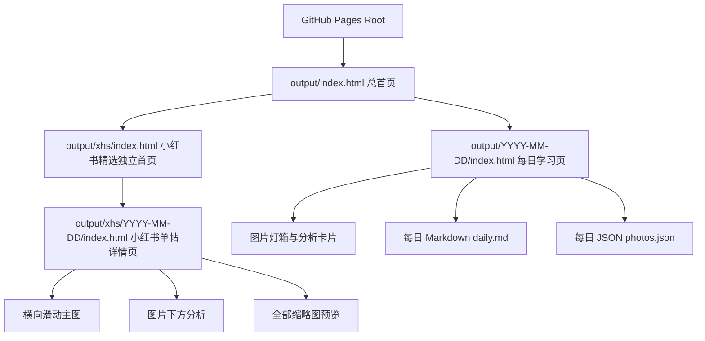
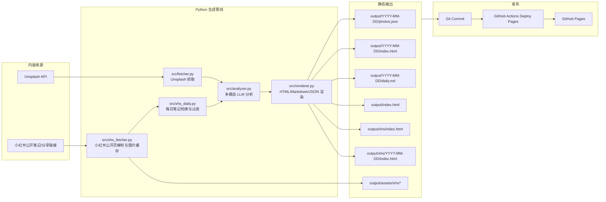
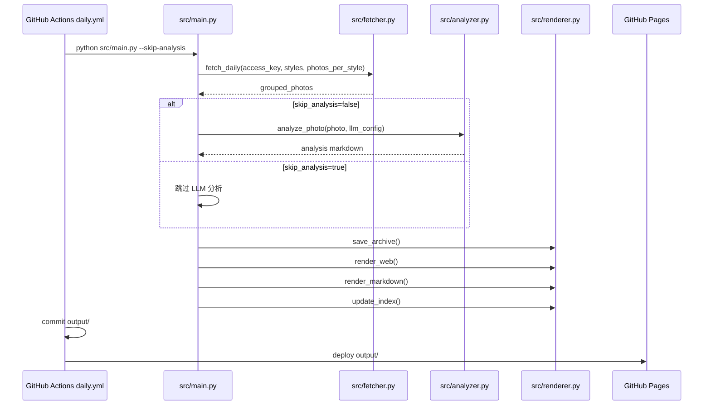
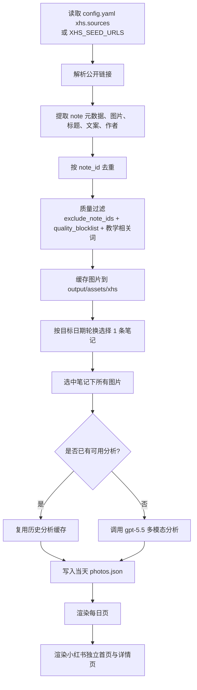
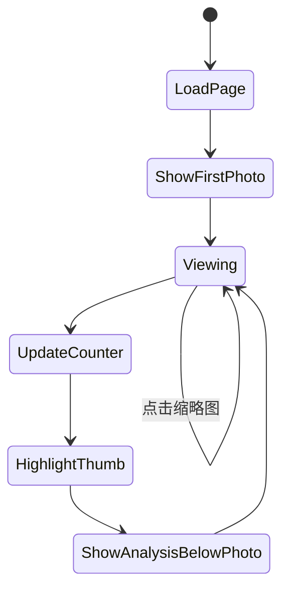
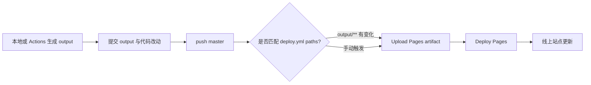
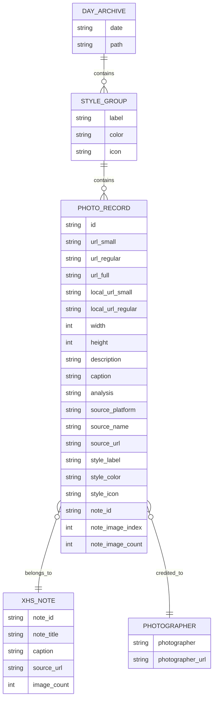

# Daily Photo Coach PRD

版本：v1.0
最近同步日期：2026-05-29
最近同步实现提交：`72cb00a`
线上站点：https://krisaruz.github.io/daily-photo-coach/

## 1. 文档维护规则

本 PRD 是 Daily Photo Coach 的产品事实源。任何会改变用户体验、数据流、自动化流程、外部集成、配置项、输出格式、页面结构、分析策略或内容质量策略的改动，都必须在同一次改动中同步更新本文件。

不需要更新 PRD 的改动仅限于：

- 纯日志、临时脚本、一次性本地调试文件。
- 不改变产品行为的格式化、注释修正、拼写修正。
- 只刷新 `output/` 中当天内容，且没有改变生成规则或页面结构。

如果一次改动被判断为“不需要更新 PRD”，提交或 PR 说明里必须明确写出原因。

## 2. 产品概述

Daily Photo Coach 是一个每日摄影学习内容生成与发布系统。它从高质量摄影来源获取图片，结合图片元数据、作者信息、帖子文案与多模态大模型分析，生成可浏览的静态摄影学习站点。

当前产品由两条内容线组成：

1. Unsplash 每日摄影教练：按风格抓取摄影作品，生成每日多风格学习页。
2. 小红书摄影精选：按公开笔记池每日轮换一条摄影帖子，抓取该帖多张图片，并逐张生成分析，独立呈现在小红书学习站中。

系统最终输出静态文件到 `output/`，由 GitHub Pages 发布。

## 3. 背景与问题

用户希望每天看到可直接学习的摄影案例，而不是泛泛的图片推荐。早期 Unsplash 图片质量稳定，但内容与国内摄影表达、社交平台拍法和人像写真场景有距离。小红书上有大量摄影博主会直接分享拍摄机位、文案、氛围和拍法，因此系统需要支持从公开小红书笔记中获取多图素材并结合文案分析。

小红书公开网页存在反爬、登录风控和分享链接跳转不稳定的问题。项目因此不做无限制搜索式爬取，而采用“可信公开笔记池 + 每日轮换 + 质量过滤 + 本地缓存资产”的策略。

## 4. 产品目标

- 每天自动生成一个可浏览的摄影学习站点。
- 为每张照片提供结构化、可复刻的摄影教学分析。
- 支持 Unsplash 多风格图片与小红书多图帖子两种来源。
- 小红书内容每天对应一条帖子，并分析帖子里的全部可用图片。
- 小红书学习入口独立于主日报，避免日期跳转和内容混杂。
- 页面可直接托管到 GitHub Pages，无需后端服务。
- 内容生成流程可在本地和 GitHub Actions 中运行。

## 5. 非目标

- 不实现绕过登录、验证码、付费墙或访问控制的爬取。
- 不承诺小红书公开搜索或主页可以稳定大规模抓取。
- 不做用户账号系统、评论系统、数据库后台或服务端管理台。
- 不把项目变成图片存储平台；优先引用远端图片，必要时缓存小红书图片资产。
- 不保证大模型分析结果是摄影事实的唯一标准，输出定位为学习辅助。

## 6. 目标用户

| 用户 | 需求 | 关键场景 |
| --- | --- | --- |
| 摄影学习者 | 每天看几张照片，学习构图、光线、色彩和拍法 | 打开 GitHub Pages 学习当天内容 |
| 博客维护者 | 自动生成内容并发布到博客 | 定时任务生成、提交、部署 |
| 内容策展者 | 把认可的小红书公开帖子加入学习池 | 配置 `xhs.sources` 或 GitHub Secret |
| 开发维护者 | 快速调整抓取、分析、渲染逻辑 | 本地运行脚本、修改模板、验证输出 |

## 7. 当前范围

### 7.1 Unsplash 每日摄影教练

系统根据 `config.yaml` 或环境变量里的 `daily.styles` 和 `photos_per_style`，从 Unsplash 拉取不同风格的图片，并写入当天目录。

当前默认风格包括：

- 风光/自然
- 人像/质感
- 街头/人文
- 极简/建筑
- 美食/静物
- 夜景/城市
- 微距/特写
- 黑白/光影

每张 Unsplash 图片需要包含：

- 图片 ID
- small / regular / full 图片 URL
- 作者名、作者链接、Unsplash 原链接
- 下载跟踪链接
- EXIF 元数据
- 图片尺寸与描述
- 风格标签、颜色和图标
- LLM 分析文本

### 7.2 小红书摄影精选

系统从配置或环境变量读取小红书公开笔记/分享链接，构建候选池。每日任务在 `note` 模式下选择一条笔记，并写入该笔记下的多张图片。每张图独立调用模型分析。

当前关键策略：

- 每天选择 1 条小红书帖子。
- 每条帖子最多解析 18 张图片。
- 默认使用 `gpt-5.5` 分析小红书内容。
- 支持 `exclude_note_ids` 排除已知低质量或不适合教学的笔记。
- 支持 `quality_blocklist` 过滤文案明显不适合作为摄影教学样本的内容。
- 支持复用历史分析缓存，避免同一图片反复调用模型。
- 小红书图片会缓存到 `output/assets/xhs/`，保证 GitHub Pages 可稳定展示。

### 7.3 静态页面

系统生成以下静态页面：

| 页面 | 路径 | 作用 |
| --- | --- | --- |
| 总首页 | `output/index.html` | 查看历史日报、风格统计、小红书精选入口 |
| 每日页 | `output/YYYY-MM-DD/index.html` | 查看当天 Unsplash 与小红书栏目内容 |
| 每日 Markdown | `output/YYYY-MM-DD/daily.md` | 归档当天分析全文 |
| 每日 JSON | `output/YYYY-MM-DD/photos.json` | 结构化数据源 |
| 小红书独立首页 | `output/xhs/index.html` | 只浏览小红书每日帖子 |
| 小红书详情页 | `output/xhs/YYYY-MM-DD/index.html` | 浏览某天小红书单帖多图分析 |

小红书详情页当前布局要求：

- 主图支持横向滑动切换。
- 左右箭头可切换图片。
- 键盘左右键可切换图片。
- 每张图片的分析位于该图片下方。
- 页面提供当天全部图片的小图预览。
- 桌面端缩略图在右侧，移动端缩略图在主图上方横向排列。

## 8. 信息架构



## 9. 系统架构



## 10. 核心流程

### 10.1 Unsplash 每日生成流程



### 10.2 小红书每日轮换流程



### 10.3 小红书单帖详情页交互流程



### 10.4 发布流程



## 11. 数据模型

### 11.1 PhotoRecord

`photos.json` 当前以风格标签分组，核心结构如下：



### 11.2 小红书字段约定

| 字段 | 含义 |
| --- | --- |
| `source_platform` | 小红书图片固定为 `xhs` |
| `source_name` | 展示来源名，通常为 `小红书` |
| `source_url` | 原始公开笔记链接 |
| `note_id` | 小红书笔记 ID |
| `note_title` | 笔记标题 |
| `caption` | 博主文案 |
| `note_image_index` | 当前图片在该帖中的序号，从 1 开始 |
| `note_image_count` | 该帖总图片数 |
| `local_url_small` | 缓存后的小图路径 |
| `local_url_regular` | 缓存后的常规图路径 |
| `daily_source` | 每日轮换写入的图片标记为 `xhs_daily` |
| `picked_for_date` | 该图片被选入的日期 |

## 12. 功能需求

### 12.1 内容抓取

| 编号 | 需求 | 优先级 |
| --- | --- | --- |
| F-001 | 支持从 Unsplash 按风格 query 抓取图片 | P0 |
| F-002 | 支持读取历史图片 ID，降低重复 | P0 |
| F-003 | 支持从小红书公开分享链接或笔记链接解析图片 | P0 |
| F-004 | 支持小红书图片缓存到静态资产目录 | P0 |
| F-005 | 支持通过配置或 `XHS_SEED_URLS` 扩展小红书来源池 | P0 |
| F-006 | 支持过滤已知低质量或不适合教学的小红书笔记 | P0 |
| F-007 | 不绕过登录、验证码或访问控制 | P0 |

### 12.2 分析生成

| 编号 | 需求 | 优先级 |
| --- | --- | --- |
| F-101 | 支持多模态 LLM 分析图片 | P0 |
| F-102 | 支持将 EXIF、标题、文案、作者信息输入模型 | P0 |
| F-103 | 小红书默认使用 `gpt-5.5` | P0 |
| F-104 | 支持跳过分析，仅抓取和渲染 | P1 |
| F-105 | 支持强制重新分析 | P1 |
| F-106 | 支持复用历史分析缓存 | P1 |

### 12.3 页面渲染

| 编号 | 需求 | 优先级 |
| --- | --- | --- |
| F-201 | 生成每日 HTML 页面 | P0 |
| F-202 | 生成每日 Markdown 页面 | P0 |
| F-203 | 生成每日 JSON 数据 | P0 |
| F-204 | 生成历史总首页 | P0 |
| F-205 | 首页展示小红书精选入口和最近小红书帖子 | P0 |
| F-206 | 生成小红书独立首页 | P0 |
| F-207 | 生成小红书单帖详情页 | P0 |
| F-208 | 小红书详情页支持左右滑动、箭头、键盘切换和缩略图跳转 | P0 |
| F-209 | 小红书详情页中每张图片的分析必须放在该图片下面 | P0 |

### 12.4 自动化

| 编号 | 需求 | 优先级 |
| --- | --- | --- |
| F-301 | 每日自动运行 Unsplash 生成任务 | P0 |
| F-302 | 每日自动运行小红书精选任务 | P0 |
| F-303 | 支持手动导入小红书链接 | P0 |
| F-304 | 支持手动刷新某个风格 | P1 |
| F-305 | 生成结果自动提交并部署 GitHub Pages | P0 |

## 13. 非功能需求

| 类别 | 要求 |
| --- | --- |
| 稳定性 | 单个来源失败时应跳过或报错清晰，不影响已有站点文件 |
| 可维护性 | 配置、抓取、分析、渲染模块分离 |
| 可审计性 | 每日输出保留 JSON 和 Markdown |
| 性能 | 静态站可直接由 GitHub Pages 托管；详情页无需后端请求 |
| 成本控制 | 支持 `--skip-analysis`、历史分析缓存和可选强制重跑 |
| 合规 | 不绕过平台访问控制；只处理公开且有权引用的内容 |
| 可访问性 | 小红书详情页支持键盘切换；按钮提供 `aria-label` |
| 响应式 | 首页、每日页、小红书详情页需兼容桌面和移动端 |

## 14. 配置与密钥

### 14.1 本地配置

`config.yaml` 不应提交。示例配置见 `config.yaml.example`。

关键配置：

- `unsplash.access_key`
- `llm.url`
- `llm.model`
- `llm.headers.Authorization`
- `xhs.model`
- `xhs.sources`
- `xhs.max_notes_per_source`
- `xhs.max_images_per_note`
- `xhs.exclude_note_ids`
- `xhs.quality_blocklist`
- `daily.styles`
- `output.dir`

### 14.2 GitHub Secrets

| Secret | 用途 |
| --- | --- |
| `UNSPLASH_ACCESS_KEY` | Unsplash API 抓取 |
| `OPENAI_API_KEY` | OpenAI API 鉴权 |
| `LLM_AUTH` | 兼容自定义网关鉴权 |
| `LLM_URL` | 兼容自定义 LLM 端点 |
| `XHS_LLM_MODEL` | 覆盖小红书分析模型 |
| `XHS_SEED_URLS` | 小红书公开链接池 |
| `XHS_COOKIE` | 可选，仅用于有权访问但偶发需要 Cookie 的公开页面 |

## 15. 命令与工作流

### 15.1 本地命令

```bash
pip install -r requirements.txt
python src/main.py
python src/main.py --date 2026-05-29
python src/main.py --skip-fetch
python src/main.py --skip-analysis
python src/xhs_import.py --url "https://example.com/share" --style "小红书｜人像写真"
python src/xhs_daily.py --date 2026-05-29 --backfill-days 20 --style "小红书｜人像写真" --mode note --count 1
python -c "from src.renderer import render_xhs_site; render_xhs_site('output')"
```

### 15.2 GitHub Actions

| Workflow | 触发 | 作用 |
| --- | --- | --- |
| `daily.yml` | 每日 UTC 18:00 / 手动 | 生成 Unsplash 每日内容并部署 |
| `xhs-daily.yml` | 每日 UTC 18:25 / 手动 | 生成小红书每日精选并部署 |
| `xhs.yml` | 手动 | 导入指定小红书公开链接 |
| `refresh.yml` | 手动 | 刷新指定 Unsplash 风格 |
| `deploy.yml` | `output/**` push / 手动 | 部署 GitHub Pages |

## 16. 验收标准

### 16.1 小红书每日内容

- 一个日期的小红书栏目只包含一个 `note_id`。
- 当天小红书图片数量等于该 note 的 `note_image_count`，除非图片解析或缓存失败并被显式记录。
- 被 `exclude_note_ids` 排除的笔记不得出现在新生成的小红书日期页。
- 命中 `quality_blocklist` 的笔记不得作为默认每日样本。
- `output/xhs/YYYY-MM-DD/index.html` 能展示该 note 的所有图片。
- 小红书详情页必须有缩略图预览和滑动切换能力。

### 16.2 页面发布

- `output/index.html` 可访问。
- `output/xhs/index.html` 可访问。
- `output/xhs/YYYY-MM-DD/index.html` 可访问。
- 所有本地缓存图片路径返回有效资源。
- Deploy Pages workflow 成功。

### 16.3 PRD 同步

- 涉及产品行为的改动必须更新本 PRD。
- 涉及页面、工作流、数据结构、配置或模型策略的改动必须更新对应章节。
- PR 或提交说明必须提到 PRD 是否已同步。

## 17. 风险与应对

| 风险 | 表现 | 应对 |
| --- | --- | --- |
| 小红书反爬/登录 | 分享链接解析失败、内容跳转异常 | 使用公开笔记池；保留 Cookie 可选项；不做绕过 |
| 内容质量不稳定 | 抓到旅行攻略、情绪文案或无教学价值图片 | 使用排除 ID、blocklist、摄影相关词过滤 |
| 模型拒绝分析 | 个别图片触发安全拒绝 | 过滤已知问题 note；记录失败；支持换源 |
| API 成本 | 多图帖子会产生多次模型调用 | 复用历史分析缓存；支持 `--skip-analysis` |
| 静态资源失效 | 外链图片不稳定 | 小红书图片缓存到 `output/assets/xhs/` |
| 日期混杂 | 首页卡片跳错每日主页面 | 小红书卡片跳到独立 `xhs/YYYY-MM-DD/` 页面 |

## 18. 后续路线图

| 阶段 | 方向 | 说明 |
| --- | --- | --- |
| R1 | 小红书来源管理 | 将可信来源池抽成更易维护的数据文件 |
| R2 | 质量评分 | 对候选帖子做更细的图像与文案评分 |
| R3 | 分析对比视图 | 支持同一帖子多图的共同拍摄策略总结 |
| R4 | 本地可视化管理 | 增加来源预览、排除列表编辑、重跑入口 |
| R5 | 测试自动化 | 增加渲染结构测试和链接/图片有效性测试 |

## 19. 当前已知实现边界

- README、配置示例和部分源码注释在 Windows PowerShell 中可能显示为乱码，但文件应按 UTF-8 读写；后续如修复编码显示，需要单独验证不破坏内容。
- `output/` 中包含历史生成物，生成规则变化时通常只重渲染受影响页面。
- 小红书独立站目前扫描历史 `photos.json` 并按 note 分组生成页面。
- 小红书详情页的轮播逻辑是原生 HTML/CSS/JavaScript，不依赖前端构建工具。
