# 每日摄影教练 - 2026-05-07

---

# 风光/自然

## #1 风光/自然

**摄影师**: [Matthieu Pétel](https://unsplash.com/@mattpetel)
 | **来源**: [Unsplash](https://unsplash.com/photos/aerial-view-photography-of-mountains-under-cloudy-sky-Bj5_VBNNJCA)

> EXIF: Camera ASUS Z00AD | f/2.0 | 1/5000s | 3.8mm | ISO 50

## 直觉
云层压得很低，雪山横向展开，画面有一种冷峻、辽阔的高山气息。前景草坡把视线自然引向中央山峰，空间感不错。

## 技法拆解
- 原片用 3.8mm 广角等效视角，适合表现山脉的宽广层次。
- f/2.0、1/5000s、ISO 50 说明光线充足，但风光题材其实不需要这么大光圈。
- 天空占比接近一半，云层有气势，但高光略亮，可再压一点。
- 中央山峰位置明确，前景暗部略重，导致细节稍被吞掉。

## 实拍操作（佳能 R10）
模式拨盘建议用 **Av 光圈优先**，风光拍摄更需要控制景深，让前中远景都清晰。推荐参数：光圈 f/8-f/11，快门不低于 1/250s，ISO 100-400，评价测光，单次自动对焦 AF，区域可用单点或小区域对焦在远处山脊。镜头建议 RF-S 10-18mm 或 RF-S 18-45mm 的 18mm 端；若想更压缩山势，可用 RF-S 55-210mm。现场先找有前景草坡或雪线的位置，低一点机位让地面形成引导；等待云层露出局部光线打在山坡上；按快门时注意保留天空高光，可适当 -0.3EV 到 -0.7EV。

## 后期思路
整体往冷调、高反差的山地氛围走。压高光、提阴影，增加云层纹理和山体清晰度；可用渐变工具单独压暗天空，再微调白平衡偏冷，保留雪山的清爽感。

## #2 风光/自然

**摄影师**: [Alessio Furlan](https://unsplash.com/@alessiofurlan)
 | **来源**: [Unsplash](https://unsplash.com/photos/brown-rocky-mountain-under-cloudy-sky-during-daytime-eoJ0Lhi-nFA)

> EXIF: Camera Canon Canon EOS-R | f/9 | 1/200s | 35.0mm | ISO 100

## 直觉
最打动人的是山体被斜射光“点亮”，而上方压来的乌云形成强烈戏剧冲突。画面有史诗感，尺度也被底部小路和人物很好地托出来。

## 技法拆解
- 35mm 视角保留了山峰主体，同时纳入大面积天空，强化压迫感。
- f/9、ISO100 很适合风光，保证细节与画质，岩壁纹理清楚。
- 1/200s 足够手持稳定，也能应对山地风大环境。
- 曝光偏向保护高光，暗云和山体阴影保留了厚重氛围。
- 构图上主峰略偏右，底部小路形成引导线，画面不呆板。

## 实拍操作（佳能 R10）
模式拨盘选 **Av 光圈优先**，因为风光拍摄更需要先控制景深，让相机自动匹配快门。推荐 **f/8-f/11，ISO100，快门不低于1/160s，评价测光，单次AF，单点或小区域对焦**，对焦在主峰岩壁中部。R10 上可用 **RF-S 18-150mm** 的 18-24mm 端获得类似广阔感；若想更压缩山体，可用 **RF-S 55-210mm** 中短焦段。现场先找低一点的站位，把小路纳入前景；等待阳光穿过云层打到山峰；当山体亮、天空仍暗时立即连拍几张。

## 后期思路
后期重点是强化“暗云压顶、岩壁受光”的反差感。适度压高光、提阴影细节，增加纹理、清晰度和去朦胧；色彩可往暖岩石、冷暗云方向分离，让画面更有电影感。

## #3 风光/自然

**摄影师**: [Vlad Kiselov](https://unsplash.com/@wladkiselev)
 | **来源**: [Unsplash](https://unsplash.com/photos/aerial-photography-of-desert-under-blue-and-white-sky-during-daytime-Fe3eF795O24)

> EXIF: Camera NIKON CORPORATION NIKON D300 | f/8 | 1/400s | 28.0mm | ISO 200

## 直觉
这张日出山景最迷人的是层层山脊的纵深感，前景岩石把人直接带入现场。暖色岩壁与冷青色远山形成对比，很有史诗感。

## 技法拆解
- 构图用两侧岩壁做“天然框架”，视线被引向谷地和远处地平线。
- f/8 保证前景岩石到远山都有较好清晰度，适合风光。
- 1/400s 对静态山景偏快，说明当时光线较强，也能避免手持抖动。
- ISO 200 画质干净，保留了岩石纹理。
- 高光天空略亮，若现场用包围曝光或压低曝光，会更稳。

## 实拍操作（佳能 R10）
模式拨盘选 **Av 光圈优先**，因为风光最重要的是控制景深，让相机自动匹配快门。建议用 **f/8-f/11、ISO 100-200、评价测光，曝光补偿 -0.3 到 -0.7EV**，快门保持在 1/125s 以上；对焦用 **单次自动对焦 AF-S，区域选小区域/单点**，对在画面下方约三分之一处的岩石或山体。镜头可用 **RF-S 18-45mm 的 18-24mm**，或 **RF-S 10-18mm** 拍更广阔气势。现场先找有岩石前景的位置，低机位贴近石头；等太阳斜射出暖光；天空不过曝时连拍几张。

## 后期思路
整体走“暖岩石、冷远山”的电影风光感。压高光、提阴影，增加去雾和清晰度突出山脊层次；用渐变滤镜压天空亮度，局部提亮前景岩石纹理即可。

---

# 人像/肖像

## #4 人像/肖像

**摄影师**: [Look Studio](https://unsplash.com/@lookphoto)
 | **来源**: [Unsplash](https://unsplash.com/photos/a-woman-standing-on-a-dirt-road-holding-a-cell-phone-8BBw2LTxIwo)

> EXIF: Camera Canon  EOS 5D Mark IV | f/2.2 | 1/2000s | 35.0mm | ISO 100

## 直觉
夕阳侧光、被风吹起的头发和土路纵深，让画面有很强的夏日电影感。人物姿态自然，抓拍感比摆拍更有生命力。

## 技法拆解
- EXIF：f/2.2、1/2000s、ISO100，很适合定格头发飘动，同时保留浅景深。
- 35mm 视角带入环境，土路形成引导线，把视线带向人物。
- 光线来自侧前方，暖色很好，但脸部阴影略重，需注意人物转向。
- 背景树干稍杂，人物可再向右或向前挪，让头部背景更干净。

## 实拍操作（佳能 R10）
模式拨盘选 **Av 光圈优先**，因为这类人像重点是控制虚化和现场光氛围。推荐参数：光圈 f/2-f/2.8，快门让相机保持在 1/1000s 以上，ISO 100-400，评价测光，伺服 AF，开启人眼检测，全区域 AF。镜头可用 **RF 24mm F1.8**，在 R10 上约等效 38mm，接近原片 35mm 环境人像感；若用 RF-S 18-45mm，可设在 22-24mm。现场让人物站在路边三分线位置，身体微转向阳光，等风吹起头发或手部动作自然时连拍。

## 后期思路
整体走暖调胶片感：提高白平衡温度，适当压高光、提阴影，保留夕阳层次。肤色注意别过橙，可降低橙色饱和度、微提亮橙色亮度；背景绿色可稍降饱和，让人物更突出。

## #5 人像/肖像

**摄影师**: [shahin khalaji](https://unsplash.com/@shahinkhalaji)
 | **来源**: [Unsplash](https://unsplash.com/photos/a-black-and-white-photo-of-a-man-with-a-veil-mLxEgCOakbg)

> EXIF: Camera Canon  EOS 6D | f/5.6 | 1/160s | 135.0mm | ISO 160

## 直觉
这张人像最吸引人的是“黑纱+侧身剪影”带来的神秘感，情绪压得很低，很像暗调舞台肖像。人物姿态和纱的延展线条，让画面有一种被拉扯、包裹的张力。

## 技法拆解
- 135mm 中长焦压缩空间，让人物轮廓更集中，背景干扰少，适合这种造型感人像。
- f/5.6 保留了人物、纱和椅子的基本清晰度，比大光圈更适合表现材质层次。
- 1/160s 对静态摆姿足够安全，但若纱有明显摆动，可再提高到 1/250s。
- 整体曝光刻意偏暗，黑位很重，氛围强；但局部腿部和椅子已接近死黑，可稍留一点暗部细节。
- 构图上人物偏右，纱向左展开，形成很好的方向性和平衡感。

## 实拍操作（佳能 R10）
模式拨盘建议选 **M 档**，因为暗调棚拍更需要你固定曝光，不让相机自动把黑背景提亮。参数可从 **f/5.6、1/160s、ISO 100-200** 开始，使用 **评价测光或点测光参考面部/亮部**，对焦设 **单次 AF / 单点或小区域 AF**，对在眼睛或面部边缘。镜头可用 **RF 85mm F2 Macro IS STM**，在 R10 上等效约 136mm，很接近原片 135mm 视角；空间不够可用 **RF-S 18-150mm 拉到 70-100mm**。现场让模特侧身坐在椅子上，主灯放在人物前侧 45°、略高位置，用柔光箱或旗板控制溢光；先让黑纱从头部垂下，再向左拉出线条；等纱自然下垂、身体轮廓最清楚时按快门。

## 后期思路
后期保持低调黑白方向，重点压低曝光和饱和度，增加对比与暗角，强化神秘感。用曲线抬一点黑场或保留少量暗部细节，避免服装、椅子完全糊成一片；局部提亮纱的边缘和人物轮廓，会让画面更有层次。

## #6 人像/肖像

**摄影师**: [Nationaal Archief](https://unsplash.com/@nationaalarchief)
 | **来源**: [Unsplash](https://unsplash.com/photos/a-couple-of-women-sitting-on-top-of-a-rock-next-to-a-river-TMuOWTkN3OY)

## 直觉
这张照片最动人的是“旅行中的即兴感”：一个人坐在水边，一个人抬手指向远处，动作自然，像被摄影师刚好捕捉到。黑白影调和溪流、岩石的质感，让画面有很强的年代感与叙事性。

## 技法拆解
- 构图上人物放在右侧岩石上，左侧溪流形成留白和引导线，空间感很好。
- 站立者的手势把视线带向画面右上方，增加了故事性，但手指接近边缘，现代拍摄可多留一点空间。
- 光线偏硬，可能是晴天直射，裙子和水面高光较亮，黑白片中形成强烈反差。
- 背景虚化不明显，但远山和建筑交代了环境，是典型“环境人像”而非纯肖像。
- 低机位略仰拍，让岩石和人物更有存在感，也强化了旅行纪念照的现场感。

## 实拍操作（佳能 R10）
模式拨盘建议选 **Av 光圈优先**，因为这类环境人像要优先控制景深，同时让相机快速应对溪边变化的光线。推荐参数：光圈 **f/4-f/5.6**，快门保持 **1/500s 以上** 防止人物动作和流水抖动，ISO **100-400**，评价测光，曝光补偿可设 **-0.3EV** 保住白裙和水面高光；对焦用 **伺服 AF + 人眼识别**，区域选全域或灵活区域。镜头可用 **RF-S 18-150mm** 的 35-70mm 段，或 **RF 50mm F1.8** 拍出更集中人物感。现场先让人物站在有层次的岩石边，摄影师略低机位，避开杂乱背景；等待人物自然互动，比如指向远处、回头说话；水面反光强时连拍几张，挑动作和表情最自然的一张。

## 后期思路
后期可走复古黑白方向，降低饱和后调整黑白混色，让皮肤保持明亮、岩石和水流有层次。重点控制高光和白色色阶，避免裙子、溪水死白；适度增加对比、颗粒和暗角，强化1930年代旅行影像的质感。

---

# 街头/人文

## #7 街头/人文

**摄影师**: [Il Vagabiondo](https://unsplash.com/@ilvagabiondo)
 | **来源**: [Unsplash](https://unsplash.com/photos/a-man-standing-next-to-another-man-in-a-store-ochqggZNXuY)

> EXIF: Camera FUJIFILM X-Pro3 | f/2.0 | 1/125s | 23.0mm | ISO 500

## 直觉
最打动人的是“递出试吃”的瞬间，手与手形成了清晰的交流关系。店内暖光、木质摊位和大量日文招牌，让画面很有旅行街头的人情味。

## 技法拆解
- 23mm、f/2.0 带来较强环境感，同时让人物从复杂背景中稍微跳出。
- 1/125s 基本压住了递手动作，但若人物动作更快，可再提高到 1/200s。
- ISO 500 在室内灯光下控制得不错，保留了现场氛围。
- 构图上右侧摊主和栗子摊信息丰富，左侧顾客姿态自然，互动线索明确。
- 画面略显杂乱，拍摄时可再靠近一点，减少顶部和右下角干扰。

## 实拍操作（佳能 R10）
模式拨盘建议用 **Av 光圈优先**，街头人文变化快，先控制景深，让相机自动匹配快门更高效。推荐参数：光圈 f/2–f/2.8，快门尽量不低于 1/160s，ISO Auto 上限 3200，评价测光，伺服 AF，人物/眼部检测或小区域 AF 对准递物的手与脸。镜头可用 **RF-S 18-45mm** 的 18–24mm 端，或 **RF 24mm F1.8**，在 R10 上等效约 38mm，很适合环境人文。现场先站在摊位斜前方，等顾客伸手、摊主递出食物时连拍 2-3 张；注意避开强灯直射脸部，并让手部互动落在画面中心附近。

## 后期思路
后期可保留暖色氛围，适当降低高光，提一点阴影，让人物脸部和手部更清楚。色彩上强化橙红与木色，但控制饱和度，避免招牌过抢。可用轻微暗角或局部加亮，把视线引向递食物的动作。

## #8 街头/人文

**摄影师**: [Tom Caillarec](https://unsplash.com/@tomca_tv)
 | **来源**: [Unsplash](https://unsplash.com/photos/person-photographing-modern-building-with-camera-ljQOYvyad34)

> EXIF: Camera SONY ILCE-7M4 | f/4.5 | 1/80s | 18.0mm | ISO 50

## 直觉
这张照片最有意思的是“拍摄者正在拍建筑”的反身视角，人物动作把观众自然带向高楼。广角仰拍带来的线条压迫感，很符合街头/人文里的现场感。

## 技法拆解
- 18mm 广角让建筑立面产生强烈纵深，人物背影成为前景锚点。
- f/4.5 兼顾人物与建筑清晰度，背景轻微虚化但不丢环境信息。
- 1/80s 对静态人物基本够用，但若手部动作更快，容易有轻微糊。
- ISO 50 保留了天空和建筑高光，画面干净，但阴影人物会偏暗。
- 构图上人物占右下，建筑线条向上延伸，视线引导明确。

## 实拍操作（佳能 R10）
模式拨盘选 **Av 光圈优先**：街头环境变化快，先控制景深，让相机自动给快门。推荐 **f/4-f/5.6，快门不低于 1/125s，ISO 100-400，评价测光，伺服 AF，区域 AF 或人脸/追踪 AF**。镜头可用 **RF-S 10-18mm** 拍夸张广角，或 **RF-S 18-45mm 的 18mm 端**接近这张视角。现场先站在人物斜后方低一点的位置，把建筑线条放进画面；等待他举机仰拍的动作形成；按快门时注意别让人物头部贴边，保留天空呼吸感。

## 后期思路
后期可走轻微电影街头感：压高光、提一点阴影，让人物衣服保留细节。色彩上可增强青蓝天空，降低橙黄饱和，形成冷调城市感；适当加颗粒和暗角，强化纪实氛围。

## #9 街头/人文

**摄影师**: [Christian Agbede](https://unsplash.com/@chriscreations__)
 | **来源**: [Unsplash](https://unsplash.com/photos/person-walks-across-a-street-at-night-leIADtbE3YU)

> EXIF: Camera SONY ILCE-7M3 | f/4.0 | 1/15s | 19.0mm | ISO 125

## 直觉
夜色街道里，人物被突然“拎”出来，带着一点抓拍的荒诞感和街头戏剧性。背景车灯与招牌的散点光，让画面有城市夜行的气氛。

## 技法拆解
- 19mm 广角让环境信息充分，人物置于路中央，空间感很强。
- f/4、ISO125 在夜晚偏保守，1/15s 导致人物和背景都有轻微拖影，反而增加了街头即兴感。
- 画面像是用了直闪或强补光，人物突出，但光线略硬，脸部和衣服层次会被压平。
- 构图上人物偏中下，右侧黑暗面积较大，孤独感明显，但可稍微裁掉上方黑区增强集中度。

## 实拍操作（佳能 R10）
模式拨盘建议选 **Tv 快门优先**：夜间街头人物在动，先控制快门，避免糊得不可控。推荐 **1/60s 起步**，想保留拖影可降到 **1/30s**；光圈交给相机，ISO 设 **Auto ISO 上限 3200**，测光用 **评价测光**，对焦用 **伺服 AF + 人物追踪/全区域 AF**。
镜头可用 **RF-S 18-45mm** 的 18mm 端，或 **RF 16mm f/2.8** 拍出更强广角街头感。现场先站在安全路边或斑马线附近，预判人物经过灯光区域；半按追焦，等人物腿部姿态打开、车灯形成背景光点时连拍 3-5 张。若用闪光灯，功率压低一点，避免“证件照式”硬亮。

## 后期思路
整体可走高反差、冷暖混合的夜街风格：压低高光，保住招牌和车灯细节，适度提阴影找回路面纹理。人物可局部加一点曝光和清晰度，背景降噪并压暗，让视线更集中。

---

# 极简/建筑

## #10 极简/建筑

**摄影师**: [Pawel Czerwinski](https://unsplash.com/@pawel_czerwinski)
 | **来源**: [Unsplash](https://unsplash.com/photos/abstract-geometric-shapes-with-clean-lines-and-shadows-cI5kk1r835w)

## 直觉
这张照片的魅力在于“几乎什么都没有”，却靠折线、斜面和淡淡阴影建立了秩序感。白色空间被拍出了安静、冷冽的建筑雕塑感。

## 技法拆解
- 构图重点是大面积留白，让右下到左上的斜线成为视觉主导。
- 阴影非常克制，没有死黑，适合表现极简建筑的干净质感。
- 画面边缘线条较多，机位稍有偏差就会显乱，横平竖直和裁切很关键。
- 整体曝光偏高但未明显过曝，符合白色建筑的轻盈氛围。

## 实拍操作（佳能 R10）
模式拨盘建议用 **Av 光圈优先**，因为这类静态建筑主要控制景深与画质，快门交给相机即可。推荐 **f/5.6-f/8、ISO 100-400、评价测光，曝光补偿 +0.3 至 +1EV**，避免白墙被相机压成灰；对焦用 **单次 AF，单点或小区域 AF**，对在边缘线条上。镜头可用 **RF-S 18-45mm 的 18-30mm**，或 **RF-S 10-18mm** 拍更强透视。现场先抬头寻找几何交汇点，再微调机身让主斜线干净穿过画面；等云层遮光或室内漫射光最柔时拍，按快门前检查四角是否有杂物和歪线。

## 后期思路
后期方向是“冷白、低对比、保留层次”。适当提高曝光和白色，压一点高光，增加少量清晰度或纹理强化折面；色温可略偏冷，最后用裁切/透视校正把线条整理得更利落。

## #11 极简/建筑

**摄影师**: [Pierre Châtel-Innocenti](https://unsplash.com/@chatelp)
 | **来源**: [Unsplash](https://unsplash.com/photos/white-and-clear-curtain-wall-building-during-daytime-IHDHaO-_In4)

> EXIF: Camera SONY ILCE-6000 | f/11.0 | 1/160s | 50.0mm | ISO 100

## 直觉
最打动人的是建筑立面的节奏感：竖向线条、窗格重复和阳光切出的亮面，让画面既冷静又有秩序。局部暖色窗帘给极简建筑增加了生活气息。

## 技法拆解
- 50mm 焦段压缩空间，减少广角畸变，很适合拍这种建筑立面。
- f/11、ISO100 保证了充足景深和干净画质，线条细节保留得不错。
- 1/160s 对静态建筑足够安全，但手持时仍要注意端稳，避免微抖。
- 构图选择了局部截取，避开天空和地面，让观众专注于几何关系。
- 光线来自侧前方，明暗分区清晰，是这张照片成立的关键。

## 实拍操作（佳能 R10）
模式拨盘建议选 **Av 光圈优先**，因为建筑摄影最重要是控制清晰度和景深，快门交给相机即可。推荐参数：光圈 **f/8-f/11**，ISO **100**，快门保持 **1/125s 以上**，测光用 **评价测光**，对焦用 **单次自动对焦 One-Shot + 单点/小区域 AF**。镜头可用 **RF-S 18-150mm** 的 50-100mm 段，或 **RF 50mm F1.8**；在 R10 上等效视角更窄，适合截取立面。现场先站远一点，用中长焦拉近建筑；等待侧光打出明暗分界；按快门前检查竖线是否垂直，必要时打开电子水平仪。

## 后期思路
后期重点是强化“干净、冷静、建筑感”：适当提升对比度和清晰度，压低高光避免白墙过曝。色彩上可稍微降低饱和度，保留蓝灰与暖橙窗帘的对比；最后用透视校正工具修正垂直线，让画面更规整。

## #12 极简/建筑

**摄影师**: [Nicola Zhukov](https://unsplash.com/@nicolazhukov)
 | **来源**: [Unsplash](https://unsplash.com/photos/a-black-and-white-photo-of-a-building-and-a-plane-xMVJxulhLWA)

> EXIF: Camera Apple iPhone 6 | f/2.2 | 1/4405s | 4.2mm | ISO 32

## 直觉
建筑的几何秩序很强，黑白处理把窗格、阴影和天空压成了干净的图形关系。左上角的小飞机是点睛之笔，让冷静的建筑画面多了一点“偶然性”。

## 技法拆解
- 低机位仰拍强化了建筑的纵深和压迫感，右侧立面形成强烈引导线。
- 黑白高反差处理有效突出白墙、黑窗和深色天空，符合极简建筑气质。
- EXIF 中 iPhone 6 的 4.2mm 广角带来明显透视拉伸，适合表现建筑体块。
- 1/4405s 快门非常快，刚好凝固了飞机；ISO 32 也保证了画面干净。
- 构图上飞机位置很好，但左下建筑略重，可尝试再裁得更纯粹。

## 实拍操作（佳能 R10）
模式拨盘选 **Av 光圈优先**：建筑需要稳定景深，同时让相机自动给出足够快的快门。推荐 **f/8、ISO 100、评价测光、曝光补偿 -0.3EV 至 -0.7EV、One-Shot AF、单点或小区域对焦**；若等飞机入画，确保快门不低于 1/1000s。镜头可用 **RF-S 18-45mm 的 18mm 端**，等效约 29mm，接近这张的广角视角。现场先贴近建筑转角，仰拍找出两面墙的夹角；等阳光形成清晰窗影；看到飞机或行人等小元素进入空白区域时连拍。

## 后期思路
后期重点走高反差黑白：降低饱和度，拉高对比和清晰度，压暗蓝天让建筑更跳出。适当提升白色、压低黑色，并用透视校正微调垂直线；最后加少量颗粒，增强街拍建筑的质感。

---

# 美食/静物

## #13 美食/静物

**摄影师**: [Stephanie Sarlos](https://unsplash.com/@studiostephaniesarlos)
 | **来源**: [Unsplash](https://unsplash.com/photos/a-table-topped-with-plates-of-food-and-glasses-atTu7WJ_Vqk)

## 直觉
黑色意面、橙色虾仁和透明酒杯形成很高级的餐桌氛围，像暗调餐厅广告。最吸引人的是食物质感：虾的亮、面的黑、奶酪片的薄，都很有食欲。

## 技法拆解
- 暗色背景和桌面统一了画面气质，让橙色虾仁成为视觉焦点。
- 主盘放在左前方，副盘和酒杯向右后延伸，形成稳定的斜向层次。
- 侧逆光很好地勾出玻璃杯边缘和面条反光，但右侧高光略多，需注意控光。
- 景深适中，前景餐具和主盘清晰，后方杯子稍虚，空间感自然。
- 画面元素稍多，右侧大酒杯有些抢眼，可适当后移或压暗。

## 实拍操作（佳能 R10）
模式拨盘选 **Av 光圈优先**，适合静物美食，先控制景深，再让相机匹配快门。推荐 **f/5.6-f/8、1/60s 以上、ISO 400-800、评价测光，单次自动对焦 One-Shot，单点或小区域对焦**，对在前景虾仁或意面上。镜头可用 **RF-S 18-150mm 的 35-60mm 段**，或 **RF 50mm F1.8** 收紧视角、减少变形。现场先让窗光从左前或左侧进入，右侧用黑卡压暗反光；相机略低于盘沿，制造餐桌临场感；等杯壁和虾仁出现漂亮高光时按快门，必要时用三脚架稳定。

## 后期思路
整体走暗调高级感：压低黑色色阶但保留面条纹理，适当提升虾仁橙色饱和度和明亮度。局部降低酒杯高光，增强食物清晰度与纹理；背景可加一点暗角，让视线回到主盘。

## #14 美食/静物

**摄影师**: [Deepthi Clicks](https://unsplash.com/@switchinglanes)
 | **来源**: [Unsplash](https://unsplash.com/photos/a-plate-of-food-on-a-table-with-a-bowl-of-fruit-_Fu7TpU3t34)

> EXIF: Camera Canon  EOS 5D Mark IV | f/3.5 | 1/125s | 85.0mm | ISO 400

## 直觉
这张美食照最吸引人的是秋叶、莓果和班尼迪克蛋形成的暖色氛围，画面有很强的早午餐季节感。斑驳阳光让食物显得真实、有生活气。

## 技法拆解
- 俯拍构图清楚交代餐盘关系，莓果碗与主食形成左右平衡。
- 85mm、f/3.5 带来轻微压缩感，食物形体更饱满，但俯拍时景深略浅。
- 1/125s、ISO400 对静物足够安全，手持拍摄也比较稳。
- 直射光的光斑增加气氛，但蛋面和盘子上有局部高光偏亮，可稍压曝光。
- 橙色叶子、酱汁与红色莓果呼应，色彩主题统一。

## 实拍操作（佳能 R10）
模式拨盘建议选 **Av 光圈优先**，美食静物优先控制景深，快门交给相机更高效。参数可设 **f/4-f/5.6、1/125s 以上、ISO 400-800、评价测光、单次 AF，单点或小区域对焦**，对焦放在蛋黄/酱汁最有食欲的位置。镜头可用 **RF-S 18-150mm 在 45-60mm**，或 **RF 50mm F1.8**；R10 上等效约80mm，接近这张的视觉。现场先站到餐盘正上方略偏主食一侧，调整叶子进入上边框；等阳光光斑落在盘边或酱汁边缘时拍，避免正打在最亮的蛋面；连拍几张，选光斑形状最好的一张。

## 后期思路
后期保持温暖秋日感，白平衡略偏暖，但不要让盘子发黄。重点压 **高光/白色色阶**，提升一点 **阴影和纹理**，让莓果与酱汁更有质感。可用局部蒙版轻压刺眼光斑，再给食物中心加少量清晰度与饱和度。

## #15 美食/静物

**摄影师**: [Hiang Kanjinna](https://unsplash.com/@hiangg)
 | **来源**: [Unsplash](https://unsplash.com/photos/brown-peanuts-on-brown-wooden-bowl-beside-stainless-steel-spoon-jOJ9kz_Iduc)

> EXIF: Camera SONY ILCE-7RM2 | f/1.8 | 1/320s | 85.0mm | ISO 640

## 直觉
画面有很舒服的咖啡馆静物感：木板、腰果、冰咖啡的暖色，与深蓝布料形成漂亮对比。最吸引人的是“日常小食”的轻松氛围。

## 技法拆解
- EXIF 使用 85mm、f/1.8，景深很浅，腰果清晰而咖啡明显虚化，突出主角但饮品存在感稍弱。
- 1/320s 足够稳，适合手持拍摄静物；ISO 640 在室内也合理。
- 构图是斜向俯拍，木板边线和勺子形成引导线，让画面不呆板。
- 暖木色与橙色咖啡统一，深蓝背景压住画面，色彩关系不错。
- 右下角装饰物略抢边，建议拍摄时要么完整纳入，要么彻底避开。

## 实拍操作（佳能 R10）
模式拨盘选 **Av 光圈优先**，因为这类美食静物最关键是控制景深和背景虚化。推荐用 **RF 50mm F1.8 STM**，在 R10 上视角接近 80mm，很适合拍局部美食；也可用 RF-S 18-150mm 拉到 50-70mm。参数建议：**f/2.2-f/2.8、快门不低于 1/250s、ISO Auto 上限 1600、评价测光、单次 AF，单点/小区域对焦**，对焦放在腰果或盐粒边缘。现场先站在桌边 45° 俯拍，调整木板斜线；再等侧窗光或柔和室内光；最后连拍两三张，避免手抖和焦点偏移。

## 后期思路
后期可走“暖调咖啡馆”方向：略提高曝光和暖色温，压低高光避免奶泡过曝。增加一点对比和清晰度突出木纹、腰果质感；蓝布可稍降饱和，让主体更干净。

---

# 夜景/城市

## #16 夜景/城市

**摄影师**: [Valerie](https://unsplash.com/@leracherry)
 | **来源**: [Unsplash](https://unsplash.com/photos/city-lights-illuminate-the-skyline-at-night-QMc0G4sORhc)

> EXIF: Camera SONY ILCE-7M4 | f/4.0 | 1/50s | 38.0mm | ISO 12800

## 直觉
前景坐着的人影很有生活感，把悉尼港夜景从“城市明信片”拉回到现场。高楼灯光与开阔广场形成强烈对比，夜晚氛围很足。

## 技法拆解
- 构图上用人物剪影做前景，城市天际线做主体，层次清楚。
- 右侧大面积夜空略空，但也给画面留下呼吸感。
- EXIF 为 f/4、1/50s、ISO 12800，明显是手持夜景，快门勉强安全，高 ISO 带来噪点。
- 左侧强灯有些过曝，拍夜景要优先保护高光。

## 实拍操作（佳能 R10）
模式拨盘选 **M 挡 + 自动 ISO**：夜景中锁定快门和光圈，避免相机被灯光误导。推荐 **f/4，1/50-1/80s，ISO Auto 上限 6400/12800，评价测光，曝光补偿 -0.3EV**；对焦用 **单次 AF，灵活区域/区域 AF**，对准亮的建筑边缘或前景人物。镜头可用 **RF-S 18-45mm** 或 **RF-S 18-150mm**，焦段放在 **18-24mm**，接近这类广角城市视角。现场先找高一点的位置，把人物剪影放在下方三分之一；等广场人流分散、建筑灯光稳定时拍；按快门时屏住呼吸，连拍 2-3 张挑最稳的一张。

## 后期思路
整体往“干净、通透的城市夜景”走：压高光、提一点阴影，保住楼体细节。重点做降噪和锐化，适度提升蓝色夜空与暖色灯光的对比，但不要把饱和度拉得太满。

## #17 夜景/城市

**摄影师**: [Baltasar Henderson](https://unsplash.com/@baltasarhenderson)
 | **来源**: [Unsplash](https://unsplash.com/photos/city-street-at-night-with-light-trails-and-building--k0ph2yuYrI)

> EXIF: Camera NIKON CORPORATION NIKON D500 | f/40.0 | 30s | 300.0mm | ISO 200

## 直觉
这张夜景最吸引人的是纵深感：车流光轨把视线一路带向远处被照亮的建筑。黑暗楼体形成“城市峡谷”，让主体更有舞台感。

## 技法拆解
- 300mm 长焦压缩空间，让远处建筑和街道光轨显得更紧凑、有层次。
- 30s 慢门成功拉出连续车轨，但部分高光灯点略炸。
- f/40 光圈过小，虽有星芒，但会带来明显衍射，画面锐度下降。
- 左右暗楼作为天然框架很好，但右侧黑块略重，可再微调构图。
- ISO 200 合理，夜景慢门优先保证低噪点。

## 实拍操作（佳能 R10）
模式拨盘选 **M 档**，因为夜景光轨需要同时锁定快门、光圈和 ISO，避免相机自动改变效果。推荐参数：光圈 **f/8-f/11**，快门 **15-30s**，ISO **100-200**，评价测光或点测高亮建筑，对焦用 **单次 AF + 单点/小区域**，对远处建筑对焦后切手动锁定。镜头建议用 **RF-S 55-210mm** 长端，或 **RF 100-400mm** 拍出压缩感。现场先上三脚架，找高机位让道路形成 S 线；等车流进入画面、红白灯轨同时出现时按快门；使用 2 秒自拍或遥控快门防抖。

## 后期思路
后期重点压高光、提阴影，让建筑细节和车轨都保住。适度提升对比度与清晰度，白平衡略偏冷，保留夜晚城市感。可用局部蒙版单独提亮远处建筑、压暗右侧黑块。

## #18 夜景/城市

**摄影师**: [Rohit Varanasi](https://unsplash.com/@kylowhen)
 | **来源**: [Unsplash](https://unsplash.com/photos/illuminated-clock-tower-with-american-flag-at-night-CDe1Fy5M7JA)

> EXIF: Camera FUJIFILM X-T4 | f/2.8 | 1/125s | 70.0mm | ISO 2000

## 直觉
钟楼的暖光从黑夜里“浮”出来，左侧虚化的美国旗像一层前景帷幕，增加了城市夜景的叙事感与空间感。

## 技法拆解
- 70mm 中长焦压缩空间，让钟楼更挺拔，旗帜成为柔焦前景而不抢主体。
- f/2.8 带来浅景深和进光量，适合手持夜景，但对焦必须牢牢锁在钟楼钟面或塔顶。
- 1/125s 对 70mm 夜拍较稳，能避免手抖；ISO 2000 保住快门，但暗部会有颗粒感。
- 构图上主体偏右，左侧暗部与旗帜形成平衡，黑色天空强化了灯光建筑的轮廓。
- 高光控制不错，钟面和塔顶没有严重过曝，是这张夜景成立的关键。

## 实拍操作（佳能 R10）
模式拨盘选 **Av 光圈优先**：夜景中先控制景深和进光量，让相机自动给快门，拍起来更稳定。推荐参数：光圈 **f/2.8-f/4**，快门尽量不低于 **1/125s**，ISO **1600-3200 自动上限**，评价测光或高光优先测光，单次 AF，单点/小区域对焦对准钟面亮部。镜头建议用 **RF-S 18-150mm** 拉到 70-100mm，或 **RF 50mm f/1.8** 裁切取景。现场先找一面旗帜、栏杆或树影做前景，站远一点用中长焦压缩；等钟楼灯光稳定、天空足够黑时拍；按快门前可曝光补偿 **-0.3 到 -1EV**，防止灯光炸白。

## 后期思路
后期走低调电影感：压低黑位与阴影，保留夜色厚度，同时适度拉回高光保护钟面细节。白平衡可略偏暖，增强建筑灯光质感；用降噪、清晰度和局部蒙版加强钟楼，旗帜保持柔和即可。

---

# 微距/特写

## #19 微距/特写

**摄影师**: [Luan Fonseca](https://unsplash.com/@luanfonsecavisuals)
 | **来源**: [Unsplash](https://unsplash.com/photos/a-frog-peeking-through-tall-grass-and-dirt-NmcXkj9XFsc)

> EXIF: Camera SONY ILCE-7M4 | f/2.8 | 1/60s | 70.0mm | ISO 12800

## 直觉
这张照片最迷人的是“发现感”：青蛙几乎融进泥土和枯草里，只有湿润反光的眼睛把观者拉住。低调、土色、浅景深共同营造出隐秘的野外气息。

## 技法拆解
- f/2.8 带来很浅的景深，前景草叶虚化成遮挡，增强了“偷窥式”临场感。
- 1/60s 对微距/近摄偏危险，青蛙不动还好，手持稍抖就会糊，建议有防抖或提高快门。
- ISO 12800 说明现场很暗，噪点不可避免，但低调题材反而能接受，关键是保住眼睛细节。
- 构图把青蛙压在画面中央偏下，周围环境包裹主体，符合“伪装”和“消失”的主题。

## 实拍操作（佳能 R10）
模式拨盘建议用 **Av 光圈优先**：近摄时先控制景深，让相机自动匹配快门，必要时用曝光补偿压暗环境。推荐参数：光圈 f/2.8-f/4，快门尽量不低于 1/125s，ISO Auto 上限可设 6400-12800，评价测光或点测光，对焦用 **单次 AF + 小区域/1点 AF**，精准对青蛙眼睛。镜头可选 **RF 85mm F2 Macro IS STM**，或 RF-S 18-150mm 拉到长焦端近摄；若空间很小，RF-S 18-45mm 也可贴近拍环境特写。现场先蹲低到与青蛙眼睛齐平，用草叶做前景框架；等待眼睛有一点侧光或反光；连拍 3-5 张，轻按快门，优先保证眼部清晰。

## 后期思路
后期方向保持低调、潮湿、 earthy tones，不要把阴影全拉亮。重点降低高光、微提阴影，给眼睛和皮肤反光做局部提亮；同时做降噪与适度锐化，色彩上压低绿色饱和度，增强棕褐色统一感。

## #20 微距/特写

**摄影师**: [César Cabrera](https://unsplash.com/@gaiostudio)
 | **来源**: [Unsplash](https://unsplash.com/photos/a-close-up-of-a-brown-spider-with-detailed-legs-M9_bNpuCQvw)

> EXIF: Camera Canon  EOS M50 | 1/200s | ISO 100

## 直觉
这张蜘蛛特写最抓人的是“贴脸”的压迫感：低机位、浅景深和眼部高光，让主体有很强的生命感与临场感。

## 技法拆解
- 1/200s 对微距昆虫算刚好，能压住轻微抖动，但若蜘蛛移动快还可再提速。
- ISO 100 保留了干净画质，暗部压得很深，形成戏剧化背景。
- 焦点落在头部与眼睛附近，这是微距最关键的“命门”。
- 前景腿部虚化明显，增强纵深，但也让画面略显拥挤。
- 顶部暖色光带很好，给冷暗主体增加了环境氛围。

## 实拍操作（佳能 R10）
模式拨盘建议用 **M 档**：微距下光线、景深和快门都要精确控制，避免相机自动误判。推荐参数：光圈 **F5.6-F8**，快门 **1/250s 起**，ISO **400-800** 视光线调整；测光用 **评价测光**，对焦用 **单次 AF / 小区域单点**，对准蜘蛛眼睛。镜头可用 **RF 100mm F2.8L Macro**，或 RF-S 18-150mm 加近摄环/微距附件入门。现场先压低机位与蜘蛛平视，等它停顿时半按锁焦；让侧逆光或小LED从上方斜打，眼睛出现高光时连拍 3-5 张。

## 后期思路
整体保留低调暗背景，重点提亮蜘蛛头部和眼睛。可降低高光、加一点清晰度与纹理，局部锐化眼部；暗部不要拉太多，保持神秘、紧张的微距氛围。

## #21 微距/特写

**摄影师**: [Raul Ling](https://unsplash.com/@raulling)
 | **来源**: [Unsplash](https://unsplash.com/photos/close-up-of-a-pine-cone-bud-with-vibrant-colors-11w_1PzvjM4)

> EXIF: Camera SONY ILCE-7RM4A | f/11.0 | 1/80s | 75.0mm | ISO 500

## 直觉
这张微距最吸引人的是松果芽像“小花冠”一样从暗背景中亮出来，红紫与黄绿的对比很鲜活。逆侧光把边缘绒毛和鳞片质感勾得很漂亮。

## 技法拆解
- EXIF 用 f/11 是合理的：微距景深很浅，收光圈能保住三枚主体的细节。
- 1/80s 略偏慢，若手持拍摄容易糊，最好配合防抖、连拍或三脚架。
- 暗背景让主体颜色更跳，但高光边缘已有些亮，曝光需保护高光。
- 构图接近中心式，适合这种放射状结构，视觉稳定。
- 侧逆光强化了透明感和立体感，是这张照片的关键。

## 实拍操作（佳能 R10）
模式拨盘建议选 **Av 光圈优先**，因为微距最先控制的是景深；若有风或手持不稳，可改 **M** 固定快门。推荐参数：f/8-f/11，快门不低于 1/160s，ISO 400-800，评价测光或点测高光处；对焦用 **单次 AF + 单点/小区域 AF**，对准最前方花芽尖端。镜头优先用 **RF 100mm F2.8L Macro**；轻便方案可用 **RF-S 18-150mm** 长焦端近摄。现场先找暗背景和侧逆光角度，身体贴近但避免挡光；轻微移动机位，让三颗芽形成三角关系；等风停的一瞬间连拍 3-5 张。

## 后期思路
后期方向是保留浓郁、神秘的森林微距感。压低高光、微提阴影，增加纹理和清晰度，但别把锐化拉到刺眼；色彩上可加强红紫与黄绿的对比，背景适度降亮度和饱和度，让主体更突出。

---

# 黑白/光影

## #22 黑白/光影

**摄影师**: [srinivas bandari](https://unsplash.com/@srini2srinivas)
 | **来源**: [Unsplash](https://unsplash.com/photos/a-woman-with-long-hair-s2pv9GSkX7E)

> EXIF: Camera Canon  EOS 1300D | f/5.6 | 1/160s | 194.0mm | ISO 400

## 直觉
这张黑白人像最吸引人的是逆光下的发丝轮廓，凌乱的头发被光勾出来，有一种随性、私密的情绪。背景虚化得比较柔，让人物从环境中浮出来。

## 技法拆解
- 194mm 长焦压缩空间，背景被拉近并虚化，适合拍这种半身情绪人像。
- f/5.6 在长焦端仍能获得不错虚化，同时保留头发层次。
- 1/160s 对 194mm 来说略偏慢，若手持容易轻微糊，建议提高到 1/250s 以上。
- 逆光让发丝有高光边缘，但脸部容易欠曝，黑白处理强化了明暗反差。
- 构图上人物偏右，左侧留出环境，有故事感，但背景亮部略抢眼。

## 实拍操作（佳能 R10）
模式拨盘选 **Av 光圈优先**，因为这类人像重点是控制虚化和景深，让相机自动配快门更高效。推荐参数：光圈 f/5.6 或镜头最大光圈，快门尽量不低于 1/250s，ISO 400-800，评价测光或点测光测脸部；对焦用 **伺服 AF + 人眼识别/单点区域**。镜头可选 **RF-S 55-210mm** 的 150-210mm 端，或 RF 85mm、RF 100-400mm 拍压缩感。现场先让人物背对强光或侧逆光站位，自己退远用长焦框住半身；等待风吹起头发或人物低头瞬间，再连拍 3-5 张。必要时曝光补偿 +0.3 到 +1EV，避免脸部死黑。

## 后期思路
黑白方向可以走高反差、柔颗粒的胶片感。压低高光、适度提阴影，重点用曲线增强发丝边缘光；背景可加一点暗角，让视线回到人物。

## #23 黑白/光影

**摄影师**: [JEaLiFe Pictures](https://unsplash.com/@jealife_pictures)
 | **来源**: [Unsplash](https://unsplash.com/photos/a-man-with-curly-hair-standing-in-the-dark-TKw-uUi6cUc)

> EXIF: Camera SONY ILCE-7M3 | f/4.5 | 1/80s | 50.0mm | ISO 1250

## 直觉
这张最打动人的是“几乎看不见”的克制：卷发边缘和肩线被微弱轮廓光勾出，人物像从黑暗里浮现。整体情绪安静、神秘，很适合黑白光影表达。

## 技法拆解
- EXIF 为 50mm、f/4.5、1/80s、ISO1250，曝光明显偏低，但正好保留了低调氛围。
- 画面主要靠侧后方微光塑形，头发高光是视觉中心。
- 人物面部过暗，神秘感强，但若想更有层次，可给脸部留一点暗部细节。
- 构图上主体居中偏下，黑场面积很大，压迫感明显。

## 实拍操作（佳能 R10）
模式拨盘选 **M 手动模式**，因为这种暗调人像需要你主动控制“不拍亮”。推荐参数：f/4 左右、1/80s–1/125s、ISO 800–1600，评价测光或点测光，对焦用 **单次 AF + 单点/小区域 AF** 对准头发边缘或脸部轮廓。镜头可用 **RF 50mm F1.8 STM**，在 R10 上等效约 80mm，很适合半身暗调人像。现场让人物背对或侧对一盏小光源，你站在人物正前方略偏侧，先压低曝光补偿或手动欠曝 1–2 档，等头发边缘出现漂亮高光时再按快门。

## 后期思路
后期以“低调黑白”为方向，降低曝光和黑色色阶，保留头发、肩线的高光。可提升一点对比度与清晰度，但不要把暗部拉得太亮；适当加颗粒，会让画面更有胶片感和情绪。

## #24 黑白/光影

**摄影师**: [Siebe Vanderhaeghen](https://unsplash.com/@siebe_vanderhaeghen)
 | **来源**: [Unsplash](https://unsplash.com/photos/a-body-of-water-surrounded-by-trees-in-a-foggy-forest-X35m8Bh2uFA)

> EXIF: Camera NIKON CORPORATION NIKON Z fc | f/11.0 | 1/125s | 33.0mm | ISO 400

## 直觉
雾气把树林层层推远，水面的倒影让画面有一种安静、阴冷的诗意。黑白处理很合适，弱化了杂色，强化了枝条线条和湿润空气感。

## 技法拆解
- 构图上用水面作为下半部“镜子”，树干与倒影形成纵向节奏，画面稳定。
- 雾天反差低，远处树木逐渐变淡，天然形成空间层次。
- 右侧枝条较密，压迫感强，和左上亮雾形成明暗平衡。
- EXIF：f/11 保证前后树枝和水面都有清晰度，1/125s 足够手持，ISO 400 在雾天合理。
- 黑白风格适合这类场景，但暗部枝条略密，可稍微留一点呼吸空间。

## 实拍操作（佳能 R10）
模式拨盘选 **Av 光圈优先**，因为这类风景最重要的是控制景深，让树林、水面、倒影都有足够清晰度。推荐参数：光圈 **f/8-f/11**，快门不低于 **1/100s**，ISO **400-800 自动上限**，评价测光，曝光补偿可设 **-0.3EV** 保住雾中高光；对焦用 **单次 AF**，单点或小区域对在前景树枝/水面边缘。镜头可用 **RF-S 18-45mm** 的 24-35mm，或 **RF-S 18-150mm** 的 30mm 左右。现场先找水面倒影完整的位置，避开过乱前景；等雾最浓、光线最柔时拍；按快门前检查边缘枝条是否切得干净。

## 后期思路
后期以低调黑白为主，降低饱和或直接转黑白，适当提高对比和清晰度，但不要把雾拉没。重点调整高光、阴影、黑色色阶，让远处保持朦胧，近处枝条更有骨感；可用局部加深压暗四角，增强幽静氛围。

---

# 小红书｜人像写真

## #25 小红书｜人像写真

**摄影师**: [-奶油](https://www.xiaohongshu.com/user/profile/5a882da24eacab1dd451afa0)
 | **来源**: [小红书](https://www.xiaohongshu.com/explore/644128a8000000001300bf69?xsec_token=ABlP6Vup-yAeNsm5GA_-MBKQjAtqezghDlgOx26677wCY%3D&xsec_source=pc_feed)

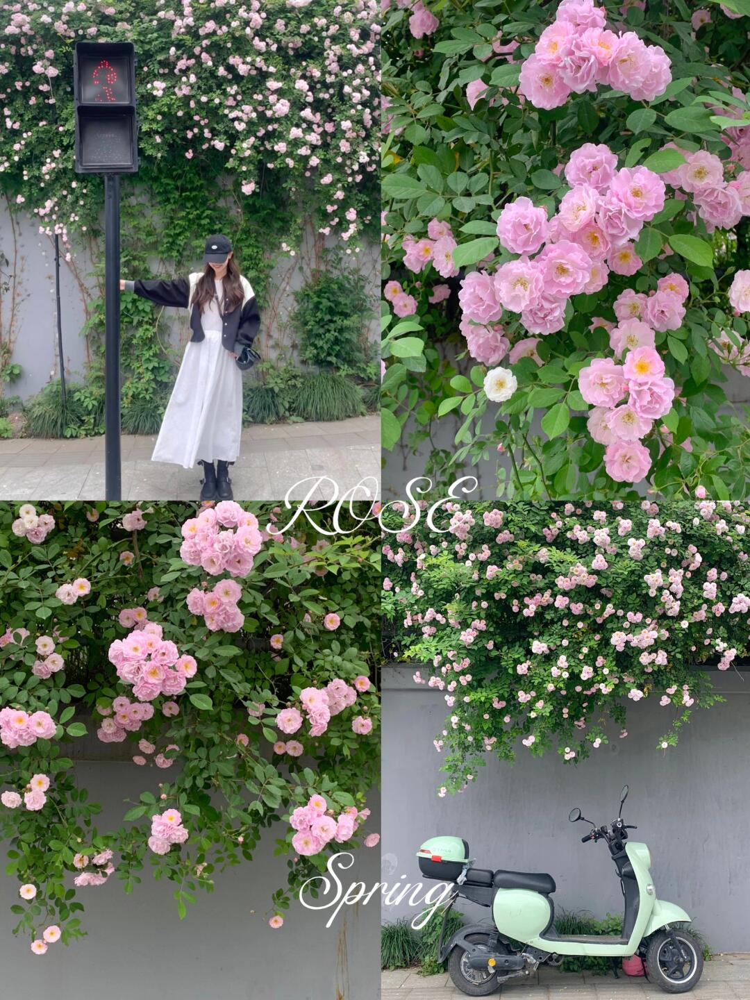

## 直觉
整组最动人的是“阴天粉蔷薇”的柔和感，花墙、人物、薄荷绿电动车共同营造出很小红书的春日打卡氛围。拼图信息量丰富，但主视觉略分散。

## 技法拆解
- 阴天漫射光很适合拍粉色花，反差低，花瓣细节保留得比较温柔。
- 人像那张站位偏远，人物被红绿灯杆抢视线，可再靠近花墙或用花当前景。
- 花朵特写取景不错，粉花与绿叶形成清新配色，但可选一簇最完整的花做明确主体。
- 电动车画面有生活感，薄荷绿和粉花呼应，适合作为“地点氛围照”。
- 拼图文字装饰增加春日感，但字体过大时会压住画面主体。

## 实拍操作（佳能 R10）
模式拨盘选 **Av 光圈优先**，方便在花墙、人像、特写间快速控制虚化。推荐 **f/2.8-f/4、1/250s 以上、ISO 200-800、评价测光、单次 AF/伺服 AF 均可，人物用眼部检测，花朵用单点对焦**。镜头建议 **RF-S 18-150mm** 拍全景与中景，或 **RF 50mm F1.8** 拍人像和花朵特写。现场先找花最密的一段墙，人物站离背景 0.5-1 米；等行人少、风停时拍；多拍竖构图，分别收集人像、局部花、环境物件，后期再拼成笔记封面。

## 后期思路
整体往“阴天清透春日”走：提高曝光和阴影，轻压高光，粉色稍提亮但避免过饱和。绿色可降低一点饱和、偏青一点，让粉花更突出；最后加轻微颗粒或柔化，保持小红书的温柔氛围。

## #26 小红书｜人像写真

**摄影师**: [-奶油](https://www.xiaohongshu.com/user/profile/5a882da24eacab1dd451afa0)
 | **来源**: [小红书](https://www.xiaohongshu.com/explore/644128a8000000001300bf69?xsec_token=ABlP6Vup-yAeNsm5GA_-MBKQjAtqezghDlgOx26677wCY%3D&xsec_source=pc_feed)

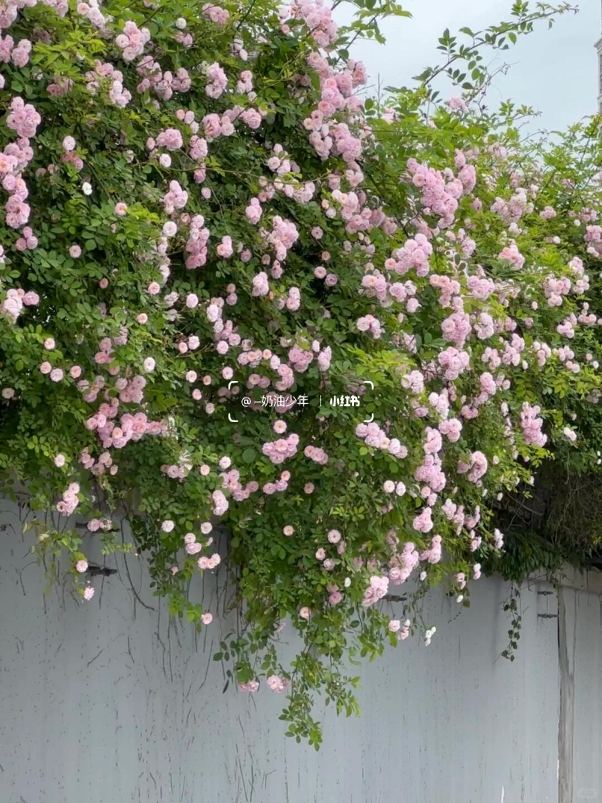

## 直觉
整面蔷薇从墙头倾泻下来，粉色花团和大片绿色形成很温柔的春日氛围。阴天柔光让花瓣不刺眼，适合小红书式清新写真背景。

## 技法拆解
- 构图上花墙占据上方大面积，白墙留在下方，适合后续安排人物站位。
- 阴天光线均匀，粉色蔷薇保留了柔和层次，但画面整体略平。
- 粉花与绿叶对比自然，色彩方向偏清新，符合“春日花海”语境。
- 右上角建筑边缘略分散注意力，实拍时可再向左取景或稍微收紧。
- 这类场景不一定要拍全，局部花枝+人物半身会更有写真感。

## 实拍操作（佳能 R10）
模式拨盘选 **Av 光圈优先**，方便控制背景虚化和花墙层次，适合人像写真快速拍摄。推荐 **f/2.8-f/4、1/250s 以上、ISO 自动上限 1600、评价测光、伺服 AF 或单次 AF、人眼识别+灵活区域对焦**。镜头可用 **RF-S 18-150mm** 的 50-85mm 段，或 **RF 50mm F1.8** 拍半身氛围。

现场先让人物站在白墙前、离花墙约1米，避免背景贴脸；选择阴天或阳光被云遮住时拍，肤色更柔；按快门时让人物侧身看花、抬手触花枝，抓自然动作。

## 后期思路
整体走“小红书春日清透”方向：提高曝光和阴影，轻压高光，保留花瓣细节。色彩上绿色降低饱和、略偏黄，粉色提升明度和一点饱和；可加轻微柔化或颗粒，让画面更温柔。

## #27 小红书｜人像写真

**摄影师**: [-奶油](https://www.xiaohongshu.com/user/profile/5a882da24eacab1dd451afa0)
 | **来源**: [小红书](https://www.xiaohongshu.com/explore/644128a8000000001300bf69?xsec_token=ABlP6Vup-yAeNsm5GA_-MBKQjAtqezghDlgOx26677wCY%3D&xsec_source=pc_feed)

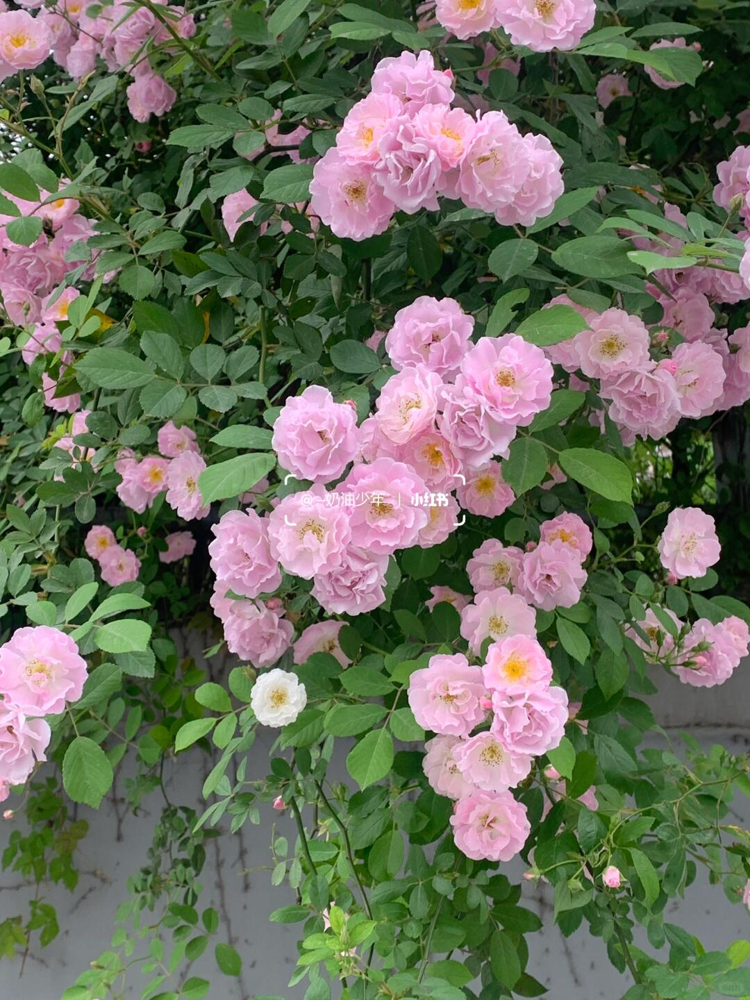

## 直觉
阴天柔光把粉色蔷薇拍得很嫩，整面花墙有“小红书春日打卡点”的即视感。画面花量足、色彩统一，适合做人像写真背景。

## 技法拆解
- 阴天漫射光降低了花瓣反差，粉色层次比较柔，不容易过曝。
- 构图以花墙铺满画面，信息量丰富，但主体略分散，缺少一个最明确的视觉中心。
- 绿色叶片占比高，能衬托粉色，但局部杂枝较乱，拍人时要避开脸部穿插。
- 中央水印位置压在花簇上，发布成片建议

## #28 小红书｜人像写真

**摄影师**: [-奶油](https://www.xiaohongshu.com/user/profile/5a882da24eacab1dd451afa0)
 | **来源**: [小红书](https://www.xiaohongshu.com/explore/644128a8000000001300bf69?xsec_token=ABlP6Vup-yAeNsm5GA_-MBKQjAtqezghDlgOx26677wCY%3D&xsec_source=pc_feed)

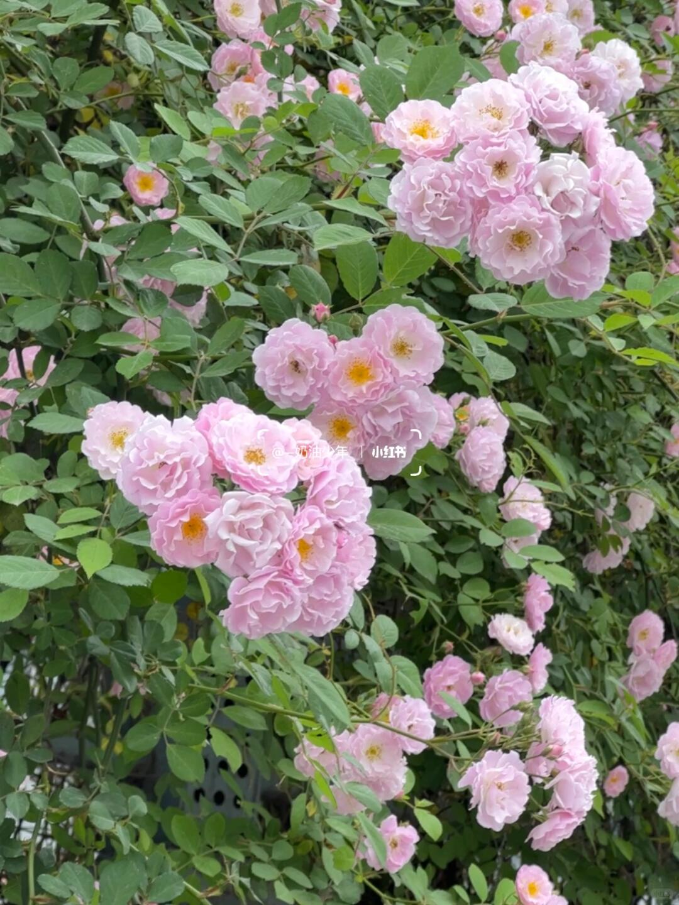

## 直觉
阴天的蔷薇呈现出很柔的粉色，花墙的密度和层次感是最吸引人的地方，很适合小红书春日打卡氛围。画面已经有“被花包围”的感觉，但主体还可以再明确一点。

## 技法拆解
- 阴天漫射光让粉色花瓣不过曝，质感柔和，适合拍甜美人像或花墙特写。
- 构图以多簇花形成斜向分布，画面有延伸感，但中心略散，缺少一个最强视觉焦点。
- 绿色叶片面积较大，衬托粉色很好，但后期可适当压低绿的饱和度，避免抢戏。
- 若加入人物，建议让人站在花墙前侧或转角处，用花做前景，氛围会更强。

## 实拍操作（佳能 R10）
模式拨盘选 **Av 光圈优先**，因为这种花墙/人像场景重点是控制虚化和亮度，操作最快。推荐 **f/2.8-f/4、1/250s 以上、ISO 自动上限 1600、评价测光、单次 AF 或伺服 AF、人眼识别/单点对焦**；拍纯花就用单点对在最漂亮的一簇花心上。镜头建议 **RF-S 18-150mm 用 50-100mm 段**，或 **RF 50mm F1.8** 拍半身人像和花墙虚化。现场先找花最密的一段，人物穿浅粉/白色站在花墙侧前方；等阴天亮度均匀或短暂透光时拍；相机略高于胸口，竖构图，前景带一两枝花再按快门。

## 后期思路
整体往“清透粉绿、春日柔光”方向走：提高曝光和阴影，轻降高光保护花瓣层次。HSL 中降低绿色饱和度、提高粉色/洋红明度，局部给花朵加一点纹理和清晰度，最后加轻微柔焦或颗粒即可。

## #29 小红书｜人像写真

**摄影师**: [-奶油](https://www.xiaohongshu.com/user/profile/5a882da24eacab1dd451afa0)
 | **来源**: [小红书](https://www.xiaohongshu.com/explore/644128a8000000001300bf69?xsec_token=ABlP6Vup-yAeNsm5GA_-MBKQjAtqezghDlgOx26677wCY%3D&xsec_source=pc_feed)

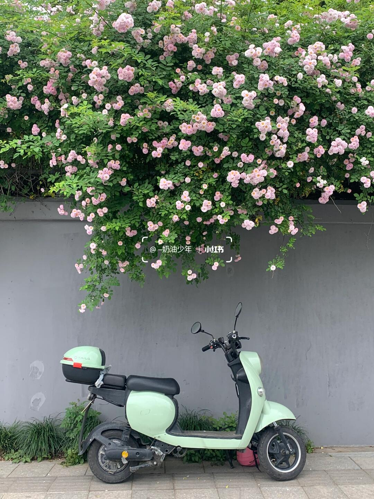

## 直觉
最打动人的是“粉色蔷薇瀑布”和薄荷绿电动车的呼应，阴天柔光让画面很温柔，很适合小红书春日打卡。灰墙留白也干净，给人物写真预留了很好的站位。

## 技法拆解
- 构图上采用正面平拍，花墙占上半部分，电动车压在下方，层次清楚。
- 阴天光线柔和，粉色花朵不过曝，适合拍清新、低对比的人像。
- 薄荷绿与粉色是关键配色，画面有“春日甜感”。
- 灰墙面积稍大，若拍人可让人物站在车旁或墙前，打破空白。
- 画面中心水印略抢眼，正式发布时建议避开主体区域。

## 实拍操作（佳能 R10）
模式拨盘选 **Av 光圈优先**，方便控制背景清晰度，同时让相机自动适应阴天光线。推荐参数：光圈 **F4-F5.6**，快门尽量不低于 **1/250s**，ISO **200-800 自动**，评价测光；人像用 **伺服 AF + 人眼识别**，拍空景用单点 AF 对准花朵或车头。镜头建议 **RF-S 18-150mm** 用 24-35mm 端拍环境人像，或 **RF 35mm F1.8** 拍更有氛围的半身。现场先正对花墙站远一点，保持墙线水平；等路人车辆清空；让模特穿粉色或白色，站在电动车旁回头、扶车把或仰头看花时连拍。

## 后期思路
整体往“小红书春日奶油感”走：提亮曝光和阴影，降低对比，适当提升粉色与绿色的明度。可用 HSL 微调粉花偏柔、绿叶偏清透，灰墙稍降饱和，最后加一点柔化或颗粒，让画面更轻盈。

## #30 小红书｜人像写真

**摄影师**: [-奶油](https://www.xiaohongshu.com/user/profile/5a882da24eacab1dd451afa0)
 | **来源**: [小红书](https://www.xiaohongshu.com/explore/644128a8000000001300bf69?xsec_token=ABlP6Vup-yAeNsm5GA_-MBKQjAtqezghDlgOx26677wCY%3D&xsec_source=pc_feed)

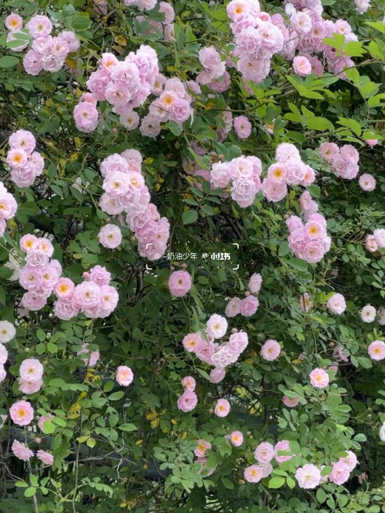

## 直觉
阴天的蔷薇花墙很柔，粉色花团和绿色叶片形成清新的春日氛围。画面适合作为小红书人像背景，但目前缺少明确主体，视觉停留点不够强。

## 技法拆解
- 阴天漫射光让花瓣不过曝，粉色保留得比较温柔，适合拍“奶油感”人像。
- 构图是满版花墙，信息量丰富，但枝叶偏杂，建议找花更密、背景更干净的一块。
- 粉绿配色舒服，若人物穿粉、白、浅黄，会更融入春日氛围。
- 拍花墙人像时不要贴墙太近，让人物离花墙 0.5-1 米，背景会更有层次。

## 实拍操作（佳能 R10）
模式拨盘选 **Av 光圈优先**，方便控制背景虚化和人像氛围，快门交给相机即可。推荐参数：光圈 **f/2.8-f/4**，快门尽量不低于 **1/250s**，ISO **自动上限 1600**，评价测光，人脸/眼睛检测 AF，区域选全区域或灵活区域。镜头建议用 **RF 50mm F1.8** 拍半身特写，或 **RF-S 18-150mm** 拉到 50-85mm 端压缩花墙。现场先找花最密的一面，让模特站在斜侧方；等风小、花枝稳定时拍；让人物轻扶花枝、回头或低头闻花，避开正中呆站。

## 后期思路
整体往“小红书春日柔粉”走：提高曝光和阴影，降低高光，适当提升粉色/洋红明度。绿色可稍微降饱和、偏黄一点，避免叶子抢戏。最后加一点柔化或降低清晰度，让花瓣和肤色更轻盈。

## #31 小红书｜人像写真

**摄影师**: [-奶油](https://www.xiaohongshu.com/user/profile/5a882da24eacab1dd451afa0)
 | **来源**: [小红书](https://www.xiaohongshu.com/explore/644128a8000000001300bf69?xsec_token=ABlP6Vup-yAeNsm5GA_-MBKQjAtqezghDlgOx26677wCY%3D&xsec_source=pc_feed)

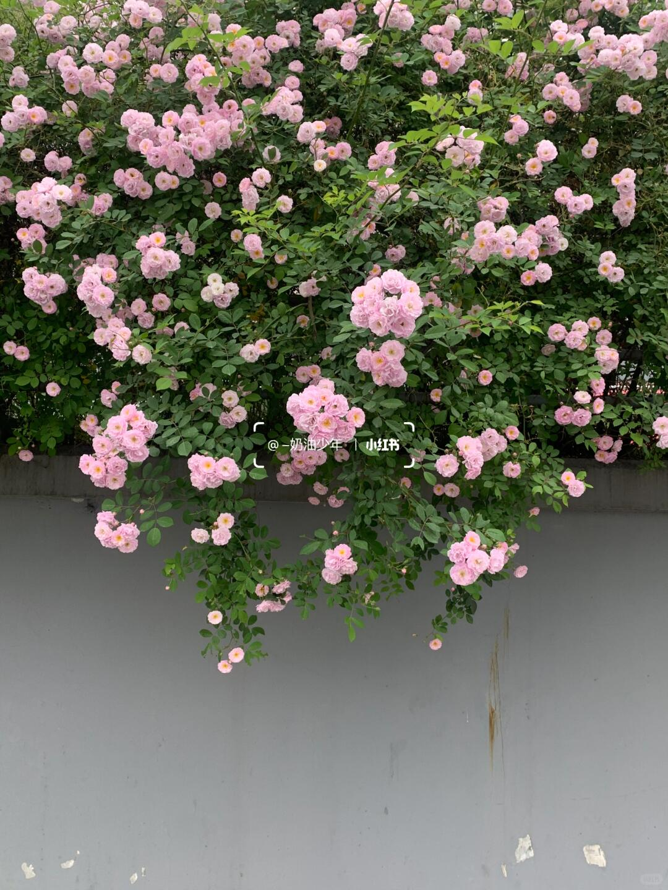

## 直觉
满墙粉色蔷薇从上方倾泻下来，阴天柔光让花瓣显得很嫩，确实有“小红书春日打卡”的轻盈感。灰墙留白也给后续人像站位留下了空间。

## 技法拆解
- 阴天光线柔和，没有硬阴影，适合拍粉色花墙和清透人像。
- 构图上花集中在上半部，下方灰墙留白明显，适合让人物站在画面下方做前景主体。
- 粉花与绿叶形成稳定的春日配色，灰墙降低杂乱感，但右下污渍略抢眼。
- 画面偏记录感，如果想更“写真”，可用中长焦压缩花墙、虚化背景。

## 实拍操作（佳能 R10）
模式拨盘选 **Av 光圈优先**，方便控制背景虚化和人像氛围；拍花墙人像推荐 **RF-S 18-150mm** 用 50-85mm 端，或 **RF 50mm F1.8**。参数可设 **f/2.8-f/4、1/250s 以上、ISO 自动上限1600、评价测光、伺服AF/人眼识别，区域选全域或小区域**。现场让模特穿浅粉、白色或奶油色，站在灰墙前离花墙半米到一米；摄影师稍微后退，用中长焦竖拍；等风停、表情放松时连拍，避开墙面污渍和杂物。

## 后期思路
整体往“阴天清甜、粉绿柔和”的方向走：稍提曝光和阴影，降低高光，保留花瓣层次。HSL里让粉色更明亮、绿色略降饱和，灰墙可用修复工具清掉污渍，最后加一点柔化或颗粒，形成小红书春日感。

## #32 小红书｜人像写真

**摄影师**: [-奶油](https://www.xiaohongshu.com/user/profile/5a882da24eacab1dd451afa0)
 | **来源**: [小红书](https://www.xiaohongshu.com/explore/644128a8000000001300bf69?xsec_token=ABlP6Vup-yAeNsm5GA_-MBKQjAtqezghDlgOx26677wCY%3D&xsec_source=pc_feed)

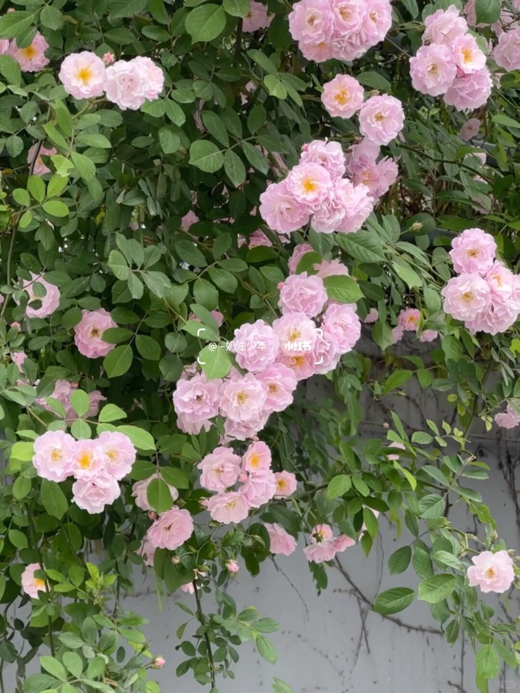

## 直觉
这面蔷薇墙最动人的是“粉花压满枝头”的春日密度，阴天光线让粉色显得很柔，不刺眼。画面已经有小红书打卡感，但主体花簇还可以再更明确。

## 技法拆解
- 阴天漫射光很适合拍粉色花，不容易过曝，花瓣层次保留得比较好。
- 构图上花簇分布丰富，但中心略散，建议选择一团最饱满的花作为视觉主角。
- 绿色叶片面积较大，粉绿对比清新，适合春日、人像写真背景。
- 目前背景墙面和枝条稍杂，拍人时可用大光圈虚化，让花墙变成柔和氛围。

## 实拍操作（佳能 R10）
模式拨盘选 **Av 光圈优先**，因为这类花墙/人像更需要控制景深和背景虚化。推荐参数：光圈 **F2.8-F4**，快门不低于 **1/250s**，ISO 自动或 **100-800**，评价测光，曝光补偿 **+0.3EV**；对焦用 **人像：眼部追踪 AF**，拍花用 **单点 AF** 对准花心。镜头建议 RF-S 18-150mm 拉到 **70-120mm**，或 RF 50mm F1.8 拍半身氛围。现场先找最密、最干净的一片花墙，让人物穿浅粉/白色站在花前半步；机位略高或平视，避开灰墙杂线；等微风停、表情自然时连拍 3-5 张。

## 后期思路
整体往“小红书春日粉绿”走：提高曝光和阴影，略降高光，保护花瓣细节。粉色可轻微提亮、降低饱和避免荧光，绿色往浅一点、黄一点调，最后加少量柔化或颗粒，增强温柔氛围。

## #33 小红书｜人像写真

**摄影师**: [-奶油](https://www.xiaohongshu.com/user/profile/5a882da24eacab1dd451afa0)
 | **来源**: [小红书](https://www.xiaohongshu.com/explore/644128a8000000001300bf69?xsec_token=ABlP6Vup-yAeNsm5GA_-MBKQjAtqezghDlgOx26677wCY%3D&xsec_source=pc_feed)

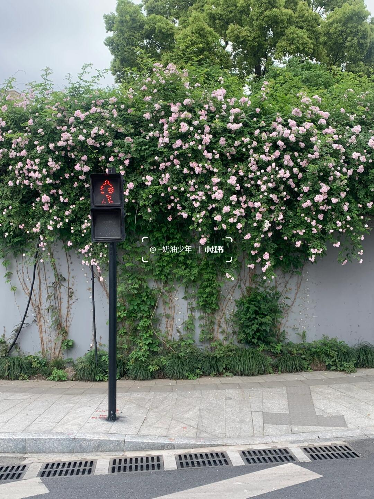

## 直觉
这面蔷薇花墙的量感很足，阴天柔光让粉色显得干净温柔，很适合小红书式春日写真。画面里红绿灯增加了“路口转角”的生活感，但也稍微抢戏。

## 技法拆解
- 阴天光线均匀，没有硬阴影，适合拍花墙和人像肤色。
- 构图以花墙为主体，但下方路面和排水沟占比偏多，可再上移或靠近压缩杂物。
- 粉花与绿叶形成清新配色，人物若穿粉、白、浅黄会更融入。
- 红绿灯是场景记忆点，拍人像时可放在边缘当环境元素，不要压住人物。

## 实拍操作（佳能 R10）
模式拨盘选 **Av 光圈优先**，因为花墙人像重点是控制景深和曝光，现场变化快。推荐 **f/2.8-f/4、1/250s 以上、ISO 自动上限1600、评价测光、伺服AF/人眼识别，区域选全区域或灵活区域**。镜头建议 **RF-S 18-150mm 用 50-85mm 端**，或 **RF 50mm F1.8** 拍半身虚化。现场先让模特站离花墙约50cm-1m，摄影师退到马路安全边缘用中长焦压缩；等行人车辆少、红绿灯不抢画面时连拍；让模特侧身看花、回头笑，手轻扶花但不要压弯枝条。

## 后期思路
整体往“阴天清透、粉绿色春日感”走：稍提曝光和阴影，降低高光，保留花瓣层次。HSL里绿色降一点饱和、提高明度，粉色略提亮；最后加轻微锐化和暗角，让视线集中在人和花墙。

## #34 小红书｜人像写真

**摄影师**: [-奶油](https://www.xiaohongshu.com/user/profile/5a882da24eacab1dd451afa0)
 | **来源**: [小红书](https://www.xiaohongshu.com/explore/644128a8000000001300bf69?xsec_token=ABlP6Vup-yAeNsm5GA_-MBKQjAtqezghDlgOx26677wCY%3D&xsec_source=pc_feed)

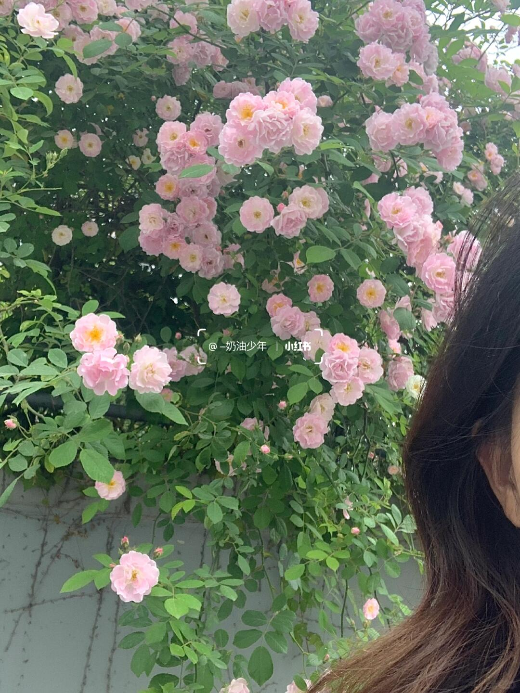

## 直觉
粉色蔷薇铺满画面，阴天柔光让花色很温柔，有“小红书春日打卡”的氛围。右侧只露半张脸，有随手自拍感，但人物占位略尴尬，容易分散花墙的美。

## 技法拆解
- 阴天光线柔和，花瓣不过曝，适合拍这种粉粉嫩嫩的蔷薇墙。
- 构图上花墙很饱满，但人物被切得太边缘，建议要么完整入镜，要么只拍背影/侧脸。
- 画面中部文字水印压在花丛上，会破坏干净感，正式出片尽量避开主体区域。
- 绿色叶子偏多，粉花不够突出，可通过靠近花簇、压缩背景来强化层次。

## 实拍操作（佳能 R10）
模式拨盘选 **Av 光圈优先**，方便控制背景虚化和花墙层次，适合人像写真打卡。推荐参数：光圈 **F2.8-F4**，快门保持 **1/250s 以上**，ISO 自动或 **100-800**，评价测光，人像用 **伺服 AF + 人眼识别**，花墙特写用单点/小区域对焦。镜头建议用 **RF-S 18-150mm** 的 50-100mm 段，或 **RF 50mm F1.8** 拍半身氛围感。现场先让人物站在花墙前 0.5-1 米，避开杂乱枝条；等阴天均匀光或云层遮住直射光；按快门时让人物侧脸看花、轻扶花枝，表情放松再连拍。

## 后期思路
整体走“春日粉嫩、低对比、轻胶片”方向。适当提高曝光和阴影，降低高光，粉色/洋红稍加饱和，绿色往浅绿偏黄调，避免叶子太脏。可用局部蒙版提亮人物脸部和主花簇，弱化背景杂乱。

## #35 小红书｜人像写真

**摄影师**: [-奶油](https://www.xiaohongshu.com/user/profile/5a882da24eacab1dd451afa0)
 | **来源**: [小红书](https://www.xiaohongshu.com/explore/644128a8000000001300bf69?xsec_token=ABlP6Vup-yAeNsm5GA_-MBKQjAtqezghDlgOx26677wCY%3D&xsec_source=pc_feed)

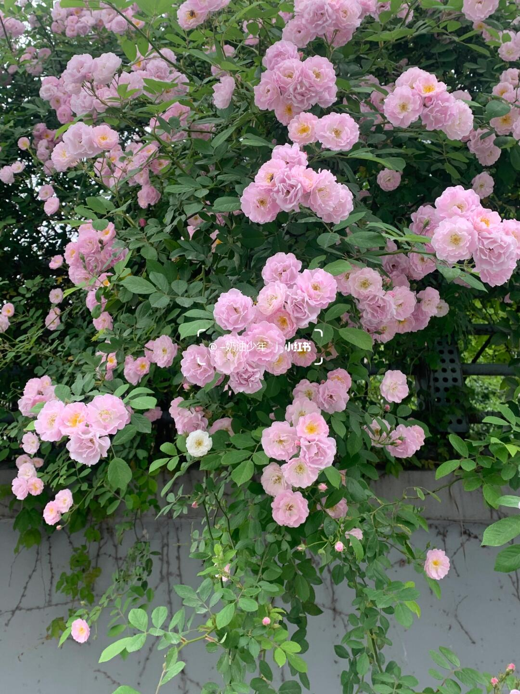

## 直觉
阴天把粉色蔷薇拍得很柔，花墙有一种“小红书春日打卡点”的清甜感。画面最吸引人的是花量充足、枝条自然下垂，很适合作为人像写真背景。

## 技法拆解
- 阴天散射光让花瓣层次柔和，不容易出现强烈反光，适合拍粉色花。
- 构图采用竖幅，保留了花墙的垂坠感，但中间水印位置略抢眼，拍摄时可避开主体中心。
- 画面信息偏满，花和叶都很多；若用于人像，建议让人物站在花少一点的暗部前，突出脸。
- 粉绿配色清新，但绿色略重，后期可稍微压低绿叶饱和度，让粉花更跳出来。

## 实拍操作（佳能 R10）
模式拨盘选 **Av 光圈优先**，因为花墙/人像更需要先控制虚化和景深。推荐 **F2.8-F4、1/250s 以上、ISO 自动上限 1600、评价测光、伺服 AF 或单次 AF，人物/眼部检测；拍花用单点 AF 对准前景花簇**。镜头可用 **RF-S 18-150mm 的 50-100mm 段**压缩花墙，或 **RF 50mm F1.8**拍半身人像。现场先退后一步用中长焦取景，避开墙面杂物；等风停、花枝稳定时连拍；如果拍人，让模特穿浅粉/白色，侧身靠近花墙但不要贴太近。

## 后期思路
整体走“阴天奶油粉”的清透方向：提一点曝光和阴影，压高光保留花瓣细节。HSL 里降低绿色饱和度、微提粉色/洋红明度，适当加一点柔化或降低清晰度，让花墙更梦幻。