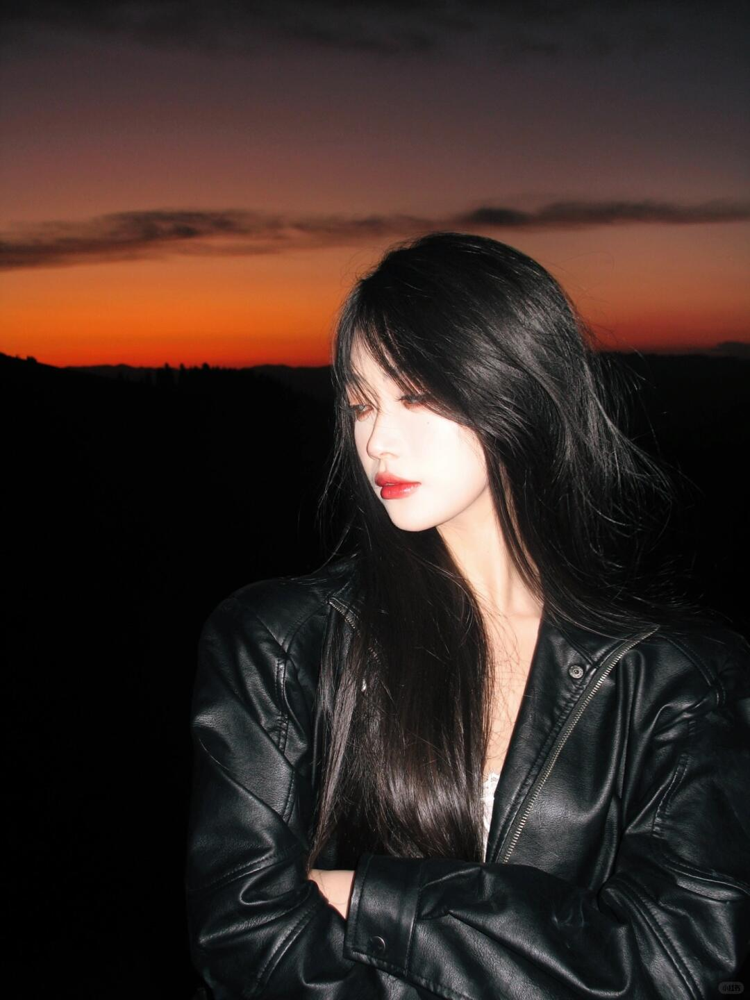
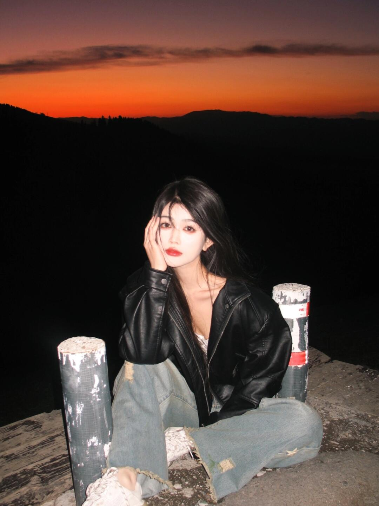
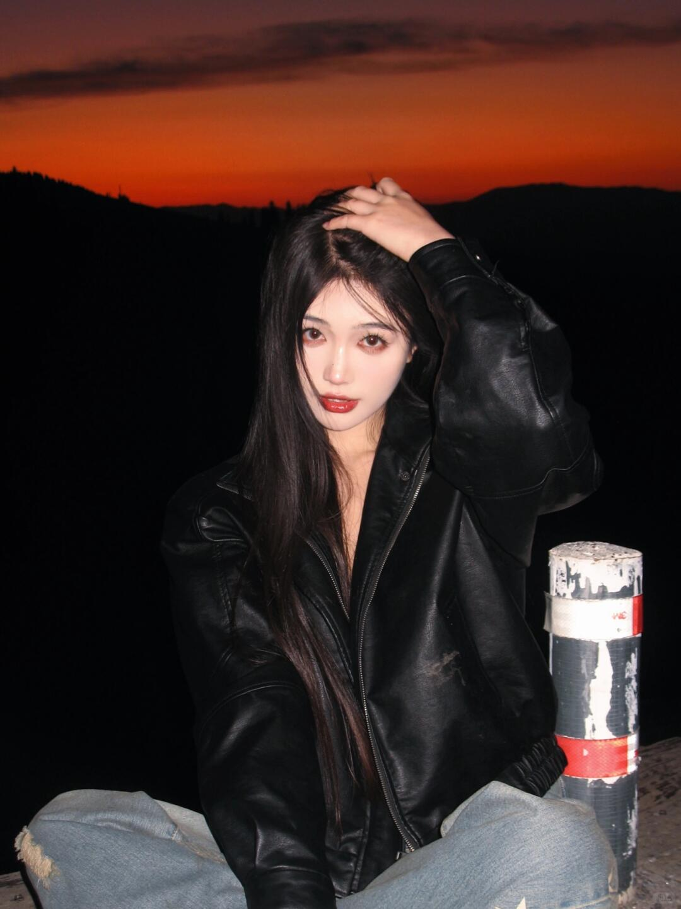
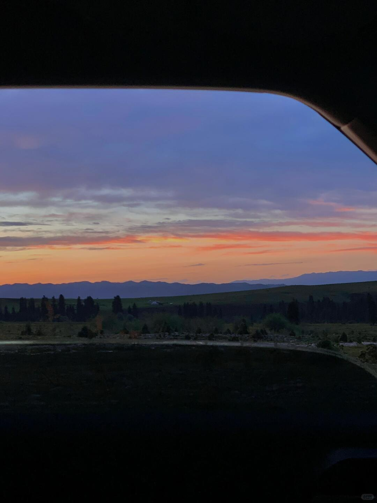

# 每日摄影教练 - 2026-05-10

---

# 风光/自然

## #1 风光/自然

**摄影师**: [Fabien Maurin](https://unsplash.com/@fabienmaurin)
 | **来源**: [Unsplash](https://unsplash.com/photos/a-mountain-with-clouds-around-it-wAJuo5rbTQI)

> EXIF: Camera Canon  EOS 80D | f/7.1 | 1/250s | 90.0mm | ISO 100

## 直觉
这张山脊被云雾吞没，最有力量的是“露出与隐藏”的关系：岩石的硬朗和雾气的柔软形成强烈对比。画面有一种冷峻、史诗感的高山气氛。

## 技法拆解
- 90mm 中长焦压缩了山体层次，让山脊更陡峭、更有压迫感。
- f/7.1 兼顾清晰度和景深，适合拍远处山体纹理。
- 1/250s 足够应对手持和雾气流动，画面没有明显拖影。
- ISO 100 保留了干净的暗部和云雾细节，后期空间较好。
- 构图上左侧山脊作为视觉入口，向右延伸进雾里，留白营造神秘感。

## 实拍操作（佳能 R10）
模式拨盘建议选 **Av 光圈优先**，因为风光里优先控制景深和镜头最佳画质，快门由相机自动匹配。推荐参数：光圈 **f/7.1-f/8**，快门尽量不低于 **1/250s**，ISO **100-400 自动上限**，测光用 **评价测光**，对焦用 **单次 AF**，区域选 **单点 AF** 对在山脊明暗交界处。镜头可用 **RF-S 18-150mm** 的 80-120mm 段，或 **RF 100-400mm** 取更强压缩感。现场先找一条有方向感的山脊线，让它从左下或侧边进入画面；等云雾半遮半露、岩石轮廓刚显出来时拍；连拍几张，抓雾气形态最有层次的一刻。

## 后期思路
后期重点强化“冷峻山雾感”：适当降低饱和度，压高光、提一点阴影，保留雾的柔和层次。用局部调整增强山脊清晰度、纹理和对比，雾区则避免过度锐化，可加轻微暖灰或冷灰色调统一气氛。

## #2 风光/自然

**摄影师**: [Prashant Verma](https://unsplash.com/@prashantvarmaofficial)
 | **来源**: [Unsplash](https://unsplash.com/photos/a-long-road-going-through-a-forest-cpvDCa_hJas)

> EXIF: Camera Xiaomi Redmi Note 8 | f/1.8 | 1/130s | 4.7mm | ISO 96

## 直觉
这张照片最吸引人的是山路的蜿蜒感，它把视线从河谷一路带到远山。天空留白很大，配合层叠山脉，有一种安静、辽阔的旅行感。

## 技法拆解
- 构图上，山路形成天然引导线，是画面叙事的核心。
- 前景河床、中景树林、远景群山层次清楚，风光纵深感不错。
- EXIF 显示手机 4.7mm 广角、f/1.8、1/130s、ISO 96，曝光稳定，但边缘细节和高光层次略受限。
- 天空占比偏大且内容较空，可适当降低机位或裁掉上方，让道路和山体更突出。
- 色彩偏青绿，氛围统一，但森林暗部可再提亮一点。

## 实拍操作（佳能 R10）
模式拨盘建议用 **Av 光圈优先**，风光拍摄更重视景深控制，相机会自动匹配快门。推荐 **f/8、1/125s 以上、ISO 100-400、评价测光、单次自动对焦 One-Shot、灵活区域对焦**。镜头可用 **RF-S 18-45mm 的 18mm 端**，或 **RF-S 10-18mm** 拍出更开阔的河谷与山路。现场先站在高处寻找“S形路”作为引导线；等日出后或傍晚柔光时拍；对焦放在中景山路或树林处，半按确认后连拍几张防抖动。

## 后期思路
后期重点是压住天空高光、提升暗部树林细节，并加强远山层次。可降低高光、提高阴影和去朦胧，色温略暖一点，让画面从偏冷记录感走向柔和风光感。

## #3 风光/自然

**摄影师**: [Ben Bramhall](https://unsplash.com/@silversn95)
 | **来源**: [Unsplash](https://unsplash.com/photos/misty-mountain-peak-shrouded-in-clouds-F28tgL6RBA0)

> EXIF: Camera SONY ILCE-6300 | f/8.0 | 1/320s | 50.0mm | ISO 100

## 直觉
云雾像一层纱掠过山峰，最有吸引力的是“若隐若现”的神秘感。山体的厚重岩壁与柔软云层形成了很好的质感对比。

## 技法拆解
- 50mm 视角压缩了山体层次，让主峰显得更高、更迫近，适合突出山的压迫感。
- f/8 保证了山体纹理和云层边缘都有足够清晰度，是风光题材的稳妥选择。
- 1/320s 能冻结云雾与手持轻微抖动，ISO 100 保留了干净画质。
- 构图上山峰居中偏右，云雾横向铺开，画面稳定但略显满，可适当给峰顶多留一点呼吸空间。
- 光线偏硬，天空高光接近发白，拍摄时要注意保护云层细节。

## 实拍操作（佳能 R10）
模式拨盘建议用 **Av 光圈优先**，因为风光拍摄最先控制景深，快门交给相机即可。R10 可设 **f/8、ISO 100、评价测光、曝光补偿 -0.3EV 到 -0.7EV**，避免云层过曝；对焦用 **单次 AF，单点或小区域 AF**，对在山体岩壁高反差处。镜头建议 **RF-S 18-150mm** 用 50-80mm 端，或 **RF-S 18-45mm** 的长焦端稍作裁切。现场先找远离杂乱前景的位置，用中长焦压缩山体；等待云雾刚露出峰尖时拍，连拍几张抓云形；若手持，确认快门不低于 1/250s，必要时提高 ISO 到 200。

## 后期思路
后期重点是压高光、提局部对比，让云层保留层次、山体更有立体感。可降低高光与白色色阶，适度提升阴影、纹理和清晰度，色彩往冷调自然风光走，绿色不要推得过饱和。

---

# 人像/肖像

## #4 人像/肖像

**摄影师**: [Aditya Sethia](https://unsplash.com/@aditya_sethia_97)
 | **来源**: [Unsplash](https://unsplash.com/photos/a-man-with-a-watch-on-his-wrist-S884ZhekOK8)

> EXIF: Camera Canon  EOS 1300D | f/2.8 | 1/100s | 50.0mm | ISO 400

## 直觉
这张照片有很强的近距离生活感，手、手表和人物侧脸形成了自然的私密氛围。最吸引人的是前景动作带来的“正在思考”的状态。

## 技法拆解
- f/2.8 带来了明显浅景深，但焦点更像落在耳朵/头发处，手表和手部偏虚，主体意图不够明确。
- 1/100s 对 50mm 基本够用，但人物手部靠近镜头，轻微移动会更容易糊。
- 构图上脸部被大面积遮挡后，观众会转而看手表；如果手表是重点，应让它更清晰、更完整。
- 背景干净、色彩克制，黑衣服和肤色对比自然，适合做低调人像。

## 实拍操作（佳能 R10）
模式拨盘建议用 **Av 光圈优先**，方便控制虚化，同时让相机自动处理快门。推荐参数：f/2.8-f/4，快门尽量不低于 1/160s，ISO Auto 上限 1600，评价测光，伺服 AF 或单次 AF，使用单点/小区域对焦。镜头可用 **RF 50mm F1.8 STM**，在 R10 上等效约 80mm，适合半身特写；若空间窄，可用 RF-S 18-45mm 拉到 35-45mm。现场先决定主体：拍人就对眼睛/脸部边缘对焦，拍手表就把对焦点放在表盘；让人物靠近窗边侧光，身体微侧；按快门时等手部稳定、表盘角度有反光但不过曝再拍。

## 后期思路
后期重点是压住高光、提升局部清晰度，让手表或人物轮廓更突出。可适当降低饱和度和对比，走柔和纪实人像风格；若手表是重点，用局部蒙版增加锐度、纹理和一点明度。

## #5 人像/肖像

**摄影师**: [Riccardo Pitzalis](https://unsplash.com/@riccardoptz)
 | **来源**: [Unsplash](https://unsplash.com/photos/man-in-white-crew-neck-shirt-wearing-black-framed-eyeglasses-TpeBIIM0UIY)

> EXIF: Camera Canon Canon EOS 6D Mark II | f/4.5 | 1/60s | 50.0mm | ISO 125

## 直觉
这张肖像最有力量的是“身份被遮挡”带来的陌生感：身体姿态很日常，但脸部被灰块覆盖，形成强烈的心理张力。黑白处理也让注意力集中到头发、衣领、皮肤和姿态上。

## 技法拆解
- 50mm、f/4.5 让人物比例自然，背景略虚但仍保留墙面的干净质感。
- 1/60s 对静态人像可用，但手持拍摄要非常稳，R10 上建议略提高到 1/125s 更安全。
- 中央构图强化了证件照式的直视感，和“被遮挡的脸”形成反差。
- 白衣与浅背景接近，层次稍弱；好处是让头发和颈部阴影更突出。
- 黑白影调偏柔，若想更有冲击力，可增加局部对比和暗部厚度。

## 实拍操作（佳能 R10）
模式拨盘选 **Av 光圈优先**：人像里先控制景深，R10 会自动匹配快门，操作效率高。推荐参数：光圈 **f/4–f/5.6**，快门尽量不低于 **1/125s**，ISO 设 **Auto ISO 上限1600**，评价测光；对焦用 **单次 AF / 人眼检测**，脸部被遮挡时可改为 **单点 AF 对在头发边缘或衣领附近**。镜头建议用 **RF 50mm F1.8 STM**，在 R10 上等效约 80mm，适合半身肖像；若空间小可用 **RF-S 18-45mm** 的 35-45mm 端。现场先让人物离背景 0.5-1 米，避免墙上阴影太硬；站在人物正前方略高一点，保持肩线水平；等人物身体稳定、呼吸放松时按快门，连拍两三张防止轻微晃动。

## 后期思路
后期可走极简黑白肖像方向：降低饱和转黑白，适当提高对比、清晰度和纹理，让头发与皮肤质感更明确。注意保护白 T 恤高光，可压一点高光、提少量阴影；灰色遮挡块保持中性，不要让它比人物本身更抢眼。

## #6 人像/肖像

**摄影师**: [behrouz sasani](https://unsplash.com/@behrouzsasani)
 | **来源**: [Unsplash](https://unsplash.com/photos/a-black-and-white-photo-of-a-woman-with-long-hair-xcVL00Z8Cfc)

## 直觉
这张黑白人像最吸引人的是窗边侧光打在头发上的高光，发丝质感很漂亮。人物靠窗的姿态带出安静、私密的情绪，适合走“日常纪实肖像”方向。

## 技法拆解
- 窗户形成单侧硬光，头发边缘有明显高光，增强了立体感。
- 黑白处理让注意力集中在明暗、线条和发丝纹理上。
- 构图偏近，人物头发占据大面积画面，情绪更亲密。
- 右侧窗框线条较重，有一定压迫感，但也提供了环境信息。
- 亮部头发略抢眼，拍摄时可稍微压曝光，保留更多层次。

## 实拍操作（佳能 R10）
模式拨盘建议选 **Av 光圈优先**，人像拍摄中方便控制景深，同时让相机自动适应窗边光线变化。推荐参数：光圈 **f/2.8-f/4**，快门尽量不低于 **1/160s**，ISO 自动或 **ISO 400-800**，评价测光或高光优先测光；对焦用 **伺服 AF + 人眼识别/单点 AF**，若脸部被头发遮挡则对焦在眼睛位置或最近发丝边缘。镜头可用 **RF-S 18-150mm 的 50-80mm 段**，或 **RF 50mm F1.8** 拍出更自然的透视。现场先让人物靠近窗边约半米，身体微微转向窗外；观察头发高光不过曝时再拍；按快门选择人物低头、靠窗、发丝自然垂落的瞬间。

## 后期思路
后期适合强化黑白反差，但不要把暗部压死。可降低高光、提升阴影细节，适度增加清晰度和纹理，让发丝更有层次。局部压暗右侧窗框，避免它比人物更抢眼。

---

# 街头/人文

## #7 街头/人文

**摄影师**: [Kelvin Zyteng](https://unsplash.com/@zyteng)
 | **来源**: [Unsplash](https://unsplash.com/photos/motorcycles-parked-in-a-field-kczAjm7PItA)

> EXIF: Camera Panasonic DC-GH5 | 1/200s | ISO 200

## 直觉
这张黑白摩托很有复古街头感，旧墙、草地和改装车形成了粗粝的机械气质。两台车一前一后，画面有层次，也有“车友聚会”的人文氛围。

## 技法拆解
- 黑白处理强化了金属、轮胎和斑驳墙面的质感，弱化了杂色干扰。
- 前车作为主体更清晰，后车略虚，纵深关系成立。
- 1/200s 对静态车辆足够安全，手持拍摄基本不会糊。
- 构图略满，右侧车头和下方轮胎空间稍紧，可再退半步让车更“呼吸”。
- 背景墙纹理很好，但亮部略抢眼，拍摄时可注意避开过亮区域。

## 实拍操作（佳能 R10）
模式拨盘建议用 **Av 光圈优先**，因为这类静态街头题材重点是控制景深和背景虚化。推荐参数：光圈 **F2.8-F4**，快门保持 **1/200s 以上**，ISO **100-400**，评价测光，曝光补偿可减 **-0.3EV** 保住高光；对焦用 **单次 AF**，区域选 **单点 AF** 对在前车油箱或车标上。镜头可用 **RF-S 18-150mm** 的 50-80mm 端，或 **RF 50mm F1.8** 获得更好的虚化。现场先蹲低到轮胎高度，斜侧面拍出车身线条；等柔和侧光或阴天光；按快门前检查车头、轮胎不要贴边。

## 后期思路
后期适合走高反差复古黑白：降低饱和或直接转黑白，增加对比、清晰度和纹理。压低高光、提一点阴影，让轮胎和发动机细节出来；可加轻微暗角，把视线集中到前车。

## #8 街头/人文

**摄影师**: [Jahanzeb Ahsan](https://unsplash.com/@jahan_photobox)
 | **来源**: [Unsplash](https://unsplash.com/photos/man-holding-camera-in-cobblestone-street-B2nNWkA4_0M)

> EXIF: 0.0mm

## 直觉
黑白处理很适合这条石板老街，人物举相机的动作有“摄影者被拍”的趣味。巷道纵深和背景虚化，让画面有街头人文的现场感。

## 技法拆解
- 人物居中站位稳，左右建筑形成自然引导线，把视线推向主体。
- 背景虚化有效分离人物，但头顶高光略亮，容易抢眼。
- 黑白对比不错，皮衣、石板路和墙面都有质感层次。
- EXIF 焦距显示 0.0mm，无法判断实际镜头；从透视看应是标准偏广焦段。

## 实拍操作（佳能 R10）
模式拨盘选 **Av 光圈优先**，街头人像需要快速控制景深，同时让相机应对巷子里的明暗变化。推荐 **f/2.8-f/4，快门不低于 1/250s，ISO Auto，评价测光，单次 AF 或伺服 AF，人物/眼部检测+区域对焦**；若脸被相机遮住，就把焦点放在相机和手部。镜头可用 **RF-S 18-150mm 的 35-50mm 段**，或 **RF 35mm F1.8**。现场先站在巷道中轴线，等人物举起相机形成动作，再微微压低机位，让石板路引导线进入画面，最后连拍 2-3 张抓手势。

## 后期思路
后期继续走高对比黑白方向，压高光、提阴影，保留皮衣和石板路纹理。可用曲线加强中间调对比，适度加暗角，让注意力集中在人和相机动作上。

## #9 街头/人文

**摄影师**: [Ben Iwara](https://unsplash.com/@1hundredimages)
 | **来源**: [Unsplash](https://unsplash.com/photos/a-couple-of-men-riding-skateboards-down-a-street-m9VTpST9ceY)

## 直觉
强逆光下的篮球对峙很有街头感，人物被压成半剪影，长长的影子让画面有了戏剧性和时间感。

## 技法拆解
- 太阳放在画面上方，形成高反差逆光，强化了运动与青春气息。
- 黑白处理减少色彩干扰，让视线集中在人物姿态、影子和建筑线条上。
- 人物位置偏下，留出大量天空和校舍，环境交代清楚。
- 快门需要足够快，否则运球和脚步会糊；此图的瞬间抓得不错。

## 实拍操作（佳能 R10）
模式拨盘选 **Tv 快门优先**，因为街头运动最先保证动作凝固。推荐 **1/1000s，ISO 100-400 自动，光圈由相机决定，评价测光，Servo AF，区域对焦或人物追踪**。镜头可用 **RF-S 18-150mm** 的 18-35mm，或 **RF-S 18-45mm** 广角端，保留环境。现场先蹲低一点，把太阳放在画面边缘或上方；对着人物半按追焦，等两人距离拉近、影子完整落入画面时连拍；曝光补偿可设 **-0.3 到 -1EV**，保住高光。

## 后期思路
建议继续走高反差黑白方向：压高光、提一点阴影但别全拉平，保留逆光硬朗感。适当增加对比度、清晰度和黑色，局部压暗天空，让人物和影子更突出。

---

# 极简/建筑

## #10 极简/建筑

**摄影师**: [Simone Hutsch](https://unsplash.com/@heysupersimi)
 | **来源**: [Unsplash](https://unsplash.com/photos/gray-concrete-building-TR0SxEfj-Vw)

> EXIF: Camera Canon Canon EOS 7D | f/11.0 | 1/100s | 30.0mm | ISO 100

## 直觉
这张建筑照最舒服的是“少”：大面积浅蓝天空托住玻璃建筑，线条干净，科技感很强。建筑顶部的弧线让画面不呆板，有向上生长的动势。

## 技法拆解
- 构图把建筑放在下半部，留出大量负空间，符合极简建筑的清爽气质。
- 30mm 在 APS-C 上视角适中，既保留建筑体量，又避免超广角夸张变形。
- f/11、ISO100 保证了建筑细节和画质，适合静态建筑拍摄。
- 1/100s 基本安全，但若手持拍摄，建议开启防抖或提高到 1/160s 更稳。
- 光线偏柔，玻璃反光不过曝，整体色彩冷静统一。

## 实拍操作（佳能 R10）
模式拨盘建议选 **Av 光圈优先**，因为建筑拍摄核心是控制景深和画质，让相机自动匹配快门更高效。推荐参数：光圈 **f/8-f/11**，快门尽量不低于 **1/125s**，ISO **100-200**，评价测光，单次自动对焦 **One Shot**，对焦区域用单点或小区域对准建筑边缘。镜头可用 **RF-S 18-45mm** 的 30-35mm，或 **RF-S 18-150mm** 的中广角段。

现场操作：站远一点，用中焦段压缩建筑形体；把天空留足，不要贪多收进杂物；等玻璃反光最干净、云影不乱时再按快门，注意机身保持水平，减少透视歪斜。

## 后期思路
后期方向是强化冷静、通透的建筑感。适当提升曝光和白色，压一点高光，增加清晰度/纹理，让玻璃线条更利落；色温可略偏冷，天空降低饱和度，保持极简干净。

## #11 极简/建筑

**摄影师**: [Jonas Off](https://unsplash.com/@jonas_off)
 | **来源**: [Unsplash](https://unsplash.com/photos/gray-concrete-building-during-daytime-1SUjNRZg9KQ)

## 直觉
这张建筑照最有力的是“重复秩序”：密集窗格形成强节奏，黑白处理让结构感更纯粹。左侧大面积留白也很好，给高楼一种冷静、压迫但克制的气质。

## 技法拆解
- 构图采用右侧高楼与下方横向建筑形成“L形”框架，画面稳定且有张力。
- 大面积白天空被简化成负空间，强化了极简建筑的几何感。
- 黑白高反差突出窗格、阴影和混凝土边缘，削弱了杂色干扰。
- 透视线基本控制得较好，但竖线仍需尽量保持垂直，建筑摄影里这点很关键。

## 实拍操作（佳能 R10）
模式拨盘选 **Av 光圈优先**，因为建筑题材需要优先控制景深和画质，快门由相机配合即可。推荐参数：**f/8，1/250s 以上，ISO 100-400，评价测光，单次自动对焦 One-Shot，单点或小区域对焦**。镜头可用 **RF-S 18-150mm** 的 35-80mm 段压缩建筑纹理，或 **RF 24-105mm** 获得更规整的中长焦视角。现场先退远一点，用中长焦减少透视变形；让建筑边缘贴近画面右侧，保留左侧天空；等云层或柔和日光时拍，避免强烈杂乱反光。

## 后期思路
后期可走高反差黑白方向：降低饱和或直接转黑白，提升对比度、清晰度和纹理。重点压高光保住天空纯净，同时加深阴影，让窗格层次更硬朗；最后用透视校正把竖线拉直，裁切强化极简比例。

## #12 极简/建筑

**摄影师**: [AN V](https://unsplash.com/@bctaken)
 | **来源**: [Unsplash](https://unsplash.com/photos/a-person-on-a-skateboard-on-a-wall-7mJudmDL3SA)

## 直觉
这张最吸引人的是大面积蓝天与白墙形成的“干净留白”，粉色建筑和右下暗部像两个视觉锚点，让极简画面不空。

## 技法拆解
- 构图上用白墙横线切开画面，天空占大面积，极简感明确。
- 左侧粉色建筑贴边放置，形成垂直线，与白墙水平线产生秩序感。
- 色彩是关键：蓝、白、粉、深绿黑，块面纯净，建筑感很强。
- 右下角暗部略重，但它提供了对比和空间入口；注意别让阴影抢主体。

## 实拍操作（佳能 R10）
模式拨盘建议用 **Av 光圈优先**，因为这类建筑极简照重点是控制景深和画面清晰度，快门交给相机即可。参数可设 **f/8、ISO 100、评价测光、曝光补偿 +1/3 到 +2/3**，让白墙保持明亮但注意直方图不要顶右；对焦用 **One-Shot + 单点AF**，对在墙面边缘或建筑立线上。镜头建议 **RF-S 18-45mm 的 18-24mm**，或 **RF-S 10-18mm** 拍更强空间感。现场先站正，尽量让墙线水平、楼边垂直；等阳光稳定、阴影形状清楚时拍；如果要呼应滑板人物，可等人进入右下暗部或白墙边缘再按快门。

## 后期思路
后期走“高明度、低杂质”的极简建筑感：提升白色和蓝色纯净度，适度加对比。重点用裁剪校正水平垂直线，压住高光细节，稍微降低阴影黑位，让画面更利落。

---

# 美食/静物

## #13 美食/静物

**摄影师**: [Imad 786](https://unsplash.com/@imad8321)
 | **来源**: [Unsplash](https://unsplash.com/photos/a-white-plate-topped-with-lots-of-cherries-0BjBZG1lnGQ)

## 直觉
这张樱桃最吸引人的是“水润感”：深红果皮的高光很漂亮，配合白盘和浅背景，显得干净、清爽、有食欲。

## 技法拆解
- 白色背景让红色更突出，画面色彩关系简单有效。
- 浅景深把注意力集中在前中部樱桃，但后方虚化略多，可再保留一点层次。
- 侧前方柔光形成漂亮反光，说明光源够大、够软。
- 盘子的黑边形成弧线，引导视线，但左下角切入的樱桃稍抢眼。

## 实拍操作（佳能 R10）
模式拨盘选 **Av 光圈优先**，静物不赶时间，方便先控制景深。推荐 **f/4–f/5.6、1/125s 以上、ISO 100–400、评价测光、单次 AF，单点或小区域对焦**，对焦放在最亮、最完整的前中部樱桃上。镜头可用 **RF-S 18-150mm 的 50–80mm 段**，或 **RF 50mm F1.8** 收到 f/4 拍摄。现场把樱桃堆出高低层次，靠窗放一张白纸补光；机位略高于盘面 30–45 度；等高光落在果皮侧面时再按快门，避免直射硬光。

## 后期思路
整体走明亮、清透的高调美食风。适当提高曝光和白色色阶，压一点高光保住果皮反光；红色可微调 HSL，让樱桃更鲜亮但不要过饱和。最后用轻微锐化和局部清晰度强化前景果皮质感。

## #14 美食/静物

**摄影师**: [Deepthi Clicks](https://unsplash.com/@switchinglanes)
 | **来源**: [Unsplash](https://unsplash.com/photos/a-bagel-with-a-bite-taken-out-of-it-Ik_ywUMb-Ds)

> EXIF: Camera Canon  EOS 5D Mark IV | f/5.0 | 1/250s | 85.0mm | ISO 5000

## 直觉
这张图最吸引人的是贝果表面的芝麻、南瓜籽和酥皮质感，咬开的缺口让食物更有“刚入口”的真实感。整体暖色调和干花背景营造出温柔的下午茶氛围。

## 技法拆解
- 85mm 焦段压缩感好，主体比例自然，适合拍美食静物。
- f/5.0 景深适中，贝果主体清晰，背景干花有轻微虚化但仍保留环境信息。
- 1/250s 足够防手抖，适合手持俯拍。
- ISO 5000 偏高，画面若放大可能有噪点；静物拍摄可用补光或三脚架降低 ISO。
- 构图中斜放托盘增加动势，但上方干花略抢眼，可再简化一点。

## 实拍操作（佳能 R10）
模式拨盘建议选 **Av 光圈优先**，因为美食静物最重要的是控制景深和质感。推荐参数：光圈 f/5.6，快门保持 1/160s 以上，ISO 自动但上限设 1600-3200，评价测光，曝光补偿 +1/3EV；对焦用 One-Shot AF，单点或小区域对焦，落在咬口边缘和芝麻纹理上。镜头可用 **RF 50mm F1.8 STM**，在 R10 上约等效 80mm；或 RF-S 18-150mm 拉到 50-70mm。现场先靠窗侧光摆盘，让光从左前方打来；相机稍高于食物约 45° 俯拍；整理碎屑，只保留少量增强生活感，再按快门。

## 后期思路
后期可走暖调、柔和、干净的甜品杂志感。适当提升曝光和阴影，降低高光避免贝果反光过亮；用纹理、清晰度轻微加强芝麻和酥皮细节。若 ISO 噪点明显，做适度降噪，并用径向滤镜突出贝果主体。

## #15 美食/静物

**摄影师**: [Daniel Houwing](https://unsplash.com/@danielhouwing)
 | **来源**: [Unsplash](https://unsplash.com/photos/bowl-of-soup-i0AlYDDlrbY)

> EXIF: Camera NIKON CORPORATION NIKON D5300 | f/3.5 | 1/160s | 18.0mm | ISO 320

## 直觉
这张俯拍拉面静物最吸引人的是“食材围绕主角展开”的丰盛感，木纹、海苔、萝卜和调料让画面很有日式厨房氛围。

## 技法拆解
- 俯拍构图很适合美食静物，砧板形成斜线，把视线引向中央的面碗。
- 原片 18mm、f/3.5，广角带来丰富环境，但边缘略有透视拉伸。
- 1/160s 足够手持，ISO 320 控噪良好，整体自然光质感舒服。
- 色彩上以木色为底，绿色葱和红色萝卜做点缀，层次清楚。

## 实拍操作（佳能 R10）
模式拨盘选 **Av 光圈优先**，因为静物拍摄重点是控制景深和画面清晰范围。推荐 **f/5.6、1/125s 以上、ISO 400-800、评价测光、单次 AF、小区域对焦**，对焦放在面碗表面。镜头可用 **RF-S 18-45mm 的 18-24mm**，或 **RF-S 18-150mm 的 18-35mm**。现场先站到桌面正上方，保持相机与桌面平行；再把深色食材放边缘、亮色食材靠近主碗；等侧窗光柔和时拍，必要时用白纸板补一点阴影。

## 后期思路
后期保持自然食欲感，适当提高对比和清晰度，压住高光避免白碗过曝。色温略偏暖，木纹加一点质感，绿色和红色可微增饱和，但不要调得过艳。

---

# 夜景/城市

## #16 夜景/城市

**摄影师**: [Jasmin  Mazarine](https://unsplash.com/@jasminmazarine)
 | **来源**: [Unsplash](https://unsplash.com/photos/people-walking-on-sidewalk-during-night-time-DVbEfHCT6_k)

## 直觉
这张夜景最吸引人的是湿润街面与橱窗霓虹的反光，带出布鲁塞尔夜晚的冷清与温度。画面右侧酒吧很有故事感，像一帧电影定场镜头。

## 技法拆解
- 构图上用斑马线做前景引导，视线自然进入街角与酒吧橱窗。
- 右亮左暗的明暗对比很好，保留了夜晚的神秘感。
- 湿地反光是关键元素，增加层次，也让暗部不至于死黑。
- 橱窗红色霓虹是视觉锚点，但高光略抢，可拍摄时适当减曝光。

## 实拍操作（佳能 R10）
模式拨盘建议用 **Av 光圈优先**：夜景街拍光线变化快，先控制景深，交给相机算快门更稳。推荐参数：光圈 **f/4-f/5.6**，ISO Auto 上限 **3200**，曝光补偿 **-0.7EV**，评价测光，One-Shot AF，单点或小区域对焦。快门尽量不低于 **1/60s**，防止手抖。镜头可用 **RF-S 18-45mm** 的 18-24mm，或 **RF-S 18-150mm** 广角端。现场先站在斑马线后方，利用线条做前景；等路面有反光、橱窗亮度稳定时拍；避开车辆强灯直射，轻按快门连拍两三张。

## 后期思路
后期以“低调电影夜景”为方向：压高光，保住霓虹和路灯细节；适度提阴影，让建筑纹理回来。色彩可稍微降低整体饱和度，保留红色霓虹与暖黄灯光，增加一点对比和清晰度。

## #17 夜景/城市

**摄影师**: [Kelvin Lua](https://unsplash.com/@cheminlua)
 | **来源**: [Unsplash](https://unsplash.com/photos/a-city-street-at-night-q81DcSygavA)

> EXIF: Camera Apple iPhone 13 Pro Max | f/1.5 | 1/30s | 5.7mm | ISO 1000

## 直觉
这张夜景最吸引人的是道路灯光形成的纵深感，像一条发光的河流把视线带进城市中心。两侧高楼压住画面，黑夜中的窗口光点很有都市孤独感。

## 技法拆解
- 构图上利用道路居中延伸，形成明确引导线，视线自然走向远处亮点。
- 高楼左右分布像“门框”，增强了城市峡谷感，但上方黑天空略多，可适当裁掉。
- EXIF 为 iPhone 1/30s、ISO1000，暗部噪点和高光溢出都比较明显，是手机夜景常见问题。
- 路灯、车灯偏暖，楼宇灯偏冷，冷暖对比让画面更有夜景氛围。
- 亮部车灯已有轻微爆点，拍摄时应优先保住高光。

## 实拍操作（佳能 R10）
模式拨盘建议用 **Av 光圈优先**，夜景静态城市更方便控制景深，同时让相机自动给出快门；若想拍车流光轨则改用 **Tv/M**。推荐参数：f/5.6-f/8，快门约 1/15-1/60s 手持，ISO 800-1600，评价测光，曝光补偿 -0.3 到 -1EV；对焦用单次 AF，单点或区域对焦在远处高反差建筑灯牌上。镜头可用 RF-S 18-45mm 的 18mm 端，或 RF-S 10-18mm 拍更强广角透视。现场先找高处栏杆或天桥，保持道路在中线；等红绿灯或车流集中时连拍；手肘贴身，必要时靠墙稳定再按快门。

## 后期思路
后期重点是压高光、提阴影少量、降低噪点，让灯光不炸、暗部仍有层次。白平衡可略偏冷，保留路灯暖色；用曲线加强对比，再适度增加清晰度和去朦胧，突出城市夜色质感。

## #18 夜景/城市

**摄影师**: [heino eisner](https://unsplash.com/@eisner)
 | **来源**: [Unsplash](https://unsplash.com/photos/kayakers-with-illuminated-decorations-on-a-river-at-night-bSoBRHxL1lI)

> EXIF: Camera Canon  EOS R6m2 | f/2.8 | 1/60s | 44.0mm | ISO 12800

## 直觉
最迷人的是彩灯在水面上被打碎成一片流动的光，节日气氛很强。人群、皮划艇和倒影共同形成了热闹的城市夜景叙事。

## 技法拆解
- f/2.8、1/60s、ISO 12800 是典型弱光现场参数，保住了氛围，但人物和船桨会有轻微动态模糊。
- 画面层次丰富：前景船只、中景水道、背景观众，空间感很好。
- 高机位俯拍让水面反光成为主体，避免了平视时的杂乱。
- 色彩依靠红、黄、蓝灯光撑起节庆感，冷暖对比明显。

## 实拍操作（佳能 R10）
模式拨盘选 **M 档 + 自动 ISO**，因为夜景活动中光线变化大，但你需要固定快门和光圈来控制清晰度。推荐 **f/2.8 或更大光圈、1/80–1/125s、ISO 自动上限 6400/12800、评价测光、伺服 AF、区域 AF 或人物检测**。镜头可用 **RF-S 18-150mm** 的 24-35mm 段；若想降低 ISO，优先用 **RF 24mm F1.8**。现场先找桥上或岸边高位，等船只密集且灯光进入水面反射区时拍；连拍短点射，抓船头朝向和人物表情最清楚的一瞬间。

## 后期思路
后期重点是降噪和保留灯光质感：适度降高 ISO 噪点，但不要把水面抹平。压一点高光，提阴影细节，增强清晰度和色彩饱和度，让倒影更闪烁、夜景更有节日感。

---

# 微距/特写

## #19 微距/特写

**摄影师**: [Raed Kasrwani](https://unsplash.com/@raedkasrawani)
 | **来源**: [Unsplash](https://unsplash.com/photos/close-up-of-a-vibrant-green-leaf-with-visible-veins-MKqgUAXaxT0)

> EXIF: Camera Canon  EOS M50m2 | f/5.0 | 1/320s | 60.0mm | ISO 800

## 直觉
这张叶片最动人的是“透光感”：绿色被光从内部点亮，叶脉和细小颗粒像自然纹理一样浮出来。右侧大面积暗背景也让主体更安静、有呼吸感。

## 技法拆解
- f/5.0 在近距离下景深依然很浅，叶缘清晰、上方逐渐虚化，符合微距特写的层次感。
- 1/320s 很稳，适合手持拍叶片，能避免轻微晃动造成糊片。
- ISO 800 可接受，但暗部背景会略有噪点，后期需轻降噪。
- 构图上叶片斜向穿过画面，右侧留黑，形成“亮叶—暗底”的强对比。

## 实拍操作（佳能 R10）
模式拨盘选 **Av 光圈优先**，因为这类题材核心是控制景深和背景虚化。推荐 **f/4-f/5.6、快门不低于 1/250s、ISO Auto 上限 1600、评价测光，单次 AF，单点/小区域对焦**，对焦放在叶缘或叶脉最亮处。镜头可用 **RF-S 18-150mm 拉到 100-150mm**，或更理想用 **RF 85mm F2 Macro**。现场先找逆光或侧逆光叶片，站到暗背景一侧取景；轻微欠曝 -0.3EV 保住高光；等叶片不晃时连拍 2-3 张。

## 后期思路
后期重点保留通透绿和暗背景的干净感。适当降低高光、压暗黑色，提高纹理/清晰度，让叶脉更显；绿色可稍微往黄绿方向推一点，但避免饱和过度。

## #20 微距/特写

**摄影师**: [Pavlo Semeniuk](https://unsplash.com/@palibrix)
 | **来源**: [Unsplash](https://unsplash.com/photos/a-close-up-of-a-glass-with-water-drops-on-it-QOG4MUwHXGc)

> EXIF: Camera Canon  PowerShot SX10 IS | f/2.8 | 1/80s | 5.0mm | ISO 100

## 直觉
这张最迷人的是“玻璃、水滴、彩色背景”叠在一起后的抽象感，像一幅微型彩绘玻璃。中央水珠成簇，有明确视觉锚点，周围虚化色块提供了很强的氛围。

## 技法拆解
- EXIF 中 f/2.8 带来很浅景深，让背景色块柔化，突出水滴的立体感。
- 1/80s 对静物尚可，但微距下轻微抖动会被放大，最好有支撑或提高快门。
- ISO 100 保证了干净画质，适合这种需要纯净色彩的题材。
- 构图上中央水滴是主体，黑色线条形成引导，但右侧橙色略强，可稍压暗。

## 实拍操作（佳能 R10）
模式拨盘选 **Av 光圈优先**，因为这类照片核心是控制景深和虚化；若用三脚架，也可选 M 稳定曝光。推荐 **f/4-f/5.6、1/125s 以上、ISO 100-400、评价测光、单次 AF 或手动对焦、单点/小区域对焦**。镜头可用 **RF 100mm F2.8L Macro** 最理想；轻便方案用 **RF-S 18-150mm** 长焦端近摄。现场先把彩色图案或灯片放在玻璃后方，再在玻璃上喷细水珠；相机尽量与玻璃平行，手动微调到水珠边缘最锐；等待背景光均匀后连拍几张，挑水滴形态最集中的一张。

## 后期思路
后期重点是强化“通透”和“彩色玻璃感”：适当提高对比度、清晰度和自然饱和度。压一点高光，拉深黑色线条，同时用局部工具提亮中央水珠，让主体更跳出来。

## #21 微距/特写

**摄影师**: [Ed Stone](https://unsplash.com/@lunarpig)
 | **来源**: [Unsplash](https://unsplash.com/photos/close-up-of-a-flowers-stamen-and-pistil-bolsFgkGGDs)

> EXIF: Camera LEICA CAMERA AG LEICA Q3 43 | f/5.6 | 1/200s | 43.0mm | ISO 100

## 直觉
这张微距最迷人的是“失焦的花心”带来的抽象感，像一幅水墨影像。黑色花药与灰白花瓣形成强烈反差，情绪安静但有张力。

## 技法拆解
- f/5.6 在近距离下景深依然很浅，花蕊主体被刻意虚化，形成朦胧感。
- 1/200s 足够压住轻微手抖，适合手持微距。
- ISO 100 保留了干净的灰阶层次，黑白转换后质感更纯。
- 构图采用中心放射结构，花丝线条把视线自然引向画面中央。
- 高反差黑白处理让形态比颜色更重要，适合表现花蕊的抽象轮廓。

## 实拍操作（佳能 R10）
模式拨盘建议用 **Av 光圈优先**，因为微距最关键是控制景深与虚化程度。推荐参数：光圈 f/5.6-f/8，快门至少 1/200s，ISO 100-400，评价测光或点测光；对焦用 **单次 AF / 单点 AF**，或直接手动对焦更稳。镜头可用 **RF-S 18-150mm 的长焦端近拍**，更推荐 **RF 85mm F2 Macro IS STM** 获得更大放大率。现场先靠近花心，从正上方或略偏角度拍；等待无风、光线柔和时按快门；如果想要这种梦幻感，不必把花药全部拍实，可把焦点放在花心前后一点，让轮廓自然散开。

## 后期思路
后期适合转黑白，压低高光、加深黑色，让花药形成剪影。适度降低清晰度或纹理，保留柔雾感；再用曲线加强中间调对比，营造安静、抽象的微距氛围。

---

# 黑白/光影

## #22 黑白/光影

**摄影师**: [Leily Kelly Elahi](https://unsplash.com/@leilykelly)
 | **来源**: [Unsplash](https://unsplash.com/photos/a-black-and-white-photo-of-a-mountain-range-x7dtGCTdP2o)

> EXIF: Camera NIKON CORPORATION NIKON D3000 | f/13.0 | 1/640s | 32.0mm | ISO 400

## 直觉
这张山景最吸引人的是“云的重量”和山脊光影的层次，黑白处理让画面有很强的戏剧感。天空与群山形成上下呼应，气势很足。

## 技法拆解
- f/13 带来较大景深，远山、云层都保持清晰，适合这类大景风光。
- 1/640s 快门偏快，能稳稳压住手持抖动，也冻结云层细节。
- ISO 400 在白天略高，增加了一点颗粒感，但黑白风格里反而不违和。
- 构图上云占上半部，山体占下半部，中央主峰形成视觉锚点。
- 高反差黑白强化了山脊明暗，但暗部局部略沉，可保留更多纹理。

## 实拍操作（佳能 R10）
模式拨盘建议用 **Av 光圈优先**，因为风光拍摄最先控制的是景深，相机会自动匹配快门。推荐参数：光圈 **f/8-f/11**，快门保持 **1/250s 以上**，ISO **100-200**；测光用 **评价测光**，对焦用 **单次 AF + 单点/小区域对焦**，对在远处主峰或山脊高反差处。镜头可用 **RF-S 18-150mm** 的 24-50mm 段，或 **RF-S 18-45mm** 的 24-35mm 段，等效约 38-56mm，能压缩山体层次。现场先找高处横向展开的视角，让主峰落在画面中线附近；等待侧光或云影扫过山坡时拍；看到亮斑落在主山脊上，立即连拍两三张。

## 后期思路
后期走高反差纪实黑白方向：降低饱和转黑白后，重点拉开天空和云层的明暗。可用曲线增强中高光对比，适当压暗蓝天通道，让云更突出；同时用局部提亮山脊、压暗边缘，强化视线集中。

## #23 黑白/光影

**摄影师**: [Neelkamal Deka](https://unsplash.com/@neelkamal_zip)
 | **来源**: [Unsplash](https://unsplash.com/photos/black-metal-train-rail-tracks-9-lAaGgY6Uc)

> EXIF: Camera Canon Canon EOS 200D | f/4.0 | 1/160s | 55.0mm | ISO 100

## 直觉
这张黑白铁路很有“通向雾中”的叙事感，轨道、线缆和门架层层收束，空间纵深非常强。灰雾削弱了杂色，让画面更安静、冷峻。

## 技法拆解
- 55mm 焦段压缩空间，让远处门架密集叠加，形成很好的透视节奏。
- f/4、1/160s、ISO100 在静态场景里够用，画质干净，但近景枕木清晰度可再收一点光圈。
- 黑白处理适合此场景，重点落在线条、雾气和明暗层次，而不是颜色。
- 构图居中有效，轨道形成天然引导线；上方电缆略杂，可适当裁掉一点顶部。

## 实拍操作（佳能 R10）
模式拨盘选 **Av 光圈优先**，因为这类场景核心是控制景深和画质。建议用 **f/5.6-f/8、1/160s 以上、ISO100-400、评价测光、单次AF、单点或小区域对焦**，对焦在中远处轨道交汇附近。镜头可用 **RF-S 18-150mm** 的 50-80mm 段，或 **RF-S 18-45mm** 长端靠裁切。务必在站台、天桥或合法安全位置拍摄；蹲低机位让铁轨贴近画面底部，等清晨薄雾或逆光散射时，画面中央无人车干扰时按快门。

## 后期思路
后期走高反差黑白：降低饱和度后，用曲线增强黑位和中间调对比。适度提升清晰度/纹理突出铁轨质感，同时用去雾或局部蒙版保留远处雾感，不要把背景拉得太硬。

## #24 黑白/光影

**摄影师**: [Siebe Vanderhaeghen](https://unsplash.com/@siebe_vanderhaeghen)
 | **来源**: [Unsplash](https://unsplash.com/photos/a-black-and-white-photo-of-a-marsh-9eEsCo2jJdw)

> EXIF: Camera NIKON CORPORATION NIKON Z fc | f/11.0 | 1/125s | 16.0mm | ISO 400

## 直觉
这张沼泽黑白照最动人的是“冷、静、湿”的空气感。前景芦苇的凌乱与远处雾气的留白形成对比，很有冬日荒野的孤寂感。

## 技法拆解
- f/11 保证了前景芦苇、树枝和远处水面都有较大景深，适合这类环境风景。
- 1/125s 对静态沼泽足够安全，但若有风吹芦苇，边缘可能略虚，可视情况提高到 1/250s。
- 16mm 广角强化了“被枝条包围”的现场感，上方树枝像天然边框。
- 黑白处理很适合雾天：削弱杂色，突出线条、层次和湿冷氛围。
- 画面下半部信息略密，若机位再低或稍向左调整，可让水面留白更明显。

## 实拍操作（佳能 R10）
模式拨盘建议选 **Av 光圈优先**，因为这类风景核心是控制景深，让芦苇、树枝、水面都清楚。推荐参数：光圈 **f/8-f/11**，快门不低于 **1/125s**，ISO **400 起步**，雾天可用 **评价测光**，曝光补偿 **+0.3 到 +0.7EV** 防止雾面发灰；对焦用 **单次 AF**，区域选 **单点或小区域 AF**，对在前景芦苇与远景之间约三分之一处。镜头可用 **RF-S 18-45mm 的18mm端**，或 **RF-S 10-18mm** 拍得更开阔。现场先找树枝形成上方框架，再让水面留出一块安静区域，等风小、芦苇停住时按快门。

## 后期思路
后期以低反差、冷调黑白为主，不要把对比拉得太硬。重点微调黑白混合、曲线和清晰度：压暗前景芦苇，保留雾中水面的灰阶；可用局部蒙版轻提远处水面亮度，让画面更有呼吸感。

---

# 小红书｜人像写真

## #25 小红书｜人像写真

**摄影师**: [万万学姐](https://www.xiaohongshu.com/user/profile/5937ab955e87e72e7cc13830)
 | **来源**: [小红书](https://www.xiaohongshu.com/explore/64c52bd6000000000c0371e2?xsec_token=ABRH0_UusgNiDq6Fh2Atan5N52K1KYsHdZANmmJOa-eTY%3D&xsec_source=pc_feed)

## 直觉
这张最抓人的是“新疆十点半”的晚霞色带：橙红天空、黑色山线和直闪人像，形成很强的 CCD 旅行随拍感。人物黑皮衣与暗背景融在一起，酷感成立。

## 技法拆解
- 画面核心是“前景闪光 + 背景欠曝”，让人像从暮色里跳出来。
- 天空渐变很好，但人物头顶略靠中，构图可以再留一点上方晚霞空间。
- 直闪带来复古感，同时也让皮肤和头发高光偏硬，这是风格不是错误。
- 黑衣、黑山、黑发叠在一起，暗部层次偏少，适合走冷酷氛围。

## 实拍操作（佳能 R10）
模式拨盘选 **M 档**，因为要分别控制晚霞背景亮度和人物闪光效果。推荐 **f/4-f/5.6，1/125s，ISO 400-800，评价测光，单次 AF，人物眼部识别/单点对焦**。镜头可用 **RF-S 18-45mm 的 35-45mm 端**，或 **RF 50mm F1.8** 拍更压缩的人像。

现场先让人物背对晚霞，站在山线前方，摄影师与人物保持 2-3 米；先按天空试拍，让背景比肉眼暗一点；打开机顶闪或外接闪光灯直打，等晚霞橙色最浓时按快门。

## 后期思路
后期保留 CCD 感：提高对比、压暗黑位，天空橙红可略加饱和。人物可适度提亮阴影和肤色，但不要磨得太干净；加一点颗粒、暗角和轻微偏青阴影，会更像小红书复古旅行写真。

## #26 小红书｜人像写真

**摄影师**: [万万学姐](https://www.xiaohongshu.com/user/profile/5937ab955e87e72e7cc13830)
 | **来源**: [小红书](https://www.xiaohongshu.com/explore/64c52bd6000000000c0371e2?xsec_token=ABRH0_UusgNiDq6Fh2Atan5N52K1KYsHdZANmmJOa-eTY%3D&xsec_source=pc_feed)

## 直觉
最抓人的是“新疆十点半”的暮色氛围：橙红天光压在黑色山线后，人物被硬闪打亮，有很强的 CCD 旅行随拍感。黑皮衣、黑发和暗背景融在一起，情绪很酷。

## 技法拆解
- 这是典型“夕阳背景 + 正面闪光”人像，背景保留晚霞，人物靠闪光补亮。
- 构图把人物放在右侧偏中，头顶留出天空渐变，画面有小红书写真感。
- 暗部压得很深，皮衣高光明显，硬闪带来复古、直接、不修饰的质感。
- 人物脸部亮度略突兀，如果闪光再弱一点，氛围会更自然。

## 实拍操作（佳能 R10）
模式拨盘选 **M 档**，因为要先锁住晚霞曝光，再用闪光控制人物亮度。推荐 **F4-F5.6、1/125s、ISO 400-800**，评价测光或点测背景亮部；对焦用 **单次 AF + 人眼识别/单点区域**。镜头可用 **RF-S 18-45mm 的 35-45mm 端**，或 **RF 50mm F1.8** 拍更有压缩感。现场先让人物背对晚霞站在暗处，天空不要过曝；开启机顶闪或小型热靴闪，闪光补偿降到 **-1EV 左右**；等人物头发被风吹起、姿态稳定时连拍几张。

## 后期思路
后期保留“CCD感”：降低清晰度一点，暗部继续压黑，突出橙红天空和皮衣高光。白平衡可偏暖，适当加颗粒、轻微暗角；人物肤色不要修得太干净，保留直闪的生硬感。

## #27 小红书｜人像写真

**摄影师**: [万万学姐](https://www.xiaohongshu.com/user/profile/5937ab955e87e72e7cc13830)
 | **来源**: [小红书](https://www.xiaohongshu.com/explore/64c52bd6000000000c0371e2?xsec_token=ABRH0_UusgNiDq6Fh2Atan5N52K1KYsHdZANmmJOa-eTY%3D&xsec_source=pc_feed)

## 直觉
夕阳的橙红天际和前景闪光人像形成强反差，很有“小红书 CCD 旅行夜拍”的随性氛围。人物坐姿放松，黑色皮衣和暗山背景融在一起，情绪比清晰度更重要。

## 技法拆解
- 画面核心是“背景吃自然光、人物吃闪光”，制造夜幕前的胶片感。
- 地平线放在上三分之一，保留大面积黑山，让新疆傍晚的辽阔感出来。
- 机顶闪光偏硬，皮衣高光明显，正好强化 CCD 直闪风格。
- 前景路桩略抢眼，但也增加了公路旅行、临时停靠的现场感。

## 实拍操作（佳能 R10）
模式拨盘选 **M 档**，因为要手动压住天空亮度，同时用闪光灯单独补亮人物。推荐参数：光圈 **F4-F5.6**，快门 **1/60-1/125s**，ISO **400-800**，评价测光，单次 AF，人物眼部/脸部追踪或单点对焦。镜头可用 **RF-S 18-45mm** 的 24-35mm 端，想更有压缩感可用 **RF 35mm F1.8**。现场先让人物坐在有边缘线的位置，背后留出夕阳渐变；对天空试拍，压暗 0.7-1 档；打开内置/外接闪光灯，等人物抬手、转头的自然瞬间按快门。

## 后期思路
后期不要修得太干净，保留直闪的硬高光和暗部颗粒。可降低清晰度、加一点噪点，色温往暖调推，橙色饱和略升，黑色保持压暗，做出“新疆十点半还没完全入夜”的松弛感。

## #28 小红书｜人像写真

**摄影师**: [万万学姐](https://www.xiaohongshu.com/user/profile/5937ab955e87e72e7cc13830)
 | **来源**: [小红书](https://www.xiaohongshu.com/explore/64c52bd6000000000c0371e2?xsec_token=ABRH0_UusgNiDq6Fh2Atan5N52K1KYsHdZANmmJOa-eTY%3D&xsec_source=pc_feed)

## 直觉
这张最抓人的是“新疆十点半”还没完全黑透的橙红天色，配合机顶闪光的人像，形成很典型的小红书 CCD 旅行写真感。人物黑皮衣、暗山体和高饱和晚霞，情绪很酷。

## 技法拆解
- 画面核心是“闪光人像 + 暮色背景”，人物被硬光打亮，背景保留日落层次。
- 构图上人物居中偏下，右侧路桩增加了公路旅行感，但也稍微抢眼，可适当避开。
- 黑色皮衣在闪光下有反光质感，增强了夜拍氛围。
- 背景山体压暗得好，让橙色天空更突出，但人物脸部闪光略硬，阴影不够细腻。

## 实拍操作（佳能 R10）
模式拨盘选 **M 档**，因为要同时控制背景天色亮度和闪光人像亮度，自动模式容易把夜景拍灰。推荐 **f/4-f/5.6、1/125s、ISO 400-800、评价测光，单次 AF，人物眼睛检测/单点对焦**；若用机顶闪或外接小闪，闪光补偿可从 **-1EV 到 -0.3EV** 试起，避免脸太白。镜头可用 **RF-S 18-150mm 的 35-50mm 段**，或 **RF 50mm F1.8** 拍更有压缩感。现场先让人物背对晚霞坐低一点，机位略低平拍；等天空还有橙红渐变时拍；按快门前让人物做摸头、低头、看旁边等动作，避免太摆拍。

## 后期思路
后期可以往“CCD 闪光旅行照”走：提高暖色饱和度和橙色明度，压暗黑色与阴影，让夜色更浓。人物皮肤注意降低高光，适当加颗粒、轻微褪色和暗角，保留随性、复古、像朋友随手拍的感觉。

## #29 小红书｜人像写真

**摄影师**: [万万学姐](https://www.xiaohongshu.com/user/profile/5937ab955e87e72e7cc13830)
 | **来源**: [小红书](https://www.xiaohongshu.com/explore/64c52bd6000000000c0371e2?xsec_token=ABRH0_UusgNiDq6Fh2Atan5N52K1KYsHdZANmmJOa-eTY%3D&xsec_source=pc_feed)

## 直觉
最打动人的是“新疆十点半”的迟暮感：车窗像天然画框，把蓝紫天空、橙色晚霞和远山层次收进来，很有 CCD 旅行随手拍的松弛感。

## 技法拆解
- 车窗黑边形成强前景框架，增加了“在路上”的叙事感。
- 曝光偏向天空，保住了晚霞颜色，但地面暗部几乎成剪影，氛围成立。
- 地平线放在画面下半部，突出天空渐变，是这张图最正确的取舍。
- 色彩以蓝紫和橙粉对比为主，符合小红书旅行感和 CCD 风格。
- 右上车窗边缘略重，拍摄时可稍微调整角度，让黑框更干净。

## 实拍操作（佳能 R10）
模式拨盘选 **Av 光圈优先**，因为夕阳风景主要控制景深和曝光补偿，操作最快。建议用 **RF-S 18-45mm** 或 **RF-S 18-150mm**，焦段在 **24-35mm** 左右，既能收进车窗也能保留远山。参数可设 **f/5.6-f/8，1/125s 以上，ISO 400-800，评价测光，单次自动对焦 One Shot，单点或区域对焦放在远山/天际线**；曝光补偿可 **-0.3 到 -1EV** 保住晚霞。现场先把车窗边缘纳入画面当框，身体贴近窗口避免反光；等天空橙色最浓、地面刚变暗时拍；按快门前检查地平线别歪。

## 后期思路
后期往“CCD 低饱和旅行感”走：压一点高光，提蓝紫色温，保留暗部剪影。可适当加颗粒、降低清晰度和对比，橙色/粉色稍微提饱和，让新疆傍晚更有胶片感。