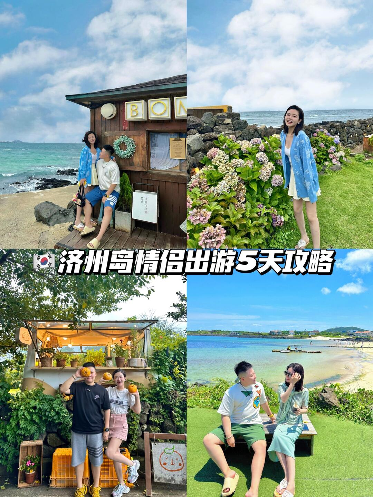

# 每日摄影教练 - 2026-05-18

---

# 风光/自然

## #1 风光/自然

**摄影师**: [Fabrizio Conti](https://unsplash.com/@conti_photos)
 | **来源**: [Unsplash](https://unsplash.com/photos/top-view-of-mountains-D9DTfAqxcC8)

> EXIF: Camera Canon Canon PowerShot G5 X | f/6.3 | 1/800s | 36.8mm | ISO 160

## 直觉
这张山景最动人的是层层山脊的起伏感，绿色山体在薄雾中向远处递进，有很强的空间纵深。整体气质清爽、开阔，适合走自然纪实风。

## 技法拆解
- 构图上利用前景岩石、中景草坡、远山雾气形成三层空间，画面不单薄。
- EXIF 中 f/6.3 保证了较好的景深，山体细节基本清晰。
- 1/800s 快门偏快，适合山顶有风、手持拍摄，能避免抖动。
- ISO 160 画质干净，但天空高光略亮，拍摄时可稍微压一点曝光。
- 色彩以青绿色为主，统一但略偏冷，增强了高山空气感。

## 实拍操作（佳能 R10）
模式拨盘建议用 **Av 光圈优先**，风光拍摄优先控制景深，相机会自动匹配快门。参数可设 **f/8、ISO 100-200、评价测光、单次自动对焦 One-Shot、对焦区域选单点或小区域 AF**，对在中远处山脊上。镜头建议用 **RF-S 18-150mm** 的 24-50mm 段，或 **RF-S 18-45mm** 广角端到中焦段。现场先找高处俯拍位置，让山脊线斜向穿过画面；等云雾或阳光在山坡上形成明暗变化；按快门前检查天空不过曝，必要时曝光补偿 -0.3EV。

## 后期思路
后期重点是保留清透感：适当降低高光、拉回天空层次，轻微增加去朦胧和对比度。绿色不要推得太艳，可降低黄色饱和、微调绿色色相，让山体更自然；用渐变工具单独压暗天空，会更有层次。

## #2 风光/自然

**摄影师**: [Husniati Salma](https://unsplash.com/@husniatisalma)
 | **来源**: [Unsplash](https://unsplash.com/photos/town-beside-cliff-5oXMfxmUSPg)

> EXIF: Camera NIKON CORPORATION NIKON D3000 | f/5.6 | 1/60s | 55.0mm | ISO 360

## 直觉
这张照片最吸引人的是山脊、村落与右侧云海形成的巨大尺度对比，有一种从高处俯瞰火山地貌的史诗感。清晨暖光扫过山体，让画面有层次和呼吸感。

## 技法拆解
- 竖构图很合适，右侧大面积云海与左侧山村形成冷暖、虚实对比。
- 55mm 焦段压缩了远近关系，让山脊线更连贯，空间感更强。
- f/5.6 在风光里景深略浅，但远景为主仍基本可用。
- 1/60s 对长焦端手持偏临界，若有风或手抖，细节容易发虚。
- 高光天空略亮，拍摄时可适当欠曝保住云海和天际层次。

## 实拍操作（佳能 R10）
模式拨盘选 **Av 光圈优先**，因为风光拍摄优先控制景深，同时让相机自动匹配快门。建议用 **f/8、1/125s 以上、ISO 100-400、评价测光、单次 AF，对焦区域用单点或小区域 AF**，对在远处山脊或村落边缘。镜头可用 **RF-S 18-150mm** 的 50-80mm 段，或 **RF-S 18-45mm** 长端取景。现场先找高机位，让山脊从左上延伸到右下；等待日出后侧光打亮山坡；按快门前观察云海边缘和村落位置，避免主体被画面边缘切得太碎。

## 后期思路
后期重点是保留清晨的暖光，同时压住天空和云海高光。可适度降低高光、提升阴影，增加少量清晰度与去朦胧，让山体纹理出来；色彩上保持暖山体、冷云海的对比，不要把饱和度推得过重。

## #3 风光/自然

**摄影师**: [Harrisun S](https://unsplash.com/@harrisunsdz)
 | **来源**: [Unsplash](https://unsplash.com/photos/snow-capped-mountain-peak-illuminated-by-sunrise-eVKQ5J_Lfug)

> EXIF: Camera FUJIFILM X-T20 | f/0.0 | 0.0mm

## 直觉
最打动人的是雪峰顶部那一抹日出暖光，和两侧山谷的深黑剪影形成强烈对比。画面安静、克制，有“清晨第一束光”的仪式感。

## 技法拆解
- 构图上，两侧暗山形成天然框景，把视线稳稳引向中央雪峰。
- 大面积蓝色天空留白让画面更冷、更静，适合表现高山清晨的空气感。
- 曝光偏向保护高光是正确的，雪峰顶部没有明显过曝，暖色细节保住了。
- 前景几乎全黑，氛围很好，但底部建筑信息略杂，可再压暗或裁掉一些。
- EXIF 中光圈和焦距为 0，数据无参考价值，应以现场光比来决定曝光。

## 实拍操作（佳能 R10）
模式拨盘建议选 **Av 光圈优先**，风光题材光线变化快，先控制景深，让相机配合快门更高效。推荐 **f/8-f/11，ISO 100-400，评价测光，曝光补偿 -0.7EV 到 -1.3EV**，防止雪峰日照部分过曝；对焦用 **单次自动对焦 One-Shot，单点或小区域对焦**，对在雪峰边缘高反差处。镜头可用 **RF-S 18-150mm** 的 50-100mm 段压缩山体，或 **RF-S 18-45mm** 取较宽山谷框景。现场先找两侧山坡形成 V 型的位置，提前等待太阳刚打到峰顶；用取景器检查高光警告，宁可画面暗一点；在暖光最集中、天空仍偏蓝时连拍几张，避免错过几分钟的最佳光线。

## 后期思路
后期方向是保留冷暖对比：天空和阴影维持蓝调，雪峰高光略加暖。重点压高光、提一点雪山中间调和纹理，黑色区域不要硬拉，保持剪影的厚重感；可适度裁掉底部杂乱，让雪峰更突出。

---

# 人像/质感

## #4 人像/质感

**摄影师**: [Shravan K Acharya](https://unsplash.com/@shravankacharya)
 | **来源**: [Unsplash](https://unsplash.com/photos/boy-in-white-button-up-shirt-smiling-cuStP_i-xPg)

> EXIF: Camera NIKON CORPORATION NIKON D5100 | f/2.2 | 1/160s | 50.0mm | ISO 320

## 直觉
这张人像最有感染力的是孩子双手抱头的自然姿态，画面有一种放松、亲近的生活感。浅景深让白衬衫和背景化开，质感柔和。

## 技法拆解
- 50mm、f/2.2 带来明显虚化，适合突出人物，但对焦容错很低。
- 1/160s 基本能压住轻微动作，拍孩子若动作更大可提高到 1/250s。
- 白衬衫面积大，曝光控制不错，但可略压高光保留衣服纹理。
- 构图采用近距离半身裁切，手臂形成框架感，增强人物中心感。
- 背景色彩低饱和，配合柔焦，整体偏温柔纪实风。

## 实拍操作（佳能 R10）
模式拨盘选 **Av 光圈优先**，因为这类人像重点是控制景深和背景虚化，让相机自动匹配快门更高效。推荐参数：光圈 f/2-f/2.8，快门尽量不低于 1/250s，ISO 自动上限 1600，评价测光，伺服 AF，人物眼部检测/人脸追踪。镜头可用 **RF 50mm F1.8 STM**，在 R10 上等效约 80mm，很适合近景人像；若空间小，可用 RF-S 18-45mm 拉到 35-45mm。现场让孩子面向柔和窗光或阴影处，摄影师略高一点俯拍；引导他把手放到头后，连续对话逗笑；等表情最自然、身体停顿瞬间连拍。

## 后期思路
后期走柔和暖调：稍降高光、提阴影，保留白衬衫细节。肤色可轻微加暖、降低整体饱和度，用曲线压一点黑位，营造胶片感。背景可加少量暗角，让视线集中到人物。

## #5 人像/质感

**摄影师**: [Garrett Jackson](https://unsplash.com/@gmjackson)
 | **来源**: [Unsplash](https://unsplash.com/photos/smiling-woman-in-green-long-sleeve-shirt-E3J03QoaTI0)

> EXIF: Camera NIKON CORPORATION NIKON D850 | f/2.8 | 1/500s | 85.0mm | ISO 400

## 直觉
最吸引人的是右侧浅蓝前景形成的“偷看感”，让人像有亲密、柔和的质感。绿色衣服与暖棕发色也很舒服，整体偏自然生活感。

## 技法拆解
- 85mm、f/2.8 带来明显虚化，背景和前景都被柔化，突出人物。
- 1/500s 足够稳，适合抓微笑和轻微动作。
- ISO 400 在户外很安全，兼顾快门速度与画质。
- 构图上人物偏左，右侧大面积虚化前景增加层次，但遮挡略多，可再留一点脸部空间。

## 实拍操作（佳能 R10）
模式拨盘选 **Av 光圈优先**，因为这类人像核心是控制景深和虚化。推荐参数：f/2.8-f/4，快门不低于 1/250s，ISO 自动上限 1600，评价测光；对焦用伺服 AF + 人眼识别，区域选全区域或灵活区域。镜头建议 **RF 50mm F1.8**（等效约80mm）或 RF-S 18-150mm 拉到 50-70mm。现场先让人物靠近有层次的背景，你自己隔着一块浅色前景拍；等表情自然、眼神放松时连拍 2-3 张。

## 后期思路
后期走柔和清透方向：稍降高光、提阴影，保留头发细节。色彩上可降低绿色饱和度、增加一点暖色温，让肤色和发色更温润；前景蓝色可适度降低清晰度，强化朦胧感。

## #6 人像/质感

**摄影师**: [Alexander Krivitskiy](https://unsplash.com/@krivitskiy)
 | **来源**: [Unsplash](https://unsplash.com/photos/a-black-and-white-photo-of-a-woman-with-long-hair-T4KjcrbJMSk)

## 直觉
这张人像最有力量的是“凝视”和发丝质感：黑白让情绪被压缩，眼神、皮肤、头发的细节都变得更有戏剧性。紧裁切带来亲密感，也让人物显得更神秘、冷静。

## 技法拆解
- 构图采用超近距离裁切，右眼和鼻梁成为视觉中心，左侧大量发丝增加层次。
- 黑白处理强化了明暗关系，弱化肤色干扰，适合表现质感人像。
- 光线像是柔和侧光，鼻梁和脸颊有漂亮过渡，没有生硬阴影。
- 景深较浅，眼部相对清晰，头发与背景逐渐虚化，突出人物情绪。
- 颗粒感提升了胶片气质，但要控制不要压掉眼睛和嘴唇细节。

## 实拍操作（佳能 R10）
模式拨盘建议选 **Av 光圈优先**，因为这类人像核心是控制景深和面部质感，快门可交给相机自动调整。推荐参数：光圈 **f/2.8-f/4**，快门不低于 **1/250s**，ISO **400-1600**，评价测光或点测光，曝光补偿可 **-0.3EV**；对焦用 **伺服 AF + 人眼检测**，对焦区域选全区域或小区域人眼追踪。镜头可用 **RF 50mm F1.8 STM**，在 R10 上等效约 80mm，很适合紧凑半身与特写；若用套机可选 **RF-S 18-150mm** 拉到 70-100mm。现场让模特侧对窗光，摄影师略高于眼平线，靠近拍摄；等她眼神稳定、发丝自然遮挡部分脸部时连拍 2-3 张，注意眼睛必须清晰。

## 后期思路
后期走高质感黑白方向：降低饱和转黑白，提高对比和清晰度，但保留皮肤灰阶。重点用曲线压暗发丝阴影、提亮眼白和唇部高光，再适量加颗粒，营造胶片肖像感。

---

# 街头/人文

## #7 街头/人文

**摄影师**: [Il Vagabiondo](https://unsplash.com/@ilvagabiondo)
 | **来源**: [Unsplash](https://unsplash.com/photos/a-man-wearing-a-face-mask-sitting-in-front-of-a-pile-of-paper-lanterns-cvWSilCI6AA)

> EXIF: Camera FUJIFILM X-H1 | f/2.8 | 1/320s | 50.0mm | ISO 800

## 直觉
这张最有味道的是“被灯笼包围的人”：纸灯笼的体量、文字和杂乱货架，把手作店铺的生活感一下子推出来了。

## 技法拆解
- f/2.8 让前景灯笼略有虚化，人物和背景仍保留环境信息，适合人文叙事。
- 1/320s 足够稳，抓住人物低头工作的瞬间，不拖影。
- ISO 800 在室内暗光下合理，保住快门速度，但暗部已有些压沉。
- 构图用前景灯笼形成包围感，但人物脸部被遮挡过多，主体识别稍弱。
- 红、白、黑三色反复出现，形成很强的街头视觉秩序。

## 实拍操作（佳能 R10）
模式拨盘选 **Av 光圈优先**，方便在室内快速控制景深和进光量。推荐 **f/2.8-f/4，1/250s 以上，ISO Auto 上限 3200，评价测光，伺服 AF，单点或小区域对焦**。镜头可用 **RF 50mm F1.8**，或 **RF-S 18-150mm 拉到 45-60mm**。现场先蹲低一点，让前景灯笼占画面；对焦在人物眼部或头部边缘；等他手部或姿态有动作时连拍两三张。

## 后期思路
后期保留室内昏暗感，不要把阴影全拉亮。可适度提升对比和清晰度，压高光、提一点白色灯笼纹理；红色稍降饱和，避免抢过人物和文字。

## #8 街头/人文

**摄影师**: [atelierbyvineeth ...](https://unsplash.com/@atelierbyvineeth)
 | **来源**: [Unsplash](https://unsplash.com/photos/man-plays-drum-during-a-street-protest-with-flags-f3aP_rJcDfs)

> EXIF: Camera FUJIFILM X-T4 | f/1.4 | 1/550s | 33.0mm | ISO 160

## 直觉
这张街头抗议有很强的临场感：鼓手站在画面中心，旗帜、标语和人群把声音与情绪都“推”了出来。黑白处理也让注意力更集中在行动和氛围上。

## 技法拆解
- f/1.4 的大光圈让背景建筑和人群虚化，突出鼓手，但现场信息仍可辨认。
- 1/550s 快门足够冻结行进中的人和敲鼓动作，街头抓拍很稳。
- 33mm 在 APS-C 上接近标准视角，既有人物主体，也保留了环境叙事。
- 构图上人物居中偏稳，左右旗帜和后方标语形成抗议现场的层次。
- 黑白高反差适合这类题材，但暗部人物衣服略压得太实，可保留一点细节。

## 实拍操作（佳能 R10）
模式拨盘选 **Av 光圈优先**，因为街头人文更需要快速控制景深，让相机自动匹配快门。推荐用 **f/1.8-f/2.8、快门不低于 1/500s、ISO Auto 上限 1600、评价测光、伺服 AF、人物/区域对焦**。镜头可用 **RF 35mm F1.8 Macro IS STM**，在 R10 上等效约 56mm；若想更宽一点，用 **RF-S 18-45mm** 的 24-35mm 段。现场先站在人群行进侧前方，不要挡路；等鼓手抬手、旗帜展开、背景标语露出时连拍；尽量让主体脸部或上半身落在最亮的街面反光中。

## 后期思路
建议继续走纪实黑白方向，提高对比和清晰度，但把阴影稍微拉回，避免黑衣服糊成一片。可用曲线压暗杂乱背景、局部提亮鼓手手部和鼓面，让“敲鼓”这个动作成为视觉中心。

---

# 极简/建筑

## #9 极简/建筑

**摄影师**: [Pavel Neznanov](https://unsplash.com/@npi)
 | **来源**: [Unsplash](https://unsplash.com/photos/brown-brick-building-covered-with-snow-ZGnI5mPQaHY)

> EXIF: Camera Xiaomi Redmi Note 8 Pro | f/1.9 | 1/1150s | 5.4mm | ISO 100

## 直觉
红砖建筑被大面积白雪包围，颜色关系非常干净，有一种冷静、疏离的工业感。画面正面展开，建筑体块和栏杆线条让“极简建筑”气质很明确。

## 技法拆解
- 手机 EXIF 为 f/1.9、1/1150s、ISO100，曝光很稳，雪地没有明显死白，细节保留不错。
- 构图以正面平视为主，红砖体块占上半部，白雪占下半部，冷暖对比清楚。
- 两侧栏杆形成引导线，把视线推向中间入口，但中心略偏乱，可再更严格对称。
- 天空灰白、光线柔和，适合拍建筑纹理，避免了强阴影破坏极简感。

## 实拍操作（佳能 R10）
模式拨盘建议用 **Av 光圈优先**，建筑静物不需要抢速度，先控制景深和画质最重要。推荐参数：f/8，ISO100，快门交给相机但不低于 1/125s，评价测光；曝光补偿可 +1/3 到 +2/3EV 防止雪变灰；对焦用单次 AF，单点或小区域对焦在建筑门窗边缘。镜头建议 RF-S 18-45mm 用 18-24mm，或 RF-S 10-18mm 拍更宽的建筑空间。现场先站到建筑中轴线，打开电子水平仪校正横平竖直；等阴天均匀光或雪后无脚印时拍；按快门前检查两侧边缘是否裁切干净。

## 后期思路
后期重点是“冷白雪 + 暖红砖”的克制对比：适度降低高光、拉回雪地纹理，提升砖墙清晰度和纹理。可轻微校正透视，让竖线更直；整体饱和度不要太高，保持灰冷、安静的建筑感。

## #10 极简/建筑

**摄影师**: [Andrew Kliatskyi](https://unsplash.com/@kirp)
 | **来源**: [Unsplash](https://unsplash.com/photos/an-abstract-black-background-with-wavy-lines-RJ7tsexUyJY)

## 直觉
这张最迷人的是“几乎全黑”里的层次：波浪形边缘像建筑表皮，也像被压低音量的光。极简但不空，靠微弱高光把节奏撑起来。

## 技法拆解
- 构图采用斜向重复曲线，画面从左下到右上形成流动感，避免了静态呆板。
- 低调曝光是核心，暗部保留大面积黑，靠边缘高光分离层次。
- 色彩几乎单色化，减少干扰，让观者专注形体、材质和明暗。
- 景深应尽量充足，保证前后波浪边缘都清晰，强化建筑抽象感。

## 实拍操作（佳能 R10）
模式拨盘选 **Av 光圈优先**，因为这类建筑细节主要控制景深和画面质感，快门可交给相机微调。建议 **f/8-f/11，ISO 100-400，评价测光或点测高光，曝光补偿 -1 到 -2EV**，避免黑色材质被相机拍灰；对焦用 **单次 AF，单点/小区域对焦**，对在最有高光的边缘线上。镜头可用 **RF-S 18-150mm 的 70-150mm 段**压缩曲线，或 **RF 50mm F1.8**靠近拍局部。现场先沿建筑表面侧向移动，找有掠射光的位置；让曲线斜穿画面，不要拍全；等光只擦到边缘时按快门，必要时连拍微调构图。

## 后期思路
后期继续走低调极简方向，不要强行提亮暗部。降低黑色色阶、微提高光和清晰度/纹理，让边缘更立体；可适度压低饱和度或转黑白，使用曲线加强暗部层次，避免死黑成一片。

## #11 极简/建筑

**摄影师**: [Robert Casmirovici](https://unsplash.com/@robertkzmr)
 | **来源**: [Unsplash](https://unsplash.com/photos/a-black-and-white-photo-of-a-tall-building-AxsdiqHgwis)

> EXIF: Camera Canon  EOS 600D | f/8.0 | 1/320s | 55.0mm | ISO 100

## 直觉
这张建筑极简照片最吸引人的是“向上生长”的尖锐几何感，画面干净、冷静。大面积留白让建筑线条更有力量，黑白处理也强化了秩序感。

## 技法拆解
- 构图采用低机位仰拍，让楼体边缘形成强烈斜线，把视线直接引向顶部尖点。
- 大面积天空留白处理得很好，符合极简建筑摄影的“少即是多”。
- f/8、ISO100 保证了画面细节和低噪点，适合拍摄建筑表面纹理。
- 1/320s 快门足够稳定，55mm 焦段压缩感适中，避免过度广角畸变。
- 黑白影调偏柔，线条清晰但反差还可以再略加强。

## 实拍操作（佳能 R10）
模式拨盘建议选 **Av 光圈优先**，因为建筑静态拍摄重点是控制景深和画质。推荐参数：光圈 f/8，快门由相机自动但尽量不低于 1/250s，ISO 100，评价测光，单次自动对焦 One-Shot AF，使用单点或小区域对焦对准建筑边缘。镜头可用 RF-S 18-150mm，在 50-70mm 段拍摄；或 RF-S 18-45mm 拉到 45mm。现场先贴近建筑底部，抬头寻找最干净的天空背景；再微调机位，让建筑尖端落在画面上方偏右位置；等待云层均匀或阴天柔光时按下快门，减少强烈阴影干扰。

## 后期思路
后期可以走高调黑白极简风：降低饱和转黑白，提高白色和高光，让天空更干净。适度增加对比度、清晰度和纹理，强化建筑线条；同时用透视校正微调垂直边缘，保持几何感干净利落。

---

# 美食/静物

## #12 美食/静物

**摄影师**: [Mae Mu](https://unsplash.com/@picoftasty)
 | **来源**: [Unsplash](https://unsplash.com/photos/fry-rice-with-prawn-dish-dTNNDTbZr8I)

![Enjoy your meal!
If you like this picture please give me a “like” let me know your feedback, or leave your Comments/suggestions below
check out my Instagram @picoftasty more surprise there!

From now on, Every Saturday (Central Time - US & Canada) I will release Lightroom preset for people who are interested in food photography check out my website and download it for free. This is a great opportunity to practice and take your images to the next level.
- Now subscribe, get the latest release first](https://images.unsplash.com/photo-1551326844-4df70f78d0e9?crop=entropy&cs=tinysrgb&fit=max&fm=jpg&ixid=M3w5NDY2ODd8MHwxfHJhbmRvbXx8fHx8fHx8fDE3NzkxMzIxMzR8&ixlib=rb-4.1.0&q=80&w=1080)

> EXIF: Camera Canon Canon EOS 6D | f/5.6 | 1/80s | 50.0mm | ISO 125

## 直觉
这张美食静物最吸引人的是“暗调餐桌”的氛围：黑布、木器、竹编托盘把米饭和虾的暖色托得很突出。俯拍构图干净，食物有食欲，画面也有秩序感。

## 技法拆解
- 原片 EXIF 为 f/5.6、1/80s、ISO125、50mm，全画幅视角自然，适合桌面静物。
- 俯拍让锅、托盘、餐具形成稳定几何关系，主体居中但右侧餐具平衡了画面。
- 暗背景压住杂乱信息，黄色米饭与粉橙色虾成为视觉焦点。
- 光线偏柔，像是侧上方自然窗光，保留了米粒和竹编的质感。

## 实拍操作（佳能 R10）
模式拨盘选 **Av 光圈优先**，因为美食静物主要控制景深，让相机自动匹配快门更高效。推荐 **f/5.6-f/8、1/80s 以上、ISO100-400、评价测光、单次 AF、单点/小区域对焦**，对焦落在虾和米饭交界处。镜头可用 **RF-S 18-45mm 的 30-35mm 端**，或 **RF 50mm F1.8** 后退俯拍。现场先把相机架到餐桌正上方，保持画面边框与托盘平行；用窗光从左上方进入，黑布吸光；最后整理虾的位置，等高光最柔时按快门。

## 后期思路
后期保持低调暖色方向：压低黑位和阴影，让背景更沉，同时提升食物的曝光、纹理和清晰度。适度增加暖色饱和度，虾可用局部蒙版提亮，避免整体过黄。

## #13 美食/静物

**摄影师**: [Deepthi Clicks](https://unsplash.com/@switchinglanes)
 | **来源**: [Unsplash](https://unsplash.com/photos/a-cut-in-half-sandwich-sitting-on-top-of-a-wooden-cutting-board-ZVS9Tic57gw)

> EXIF: Camera Canon  EOS 5D Mark IV | f/3.5 | 1/200s | 85.0mm | ISO 3200

## 直觉
牛油果的绿色和培根的焦脆感很诱人，浅景深让三明治从温暖的木板和背景灯斑里跳出来。整体有阳光早餐的松弛感。

## 技法拆解
- 85mm、f/3.5 带来明显压缩感和柔化背景，适合突出食物层次。
- 1/200s 足够稳，但 ISO 3200 偏高，若现场允许可降 ISO 换更干净画质。
- 高光有些溢出，右上背景和面包边缘略亮，拍摄时应压一点曝光。
- 构图采用斜向木板和切开的三明治，能引导视线，但前景叶子稍抢眼。

## 实拍操作（佳能 R10）
模式拨盘选 **Av 光圈优先**，因为美食静物最重要是控制景深和背景虚化。推荐参数：f/3.5-f/4，快门不低于 1/160s，ISO Auto 上限 1600，评价测光或高光重点测光，单次 AF，单点/小区域对焦在前方三明治的牛油果或培根边缘。镜头可用 **RF 50mm F1.8 STM**，在 R10 上约等效 80mm；或 RF-S 18-150mm 拉到 50-60mm。现场先低机位靠近食物，45°侧逆光；用白纸或反光板补暗部；等阳光斑落在木板而不是面包高光处时连拍几张。

## 后期思路
后期以“明亮、温暖、清爽”为方向，降低高光、略提阴影，保住面包和木板细节。适度增加自然饱和度和清晰度，让生菜与培根更有食欲；可用局部蒙版压暗前景杂叶和右上过亮区域。

## #14 美食/静物

**摄影师**: [Imad Sidki](https://unsplash.com/@imadsvision)
 | **来源**: [Unsplash](https://unsplash.com/photos/a-dessert-with-fruit-and-cream-on-a-plate-To5YPoNhxDo)

> EXIF: Camera Canon  EOS 4000D | f/3.5 | 1/60s | 50.0mm | ISO 1600

## 直觉
这张甜品最吸引人的是红色莓果与奶油层次，前景杯体清晰、背景人物虚化，带出餐厅现场感。整体有“刚端上桌”的自然氛围。

## 技法拆解
- f/3.5 配合 50mm 焦段，虚化背景有效，但前杯顶部与杯身的清晰范围略浅。
- 1/60s 在室内手持偏临界，画面有轻微松动感，建议提高快门或稳定支撑。
- ISO 1600 保住了曝光，但暗部噪点和色彩纯净度会下降。
- 构图上主体偏右不错，后方第二杯形成呼应，但左侧亮竖线稍分散注意力。
- 色彩重点是红、白、绿，甜品本身很有食欲，适合略提亮、增强通透感。

## 实拍操作（佳能 R10）
模式拨盘建议用 **Av 光圈优先**，美食静物最重要是控制景深，R10 会自动匹配快门。推荐参数：光圈 f/4-f/5.6，让杯口水果到杯身都有足够清晰；快门尽量不低于 1/125s；ISO Auto 上限设 3200；评价测光；对焦用 **单次 AF + 单点/小区域 AF**，对在前杯最亮的莓果或杯口边缘。镜头可用 RF-S 18-150mm 的 50-70mm 段，或 RF 50mm F1.8 收到 f/4 使用。现场先蹲低到与杯口接近平视，让背景人物成为柔和色块；移动机位避开左侧亮竖线；等服务员或背景人物动作安静时再按快门，必要时连拍 2-3 张防手抖。

## 后期思路
后期往“清爽甜品、自然餐厅光”方向走：提高曝光和阴影，略压高光，保留奶油质感。白平衡可稍微偏暖，红色和绿色适度提高饱和度；用局部蒙版提亮主体、降低背景清晰度与亮度，让视线集中在前杯甜品。

---

# 夜景/城市

## #15 夜景/城市

**摄影师**: [Maxime Doré](https://unsplash.com/@maxime_dore)
 | **来源**: [Unsplash](https://unsplash.com/photos/bokeh-photography-of-black-metal-bar-Nhq8yWO7fDU)

> EXIF: Camera Panasonic DC-G9 | f/5.6 | 1/30s | 100.0mm | ISO 800

## 直觉
雨夜栏杆上的水光和远处散开的暖色灯球很迷人，有一种安静、潮湿的城市电影感。主体很简单，但氛围抓得准。

## 技法拆解
- 用 100mm 长焦压缩空间，让路灯在背景中形成密集的虚化光斑。
- f/5.6 仍有明显散景，关键是主体近、背景远，距离关系比单纯大光圈更重要。
- 1/30s 在夜景中偏慢，适合拍静物，但需要稳机或防抖，否则栏杆细节容易糊。
- ISO 800 保留了暗部氛围，没有把夜景提得太亮，这是对的。
- 冷蓝色湿栏杆与暖黄色路灯形成冷暖对比，画面情绪更强。

## 实拍操作（佳能 R10）
模式拨盘选 **Av 光圈优先**，因为这类照片重点是控制景深和虚化，快门由相机配合完成。推荐参数：光圈 f/4-f/5.6，快门尽量不低于 1/60s，ISO 800-1600，评价测光，单次 AF，单点对焦对准最近的湿栏杆边缘。镜头可用 **RF-S 55-210mm** 的 100-150mm 段，或 RF 85mm F2 获得更强虚化。现场先贴近栏杆，让背景灯离主体尽量远；等雨水反光最明显的位置；半按确认焦点后，屏住呼吸连拍 2-3 张。

## 后期思路
后期保持低调夜景，不要强行提亮。适当压高光保护灯球，提升对比和清晰度突出水珠；色温略偏冷，保留灯光暖色，可用局部加亮栏杆边缘，让主体更立体。

## #16 夜景/城市

**摄影师**: [𝕡𝕒𝕨𝕤 𝕒𝕟𝕕 𝕡𝕣𝕚𝕟𝕥𝕤](https://unsplash.com/@paws_and_prints)
 | **来源**: [Unsplash](https://unsplash.com/photos/wet-cobblestone-street-reflecting-city-lights-at-night-uwXMcVUouE8)

> EXIF: Camera Canon  EOS 250D | f/1.8 | 1/200s | 25.0mm | ISO 3200

## 直觉
这张最迷人的是“雨后地面”的反光，把普通街道拍出了电影感。虚化的城市灯点和低机位湿石板，让画面有很强的夜行情绪。

## 技法拆解
- f/1.8 大光圈制造了明显散景，背景灯光被化成柔和光斑。
- 1/200s 对夜景来说偏快，有利于手持稳定，但代价是 ISO 到 3200，暗部噪点会增加。
- 低机位贴近地面是关键，湿石板纹理和反光成为前景主体。
- 画面上方留了大量黑夜空间，氛围足，但主体重心略偏低，可尝试再压暗天空或裁切。

## 实拍操作（佳能 R10）
模式拨盘选 **Av 光圈优先**，因为这类照片核心是控制景深和灯光虚化。推荐 **f/1.8-f/2.8，快门不低于 1/125s，ISO Auto 上限 3200，评价测光，单次 AF，单点/小区域对焦**。镜头可用 **RF 50mm F1.8 STM** 拍更强虚化，或 **RF-S 18-45mm 在 25-35mm** 拍环境感。现场蹲低甚至贴近地面，把焦点放在前方一块有高光的石板边缘；等车灯、路灯反射最亮时拍；连拍几张，挑反光形状和光斑最干净的一张。

## 后期思路
后期方向是保留夜景的冷暖对比：压高光，提一点阴影和纹理，让湿石板更有质感。适度降噪、增加对比和清晰度，色彩上可强化蓝橙对比，但避免把黑位提得太灰。

## #17 夜景/城市

**摄影师**: [zero take](https://unsplash.com/@zerotake)
 | **来源**: [Unsplash](https://unsplash.com/photos/two-people-stand-before-a-city-tower-at-night-Qp7dZDWk6m0)

> EXIF: Camera SONY ILCE-1 | f/2.8 | 1/40s | 200.0mm | ISO 1600

## 直觉
这张夜景最有味道的是“远处清晰的红色塔身”和“近处虚化人物”的反差，带出一种城市夜晚的疏离感。整体很暗，氛围成立，但主体细节略显压得过深。

## 技法拆解
- 200mm 长焦压缩了人物与城市塔的距离，让背景建筑更有存在感。
- f/2.8 带来浅景深，前景人物虚化，视线自然落到塔身灯光。
- 1/40s 对 200mm 来说偏慢，若手持很容易抖动，画面暗部也会显得松。
- ISO 1600 保住了夜景亮度，但暗部噪点和细节损失需要控制。
- 构图上塔居中偏上，留出大量暗空，情绪强，但可略裁掉一部分顶部黑区。

## 实拍操作（佳能 R10）
建议用 **M 档**，夜景光比复杂，手动曝光更稳定，避免相机被大面积黑夜误导。参数可从 **f/2.8-f/4、1/80s-1/125s、ISO 1600-3200、评价测光、单次 AF，单点/小区域对焦塔身灯光** 开始；若上三脚架，可降到 ISO 400-800、快门放慢。镜头推荐 **RF 70-200mm F2.8L / RF 70-200mm F4L**，轻便方案可用 **RF-S 55-210mm** 拉到长焦端。现场先退远，用长焦把塔“压”到人物背后；让人物站近镜头并不必对焦；等塔灯最亮、人物姿态稳定时连拍两三张。

## 后期思路
后期以“冷暗城市夜色”为方向，压低高光，稍提阴影但不要提太多，保留神秘感。重点增强红色塔灯的饱和度和明度，暗部适度降噪；可用径向/画笔工具轻微提亮塔身，让视觉中心更明确。

---

# 微距/特写

## #18 微距/特写

**摄影师**: [aurélie sgnl](https://unsplash.com/@auresa)
 | **来源**: [Unsplash](https://unsplash.com/photos/a-snail-with-a-large-shell-crawls-forward-iIxZ3cGsS3g)

> EXIF: Camera Canon  EOS M50 | f/6.3 | 1/30s | 150.0mm | ISO 200

## 直觉
低机位贴近蜗牛，让它像“慢慢走来的小巨人”，壳的纹理和柔和背景很有微距的安静感。

## 技法拆解
- 150mm 长焦微距压缩背景，虚化干净，主体从环境里被很好地托出来。
- f/6.3 景深仍然很浅，壳较清晰，但头部和触角明显虚掉，焦点略靠后。
- 1/30s 对 150mm 和移动中的蜗牛偏慢，容易产生轻微抖动或主体运动模糊。
- 低角度平视拍摄很有效，增强了临场感，比俯拍更有生命力。
- 整体色彩偏淡、低对比，适合表现潮湿、柔软的氛围。

## 实拍操作（佳能 R10）
模式拨盘选 **Av 光圈优先**，微距时先控制景深，再让相机给快门。建议 **f/8-f/11、1/125s 以上、ISO 400-1600 自动、评价测光**；对焦用 **单次 AF 或伺服 AF**，区域选 **单点/小区域 AF**，对准眼部或触角根部。镜头可用 **RF-S 18-150mm 的长焦端近摄**，更理想是 **RF 100mm F2.8L Macro**。现场先趴低到与蜗牛同高，背景尽量远；等它头部伸出、触角打开时连拍；若光线暗，用提高 ISO 换更安全快门。

## 后期思路
保留柔和清冷的感觉，适当提升主体的纹理、清晰度和对比。压低高光、稍提阴影，让壳的层次出来；可用局部蒙版加强壳和头部，背景保持干净柔。

## #19 微距/特写

**摄影师**: [Nik](https://unsplash.com/@helloimnik)
 | **来源**: [Unsplash](https://unsplash.com/photos/green-plant-with-raindrops-bole3BdeOto)

> EXIF: Camera NIKON CORPORATION NIKON Z 6 | 1/320s | ISO 160

## 直觉
这张微距最迷人的是“露珠像小玻璃球一样挂在草尖”，绿色层次很柔，散景光斑让画面有清晨湿润、安静的气息。

## 技法拆解
- 1/320s 对微距来说比较稳，能压住手持轻微晃动，适合草叶这种容易被风吹动的主体。
- ISO 160 保持了干净画质，绿色背景没有明显噪点，通透感好。
- 景深非常浅，焦点落在几颗露珠上，其余草叶虚化成线条，形成纵深。
- 画面采用斜向草叶走势，比居中拍单颗露珠更有流动感。
- 高光光斑漂亮，但局部略亮，拍摄时可稍微压一点曝光保护露珠高光。

## 实拍操作（佳能 R10）
模式拨盘建议用 **Av 光圈优先**，因为微距核心是控制景深，让露珠清楚、背景柔化。R10 可设 **F4-F5.6、快门不低于 1/250s、ISO 自动上限 800、评价测光，曝光补偿 -0.3EV**。对焦用 **单次 AF 或手动对焦，单点/小区域对焦**，对准最亮、形状最好的一颗露珠。镜头推荐 **RF-S 18-150mm 的长焦端近摄**，更理想是 **RF 85mm F2 Macro IS STM**。现场先蹲低，让草叶形成斜线；等侧逆光照到露珠；身体屏息，连拍 3-5 张挑最锐的一张。

## 后期思路
后期方向保持清新自然，不要把绿色拉得太荧光。可适度降低高光、提升阴影和微对比，增强露珠立体感；用径向或局部蒙版轻提主体露珠亮度，背景则略降清晰度，保留梦幻散景。

## #20 微距/特写

**摄影师**: [Glennice Burns](https://unsplash.com/@glenniceburns)
 | **来源**: [Unsplash](https://unsplash.com/photos/white-daisy-with-yellow-center-and-water-droplets-MJCsg2GkQyc)

> EXIF: Camera Canon  EOS 80D | f/6.3 | 1/160s | 100.0mm | ISO 400

## 直觉
水滴和黄色花心是这张的灵魂，阳光让花瓣有了通透感。近距离观看时，画面有一种清晨露水未干的安静与新鲜。

## 技法拆解
- 100mm 微距视角压缩背景，绿色虚化干净，主体非常突出。
- f/6.3 在微距下景深仍然很浅，水滴和部分花蕊清楚，边缘花瓣自然虚化。
- 1/160s 基本够用，但微距手持容易抖，若有风可再提高到 1/250s。
- ISO 400 是合理妥协，保证快门速度，同时画质仍然干净。
- 高光花瓣接近过曝，拍摄时应重点保护白色花瓣细节。

## 实拍操作（佳能 R10）
模式拨盘建议用 **Av 光圈优先**，因为微距最关键是控制景深，让你专注于构图和对焦。推荐参数：光圈 **f/5.6-f/8**，快门尽量不低于 **1/250s**，ISO 设 **自动 ISO 上限 1600**，测光用 **评价测光**，曝光补偿可设 **-0.3EV** 保护白花；对焦用 **单次 AF 或手动对焦**，对焦区域选 **单点 AF**。镜头可选 **RF 100mm F2.8L Macro IS USM**，或预算方案用 **RF-S 18-150mm** 长焦端近摄。现场先贴近花朵侧前方，避开杂乱背景；等太阳斜射或云层柔化光线；把焦点放在最亮、最圆的水滴或花蕊边缘，屏息轻按快门，最好连拍几张防抖动。

## 后期思路
后期重点是压住白色花瓣高光，略提阴影，让水滴更通透。色彩上可加强黄色和绿色的分离，适度降低饱和避免俗艳。用局部调整或蒙版轻微增加水滴清晰度、纹理和对比度即可。

---

# 黑白/光影

## #21 黑白/光影

**摄影师**: [Tyler Heller](https://unsplash.com/@hellert88)
 | **来源**: [Unsplash](https://unsplash.com/photos/a-black-and-white-photo-of-an-old-building-FKlRrbz8Jns)

> EXIF: Camera Canon  EOS Rebel T7 | f/5.0 | 1/2000s | 43.0mm | ISO 800

## 直觉
这张黑白建筑照最有力量的是“冷”和“空”：重复的窗格、破损的玻璃、外墙纹理，让废弃感很直接。画面右侧消防梯也增加了城市衰败的叙事性。

## 技法拆解
- 黑白处理适合这类题材，能强化砖墙、窗框和水泥柱的纹理。
- 43mm 视角较自然，建筑没有被过度夸张，但画面略有仰拍透视变形。
- EXIF：f/5、1/2000s、ISO 800，快门明显偏快，ISO 可降到 100-200 获得更干净画质。
- 构图上建筑占满画面，信息充分，但底部道路和右侧树枝略分散注意力。

## 实拍操作（佳能 R10）
模式拨盘建议用 **Av 光圈优先**，因为拍建筑重点是控制景深和画质，快门由相机自动匹配即可。推荐参数：光圈 f/8，ISO 100-200，快门不低于 1/125s，评价测光或高光优先测光；对焦用 One Shot，单点 AF，对在建筑正面中部砖墙或窗框。镜头可用 RF-S 18-45mm 的 24-35mm 段，或 RF-S 18-150mm 的 30-50mm 段。现场先退远一点，让相机尽量保持水平；等阴天或柔和侧光时拍，纹理更细；按快门前检查建筑竖线，尽量避免明显歪斜。

## 后期思路
后期可走“冷峻纪实”方向：降低饱和转黑白，适度增加对比、清晰度和纹理。重点压暗天空和边缘，提亮窗框细节；用透视校正拉直竖线，让建筑更稳、更有压迫感。

## #22 黑白/光影

**摄影师**: [Thomas Griggs](https://unsplash.com/@viajeenparacaidas)
 | **来源**: [Unsplash](https://unsplash.com/photos/grayscale-photo-of-bare-tree-OjlU6rbcG8M)

> EXIF: Camera Canon Canon EOS 80D | f/7.1 | 1/1000s | 18.0mm | ISO 125

## 直觉
枯树像一只伸向天空的手，黑云白云的强反差让画面有戏剧感。黑白处理很适合这个题材，突出了枝干的线条和荒凉气氛。

## 技法拆解
- 18mm 广角把树干、天空、湿地环境都纳入，增强了空间感和压迫感。
- f/7.1 保证前景树根到远处云层都有较清晰的细节，适合风景纪实。
- 1/1000s 偏快，完全冻结枝叶与云的动态，但在静态场景中可适当降低换取更低 ISO。
- 构图上主树略偏中，枝干向四周放射，形成很强的视觉引导。
- 黑白反差处理到位，但暗部树丛略重，可保留一点层次。

## 实拍操作（佳能 R10）
模式拨盘选 **Av 光圈优先**，因为这类照片核心是控制景深和线条清晰度。推荐 **f/8、1/250s 以上、ISO 100-400、评价测光、单次 AF，单点或小区域对焦**，对焦在主树干中段。镜头可用 **RF-S 18-45mm 的 18mm 端**，或 **RF-S 10-18mm** 拍得更有张力。现场先低机位靠近树根，让树干向上延伸；等云层经过树枝后方形成亮背景；曝光补偿可降 **-0.3 到 -0.7EV**，避免白云过曝。

## 后期思路
黑白方向应走“高反差、硬质感”，重点拉开天空与树干的明暗。降低高光保住云层，适度压暗蓝天对应的明度，加清晰度/纹理强化树皮。暗部不要一味压死，可用局部提亮保留树根和灌木细节。

## #23 黑白/光影

**摄影师**: [Llyfrgell Genedlaethol Cymru / The National Library of Wales](https://unsplash.com/@gofyn)
 | **来源**: [Unsplash](https://unsplash.com/photos/a-black-and-white-photo-of-a-woman-arranging-flowers-oO7K0pDY40g)

## 直觉
这张照片最迷人的是“舞台感”：人物在暗背景里伸手整理花束，光像聚光灯一样落在花和手臂上。黑白处理让注意力集中在形态、质感和动作，而不是花的颜色。

## 技法拆解
- 主光从右前方打来，花朵高光明亮、背景压暗，形成强烈明暗分离。
- 构图上人物在左、花束在右，手臂形成斜线，把视线自然引到花瓶。
- 黑白影调层次很好：花瓣接近高光但仍有纹理，暗部保留环境气氛。
- 人脸不作为重点，反而强化了“整理花艺”这个动作和时代纪录感。
- 画面略有颗粒与硬光感，很符合胶片纪实的质朴味道。

## 实拍操作（佳能 R10）
模式拨盘选 **Av 光圈优先**：这种静态人像/纪实场景，先控制景深和进光量，让相机自动给快门更稳妥。推荐 **f/4-f/5.6，1/125s 以上，ISO 800-1600，评价测光或点测光测花朵，对焦模式 One Shot，单点/小区域对焦在花束前部或手上**。镜头可用 **RF-S 18-150mm 的 35-60mm 段**，或 **RF 50mm F1.8**，在 R10 上等效约 80mm，适合压暗背景、突出主体。现场先让人物靠近桌边，背景尽量远且暗；把窗光或单灯放在右前侧约45度；等她伸手整理花枝、手臂线条最自然时连拍两三张。

## 后期思路
后期走经典黑白纪实方向：降低饱和转黑白，提高对比但保留花瓣细节。重点压暗背景、提亮花和手，可用曲线、黑白混色和局部蒙版；适当加颗粒与轻微暗角，增强1950年代胶片感。

---

# 小红书｜人像写真

## #24 小红书｜人像写真

**摄影师**: [天祁预暴](https://www.xiaohongshu.com/user/profile/57ff47d06a6a6940b251d3b3)
 | **来源**: [小红书](https://www.xiaohongshu.com/explore/64b60f55000000001c00fc0c?xsec_token=ABUUOADRu6dI8NlNWT9_SMJ8-fzUziNIZRrvtYhv-sDII&xsec_source=pc_feed)

## 直觉
这组图最打动人的是“济州蓝”：海、天空、草地和蓝色穿搭形成统一记忆点，很适合小红书旅行攻略封面。情侣互动自然，氛围比精修感更重要。

## 技法拆解
- 拼图选景丰富：海边、咖啡店、花丛、草坡，信息量足，符合“5天攻略”的封面属性。
- 色彩主线清晰，蓝绿橙贯穿画面，和济州海岛、橘子元素匹配。
- 多数画面用广角环境人像，人物不一定最大，但地点感很强。
- 正午光偏硬，肤色和白衣容易过曝，拍摄时要注意压高光。
- 中间大标题醒目，但略遮挡下方画面，可给文字预留更干净的横向区域。

## 实拍操作（佳能 R10）
模式拨盘选 **Av 光圈优先**，旅行人像变化快，用光圈控制虚化和进光量，快门交给相机更稳。推荐 **f/4-f/5.6，1/500s以上，ISO 100-400，评价测光，伺服AF+人眼识别，区域AF**；逆光或白衣场景可曝光补偿 **-0.3~-0.7EV**。镜头建议 **RF-S 18-150mm** 一镜走天下，海边环境用18-24mm，情侣半身或花丛用35-70mm。现场先找蓝天海面和人物衣服同色呼应的位置，再让人物坐、靠、举饮料制造互动；等云遮太阳或侧光时拍，连拍抓笑和对视瞬间。

## 后期思路
整体走“小红书清透海岛风”：提高曝光和阴影，但压住高光，避免天空死白。HSL里加强蓝色、青色和绿色的明亮度，橙色稍提饱和突出济州橘子感。人物肤色单独提亮、降一点蓝青反光，让画面清爽但不偏冷。