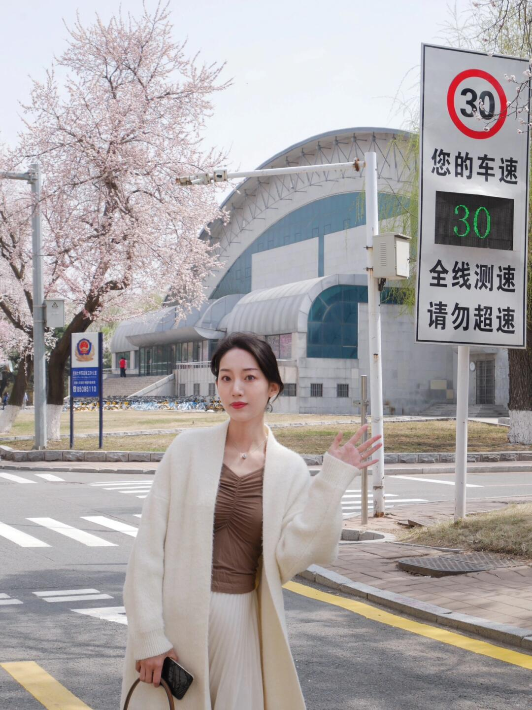

# 每日摄影教练 - 2026-05-21

---

# 风光/自然

## #1 风光/自然

**摄影师**: [Angel](https://unsplash.com/@enjiruuuu)
 | **来源**: [Unsplash](https://unsplash.com/photos/a-snow-covered-mountain-with-trees-in-the-foreground-kh_sWQb9iiI)

> EXIF: Camera Canon  EOS 800D | f/8.0 | 1/640s | 72.0mm | ISO 100

## 直觉
雪顶富士山在暖色夕光里很有宁静感，右侧树枝作为前景，让画面不只是“远山证件照”，多了一点现场感和季节气息。

## 技法拆解
- f/8 保证山体纹理清晰，适合风光题材，景深也足够覆盖远景。
- 1/640s 偏快，能避免长焦端手抖，但若上三脚架可降到 1/125s 换取更低压力。
- ISO 100 很干净，保留了天空和雪面的细腻层次。
- 构图上山峰居中偏稳，右侧树枝形成框景，但稍显杂乱，可再避开遮挡山体的枝条。
- 傍晚侧光把雪面起伏打出来，是这张照片最关键的光线优势。

## 实拍操作（佳能 R10）
模式拨盘建议选 **Av 光圈优先**，风光拍摄优先控制景深，让相机自动给快门更高效。参数可设 **f/8、ISO 100、评价测光、曝光补偿 -0.3EV**，防止雪山高光过曝；对焦用 **单次 AF，单点或小区域对焦**，对在山体明暗交界处。镜头建议用 **RF-S 18-150mm** 的 70-120mm 段，或 **RF 100-400mm** 取更压缩的山体比例。现场先找树枝作为右侧前景，再横向微调避开山峰；等夕阳低角度照亮雪线时拍；按快门前检查雪顶高光警告。

## 后期思路
整体往“清透暖夕照”方向处理：适当降低高光、提升阴影和去朦胧，增强山体纹理。白平衡可略偏暖，天空蓝色降低一点饱和，前景树枝压暗，突出富士山主体。

## #2 风光/自然

**摄影师**: [Fabrizio Conti](https://unsplash.com/@conti_photos)
 | **来源**: [Unsplash](https://unsplash.com/photos/mountain-with-clouds-P85bk96XAZM)

> EXIF: Camera Canon Canon PowerShot G5 X | f/10.0 | 1/1600s | 31.6mm | ISO 200

## 直觉
这张照片最迷人的是“山浮在云上”的层次感，远山像岛屿一样被雾气托起。整体蓝灰调很安静，有高海拔清晨的冷峻感。

## 技法拆解
- 构图上把主峰放在画面中上部，下面留出大量雾化山体，空间感很好。
- 云层形成天然横线，把天空、主峰、前景山脉分成三层，画面有秩序。
- EXIF 为 f/10、1/1600s、ISO 200，快门偏快，适合手持和远景防抖，但光线不强时可适当降到 1/500s 换更低 ISO。
- 色彩统一在冷蓝灰范围内，氛围完整，但暗部山体略沉，可保留轮廓同时稍提细节。

## 实拍操作（佳能 R10）
模式拨盘建议用 **Av 光圈优先**，风光场景优先控制景深，让相机自动匹配快门。推荐参数：光圈 f/8-f/11，快门保证不低于 1/500s，ISO 100-400，评价测光，单次自动对焦 AF，使用单点或小区域对焦在主峰边缘。镜头可用 RF-S 18-150mm，取 50-100mm 等效中长焦压缩山峦；若有 RF 70-200mm 更适合拍这种层叠远山。现场先找高处开阔视角，避开杂乱前景；等云缝露出主峰轮廓时再拍；曝光补偿可设 -0.3EV，避免云层过曝。

## 后期思路
后期保持冷调和雾感，不要过度去雾。可轻微提高对比度、降低高光、提一点阴影，让主峰更立体；用曲线压暗底部、局部加清晰度在主峰上，强化“云海孤岛”的视觉中心。

## #3 风光/自然

**摄影师**: [Mario von Rotz](https://unsplash.com/@mariovr)
 | **来源**: [Unsplash](https://unsplash.com/photos/a-view-of-a-mountain-range-from-the-top-of-a-hill-VVMFi8Z1o5U)

> EXIF: Camera Canon  EOS RP | f/13.0 | 1/200s | 68.0mm | ISO 100

## 直觉
这张照片最迷人的是山体在暖光中的层次感，岩壁纹理清晰而有体量。前景虚化的草丛像一个低视角框景，让远山更有“被窥见”的现场感。

## 技法拆解
- 使用 68mm 中长焦压缩空间，让群山显得更密集、更雄伟。
- f/13、ISO100、1/200s 很适合风光：细节充足，画质干净，也能避免手持抖动。
- 前景刻意虚化，增加纵深，但暗部略重，稍微抢了一点注意力。
- 光线是侧逆向暖光，山体纹理被很好地勾出来，这是画面成立的关键。
- 构图上山脊位于画面中下部，天空留白舒服，但右下前景可再简化。

## 实拍操作（佳能 R10）
模式拨盘建议用 **Av 光圈优先**，因为风光里先控制景深和画质，快门交给相机更高效。参数可设 **f/8-f/11、ISO100、评价测光、单次自动对焦 One-Shot、单点或小区域对焦**，快门尽量保持在 1/160s 以上；若上三脚架可降到更慢。镜头建议用 **RF-S 18-150mm** 的 50-80mm 段，或 **RF 24-105mm**，在 R10 上等效视角更紧凑，适合压缩山脉。现场先蹲低，把草丛放在镜头前缘形成虚化框景；等夕阳侧光扫到山体纹理时再拍；对焦点放在远山主峰，连拍几张防止风吹前景造成遮挡。

## 后期思路
整体往“暖色高山黄昏”方向走，稍加暖白平衡，提升山体对比和清晰度。压低高光保留云层，适度提阴影但别把前景提太亮；可用局部蒙版加强山壁纹理，前景保持柔暗作为视觉边框。

---

# 人像/质感

## #4 人像/质感

**摄影师**: [Mohammad Reza](https://unsplash.com/@razee48)
 | **来源**: [Unsplash](https://unsplash.com/photos/a-young-woman-leaning-against-a-metal-railing-k36SZEK6fOQ)

> EXIF: Camera FUJIFILM X-T10 | 1/1000s | 50.0mm | ISO 800

## 直觉
栏杆的线条把视线自然引向人物，灰蓝色调和柔和背景让画面有安静、清冷的质感。人物手臂姿态放松，是这张照片最有生活感的地方。

## 技法拆解
- 50mm 视角压缩感适中，适合半身人像，也能让背景栏杆产生纵深。
- 1/1000s 快门很安全，但人物静态其实偏快，可换取更低 ISO 或更大画质余量。
- ISO 800 在这种浅色环境下可接受，但若光线充足，建议降到 ISO 200-400。
- 构图上人物略偏右，栏杆形成引导线，但头部与横杆有重叠，稍显干扰。
- 整体低饱和冷色处理统一，适合“质感人像”。

## 实拍操作（佳能 R10）
模式拨盘选 **Av 光圈优先**，方便优先控制背景虚化和人像氛围。推荐用 RF 50mm F1.8 STM，或 RF-S 18-150mm 拉到 50-70mm；参数可设 **F2-F2.8、1/250s 以上、ISO Auto 上限 1600、评价测光、人眼检测 AF、伺服 AF/单点或人脸区域**。
现场先让模特靠近栏杆，身体微侧、手自然搭放；你站在栏杆延伸方向的斜前方，用线条做引导；等窗边柔光照到头发和肩部时连拍，注意避开横杆穿过头部。

## 后期思路
后期保持冷淡、柔和的方向：降低饱和度，白平衡略偏冷，适当提升阴影保留皮肤细节。用曲线压一点高光、降低清晰度或纹理，让背景更柔；局部提亮人物头发和手臂，强化主体。

## #5 人像/质感

**摄影师**: [Ernesto Samaniego](https://unsplash.com/@ernesto_sams)
 | **来源**: [Unsplash](https://unsplash.com/photos/young-woman-in-floral-dress-on-a-boat-at-sunset-r7OCtTyxsws)

> EXIF: Camera FUJIFILM X-T3 | f/2.0 | 1/1700s | 35.0mm | ISO 320

## 直觉
金色逆光把发丝和肩部勾出一圈暖边，海面反光也很有度假感。人物回头的姿态自然，质感来自“光”和“松弛感”。

## 技法拆解
- 这是典型黄金时刻逆光人像，背景高光略爆，但换来了漂亮的发丝轮廓光。
- EXIF：f/2.0、1/1700s、ISO 320，浅景深让人物从船体和海面中分离出来。
- 35mm 在 APS-C 上接近标准视角，既保留环境，又不会太夸张变形。
- 构图上人物占画面偏满，情绪集中；但头顶和右侧亮区略抢眼，可稍微压暗。

## 实拍操作（佳能 R10）
模式拨盘选 **Av 光圈优先**，因为这类人像重点是控制背景虚化和进光量，让相机自动匹配快门。推荐 **f/2-f/2.8，快门不低于 1/1000s，ISO 100-400，评价测光，人物眼睛检测伺服 AF，单点/眼控区域**。镜头可用 **RF 35mm F1.8 Macro IS STM**，或 RF-S 18-45mm 拉到 35-45mm；想更压缩背景可用 **RF 50mm F1.8**。现场让模特背对太阳约45°，你站在阴影侧拍侧后方，等海面闪光和发丝被点亮时，让她回头停顿一秒连拍。

## 后期思路
整体走暖调胶片感：提高色温、轻微降低高光，保住皮肤和天空层次。用曲线增加中间调对比，适度提升橙色/黄色饱和度，背景亮区可用渐变或蒙版压暗，让视线回到人物。

## #6 人像/质感

**摄影师**: [Alex Sheldon](https://unsplash.com/@slavewire)
 | **来源**: [Unsplash](https://unsplash.com/photos/a-man-in-a-white-shirt-is-standing-on-the-street-e_mwgrQA2ig)

> EXIF: 0.0mm

## 直觉
这张人像最有味道的是“城市雾感+黑白颗粒”，像一张街头电影剧照。人物低头的姿态和凌乱发型，让画面有很强的情绪感与质感。

## 技法拆解
- 黑白处理削弱了街景杂色，把注意力集中到人物轮廓、发丝和白衬衫层次上。
- 背景建筑与车辆被虚化，形成城市环境交代，但不抢主体。
- 人物偏右构图，左侧街道留出空间，画面有呼吸感和叙事感。
- 白衬衫面积较大，拍摄时要避免高光过曝，可略微压曝光。
- EXIF 焦距显示 0.0mm，无法判断镜头，但效果接近中焦街头人像。

## 实拍操作（佳能 R10）
模式拨盘建议用 **Av 光圈优先**，方便控制背景虚化和人像质感，街拍时反应也快。推荐参数：光圈 **f/2.8-f/4**，快门确保不低于 **1/250s**，ISO 自动或 **400-1600**，评价测光，曝光补偿 **-0.3EV**；对焦用 **伺服 AF + 人眼/面部识别**，区域选全区域或人物追踪。镜头可用 **RF 50mm F1.8**，在 R10 上等效约 80mm，适合半身人像；若想带更多环境，用 **RF-S 18-45mm** 的 35-45mm 端。现场先让人物站在街边，背景选择有建筑纵深的位置；等车灯或阴天柔光出现；让人物微低头、侧身，抓发丝和衣领最自然的一瞬间按快门。

## 后期思路
后期走黑白胶片质感：降低饱和转黑白，适当提高对比和清晰度，但保留雾感。重点压高光、提一点阴影，让白衬衫有层次；加入少量颗粒、暗角和轻微褪黑，增强街头复古氛围。

---

# 街头/人文

## #7 街头/人文

**摄影师**: [Il Vagabiondo](https://unsplash.com/@ilvagabiondo)
 | **来源**: [Unsplash](https://unsplash.com/photos/a-large-tori-tori-tori-tori-tori-tori-tori-tori-tori-tori-tori-tori-tori-tori-kPAmWTkGX64)

> EXIF: Camera FUJIFILM X-Pro3 | f/7.1 | 1/125s | 23.0mm | ISO 160

## 直觉
巨大的鸟居压在山谷与稻田之间，很有“神圣地标闯入日常乡野”的力量。画面里远处行人很小，反而强化了尺度感与人文气息。

## 技法拆解
- EXIF 为 f/7.1、1/125s、ISO160，景深足够，适合表现鸟居、稻田和远山层次。
- 23mm 等效广角视角把环境交代完整，但天空占比偏大且高光接近溢出。
- 鸟居居中稳定，适合表现庄重感；右下小人物让画面不空。
- 稻田黄绿与山体蓝绿形成冷暖对比，是这张照片的色彩核心。

## 实拍操作（佳能 R10）
模式拨盘选 **Av 光圈优先**，因为这类场景重点是控制景深，让前景稻田、鸟居、远山都清楚。推荐 **f/8、1/125s 以上、ISO100-400、评价测光，单次自动对焦 One-Shot，区域选择用单点或小区域对准鸟居**；若天空太亮，曝光补偿降到 -0.3 至 -1EV。镜头可用 **RF-S 18-45mm 的 18-24mm**，或 **RF-S 18-150mm 的 18-25mm**。现场先降低机位，把稻田作为前景；等行人走到右下道路形成比例参照；按快门前检查直方图，宁可保住天空高光。

## 后期思路
后期重点是压天空高光、拉回云层细节，同时略提阴影，让鸟居和山体不闷。色彩可往清爽自然走，提高稻田黄绿的饱和度但避免荧光感；用渐变工具单独处理天空会更稳。

## #8 街头/人文

**摄影师**: [tommao wang](https://unsplash.com/@tommaomaoer)
 | **来源**: [Unsplash](https://unsplash.com/photos/young-man-looking-at-his-phone-outdoors-xHvzqTcGsd0)

> EXIF: Camera Leica Camera AG LEICA M10-P | f/1.4 | 1/1500s | 50.0mm | ISO 200

## 直觉
这张照片的街头感很自然：人物低头看手机，身体姿态放松，像是旅途中一个真实的停顿。浅景深把嘈杂人群化开，注意力集中在白色外套和手部动作上。

## 技法拆解
- EXIF 为 50mm、f/1.4、1/1500s、ISO200，典型大光圈街拍，背景虚化强，主体分离明显。
- 竖构图保留了人物全身和地板线条，地面纵向纹理增强空间延伸感。
- 人物略偏左，右侧行人和树影形成环境信息，但背景稍亮，容易抢眼。
- 光线是户外散射加侧逆光，白衣有层次，但面部区域偏暗，情绪更安静。

## 实拍操作（佳能 R10）
模式拨盘选 **Av 光圈优先**，因为这类街头人文最关键是控制景深，让背景自然虚化。推荐参数：光圈 f/1.8-f/2.8，快门保持 1/500s 以上，ISO 自动上限 1600，评价测光，伺服 AF，人物/眼睛检测或单点 AF 对准头部与手部。镜头可用 **RF 50mm F1.8 STM**，在 R10 上等效约 80mm，适合半身到全身街拍；若空间窄，用 RF-S 18-45mm 的 35-45mm 端。现场先退后几步，用地板线条引导到人物；等背景行人错开、主体动作稳定时连拍 2-3 张；曝光补偿可设 -0.3EV，避免白衣和天空过曝。

## 后期思路
后期以“清爽街头纪录感”为主，压低高光、略提阴影，让白衣和脸部暗部更有细节。色彩可降低蓝色饱和、提升暖色明度，保持日光通透感；用径向或蒙版轻微提亮人物，背景清晰度和纹理可适度降低。

## #9 街头/人文

**摄影师**: [Souro Souvik](https://unsplash.com/@sourosouvik)
 | **来源**: [Unsplash](https://unsplash.com/photos/grayscale-photography-of-man-carrying-sack-0oUZoGS3Ti8)

> EXIF: Camera NIKON CORPORATION NIKON D7000 | f/1.8 | 1/4000s | 50.0mm | ISO 100

## 直觉
这张街巷照片最打动人的是“拥挤中的秩序”：人物、锅具、招牌、电线共同形成很强的生活密度。黑白处理让观众更专注于光影、层次和行走者的背影故事。

## 技法拆解
- 50mm 视角压缩适中，既保留街巷纵深，又不会把环境拍得过散。
- f/1.8 带来浅景深，前景右侧虚化形成遮挡感，增强“偷看街头”的现场感。
- 1/4000s 明显足够冻结行人动作，但在这种光线下略奢侈，可换取更深景深。
- 画面中央行走男子是视觉锚点，两侧杂物和墙线把视线自然引向巷子深处。
- 黑白高反差适合这种复杂场景，能压住杂色干扰，突出质感和空间层次。

## 实拍操作（佳能 R10）
模式拨盘选 **Av 光圈优先**，街头人文更需要快速控制景深，让相机自动匹配快门。用 RF-S 18-150mm 可取 35-50mm 段，或 RF 50mm F1.8；在 R10 上 35mm 约等效 56mm，更接近这张感觉。推荐 **f/2.8-f/4、1/500s 以上、ISO Auto 上限 1600、评价测光、伺服 AF、人物/全区域或单点对焦**。现场先站在巷口偏侧，让两边杂物形成框架；等一个背影人物走到画面中轴、腿部有步态时连拍 2-3 张；若高光招牌过亮，用曝光补偿 -0.3 到 -0.7EV 保住细节。

## 后期思路
后期适合走高反差纪实黑白：降低饱和或直接黑白转换，加强对比、纹理和清晰度。重点压住招牌和天空反光的高光，稍提阴影保留巷内细节；可用暗角和局部加亮把视线集中到行走男子身上。

---

# 极简/建筑

## #10 极简/建筑

**摄影师**: [Aakash Dhage](https://unsplash.com/@aakashdhage)
 | **来源**: [Unsplash](https://unsplash.com/photos/a-blue-background-with-a-bunch-of-chairs-5nBaiNCqlTI)

## 直觉
最打动人的是蓝色渐变背景和金属线条的冷感秩序，像一组漂浮的微型建筑构件。画面虽然元素多，但靠统一色调保持了极简气质。

## 技法拆解
- 主体是重复的弯折线条，靠“形状相似、方向变化”制造节奏感。
- 蓝色背景从深到亮的渐变，让画面有空间深度，不至于平。
- 高光控制是关键，金属边缘有亮线，但没有大面积死白。
- 构图上主体分散在四周，中间留出暗蓝过渡区，视觉更有呼吸。
- 若是实拍，建议略欠曝，保住金属反光细节。

## 实拍操作（佳能 R10）
模式拨盘选 **Av 光圈优先**，方便控制景深，让相机自动匹配快门，适合静物布光拍摄。推荐参数：光圈 **F5.6-F8**，快门不低于 **1/125s**，ISO **100-400**，评价测光或点测高光；对焦用 **单次 AF**，区域选 **单点/小区域 AF**。镜头可用 **RF-S 18-150mm** 的 70-100mm 段压缩透视，或 **RF 35mm F1.8 Macro** 近距离拍细节。现场先把回形针放在玻璃或亚克力板上，下面铺蓝色背景纸；侧后方打一盏小灯勾金属边，高光太硬就加柔光纸；相机俯拍或斜俯拍，等反光线条最清晰时按快门。

## 后期思路
后期重点是强化冷色科技感：降低杂色，提升蓝青色饱和度和明度层次。适当压暗阴影、提高高光对比，用曲线加强金属边缘的亮线。最后可轻微裁切，让主体分布更均衡，保持干净极简。

## #11 极简/建筑

**摄影师**: [Simone Hutsch](https://unsplash.com/@heysupersimi)
 | **来源**: [Unsplash](https://unsplash.com/photos/blue-and-yellow-curtain-wall-building-during-daytime-eXBqaHUt994)

> EXIF: Camera Canon Canon EOS 7D | f/13.0 | 1/125s | 35.0mm | ISO 100

## 直觉
这张最吸引人的是蓝色玻璃楼体与左侧金黄色反光的强烈对比，画面干净、秩序感很强。大面积天空留白让建筑更像几何雕塑，符合极简建筑的气质。

## 技法拆解
- 构图上把建筑集中在下半部，顶部留出大量纯净天空，强化“高耸”和极简感。
- 蓝黄互补色是核心视觉点，黄色楼面像一束光，打破冷色建筑的单调。
- EXIF 为 f/13、1/125s、ISO100，说明追求足够景深和低噪点，适合建筑线条表现。
- 35mm 在 APS-C 上约等效 56mm，压缩感适中，能避免超广角带来的严重透视变形。
- 画面竖线控制较好，但仍可注意机身尽量保持水平，减少楼体后仰。

## 实拍操作（佳能 R10）
模式拨盘建议用 **Av 光圈优先**，建筑静态题材优先控制景深和画质，快门交给相机即可。参数可设 **f/8-f/11、ISO100、评价测光、单次自动对焦 One-Shot、单点或小区域对焦**，快门尽量不低于 1/125s；若光线强可轻松满足。镜头推荐 **RF-S 18-150mm** 的 35-60mm 段，或 **RF 50mm F1.8** 拍更规整的中远景。现场先站远一点，用中焦取局部楼群；等待阳光或反射光打到某一栋楼形成色彩对比；按快门前打开电子水平仪，确保竖线尽量正，再微调构图保留天空。

## 后期思路
后期重点是强化极简与色彩关系：适当提高蓝色、青色饱和度，压低天空杂色，让背景更纯。黄色楼面可单独提升亮度和暖色饱和度，但避免过曝；同时用透视校正工具修正垂直线，增加少量清晰度突出幕墙网格。

## #12 极简/建筑

**摄影师**: [Mathew Schwartz](https://unsplash.com/@cadop)
 | **来源**: [Unsplash](https://unsplash.com/photos/a-man-riding-a-skateboard-next-to-a-tall-building-ZjrLwJqOjF8)

> EXIF: Camera Canon Canon EOS 5D Mark III | f/8.0 | 1/160s | 35.0mm | ISO 100

## 直觉
这张最打动人的是建筑曲面与网格线的秩序感，灰白调让画面非常干净。前景白墙像一道“留白”，把视线推向中间的暗部空间。

## 技法拆解
- 构图重点在曲线与直线的对比，右侧大立面形成强势视觉重量。
- 黑白处理削弱了材质颜色，突出建筑表皮的重复纹理。
- EXIF 为 f/8、1/160s、ISO100，景深充足、画质干净，适合建筑细节。
- 高光区域略偏亮，但符合极简建筑的轻盈感。
- 若画面中有人或滑板者，可放在暗部入口附近，会增强尺度感与故事性。

## 实拍操作（佳能 R10）
模式拨盘选 **Av 光圈优先**，因为建筑拍摄更需要稳定控制景深与画面清晰度。推荐 **f/8，快门不低于 1/160s，ISO100-200，评价测光，单次自动对焦 One-Shot，单点或小区域对焦**。镜头可用 **RF-S 18-45mm 在 22mm 左右**，接近全画幅 35mm 视角；若想更夸张，可用 **RF-S 10-18mm**。现场先贴近低机位，让前景白墙占下方三分之一；再微调角度，让墙面线条斜切画面；最后等待人物进入暗部或线条交汇处再按快门。

## 后期思路
后期走高调黑白方向，降低饱和度或直接转黑白，适当提高曝光与白色色阶。用曲线加强中间调对比，压住暗部入口；同时保留高光细节，避免白墙完全死白。

---

# 美食/静物

## #13 美食/静物

**摄影师**: [Alimentos Fotogénicos](https://unsplash.com/@alimentosfotogenicos)
 | **来源**: [Unsplash](https://unsplash.com/photos/a-plate-with-a-croissant-potato-chips-and-bacon-on-it-eEVi4l3ECb0)

> EXIF: Camera SONY ILCE-7M2 | f/8.0 | 1/200s | 52.0mm | ISO 400

## 直觉
这张美食照最抓人的是暖黄色背景和酥皮的金棕色呼应，整体很有早餐店的亲切感。牛角包纹理清楚，能让人联想到酥脆口感。

## 技法拆解
- f/8 保证了牛角包、薯片和盘子大部分区域都有清晰细节，适合静物美食。
- 1/200s 足够稳，配合静物拍摄可以避免手抖影响。
- 52mm 视角自然，没有明显广角变形，食物比例舒服。
- 黄色桌面与青绿色盘子形成冷暖对比，让主体更突出。
- 机位略低，强化了牛角包的体积，但前景薯片稍抢戏。

## 实拍操作（佳能 R10）
模式拨盘建议选 **Av 光圈优先**，美食静物更需要先控制景深，让相机自动匹配快门。推荐参数：光圈 **f/5.6-f/8**，快门尽量不低于 **1/125s**，ISO **400 起步**，评价测光，单次自动对焦 **One-Shot AF**，对焦区域用单点或小区域，落在牛角包前中部纹理上。镜头可用 **RF-S 18-45mm** 的 35-45mm 端，或 **RF 50mm F1.8 STM**，在 R10 上等效约 80mm，压缩感更好。现场先把盘子转到牛角包层次最好的一面，再从略高于桌面的位置平拍；用窗边侧光或柔光箱从左前方打光；按快门前清理盘边杂乱，等阴影柔和时拍。

## 后期思路
后期重点保留温暖食欲感，白平衡可略偏暖，但避免黄色过饱和。提高纹理、清晰度和少量对比，让酥皮更脆；同时压低高光、提一点阴影，保持盘子和酱料细节。可用局部蒙版轻微提亮牛角包，弱化前景薯片的存在感。

## #14 美食/静物

**摄影师**: [Kate Laine](https://unsplash.com/@kikimora33)
 | **来源**: [Unsplash](https://unsplash.com/photos/a-plate-of-fruit-on-a-wooden-table-f7MzLviMjyw)

> EXIF: Camera SONY ZV-E10 | f/6.3 | 1/125s | 36.5mm | ISO 100

## 直觉
深色盘子、黑紫李子与金黄色果子形成很强的冷暖对比，木桌纹理让画面有手作、乡村感。俯拍视角干净直接，很适合美食/静物氛围。

## 技法拆解
- EXIF 为 f/6.3、1/125s、ISO100，景深足够覆盖大部分水果，画质也干净。
- 俯拍构图稳定，圆盘作为主体锚点，周围叶子、餐具、布料增强生活感。
- 黄色水果是视觉焦点，建议避免分布过散，可让主焦点更集中。
- 右下角深色块略抢眼，静物画面里边缘杂物要特别克制。

## 实拍操作（佳能 R10）
模式拨盘选 **Av 光圈优先**，因为静物拍摄最重要是控制景深，快门由相机配合完成。推荐 **f/5.6-f/8、1/100s 以上、ISO100-400、评价测光、单次自动对焦 One-Shot、单点/小区域对焦**。镜头可用 **RF-S 18-45mm 在 35-45mm**，或 **RF 35mm F1.8 Macro** 拍细节更舒服。现场先站到桌面正上方，保持相机与桌面平行；利用窗边柔光，侧上方进光；整理边缘杂物后，对准最亮的黄色水果或盘中主体按快门。

## 后期思路
整体往低饱和、暗调复古方向走，压高光、提一点阴影，保留木纹质感。适当增强黄色与绿色的分离度，降低黑色盘子反光；用裁切或修复工具清理右下角干扰。

## #15 美食/静物

**摄影师**: [Haberdoedas](https://unsplash.com/@haberdoedas)
 | **来源**: [Unsplash](https://unsplash.com/photos/french-fries-and-fried-balls-with-dipping-sauce-and-drink-iyi03I5HGek)

> EXIF: Camera FUJIFILM GFX100 II | f/3.2 | 1/800s | 55.0mm | ISO 200

## 直觉
这张美食静物最舒服的是“午后户外小食”的松弛感：炸物、木桌和冰咖啡形成温暖又带一点清爽的对比。浅景深让视线自然落在餐盘与饮品上，背景被柔化得很干净。

## 技法拆解
- 原片用 f/3.2 制造明显虚化，适合突出前景食物，但篮子后方炸物已有轻微失焦。
- 1/800s 快门很安全，户外手持拍摄完全够用，也能避免轻微抖动。
- ISO 200 保持了干净画质，木纹和炸物质感细节保留不错。
- 构图采用斜向木桌线条，把视线引向餐盘和右侧饮品，画面有层次。
- 色彩整体偏低饱和、暖灰调，符合咖啡馆/户外餐桌的氛围。

## 实拍操作（佳能 R10）
模式拨盘选 **Av 光圈优先**，因为这类美食静物关键是控制景深，先决定虚化程度。推荐参数：光圈 **f/2.8-f/4**，快门让相机自动但不低于 **1/250s**，ISO **100-400**，评价测光，曝光补偿可设 **-0.3EV** 保住高光；对焦用 **单次 AF + 单点/小区域对焦**，对在薯条或篮子前缘。镜头建议用 **RF-S 18-150mm 的 50-70mm 段**，或 **RF 50mm F1.8** 获得更柔和背景。现场先让桌面线条斜着进入画面，机位略高约 30-45°；把饮品放在右侧留出呼吸感；等柔和侧光或阴影光出现，再连拍几张挑焦点最稳的一张。

## 后期思路
后期可走“暖灰咖啡馆”方向：降低高光、微提阴影，保留木桌纹理。白平衡稍微偏暖，饱和度不要太高，重点加强炸物的橙黄色和饮品的通透感。可用局部径向工具轻微提亮餐盘中心，压暗四角，让视线更集中。

---

# 夜景/城市

## #16 夜景/城市

**摄影师**: [Jakub Żerdzicki](https://unsplash.com/@jakubzerdzicki)
 | **来源**: [Unsplash](https://unsplash.com/photos/vibrant-cityscape-with-illuminated-buildings-at-night-1rjxcyBxyWw)

> EXIF: Camera DJI FC9313 | f/1.8 | 1/6s | 8.7mm | ISO 1600

## 直觉
这张夜景最吸引人的是“城市层次”：河流、桥、老城屋顶和远处高楼依次展开。暖色灯光在雾气中散开，有很强的欧洲城市夜晚氛围。

## 技法拆解
- 全景构图成功，桥梁放在左侧形成视觉入口，视线自然引向城市中心。
- EXIF 为 f/1.8、1/6s、ISO1600，偏向航拍弱光参数；画面亮度够，但高光灯带略溢出。
- 夜景中暖黄灯光统一了色彩，但天空偏脏，可适当压暗增强通透感。
- 城市天际线略平，若等待蓝调时刻，天空层次会比纯黑夜更好。

## 实拍操作（佳能 R10）
模式拨盘建议用 **M档**，因为夜景明暗反差大，手动控制曝光更稳定。推荐参数：光圈 **f/8**，快门 **5-15秒**，ISO **100-400**，评价测光，单次自动对焦或手动对焦，焦点放在远处建筑灯光边缘。镜头可用 **RF-S 10-18mm** 拍广角全景，或 RF-S 18-150mm 的 18mm 端接片。现场先上三脚架，站在高处或桥边寻找河流引导线；等天空仍有一点蓝色时开拍；用2秒自拍或遥控快门，必要时左右分三张接片。

## 后期思路
后期重点是压高光、提阴影，让桥和建筑灯光不过曝但城市细节保留。白平衡可略降色温，减少橙黄污染；天空用渐变工具压暗、降噪，整体走“通透暖夜景”方向。

## #17 夜景/城市

**摄影师**: [Szymon Shields](https://unsplash.com/@shields_mcmxcix)
 | **来源**: [Unsplash](https://unsplash.com/photos/a-street-filled-with-lots-of-christmas-lights-qntwp8BkvNI)

> EXIF: Camera SONY ILCE-7M2 | f/1.4 | 1/100s | 85.0mm | ISO 100

## 直觉
最吸引人的是天使灯饰形成强烈的纵深引导，整条街像被光带托起。冷蓝街面与暖金灯光对比鲜明，很有圣诞夜的城市电影感。

## 技法拆解
- 85mm 视角压缩街道距离，让多组灯饰层层叠加，画面更密集。
- f/1.4 带来高进光量，适合夜景手持，同时让背景人群略虚化。
- 1/100s 基本压住手抖，但行人和车辆灯可能会有轻微动态感。
- ISO 100 保留了干净暗部，但对相机和大光圈镜头要求较高。
- 构图上把主天使放在上半部中央，下面街道人流作为尺度参照，很有效。

## 实拍操作（佳能 R10）
模式拨盘建议用 **M 档**，夜景灯光反差大，手动曝光更容易稳定亮度，避免相机被灯饰误导。参数可从 **f/1.8-f/2.2、1/100s、ISO 400-800** 起步；测光用 **评价测光**，必要时降曝光补偿约 -0.3 至 -0.7EV；对焦用 **单次 AF / 单点或小区域 AF**，对准最前方天使灯或建筑边缘。镜头建议 **RF 50mm F1.8 STM**，在 R10 上约等效 80mm，接近这张 85mm 的压缩感；若用 RF-S 18-150mm，可拉到 50-70mm 但需提高 ISO。现场先站到街道中轴附近，利用灯饰排列找纵深；等车灯、人群形成亮点时再拍；连拍几张，挑灯饰不糊、人物分布最自然的一张。

## 后期思路
后期重点是压住高光、提一点阴影，让灯串有细节但不炸白。色彩可走“冷青暗部 + 暖金灯光”的城市夜景风格，适当调整白平衡、HSL 橙色/蓝色，并用曲线增加对比。

## #18 夜景/城市

**摄影师**: [Nemanja Stevic](https://unsplash.com/@nsdesignpotography)
 | **来源**: [Unsplash](https://unsplash.com/photos/city-skyline-during-night-time-fi4Q9Kw4LmA)

## 直觉
这张夜景最吸引人的是两栋楼的蓝色竖向灯带，与水面倒影形成呼应，安静、有都市冷感。画面留了大量深蓝天空和水面，氛围感很稳。

## 技法拆解
- 构图上左右楼体形成平衡，中间留空，让画面有呼吸感。
- 水面倒影是亮点，但下方略暗，可适当增加倒影层次。
- 蓝色灯光与暖色路灯形成冷暖对比，城市夜景味道明确。
- 建筑垂直线基本稳定，但可再注意水平线与透视校正。
- 曝光控制较保守，高光没炸，适合后期继续拉开层次。

## 实拍操作（佳能 R10）
模式拨盘建议用 **Av 光圈优先**，夜景静物便于控制景深和画质，相机会自动匹配快门。推荐 **F8、ISO 100-400、评价测光、单次自动对焦 One Shot、单点或小区域对焦**，对焦在楼体灯光边缘。若上三脚架，快门可放到 2-10 秒；手持则快门不低于 1/30 秒并提高 ISO。镜头可用 **RF-S 18-45mm 或 RF-S 18-150mm**，焦段建议 24-45mm，压住透视又保留环境。现场先找正对水面的岸边站位，保持相机水平；等水面较平、灯光稳定时拍；用 2 秒自拍或快门线减少震动。

## 后期思路
后期可走冷调城市夜景方向，降低色温、微加蓝青色，让灯带更突出。重点调整高光、阴影、白色色阶和清晰度，保住灯光细节，同时提亮水面倒影。最后做轻微透视校正和降噪，画面会更干净。

---

# 微距/特写

## #19 微距/特写

**摄影师**: [Megs Harrison](https://unsplash.com/@mharrisonphotography)
 | **来源**: [Unsplash](https://unsplash.com/photos/a-close-up-of-a-snails-shell-on-a-blue-background-vLybS_ZIx-Q)

> EXIF: Camera SONY ILCE-6400 | f/2.8 | 1/200s | 70.0mm | ISO 100

## 直觉
这张最迷人的是贝壳螺旋纹理，像一个自然形成的星系。冷蓝背景和淡紫白壳体形成安静、微距感很强的视觉氛围。

## 技法拆解
- f/2.8 带来很浅景深，突出中央螺旋，但右侧边缘虚化较明显。
- 1/200s 对静物特写足够稳，若手持微距仍建议提高到 1/250s 以上。
- ISO 100 保留了干净画质，纹理细节表现很好。
- 构图把螺旋中心放在偏右位置，避免死板居中，同时保留左侧蓝色留白。
- 侧向柔光让细密纹路产生阴影，增强了贝壳的立体感。

## 实拍操作（佳能 R10）
模式拨盘选 **Av 光圈优先**，因为这类微距/特写最关键是控制景深和背景虚化。建议用 **f/4-f/5.6、1/250s 以上、ISO 100-400、评价测光或点测光、单次 AF，单点/小区域对焦**，对焦点放在螺旋中心最清晰的纹理上。镜头可用 **RF-S 18-150mm 的长焦端近摄**，更理想是 **RF 85mm F2 Macro IS STM**，在 R10 上等效约 136mm，压缩感和细节都更好。现场先让贝壳靠近蓝色背景并拉开距离；用窗边柔光或小 LED 从侧前方照射；相机尽量平行于贝壳表面，屏住呼吸或用三脚架，等高光不过曝时按快门。

## 后期思路
后期可往冷调、干净、略梦幻的方向处理。降低高光、提升纹理/清晰度，适度加对比让螺旋线更明显；蓝色背景可降低饱和度和亮度，避免抢主体。局部可用径向蒙版提亮螺旋中心，引导视线。

## #20 微距/特写

**摄影师**: [William Scruggs](https://unsplash.com/@villiamm)
 | **来源**: [Unsplash](https://unsplash.com/photos/a-tree-covered-in-snow-cdxAWL7gaew)

> EXIF: Camera Canon  EOS DIGITAL REBEL XTi | 1/250s | 0.0mm | ISO 100

## 直觉
这张最动人的是“几乎消失”的质感：叶脉像雪地里的细线，轻、冷、脆。高调背景让主体有一种标本般的安静感。

## 技法拆解
- 画面采用高调曝光，白背景压掉环境信息，突出叶脉的线条结构。
- 景深很浅，右下和左侧虚化明显，让视线集中到中上部清晰的网状纹理。
- 1/250s、ISO100 保证了画面干净且不易手抖，但微距下仍需非常稳。
- 黑白处理强化了形态和反差，减少颜色干扰，适合这种脆弱细节题材。
- 构图上主脉接近中轴，略显静态；若稍微偏左或偏右，画面会更有呼吸感。

## 实拍操作（佳能 R10）
模式拨盘建议用 **Av 光圈优先**，方便控制景深，让相机自动匹配快门。推荐参数：光圈 **F4-F5.6**，快门尽量不低于 **1/250s**，ISO **100-400**，评价测光或点测光，对焦用 **单次 AF + 单点/小区域对焦**，对准最想清楚的叶脉交叉处。镜头可用 **RF-S 18-150mm 的长焦端近摄**，更推荐 **RF 85mm F2 Macro** 或 **RF-S 55-210mm** 拉近拍。现场先找逆光或明亮窗边，让叶片/雪面透亮；身体平行靠近主体，避免焦平面歪斜；等风停的瞬间连拍 2-3 张。

## 后期思路
后期走高调黑白方向：提高曝光和白色，压一点高光避免全白死掉。增加纹理、清晰度和局部对比，让叶脉更锋利；背景可适度降杂色、提亮，保持干净空灵。

## #21 微距/特写

**摄影师**: [Haberdoedas](https://unsplash.com/@haberdoedas)
 | **来源**: [Unsplash](https://unsplash.com/photos/a-group-of-mushrooms-that-are-on-the-ground-PohMUSNkdPU)

> EXIF: Camera FUJIFILM X-H2 | f/4.5 | 1/210s | 80.0mm | ISO 800

## 直觉
这张蘑菇特写最吸引人的是“潮湿森林感”：暖棕色菌盖从暗背景里冒出来，很有生命力。前后虚化也让画面有了窥探式的亲近感。

## 技法拆解
- f/4.5 在 80mm 近摄下景深很浅，主体菌盖清晰、背景柔化，氛围自然。
- 1/210s 能有效防止手持近摄抖动，参数选择稳妥。
- ISO 800 换取了林下弱光中的快门速度，噪点可接受。
- 构图上低机位贴近蘑菇，前景落叶形成遮挡，增强现场感。
- 暖色蘑菇与冷暗背景形成对比，主体比较突出。

## 实拍操作（佳能 R10）
模式拨盘选 **Av 光圈优先**，因为这类微距/特写最关键是控制景深和背景虚化。推荐参数：光圈 **f/4–f/5.6**，快门尽量不低于 **1/200s**，ISO **800–1600 自动上限**，评价测光，**单次 AF / 单点或小区域对焦**，对准最前方最完整的菌盖。镜头可用 **RF-S 18-150mm 拉到 100-150mm 端近摄**，或更理想用 **RF 85mm F2 Macro IS STM**。现场先把相机降到蘑菇高度，找一片干净暗背景；等侧光或柔光落在菌盖上；按快门前轻微移动机位，避开杂乱叶片遮住主体。

## 后期思路
后期保持自然湿润的森林质感，不要过度提亮。可适当降低高光、提升阴影细节，增加一点纹理和清晰度；色彩上加强橙棕色，同时压暗背景，让蘑菇更突出。

---

# 黑白/光影

## #22 黑白/光影

**摄影师**: [Yahya Gopalani](https://unsplash.com/@yahyaaag)
 | **来源**: [Unsplash](https://unsplash.com/photos/a-flock-of-birds-flying-over-a-beach-next-to-the-ocean-gIH0WWnE4pY)

> EXIF: Camera Apple iPhone 13 Pro Max | f/1.8 | 1/490s | 1.6mm | ISO 32

## 直觉
这张黑白海滩最有力量的是“群鸟的混乱”与“弯腰人物的孤独”形成对比，画面有一种潮湿、荒凉的纪实感。

## 技法拆解
- 超广角视角拉开天空与海滩空间，鸟群被放大成强烈的视觉节奏。
- 黑白处理削弱环境杂色，让鸟的剪影和人物动作更突出。
- EXIF 中 1/490s 基本凝固了飞鸟，但近处个别鸟仍有动感模糊，反而增加现场感。
- 地平线压得较低，天空占比大，强化“鸟群压下来”的气势。

## 实拍操作（佳能 R10）
模式拨盘选 **Tv 快门优先**，因为核心是控制飞鸟速度与动感。建议 **1/500–1/1000s，f/5.6–8，ISO Auto，评价测光，Servo AF，宽区域/全区域追踪**。镜头可用 **RF-S 10-18mm** 或 **RF-S 18-45mm 的广角端**，贴近前景拍出压迫感。现场先蹲低或站在鸟群起飞方向侧前方，等人弯腰、鸟群腾起时连拍；注意保留低地平线和大面积天空。

## 后期思路
黑白方向可走高反差纪实：压低高光、加深黑色与阴影，让鸟形成剪影。适当增加清晰度/纹理突出滩涂质感，天空可用渐变压暗，避免灰白一片。

## #23 黑白/光影

**摄影师**: [Ryan Edem](https://unsplash.com/@ryanedemkwashie)
 | **来源**: [Unsplash](https://unsplash.com/photos/a-woman-holding-a-cat-in-her-arms-FA_vs4v7Qnw)

> EXIF: Camera NORITSU KOKI EZ Controller

## 直觉
这张最有力量的是“看不清”的情绪：人物低头、手臂环绕，黑白光影把脆弱和雕塑感同时推出来。耳坠的小高光很关键，让暗部里有了呼吸点。

## 技法拆解
- 侧逆光让人物脸部沉入阴影，保留手臂和头发边缘的体积感，情绪更内收。
- 构图用手臂形成环形包围，视线被引向头部和耳坠，姿态比表情更重要。
- 黑白处理降低了肤色干扰，重点落在明暗层次、皮肤质感和轮廓线上。
- 画面暗部较重，但没有完全死黑，适合这种私密、安静的影棚肖像。
- EXIF 显示为 Noritsu 扫描设备，无法判断真实拍摄参数，可按胶片感的低对比高颗粒方向理解。

## 实拍操作（佳能 R10）
模式拨盘选 **Av 光圈优先**，便于控制景深和整体影调，让相机辅助完成快门匹配。推荐 **f/2.8-f/4、1/250s 以上、ISO 400-800、评价测光或点测光测亮部、Servo AF/单点或小区域对焦**。镜头可用 **RF 50mm F1.8** 拍紧凑肖像，或 **RF-S 18-150mm 在 50-80mm 段** 压缩轮廓。现场让模特靠近窗边或柔光侧逆光位置，身体略背光、脸转入阴影；你站在光线斜前方偏侧，压低机位到肩臂高度；等耳坠、手臂边缘出现高光时连拍几张。

## 后期思路
转黑白后重点压高光、抬一点阴影，保留柔和灰阶，不要做成硬反差。适当增加颗粒、降低清晰度或纹理，让数码文件接近 120 胶片的柔雾质感。局部提亮耳坠和手臂边缘，暗部保持安静。

## #24 黑白/光影

**摄影师**: [Ready Rey](https://unsplash.com/@readyrey)
 | **来源**: [Unsplash](https://unsplash.com/photos/grayscale-photo-of-boat-on-water-uLdm7poHxXI)

> EXIF: Camera SONY ILCE-6000 | f/8.0 | 126s | 18.0mm | ISO 100

## 直觉
这张黑白船景最打动人的是“静”：长曝光把水面抹平，船像漂在雾里，画面有很强的孤独感和留白美。

## 技法拆解
- 126s 长曝光是核心，水面被柔化成灰阶渐变，削弱杂乱、突出船体轮廓。
- f/8、ISO100 很稳妥，既保证画质，也让船和木桩有足够清晰度。
- 18mm 广角让环境留白充分，船偏中略低，右侧支架形成视觉延伸。
- 黑白处理强化了明暗关系，减少颜色干扰，更适合这种极简题材。
- 上方高光留白很多，注意别过曝，否则船的白色边缘会丢细节。

## 实拍操作（佳能 R10）
模式拨盘选 **M 档**，因为这种慢门需要你同时控制光圈、快门和 ISO，曝光不能完全交给相机。建议用 RF-S 18-45mm 的 18mm 端，或 RF-S 10-18mm 拍更宽；参数从 **f/8、ISO100、快门 60-120s** 起步，评价测光，单次 AF，单点对焦对船身，合焦后切 MF 防止跑焦。现场用三脚架固定，装 ND1000 或更高减光镜；站位略低，让船与木桩形成简洁三角关系；等水面相对平静、天空均匀时，用 2 秒自拍或快门线按下快门。

## 后期思路
后期往高调极简黑白走：降低饱和或直接转黑白，微提曝光和白色色阶，保留船体细节。用曲线压暗水面下方、提亮远处背景，制造从暗到亮的渐变；局部加一点清晰度给船，水面保持柔。

---

# 小红书｜人像写真

## #25 小红书｜人像写真

**摄影师**: [Yeeton](https://www.xiaohongshu.com/user/profile/5a450c704eacab1b35e76f42)
 | **来源**: [小红书](https://www.xiaohongshu.com/explore/643a5d6900000000130363ba?xsec_token=ABwMlOi53Bwe0jUAImDKByPTtTgJa-beEud-VpuGweXr4%3D&xsec_source=pc_feed)

## 直觉
春日校园感很明确：杏花、白色针织和浅色建筑一起，营造出柔和、干净的“小红书踏春照”氛围。人物手势轻松，有赴一场花事的生活感。

## 技法拆解
- 画面整体偏高调，白衣与杏花统一，适合春日写真，但人物脸部位置略暗，建议拍摄时适当补光或加曝光补偿。
- 右侧测速牌信息量太强，抢走了杏花和人物的注意力，构图上可再向左移动或用更大光圈虚化。
- 人物站在斑马线前，线条有一定引导性，但背景建筑、路牌、树枝较杂，主体分离不够。
- 色彩以白、粉、浅灰为主，氛围柔和，符合校园杏花主题。

## 实拍操作（佳能 R10）
模式拨盘建议用 **Av 光圈优先**，方便控制背景虚化和春日高调感。参数可设 **F2.8-F4、1/500s 以上、ISO 100-400、评价测光、人像/眼部检测 AF，区域用全区域或灵活区域**；若背景太亮，曝光补偿 +0.3EV 到 +0.7EV。镜头推荐 **RF 50mm F1.8** 拍半身，或 **RF-S 18-150mm 拉到 50-80mm** 压缩背景。现场先让人物离背景花树远一点，避开右侧大路牌；摄影师稍微后退，用中长焦拍半身；等微风吹花枝、人物抬手回头或微笑时连拍。

## 后期思路
后期走清透春日感：提高曝光和阴影，压一点高光，保持白衣细节。色彩上降低黄绿饱和度，提升粉色/洋红亮度，让杏花更柔；可用局部蒙版提亮人物脸部，并适当裁掉右侧干扰物。