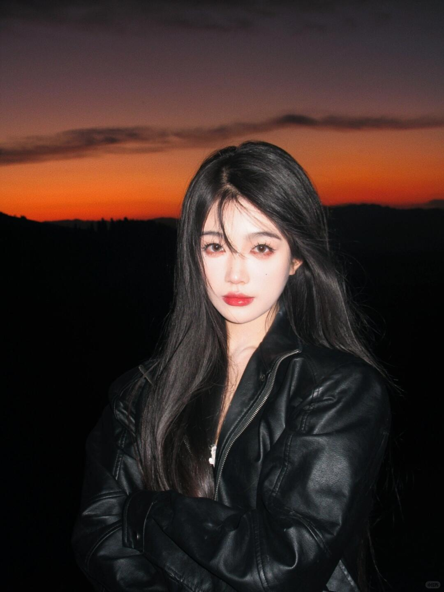
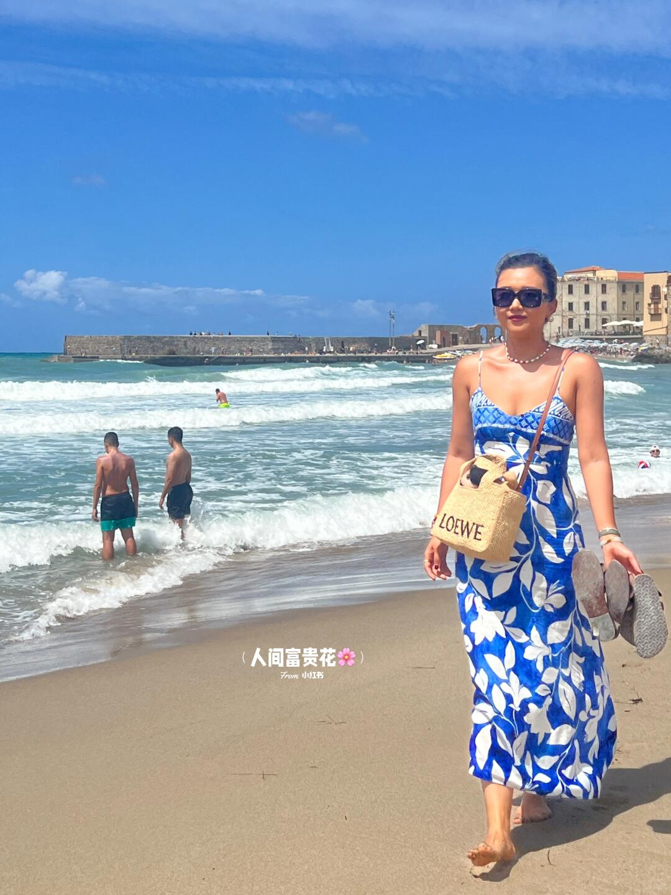

# 每日摄影教练 - 2026-05-24

---

# 风光/自然

## #1 风光/自然

**摄影师**: [Stefanos Nt](https://unsplash.com/@ribakos)
 | **来源**: [Unsplash](https://unsplash.com/photos/green-trees-on-brown-mountain-under-blue-sky-during-daytime-df0RaMUtUXI)

> EXIF: Camera NIKON CORPORATION NIKON D5300 | f/4.5 | 1/100s | 30.0mm | ISO 100

## 直觉
山体的褶皱和明暗层次很有力量，前景绿树与金褐色山坡形成自然对比。整体有安静、开阔的午后风光感。

## 技法拆解
- 构图采用横向展开，山脊占据主体，天空留白让画面更透气。
- 前景树带压住底部，增强了画面的层次，但略显偏暗。
- EXIF 为 f/4.5、1/100s、ISO100，画质干净，但风光题材光圈可再收小到 f/8 提升整体清晰度。
- 30mm 视角接近自然观看感，适合表现山体纹理而不夸张变形。
- 色彩偏青绿，氛围统一，但山体暖色可以再稍微强化。

## 实拍操作（佳能 R10）
模式拨盘建议用 **Av 光圈优先**，因为风光拍摄重点是控制景深和画面清晰度。推荐参数：光圈 **f/8**，快门保持 **1/125s 以上**，ISO **100-400 自动**，测光用 **评价测光**，对焦模式用 **单次 AF**，对焦区域选 **单点或小区域 AF**，对在山体中部纹理处。镜头可用 **RF-S 18-45mm** 的 24-35mm 段，或 **RF-S 18-150mm** 的 30-50mm 段。现场先找一条树带作为前景边界；等侧光或低角度阳光扫过山坡；按快门前检查高光不过曝，必要时曝光补偿 -0.3EV。

## 后期思路
后期重点是增强山体层次：适当提高对比度、清晰度和纹理。天空可降低高光、微调蓝色饱和度，前景树带用阴影提亮一点。整体色调建议保留自然暖绿，不要过度 HDR。

---

# 小红书｜人像写真

## #2 小红书｜人像写真

**摄影师**: [黄小人](https://www.xiaohongshu.com/user/profile/60f992ea000000000101de56)
 | **来源**: [小红书](https://www.xiaohongshu.com/explore/643631310000000011011932?xsec_token=AB6DeaQ6zZk4H1MBOXG_8A1JuIzflslThznKSGDFMJ2rM%3D&xsec_source=pc_feed)

## 直觉
汉服的轻盈白纱和古城墙的厚重灰面形成反差，很有“横店一日游写真”的氛围。人物姿态有戏曲感，袖摆和发饰让画面有流动感。

## 技法拆解
- 光线偏硬，白色衣料已有高光溢出，建议拍摄时优先保住衣服细节。
- 背景城墙质感好，但人物离背景太近，层次略平。
- 构图上人物居中可用，但头顶大面积墙面偏空，可稍微低机位或拉近。
- 草地、墙面、浅色汉服色彩统一，适合走柔和古风调。

## 实拍操作（佳能 R10）
模式拨盘选 **Av 光圈优先**，方便控制人像虚化，同时让相机自动应对户外光线。推荐参数：光圈 **f/4-f/5.6**，快门不低于 **1/500s**，ISO **100**，评价测光或高光优先测光，对焦用 **伺服AF + 人脸/眼睛检测**。镜头建议 RF-S 18-150mm 用 **50-80mm** 端，或 RF 50mm F1.8 拍半身更干净。现场先让人物离城墙远一些，站到斜侧光位置；让袖子展开形成线条；等风吹纱、手势到位时连拍，曝光补偿可设 **-0.3 到 -0.7EV** 保住白衣。

## 后期思路
整体往“小红书古风写真”方向走：降低高光、拉回白色衣料细节，适度提阴影让脸和衣纹更柔。色彩可压低绿色饱和度，墙面加一点暖灰，人物皮肤和汉服保持干净通透。

## #3 小红书｜人像写真

**摄影师**: [万万学姐](https://www.xiaohongshu.com/user/profile/5937ab955e87e72e7cc13830)
 | **来源**: [小红书](https://www.xiaohongshu.com/explore/64c52bd6000000000c0371e2?xsec_token=ABRH0_UusgNiDq6Fh2Atan5N52K1KYsHdZANmmJOa-eTY%3D&xsec_source=pc_feed)

## 直觉
这张最抓人的是“新疆十点半”的晚霞色带：橙红天空、黑色山线和直闪人像，形成很强的 CCD 旅行随拍感。人物黑皮衣与暗背景融在一起，酷感成立。

## 技法拆解
- 画面核心是“前景闪光 + 背景欠曝”，让人像从暮色里跳出来。
- 天空渐变很好，但人物头顶略靠中，构图可以再留一点上方晚霞空间。
- 直闪带来复古感，同时也让皮肤和头发高光偏硬，这是风格不是错误。
- 黑衣、黑山、黑发叠在一起，暗部层次偏少，适合走冷酷氛围。

## 实拍操作（佳能 R10）
模式拨盘选 **M 档**，因为要分别控制晚霞背景亮度和人物闪光效果。推荐 **f/4-f/5.6，1/125s，ISO 400-800，评价测光，单次 AF，人物眼部识别/单点对焦**。镜头可用 **RF-S 18-45mm 的 35-45mm 端**，或 **RF 50mm F1.8** 拍更压缩的人像。

现场先让人物背对晚霞，站在山线前方，摄影师与人物保持 2-3 米；先按天空试拍，让背景比肉眼暗一点；打开机顶闪或外接闪光灯直打，等晚霞橙色最浓时按快门。

## 后期思路
后期保留 CCD 感：提高对比、压暗黑位，天空橙红可略加饱和。人物可适度提亮阴影和肤色，但不要磨得太干净；加一点颗粒、暗角和轻微偏青阴影，会更像小红书复古旅行写真。

## #4 小红书｜人像写真

**摄影师**: [人间富贵花🌸](https://www.xiaohongshu.com/user/profile/593738795e87e718f51d2976)
 | **来源**: [小红书](https://www.xiaohongshu.com/explore/64c24c2e000000001701b934?xsec_token=ABEYLLyVLWG08-G_kO1QjaRTsF14-FQ2PebxlRpU_t8Uw&xsec_source=pc_feed)

## 直觉
蓝白裙、海浪和大晴天很契合“像风一样自由”的度假感，人物走向镜头的姿态自然、有力量。画面最吸引人的是阳光下的蓝色调，很有小红书旅行写真氛围。

## 技法拆解
- 人物放在右侧，左侧留出海浪与远处建筑，空间感不错，但头部略贴近背景建筑，可再错开。
- 正午硬光让肤色和裙子很亮，度假感强，但高光容易溢出，脸部阴影也会偏硬。
- 海平线较稳，浪线形成斜向引导，把视线带到人物身上。
- 蓝天、蓝裙、白浪形成统一色彩，是这张照片最成功的视觉记忆点。
- 人物脚步抓得好，比站定摆拍更有“自由、不被评价”的情绪。

## 实拍操作（佳能 R10）
模式拨盘选 **Av 光圈优先**，方便在强光海边快速控制景深，同时让相机自动匹配快门。建议 **f/4-f/5.6，1/1000s 以上，ISO 100，评价测光，人眼识别AF+伺服AF，区域选全区域或大区域AF**。镜头可用 **RF-S 18-150mm** 的 35-50mm 段，或 **RF 35mm F1.8**，既保留环境又不太变形。拍摄时摄影师蹲低一点，让海浪线更有延展；让模特沿浪边走向镜头，连拍抓裙摆和脚步；尽量等云层或侧光，避开正午顶光直打脸。

## 后期思路
整体走明亮、热烈、海岛度假风：提高曝光和鲜艳度，但压住高光，避免皮肤和白浪过曝。蓝色可稍微提饱和、降明度，让天空和裙子更干净；皮肤用柔和降橙、轻磨皮即可，保留晒后的健康感。