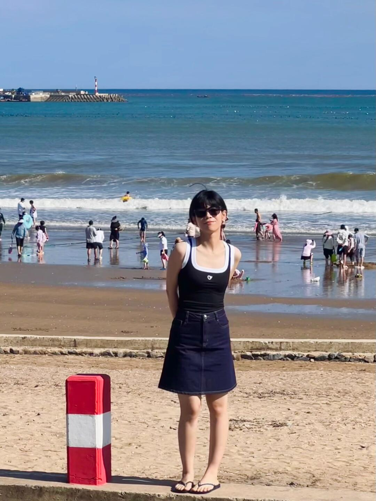

# 每日摄影教练 - 2026-05-28

---

# 风光/自然

## #1 风光/自然

**摄影师**: [Vincent Y @USA](https://unsplash.com/@vincentyuan87)
 | **来源**: [Unsplash](https://unsplash.com/photos/a-field-with-rocks-and-grass-under-a-cloudy-sky-9bydjbOz14Y)

> EXIF: Camera Canon  EOS R8 | f/4.0 | 1/2000s | 24.0mm | ISO 100

## #2 风光/自然

**摄影师**: [Silvestri Matteo](https://unsplash.com/@silvestrimatteo)
 | **来源**: [Unsplash](https://unsplash.com/photos/snow-covered-mountain-during-daytime-gf1ixHcLZSw)

> EXIF: Camera SONY ILCE-7M3 | f/2 | 1/250s | 105.0mm | ISO 50

## #3 风光/自然

**摄影师**: [Grillot edouard](https://unsplash.com/@edouard_grillot)
 | **来源**: [Unsplash](https://unsplash.com/photos/green-trees-near-body-of-water-under-blue-sky-during-daytime-tP-jh6VZgVg)

---

# 人像/质感

## #4 人像/质感

**摄影师**: [yang miao](https://unsplash.com/@yangmiao)
 | **来源**: [Unsplash](https://unsplash.com/photos/a-woman-holding-a-pink-balloon-in-the-middle-of-a-crowded-street--FZJeA1GhSU)

> EXIF: Camera NIKON CORPORATION NIKON Z 7 | f/1.8 | 1/640s | 50.0mm | ISO 800

## #5 人像/质感

**摄影师**: [Olek Buzunov](https://unsplash.com/@olek_bznv_photo)
 | **来源**: [Unsplash](https://unsplash.com/photos/woman-in-a-long-fur-coat-walks-down-the-street-W-0US1LK9Vw)

## #6 人像/质感

**摄影师**: [Alexander Krivitskiy](https://unsplash.com/@krivitskiy)
 | **来源**: [Unsplash](https://unsplash.com/photos/grayscale-photo-of-womans-face-sVhUmcTV1hc)

---

# 街头/人文

## #7 街头/人文

**摄影师**: [Il Vagabiondo](https://unsplash.com/@ilvagabiondo)
 | **来源**: [Unsplash](https://unsplash.com/photos/an-aerial-view-of-a-village-in-the-mountains-1VukKAuGYMs)

> EXIF: Camera FUJIFILM X-Pro3 | f/6.4 | 1/320s | 23.0mm | ISO 160

## #8 街头/人文

**摄影师**: [Il Vagabiondo](https://unsplash.com/@ilvagabiondo)
 | **来源**: [Unsplash](https://unsplash.com/photos/a-train-traveling-over-a-bridge-next-to-tall-buildings-8VspsGpW2QM)

> EXIF: Camera FUJIFILM X-H1 | f/4.0 | 1/250s | 23.0mm | ISO 800

## #9 街头/人文

**摄影师**: [Lizgrin F](https://unsplash.com/@lizgrin)
 | **来源**: [Unsplash](https://unsplash.com/photos/woman-selling-items-on-the-sidewalk-9i77mHmk6i0)

> EXIF: Camera NORITSU KOKI EZ Controller

---

# 极简/建筑

## #10 极简/建筑

**摄影师**: [Denis Volkov](https://unsplash.com/@mrparalloid)
 | **来源**: [Unsplash](https://unsplash.com/photos/a-tall-building-with-a-clock-on-the-side-of-it-thXoEPRnr1Y)

> EXIF: Camera Apple iPhone 15 Pro | f/2.2 | 1/640s | 2.2mm | ISO 40

## #11 极简/建筑

**摄影师**: [Andrew Kliatskyi](https://unsplash.com/@kirp)
 | **来源**: [Unsplash](https://unsplash.com/photos/a-close-up-of-a-black-circular-object-nIZGlDxbZiw)

## #12 极简/建筑

**摄影师**: [Giorgio Trovato](https://unsplash.com/@giorgiotrovato)
 | **来源**: [Unsplash](https://unsplash.com/photos/building-interior-M17yRw7s3bw)

> EXIF: Camera Canon Canon EOS 60D | f/5 | 1/500s | 38.0mm | ISO 800

---

# 美食/静物

## #13 美食/静物

**摄影师**: [The Design Lady](https://unsplash.com/@sarah35)
 | **来源**: [Unsplash](https://unsplash.com/photos/a-plate-of-food-with-a-fork-and-knife-QfDAQ1fGJ8g)

> EXIF: Camera Canon  EOS 850D | f/4.0 | 1/1000s | 50.0mm | ISO 3200

## #14 美食/静物

**摄影师**: [Shannon Nickerson](https://unsplash.com/@shanriley)
 | **来源**: [Unsplash](https://unsplash.com/photos/pizza-with-green-leaves-and-red-tomato-on-black-ceramic-plate-Qc2ePRQhV5c)

## #15 美食/静物

**摄影师**: [Akram Huseyn](https://unsplash.com/@akramhuseyn)
 | **来源**: [Unsplash](https://unsplash.com/photos/a-glass-of-orange-juice-with-a-slice-of-orange-on-a-plate-YVLczZJemIQ)

> EXIF: Camera SONY ILCE-7M3 | f/2.8 | 1/100s | 70.0mm | ISO 50

---

# 夜景/城市

## #16 夜景/城市

**摄影师**: [Igor Karimov](https://unsplash.com/@ingvar_erik)
 | **来源**: [Unsplash](https://unsplash.com/photos/black-asphalt-road-during-night-time-yX1HXelXmlQ)

> EXIF: Camera Apple iPhone SE | f/2.2 | 1/17s | 4.2mm | ISO 320

## #17 夜景/城市

**摄影师**: [Rihards Sergis](https://unsplash.com/@rsergis99)
 | **来源**: [Unsplash](https://unsplash.com/photos/a-view-of-a-city-at-night-EH-a9zA9TNw)

> EXIF: Camera SONY ILCE-7M3 | f/8.0 | 4s | 25.0mm | ISO 50

## #18 夜景/城市

**摄影师**: [Billy](https://unsplash.com/@q3billy)
 | **来源**: [Unsplash](https://unsplash.com/photos/a-blurry-photo-of-a-city-at-night-v2pN8Q-7f4o)

> EXIF: Camera Panasonic DC-GX9 | f/1.7 | 1/6s | 25.0mm | ISO 800

---

# 微距/特写

## #19 微距/特写

**摄影师**: [Deon 66](https://unsplash.com/@dede_nuryana)
 | **来源**: [Unsplash](https://unsplash.com/photos/a-close-up-of-a-spider-on-a-leaf-VInFrQGl32w)

> EXIF: Camera OPPO  Reno5 | f/1.7 | 1/160s | 4.7mm | ISO 100

## #20 微距/特写

**摄影师**: [sai pixels](https://unsplash.com/@saipixels)
 | **来源**: [Unsplash](https://unsplash.com/photos/close-up-of-a-damselfly-with-large-green-eyes-MGQsMFjEdOE)

> EXIF: Camera OnePlus  13R | f/2.0 | 1/177s | 7.1mm | ISO 200

## #21 微距/特写

**摄影师**: [Antje Winkler](https://unsplash.com/@antjewinkler)
 | **来源**: [Unsplash](https://unsplash.com/photos/a-delicate-white-flower-blooms-on-a-branch-PSQm_1CRpmg)

> EXIF: Camera SONY ILCE-7M4 | f/4.0 | 1/125s | 105.0mm | ISO 160

---

# 黑白/光影

## #22 黑白/光影

**摄影师**: [Richard](https://unsplash.com/@shy_photographer)
 | **来源**: [Unsplash](https://unsplash.com/photos/man-in-black-jacket-and-pants-standing-beside-wall-UngYi5863Es)

## #23 黑白/光影

**摄影师**: [Mathilde Langevin](https://unsplash.com/@mathildelangevin)
 | **来源**: [Unsplash](https://unsplash.com/photos/grayscale-photo-of-persons-hand-2DkKtRzHRB8)

> EXIF: Camera SONY ILCE-7 | f/2.5 | 1/250s | 30.0mm | ISO 400

## #24 黑白/光影

**摄影师**: [Mahsa Senfi](https://unsplash.com/@mahsasenfi)
 | **来源**: [Unsplash](https://unsplash.com/photos/woman-in-white-crew-neck-t-shirt-7WzAc1WWVyc)

> EXIF: Camera Canon Canon EOS 6D | f/13.0 | 1/100s | 95.0mm | ISO 100

---

# 小红书｜人像写真

## #25 小红书｜人像写真

**摄影师**: [赵火火不火](https://www.xiaohongshu.com/user/profile/55063e0f2e1d931a3ae82778)
 | **来源**: [小红书](https://www.xiaohongshu.com/explore/64b3f0c4000000003500a86b?xsec_token=ABNXsDE_bYwfBCzcY2xDqbXHHpQKLLK_JG8paXQyCMd6w%3D&xsec_source=pc_feed)

## 直觉
这张有很强的“海岛旅行打卡感”：蓝海、浪线、人群和轻松站姿，确实有小红书度假氛围。人物黑白穿搭干净，和海面蓝色形成清爽对比。

## 技法拆解
- 构图上人物居中直给，适合旅行记录，但左下红白路桩抢眼，建议拍摄时避开或让它变成有意的前景元素。
- 海平线位置偏高，天空留白多，人物与背景人群有些混杂，可降低机位或拉长焦压缩背景。
- 正午硬光让肩颈和腿部反差较强，脸部容易出现阴影，最好找侧逆光或等云遮太阳。
- 背景浪线很好看，若人物站得再离背景远一点，虚化会更干净。

## 实拍操作（佳能 R10）
模式拨盘选 **Av 光圈优先**，旅行人像需要快速控制景深，让相机自动匹配快门更方便。推荐 **f/4-f/5.6、1/1000s 以上、ISO 100、评价测光，人物眼睛检测 AF，区域选全域或大区域 AF**；若阳光太强可用曝光补偿 -0.3EV 保住海面高光。镜头建议 **RF-S 18-150mm** 拉到 50-85mm，或 **RF 50mm F1.8** 拍半身/全身，背景会更柔和。现场先让人物远离红白路桩和杂乱人群，站在海浪线前方；摄影师稍微后退，用中长焦竖构图；等浪花铺开、背景人群分散时连拍 2-3 张。

## 后期思路
后期走“清爽海岛蓝”方向：提高曝光一点，压高光，适当拉蓝色/青色饱和度和明度。人物肤色保持自然，可用局部蒙版提亮脸和腿，最后裁掉左下干扰物，让画面更像干净的小红书旅行写真。

## #26 小红书｜人像写真

**摄影师**: [天祁预暴](https://www.xiaohongshu.com/user/profile/57ff47d06a6a6940b251d3b3)
 | **来源**: [小红书](https://www.xiaohongshu.com/explore/64b60f55000000001c00fc0c?xsec_token=ABUUOADRu6dI8NlNWT9_SMJ8-fzUziNIZRrvtYhv-sDII&xsec_source=pc_feed)

## 直觉
这组图最打动人的是“济州蓝”：海、天空、草地和蓝色穿搭形成统一记忆点，很适合小红书旅行攻略封面。情侣互动自然，氛围比精修感更重要。

## 技法拆解
- 拼图选景丰富：海边、咖啡店、花丛、草坡，信息量足，符合“5天攻略”的封面属性。
- 色彩主线清晰，蓝绿橙贯穿画面，和济州海岛、橘子元素匹配。
- 多数画面用广角环境人像，人物不一定最大，但地点感很强。
- 正午光偏硬，肤色和白衣容易过曝，拍摄时要注意压高光。
- 中间大标题醒目，但略遮挡下方画面，可给文字预留更干净的横向区域。

## 实拍操作（佳能 R10）
模式拨盘选 **Av 光圈优先**，旅行人像变化快，用光圈控制虚化和进光量，快门交给相机更稳。推荐 **f/4-f/5.6，1/500s以上，ISO 100-400，评价测光，伺服AF+人眼识别，区域AF**；逆光或白衣场景可曝光补偿 **-0.3~-0.7EV**。镜头建议 **RF-S 18-150mm** 一镜走天下，海边环境用18-24mm，情侣半身或花丛用35-70mm。现场先找蓝天海面和人物衣服同色呼应的位置，再让人物坐、靠、举饮料制造互动；等云遮太阳或侧光时拍，连拍抓笑和对视瞬间。

## 后期思路
整体走“小红书清透海岛风”：提高曝光和阴影，但压住高光，避免天空死白。HSL里加强蓝色、青色和绿色的明亮度，橙色稍提饱和突出济州橘子感。人物肤色单独提亮、降一点蓝青反光，让画面清爽但不偏冷。

## #27 小红书｜人像写真

**摄影师**: [鯊魚喬納森.](https://www.xiaohongshu.com/user/profile/5a52302fe8ac2b3d2b212a76)
 | **来源**: [小红书](https://www.xiaohongshu.com/explore/64bfc48e000000000a01aeb4?xsec_token=ABSnHLvO9lnVSMKpZb-K1CpsR_tawRcS33LiHfRp3otRU%3D&xsec_source=pc_feed)

## 直觉
这张有很典型的夏日 cityboy 日常感：树荫、街道、白 T 和咖啡都很轻松。最舒服的是斑驳光影，但人物脸部被树影和背景稍微“吃掉”，主体存在感还可以再加强。

## 技法拆解
- 构图用竖幅全身，适合小红书穿搭记录，但人物略居中偏满，头顶和脚下空间可再精细。
- 右侧树干形成前景框架，有街拍感，但占比稍大，会分散视线。
- 光线是强烈夏日顶光加树荫，氛围好，但白 T 容易过曝，脸部也容易不均匀。
- 背景建筑和树影有上海街区味道，建议用更大光圈或更长焦距压一压背景，让人更突出。

## 实拍操作（佳能 R10）
模式拨盘选 **Av 光圈优先**，因为这类日常人像重点是控制景深和背景虚化，曝光交给相机更快。推荐 **f/2.8-f/4，1/500s 以上，ISO 100-400，评价测光，人眼检测 AF，伺服 AF，区域选全区域或灵活区域**。镜头建议 **RF-S 18-150mm 拉到 50-85mm**，或 **RF 50mm F1.8** 拍半身/全身更有虚化。现场先让人物站在完整阴影里，避开脸上碎光；摄影师退后用中长焦拍，人物微侧身、手拿咖啡；等背景无人、树影好看时连拍 2-3 张。

## 后期思路
整体往“小红书夏日清爽”走：提高亮度和阴影，压一点高光保护白 T。色彩可让绿色偏黄一点、肤色提亮，适度加暖色温和清晰度；用径向滤镜轻微提亮人物，背景略降饱和，突出少年感。