# 每日摄影教练 - 2026-05-29

---

# 小红书｜人像写真

## #1 小红书｜人像写真

**摄影师**: [周姨](https://www.xiaohongshu.com/user/profile/5acbfeb311be104613311ab7)
 | **来源**: [小红书](https://www.xiaohongshu.com/explore/6433d257000000000800e88f?xsec_token=ABX1pSMvxOobor452KawVYAqkLcWN45Lm6nKpMTh88SdM%3D&xsec_source=pc_feed)

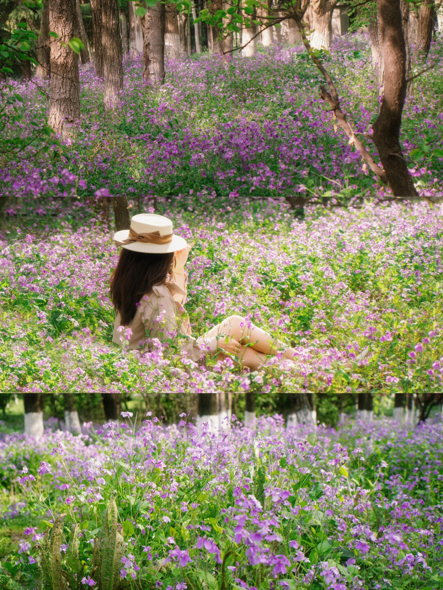

## 直觉
最迷人的是“紫色花海 + 林间逆光”的童话感，人物只露背影，反而更有春日漫游的电影氛围。三张拼接也强化了从环境到人像再到花朵细节的叙事。

## 技法拆解
- 构图上用树干做纵向节奏，花海铺满画面，形成很强的沉浸感。
- 人像采用中远景背影，避免摆拍感，更适合小红书春日写真。
- 下午斜射光让花和发丝发亮，但脸部容易暗，现场用反光板会更稳。
- 色彩以紫、绿、米白为主，浅色衣服和草帽很好地压住了花海的杂乱。

## 实拍操作（佳能 R10）
模式拨盘选 **Av 光圈优先**，这类花海人像需要优先控制虚化和景深，曝光交给相机更高效。推荐 **F2.8-F4、1/500s 以上、ISO Auto、评价测光，伺服 AF + 人眼识别/全区域 AF**；若拍纯花特写，可改单点对焦。镜头建议 **RF-S 18-150mm** 用 50-100mm 压缩花海，或 **RF 50mm F1.8** 拍柔和人像。现场先找不踩花的小路，让人物坐在花丛边缘；摄影师降低机位，让前景花挡一点镜头；等阳光从树缝打到头发和花面时连拍，人物看远处或整理帽檐。

## 后期思路
整体往“柔和、明亮、电影春天”走：提高曝光和阴影，压一点高光，保留逆光闪烁感。色彩上增强紫色饱和与明度，绿色稍微降饱和、偏暖，最后加轻微柔焦或颗粒，让画面更像春日胶片。

## #2 小红书｜人像写真

**摄影师**: [周姨](https://www.xiaohongshu.com/user/profile/5acbfeb311be104613311ab7)
 | **来源**: [小红书](https://www.xiaohongshu.com/explore/6433d257000000000800e88f?xsec_token=ABX1pSMvxOobor452KawVYAqkLcWN45Lm6nKpMTh88SdM%3D&xsec_source=pc_feed)

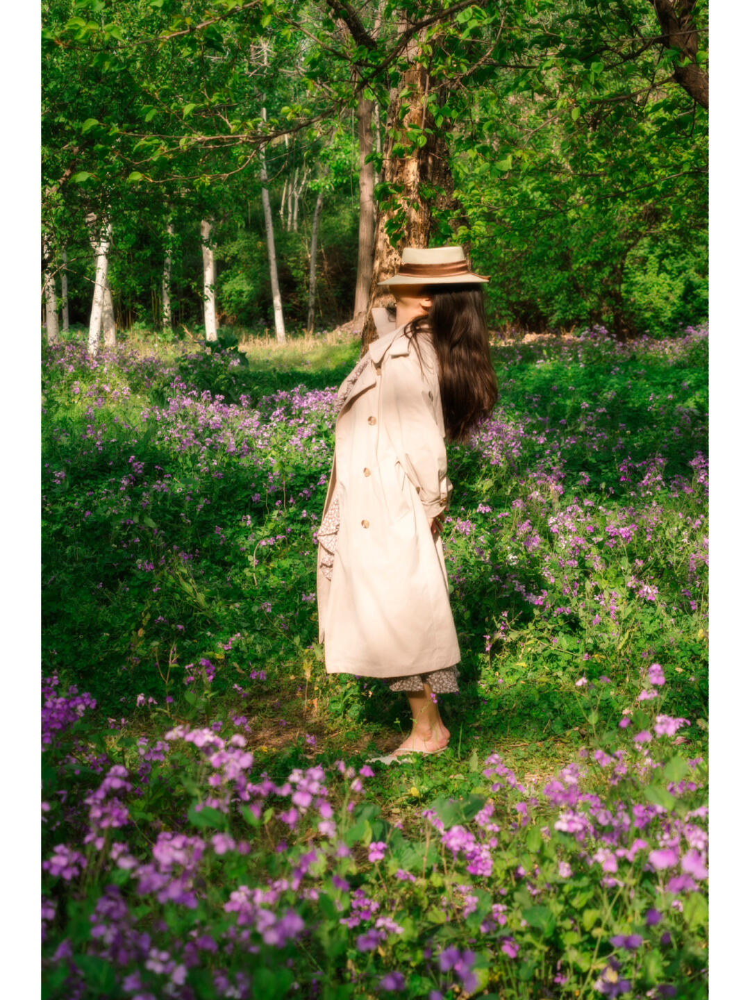

## 直觉
这张最迷人的是“人被春天包围”的电影感：紫色二月兰、浅色风衣和斑驳阳光，形成很温柔的法式漫游气质。

## 技法拆解
- 构图让人物站在花径中间，前景虚花、背景树林形成纵深。
- 浅色衣服在绿色环境里很跳，紫花负责增加浪漫色彩。
- 光线是关键：下午斜阳穿过树叶，打出明暗斑驳，比正午更有故事感。
- 画面略带柔焦和低对比，强化了“小红书电影春日”的氛围。

## 实拍操作（佳能 R10）
模式拨盘选 **Av 光圈优先**，方便控制背景虚化和人像氛围。推荐 **f/2.8-f/4**；若用 RF-S 18-150mm，可在 **50-80mm** 拍，光圈开到最大；快门保持 **1/250s 以上**，ISO 自动，评价测光，曝光补偿 **-0.3EV** 防止风衣过曝。对焦用 **伺服 AF + 人眼识别/全区域 AF**。镜头可选 **RF 50mm F1.8** 或 RF-S 18-150mm。现场先找已有小路，让人物侧身站在光斑边缘；摄影师稍微蹲低，用前景花遮一点镜头；等风吹头发、人物回头或低头时连拍。

## 后期思路
整体往“柔和、暖绿、胶片感”走：降低高光和对比，微提阴影，让阳光不刺眼。绿色可稍降饱和、偏黄一点，紫色花保留亮度；再加轻微柔焦/颗粒，让画面更像春日电影截图。

## #3 小红书｜人像写真

**摄影师**: [周姨](https://www.xiaohongshu.com/user/profile/5acbfeb311be104613311ab7)
 | **来源**: [小红书](https://www.xiaohongshu.com/explore/6433d257000000000800e88f?xsec_token=ABX1pSMvxOobor452KawVYAqkLcWN45Lm6nKpMTh88SdM%3D&xsec_source=pc_feed)

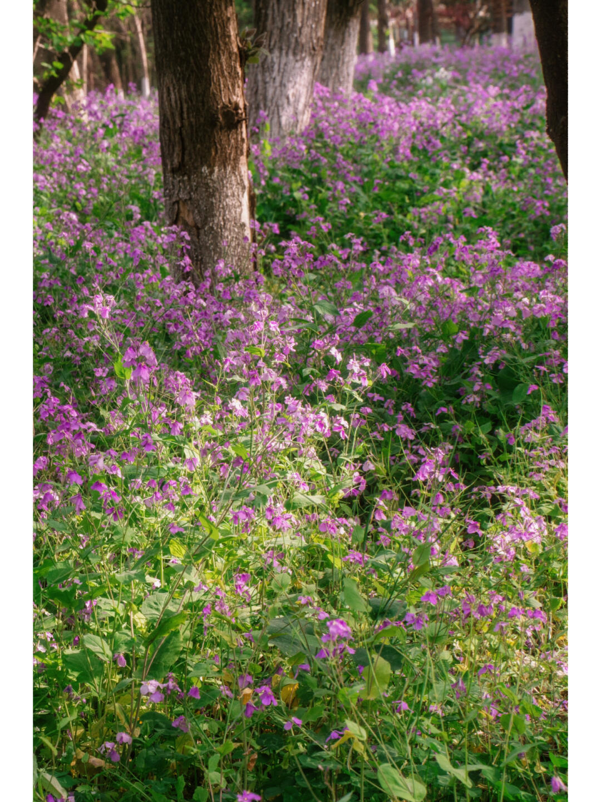

## 直觉
这张最动人的是“紫色花海被树林切成一束束光”的春日氛围，像电影里的散步空镜。树干形成纵深，花丛一直铺到远处，很适合做人像写真里的环境铺垫。

## 技法拆解
- 画面用树干做前中后景，纵向线条让花海不显杂乱。
- 下午斜光从林间穿过，花和叶片有闪光感，氛围比正午柔和。
- 紫花与绿色互补，色彩天然出片，但饱和度略高时容易显“数码艳”。
- 景深偏浅到中等，前景花清楚、远处轻微虚化，保留了梦幻感。
- 构图若做人像，可把人物放在右侧小路或树干间隙，避免踩花也更有叙事。

## 实拍操作（佳能 R10）
模式拨盘选 **Av 光圈优先**，因为这种花海人像主要控制背景虚化和进光量。推荐 **f/2.8-f/4，1/250s 以上，ISO 100-400，评价测光，曝光补偿 +0.3EV；伺服 AF，人物用眼部识别，拍空景用单点/小区域对焦前景花**。镜头可用 **RF-S 18-150mm 的 50-100mm 段**压缩花海，或 **RF 50mm F1.8**拍更柔的电影感。现场先沿小路低机位站位，让树干形成层次；等下午三点后侧逆光照进来；人物穿浅色衣服，侧身慢走或回头时连拍。

## 后期思路
整体往“法式复古、春日电影感”走：降低高光、微提阴影，让林间光更柔。紫色适当降饱和、偏一点洋红，绿色降低黄绿的刺眼感；最后加轻微颗粒和柔化，保留童话般的闪光。

## #4 小红书｜人像写真

**摄影师**: [周姨](https://www.xiaohongshu.com/user/profile/5acbfeb311be104613311ab7)
 | **来源**: [小红书](https://www.xiaohongshu.com/explore/6433d257000000000800e88f?xsec_token=ABX1pSMvxOobor452KawVYAqkLcWN45Lm6nKpMTh88SdM%3D&xsec_source=pc_feed)

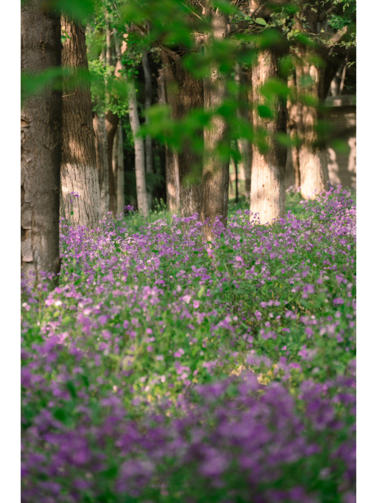

## 直觉
这张最迷人的是“从花丛里偷看森林”的感觉：紫色二月兰铺满前景，树干被斑驳阳光点亮，很有春日下午的电影感。

## 技法拆解
- 前景虚化占比很大，制造了沉浸感，像人站在花海里看出去。
- 竖构图让树干形成纵向节奏，画面更安静、文艺。
- 光线是关键：下午侧逆光穿过树林，树干和花朵有闪烁高光。
- 焦点落在中景花丛与树干附近，前后虚化自然，但主体略分散。

## 实拍操作（佳能 R10）
模式拨盘选 **Av 光圈优先**，方便控制虚化和景深，适合花海人像/氛围照。推荐 **f/2.8-f/4，1/250s 以上，ISO 100-400，评价测光，伺服 AF 或单次 AF，单点/小区域对焦**。镜头可用 **RF-S 18-150mm 拉到 70-120mm**，或 **RF 50mm F1.8** 拍浅景深。现场先蹲低，让前景花贴近镜头；选择树干有光斑的位置；等风停或人物进入光里时按快门。

## 后期思路
整体往“柔和春日电影感”走：降低对比和高光，适当提阴影，保留阳光的温暖。绿色可降一点饱和、偏黄，紫色花稍提亮提纯；加轻微暗角和颗粒，增强小红书式氛围感。

## #5 小红书｜人像写真

**摄影师**: [周姨](https://www.xiaohongshu.com/user/profile/5acbfeb311be104613311ab7)
 | **来源**: [小红书](https://www.xiaohongshu.com/explore/6433d257000000000800e88f?xsec_token=ABX1pSMvxOobor452KawVYAqkLcWN45Lm6nKpMTh88SdM%3D&xsec_source=pc_feed)

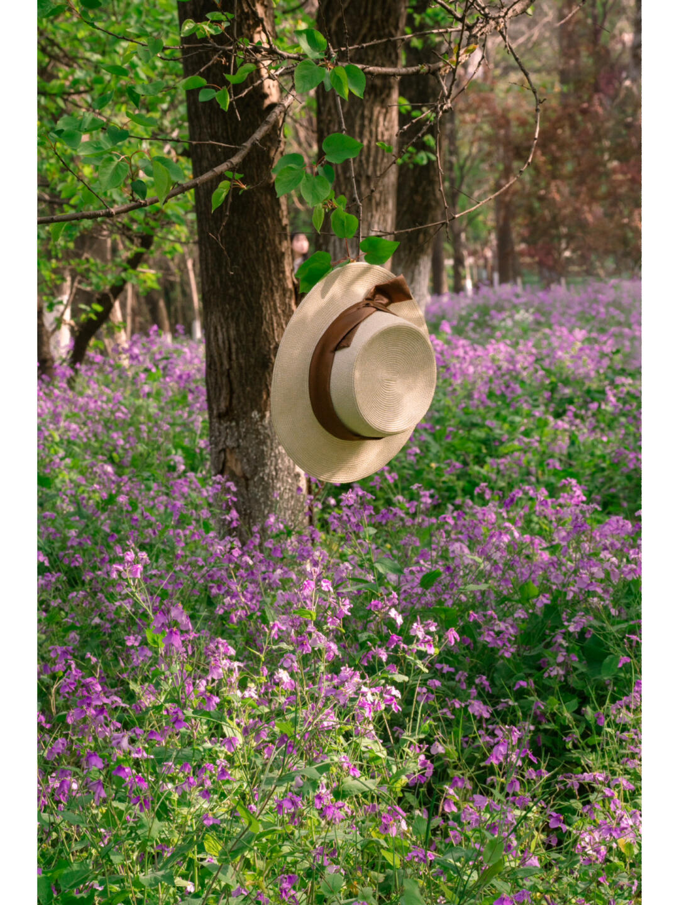

## 直觉
草帽挂在树干间，像人物刚离开画面，留下春日漫游的想象。紫色二月兰铺满背景，阳光斑驳，很有小红书常见的法式复古花海氛围。

## 技法拆解
- 主体不是人而是草帽，适合做“人像写真”的情绪引子，留白感很好。
- 竖构图强化树干高度，草帽放在中上部，下面花海形成浪漫铺垫。
- 现场是树林散射光加局部阳光，花和叶子有闪光感，但高光需避免过曝。
- 紫花、绿叶、米色草帽形成柔和互补，色彩很适合春日复古调。

## 实拍操作（佳能 R10）
模式拨盘选 **Av 光圈优先**，方便控制背景虚化和花海层次，让相机自动应对林间明暗变化。建议用 **RF-S 18-150mm** 的 50-100mm，或 **RF 50mm F1.8**；参数可设 **F2.8-F4、1/250s 以上、ISO 100-400、评价测光、单次 AF，单点/小区域对焦草帽边缘**。
现场先找一棵有低枝、后方有紫花延伸的树；让草帽避开杂乱枝条，站远一点用中长焦压缩花海；等阳光从侧后方洒进来、草帽和花朵有亮斑时再拍。

## 后期思路
整体往“电影般的春天”走：降低一点对比，提亮阴影，保留柔和高光。紫色花海可适度提高饱和和明度，绿色稍微往黄绿偏，草帽用暖色温突出复古感；最后加轻微颗粒或暗角，增强胶片氛围。

## #6 小红书｜人像写真

**摄影师**: [周姨](https://www.xiaohongshu.com/user/profile/5acbfeb311be104613311ab7)
 | **来源**: [小红书](https://www.xiaohongshu.com/explore/6433d257000000000800e88f?xsec_token=ABX1pSMvxOobor452KawVYAqkLcWN45Lm6nKpMTh88SdM%3D&xsec_source=pc_feed)

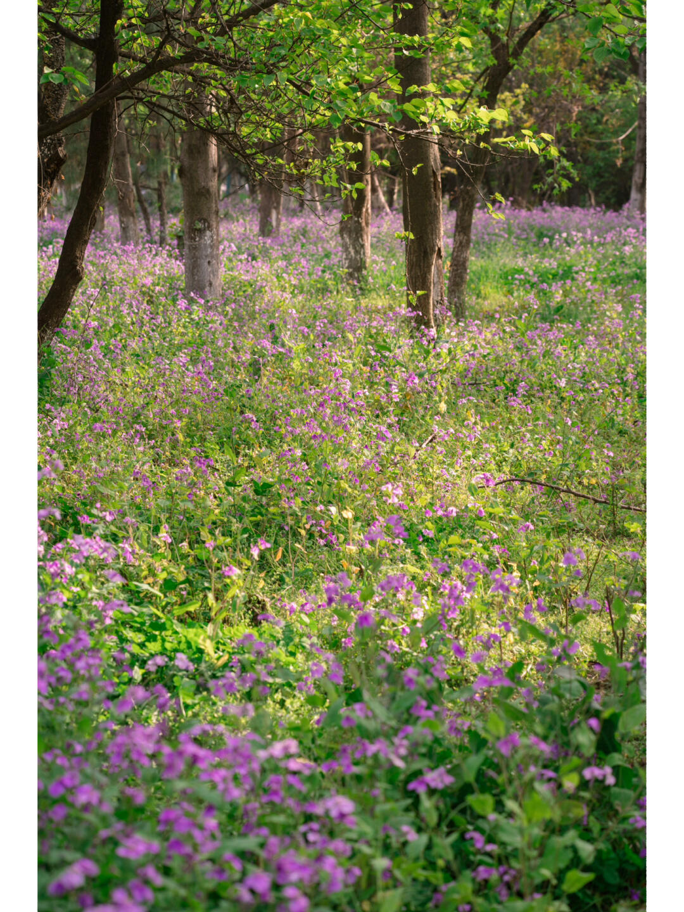

## 直觉
这张最迷人的是“紫色花海被阳光点亮”的春日空气感，树干的纵深让画面有电影里的森林漫游感。前景虚化的花朵也增加了代入感，像人正走进这片花里。

## 技法拆解
- 构图用树干做纵向节奏，视线被自然引向树林深处，空间感很好。
- 低机位贴近花丛，前景虚化形成柔软包围感，很适合小红书春日写真氛围。
- 光线是下午斜射光，叶片和花朵有高光闪烁，但反差不算硬。
- 紫花与绿色形成互补色关系，画面清新但不单调。
- 如果拍人，人物适合放在中景光斑处，穿白色、米色会更突出。

## 实拍操作（佳能 R10）
模式拨盘选 **Av 光圈优先**，因为这类花海写真重点是控制虚化和氛围，快门交给相机更高效。推荐参数：光圈 **F2.8-F4**，快门尽量不低于 **1/250s**，ISO **100-400 自动**，评价测光，曝光补偿可 **+0.3EV**；对焦用 **伺服 AF/单点或区域 AF**，拍人时开启眼部识别。镜头建议 RF-S 18-150mm 用 **70-120mm** 端压缩花海；若有 RF 50mm F1.8，可用 F2.2-F2.8 拍更梦幻。现场先找有小路的位置蹲低，镜头略穿过前景花；等阳光从树缝打到花和人物边缘；人物可慢走、回头或低头看花，在动作最自然时连拍。

## 后期思路
整体往“春日电影感”走：适度提亮阴影、压一点高光，保留阳光闪烁。绿色降低饱和、偏黄一点，紫色稍提亮但别过艳；加轻微暖色调和柔化，可用径向滤镜强调中间光感。

## #7 小红书｜人像写真

**摄影师**: [周姨](https://www.xiaohongshu.com/user/profile/5acbfeb311be104613311ab7)
 | **来源**: [小红书](https://www.xiaohongshu.com/explore/6433d257000000000800e88f?xsec_token=ABX1pSMvxOobor452KawVYAqkLcWN45Lm6nKpMTh88SdM%3D&xsec_source=pc_feed)

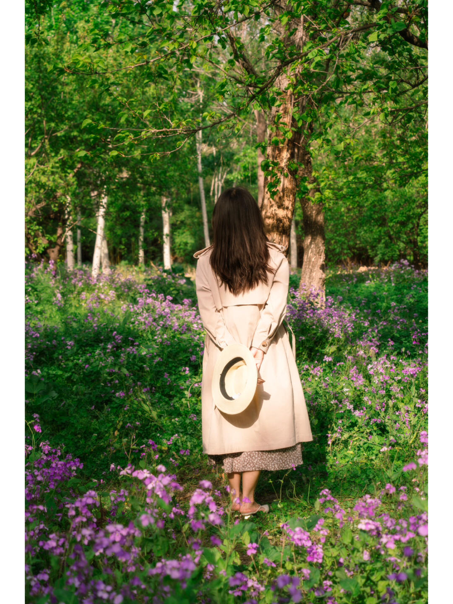

## 直觉
这张最动人的是“背影走进花海”的叙事感：紫色二月兰、斑驳阳光和浅色风衣组合出很小红书的春日电影氛围。

## 技法拆解
- 人物居中站在林间小路上，左右花丛形成自然引导线，画面稳定又有代入感。
- 前景紫花略虚化，增加层次，也让观众像是站在花丛里看她。
- 光线是下午侧逆光，树影打在人物和花上，带来闪烁感，但脸部因背影避开了补光压力。
- 米色风衣与绿色、紫色形成柔和对比，服装选择很关键，避免深色衣服压住春天气息。

## 实拍操作（佳能 R10）
模式拨盘选 **Av 光圈优先**，方便控制背景虚化和花海层次，现场光线变化时相机会自动匹配快门。推荐 **f/2.8-f/4，1/250s 以上，ISO 100-400，评价测光，伺服AF或单次AF，人物/眼睛检测+小区域对焦**；若人物静止，单次AF更稳。镜头可用 **RF-S 18-150mm 的 50-85mm 段**，或 **RF 50mm F1.8**，在 R10 上等效约80mm，适合压缩花海。拍摄时站在小路正后方，降低机位到腰部附近，让前景花进入画面；等阳光从树缝洒到人物风衣和花丛时按快门；让模特双手拿草帽背对镜头，身体微微侧一点，会比完全站直更有故事感。

## 后期思路
整体往“柔和电影春天”走：降低高光、提一点阴影，保留斑驳光感。绿色可稍降饱和、偏暖偏黄，紫色花提高一点明度和饱和；加轻微暗角、颗粒和暖色调，让画面更像胶片漫游。

## #8 小红书｜人像写真

**摄影师**: [周姨](https://www.xiaohongshu.com/user/profile/5acbfeb311be104613311ab7)
 | **来源**: [小红书](https://www.xiaohongshu.com/explore/6433d257000000000800e88f?xsec_token=ABX1pSMvxOobor452KawVYAqkLcWN45Lm6nKpMTh88SdM%3D&xsec_source=pc_feed)

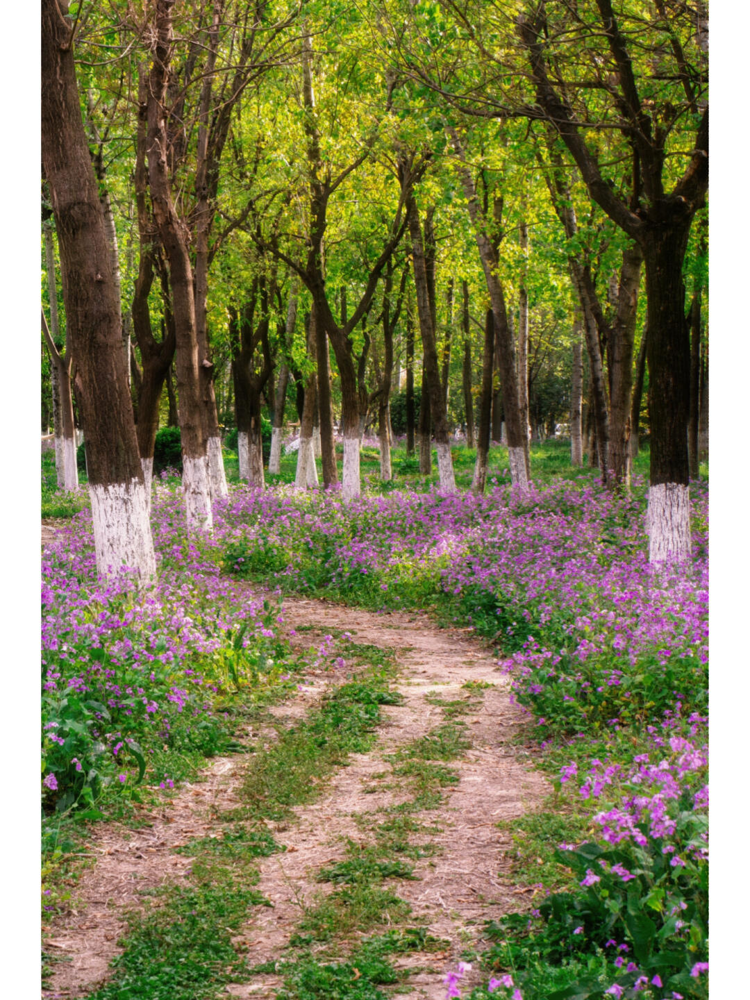

## 直觉
这张最迷人的是“林间小路通向紫色花海”的童话感，树干的纵向节奏和地面的花带把视线自然带进画面。下午斜光让绿色和紫色都显得很有春天的呼吸感。

## 技法拆解
- 构图上利用小路做引导线，纵深感明确，适合人像写真里安排人物站在路的中后段。
- 树干形成重复线条，白色树根与紫花形成色块对比，画面有记忆点。
- 光线是散射加局部斑驳阳光，氛围柔和，但高光处略杂，拍人时要避开脸部光斑。
- 色彩以绿、紫为主，饱和度偏高，符合小红书春日花海风格。

## 实拍操作（佳能 R10）
模式拨盘选 **Av 光圈优先**，方便控制背景虚化和环境保留，适合边走边拍花海人像。推荐 **f/2.8-f/4、1/250s 以上、ISO Auto、评价测光，曝光补偿 +0.3EV**；对焦用 **人物检测/伺服 AF**，区域选全区域或大区域。镜头建议 **RF-S 18-150mm 用 50-100mm 段**压缩林间纵深，或 **RF 50mm F1.8**拍半身氛围。现场先站在小路中央低机位取景，让花当前景；等下午三点后侧逆光穿过树叶；人物穿浅色衣服站在路弯处，反光板从下方补脸，抓回头、走动、扶帽瞬间。

## 后期思路
整体往“电影感春日”走：降低高光、提阴影，保留阳光穿林的通透感。绿色可稍微降饱和并偏黄，紫色提高明度和饱和；加一点柔化或颗粒，让画面更像复古写真。

## #9 小红书｜人像写真

**摄影师**: [周姨](https://www.xiaohongshu.com/user/profile/5acbfeb311be104613311ab7)
 | **来源**: [小红书](https://www.xiaohongshu.com/explore/6433d257000000000800e88f?xsec_token=ABX1pSMvxOobor452KawVYAqkLcWN45Lm6nKpMTh88SdM%3D&xsec_source=pc_feed)

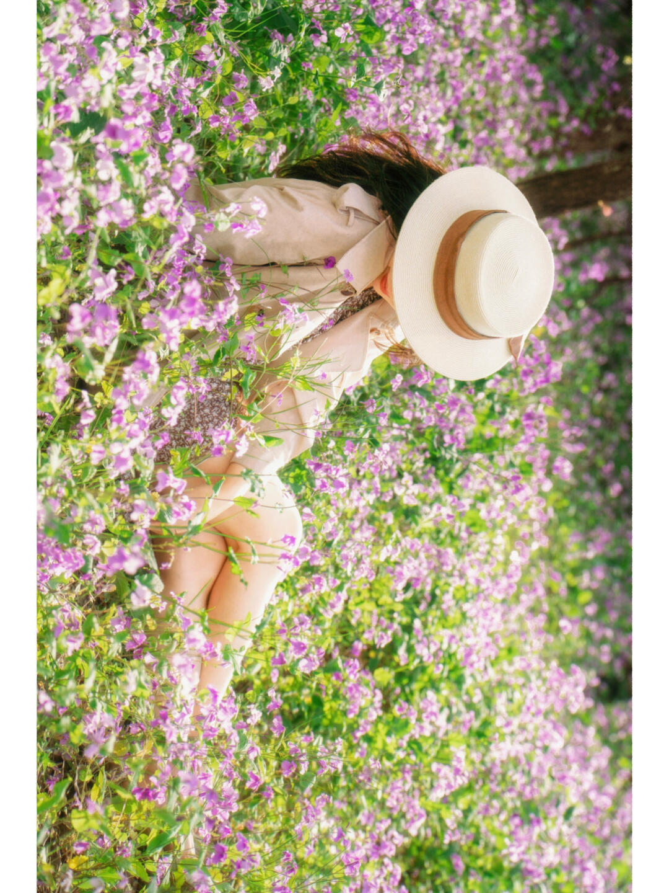

## 直觉
这张最动人的是“人被春天包围”的沉浸感，紫色二月兰、草帽和浅色衣服共同营造出法式、电影感的松弛氛围。脸被帽子遮住，反而让画面更有想象空间。

## 技法拆解
- 构图上让人物斜向躺入花海，身体线条带出画面流动感，不是普通站拍打卡照。
- 前景花朵适度遮挡人物，增加层次，也让画面更像“偷拍式漫游”。
- 光线偏逆光/侧逆光，花瓣和叶片有闪光感，春日氛围很强。
- 色彩以紫绿为主，衣服和草帽用低饱和米白色压住画面，避免杂乱。
- 画面略高亮、柔和，适合小红书春日写真风格。

## 实拍操作（佳能 R10）
模式拨盘选 **Av 光圈优先**，因为这类花海人像最关键是控制虚化和曝光，相机会自动匹配快门。推荐参数：光圈 **F2.8-F4**，快门尽量不低于 **1/250s**，ISO 自动或 **100-400**，评价测光，曝光补偿 **+0.3 到 +0.7EV**；对焦用 **伺服 AF + 人眼/人物识别**，若帽子遮脸则改用单点对焦对在草帽边缘或手臂。镜头建议 RF-S 18-150mm 用 **50-100mm** 段压缩花海，或 RF 50mm F1.8 拍更柔的背景。现场让模特沿小路边缘躺/蹲入花丛，不踩花；下午三点后找侧逆光，草帽挡脸、手自然伸进花里；等风吹动花和发丝时连拍。

## 后期思路
整体走清透、柔和、偏胶片的春日感：提高曝光和阴影，压一点高光，保留阳光闪烁。紫色不要拉得太艳，可降低饱和、提高明度；绿色稍微往黄绿偏，画面会更温柔。可加轻微颗粒和暗角，增强电影感。

## #10 小红书｜人像写真

**摄影师**: [周姨](https://www.xiaohongshu.com/user/profile/5acbfeb311be104613311ab7)
 | **来源**: [小红书](https://www.xiaohongshu.com/explore/6433d257000000000800e88f?xsec_token=ABX1pSMvxOobor452KawVYAqkLcWN45Lm6nKpMTh88SdM%3D&xsec_source=pc_feed)

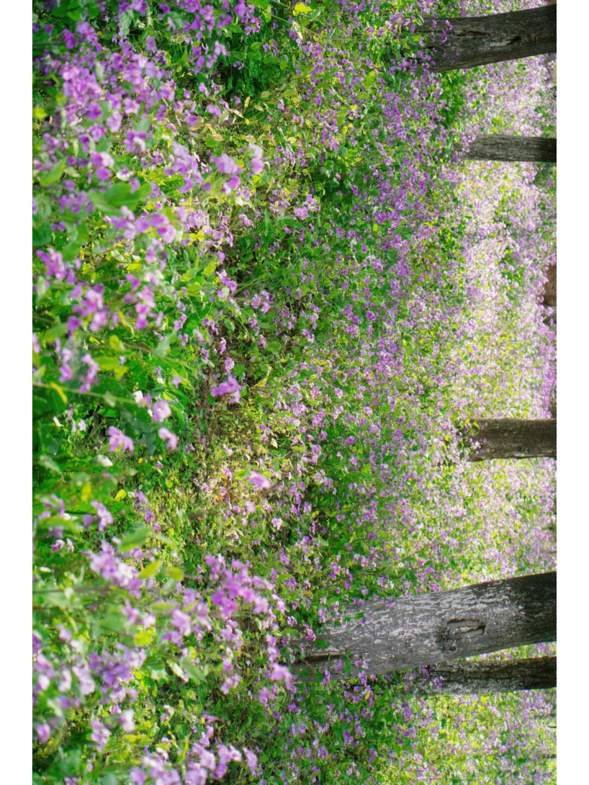

## 直觉
这张最迷人的是“紫色花海 + 斑驳树影”的春日氛围，阳光把二月兰照得很轻盈，有童话感。画面若用于人像写真，非常适合做浅色裙装、草帽、野餐篮这类法式春游场景。

## 技法拆解
- 紫色花与绿色叶片形成互补色，画面天然有清新、浪漫的情绪。
- 树干作为纵向线条能增加空间纵深，但当前画面略显倾斜，拍摄时要注意水平与主体方向。
- 前景花朵有一定虚化，能制造“被花包围”的沉浸感，适合人像半身或蹲坐构图。
- 光线偏硬但不刺眼，下午三点后斜射光能让花叶有闪光感，适合逆光或侧逆光拍摄。

## 实拍操作（佳能 R10）
模式拨盘选 **Av 光圈优先**，因为花海人像最关键是控制景深和背景虚化。推荐 **f/2.8-f/4、1/500s 以上、ISO 100-400、评价测光，曝光补偿 +0.3EV；伺服 AF + 人眼识别，区域选全域或灵活区域**。镜头可用 **RF-S 18-150mm 拉到 70-100mm** 压缩花海，或 **RF 50mm F1.8** 拍半身氛围。现场先让人物站在小路边缘、不要踩花；摄影师蹲低，用前景花遮一点镜头；等侧逆光打到头发和肩膀时连拍，让人物回头、低头闻花或轻走。

## 后期思路
整体往“小红书电影春天”走：提高曝光和暖色温，适当降低高光、提阴影，让阳光柔和。紫色花可用 HSL 微调紫色亮度和饱和度，绿色降低一点饱和、偏黄绿，最后加轻微颗粒和柔化，保留胶片感。

## #11 小红书｜人像写真

**摄影师**: [周姨](https://www.xiaohongshu.com/user/profile/5acbfeb311be104613311ab7)
 | **来源**: [小红书](https://www.xiaohongshu.com/explore/6433d257000000000800e88f?xsec_token=ABX1pSMvxOobor452KawVYAqkLcWN45Lm6nKpMTh88SdM%3D&xsec_source=pc_feed)

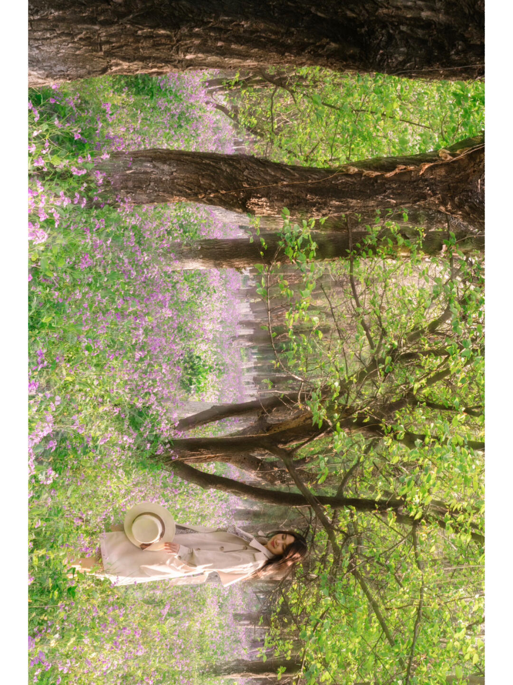

## 直觉
树干像天然画框，把人包在紫色二月兰和嫩绿春光里，氛围很“电影感”。人物偏小但情绪安静，适合小红书式春日漫游写真。

## 技法拆解
- 构图用粗树干做前景框架，增强森林纵深，但画面略有旋转感，拍摄时要注意水平与人物重心。
- 逆光/侧逆光让叶片和花丛发亮，梦幻感主要来自高光溢出。
- 浅色风衣、草帽与花海色彩很搭，人物不会抢景。
- 人物放在画面下方偏角落，环境感强；若想更突出人，可再靠近或用中长焦压缩花海。

## 实拍操作（佳能 R10）
模式拨盘选 **Av 光圈优先**，因为这类写真重点是控制虚化和通透感，让相机自动匹配快门更方便。推荐 **f/2.8-f/4，快门不低于1/250s，ISO Auto 100-800，评价测光，曝光补偿 +0.3 到 +1EV；对焦用人物眼部检测，伺服AF或单次AF均可**。镜头可用 **RF-S 18-150mm 的 50-100mm 段**，或 **RF 50mm F1.8** 拍更柔的背景。现场先让模特站在小路或花丛边缘，避免踩花；摄影师蹲低一点，让树干形成框；等阳光从叶缝洒下、发丝有亮边时连拍几张。

## 后期思路
整体往柔和、微过曝、低对比的春日胶片感走。适当提高曝光和阴影，压一点高光，绿色往黄绿偏、紫色保持清透；可加轻微柔焦或降低清晰度，让画面更像童话森林。

## #12 小红书｜人像写真

**摄影师**: [周姨](https://www.xiaohongshu.com/user/profile/5acbfeb311be104613311ab7)
 | **来源**: [小红书](https://www.xiaohongshu.com/explore/6433d257000000000800e88f?xsec_token=ABX1pSMvxOobor452KawVYAqkLcWN45Lm6nKpMTh88SdM%3D&xsec_source=pc_feed)

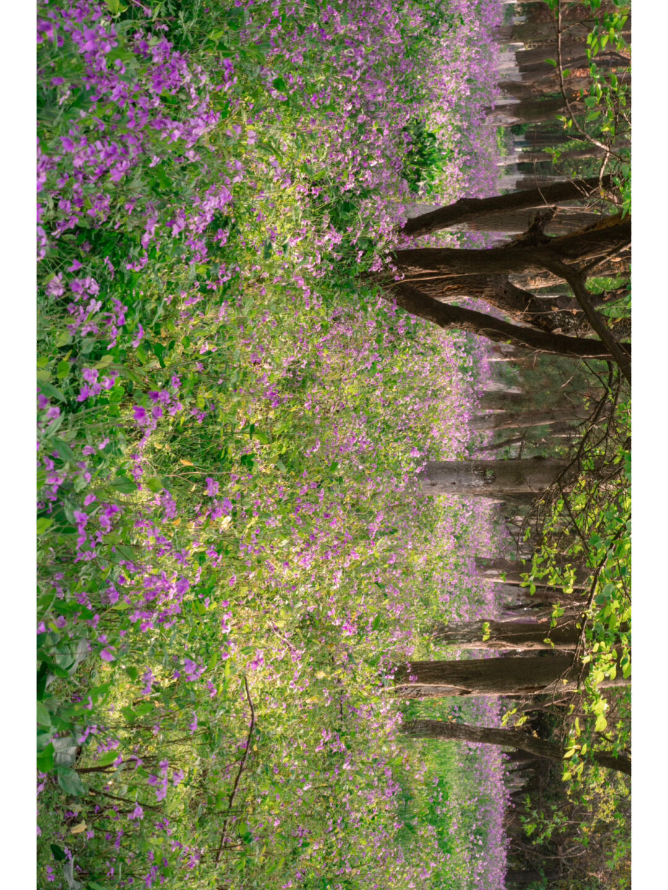

## 直觉
紫色二月兰铺满林地，阳光从树缝里漏下来，有很强的春日童话感。画面氛围好，但目前主体略散，且需注意照片方向与构图重心。

## 技法拆解
- 花海与树干形成“柔软前景 + 纵深背景”，适合做人像写真环境。
- 逆光和侧逆光让叶片、花瓣有闪光感，是这张图最出片的关键。
- 紫色与绿色对比鲜明，但绿色稍重，后期可压一点黄绿。
- 构图上建议留出一条小路或人物站位，否则花海容易变成平铺纹理。

## 实拍操作（佳能 R10）
模式拨盘选 **Av 光圈优先**，方便控制背景虚化与进光量，适合花海人像。推荐 **f/2.8-f/4，1/250s 以上，ISO 100-400，评价测光，人物用伺服AF + 人眼识别/区域对焦**；若纯拍花景可用单次AF。镜头建议 **RF-S 18-150mm 的 50-100mm 段**压缩花海，或 **RF 50mm F1.8**拍半身氛围。现场让模特站在小路边缘，不踩花；下午三点后找侧逆光，让头发和花边发亮；拍摄时蹲低一点，用前景花遮挡画面下方，等风小、表情自然时连拍。

## 后期思路
整体往“小红书春日电影感”走：提高暖色氛围，但保留紫花的清透。可降低高光、提阴影，适当加一点柔光；HSL里压低黄绿饱和，提高紫色明度，让花海更干净梦幻。

## #13 小红书｜人像写真

**摄影师**: [周姨](https://www.xiaohongshu.com/user/profile/5acbfeb311be104613311ab7)
 | **来源**: [小红书](https://www.xiaohongshu.com/explore/6433d257000000000800e88f?xsec_token=ABX1pSMvxOobor452KawVYAqkLcWN45Lm6nKpMTh88SdM%3D&xsec_source=pc_feed)

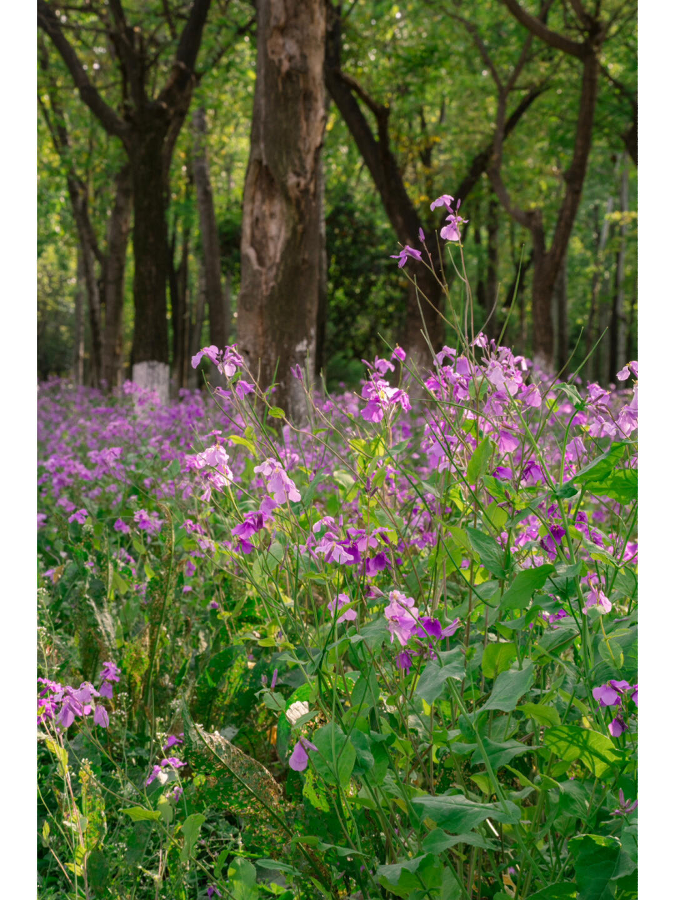

## 直觉
这张最迷人的是“林间紫色花毯”的氛围：阳光从树缝落下来，花和叶子有闪光感，很适合做春日人像的环境铺垫。

## 技法拆解
- 低机位贴近花丛，让前景二月兰形成沉浸感，比平视更有“漫游花海”的感觉。
- 树干提供纵向线条，能压住画面，不至于只有花而显得散。
- 光线是斜射的林间光，亮部漂亮，但绿色和紫色都偏满，后期要稍控饱和。
- 画面主体花朵略分散；若拍人像，可让人物站在小路或树干间的明亮处，视觉中心会更明确。

## 实拍操作（佳能 R10）
模式拨盘选 **Av 光圈优先**，因为花海/人像更需要先控制景深和背景虚化。推荐 **f/2.8-f/4，1/250s 以上，ISO Auto，评价测光，曝光补偿 -0.3EV；人像用伺服 AF + 人眼识别，拍花用单点 AF**。镜头建议 **RF-S 18-150mm 拉到 50-100mm** 压缩花海；若有人像，RF 50mm F1.8 也很适合。现场先蹲低贴近前景花，找树缝透下来的逆光或侧逆光；让人物穿浅色衣服站在花后小路上，避免踩花；等风小、花和发丝被光点亮时连拍。

## 后期思路
整体往“电影感春日”走：压一点高光，提阴影，让林子保留柔和层次。紫色可稍提升明度、降低饱和，绿色往黄绿偏一点，避免脏绿。加轻微暖色调和暗角，强化童话森林的包围感。