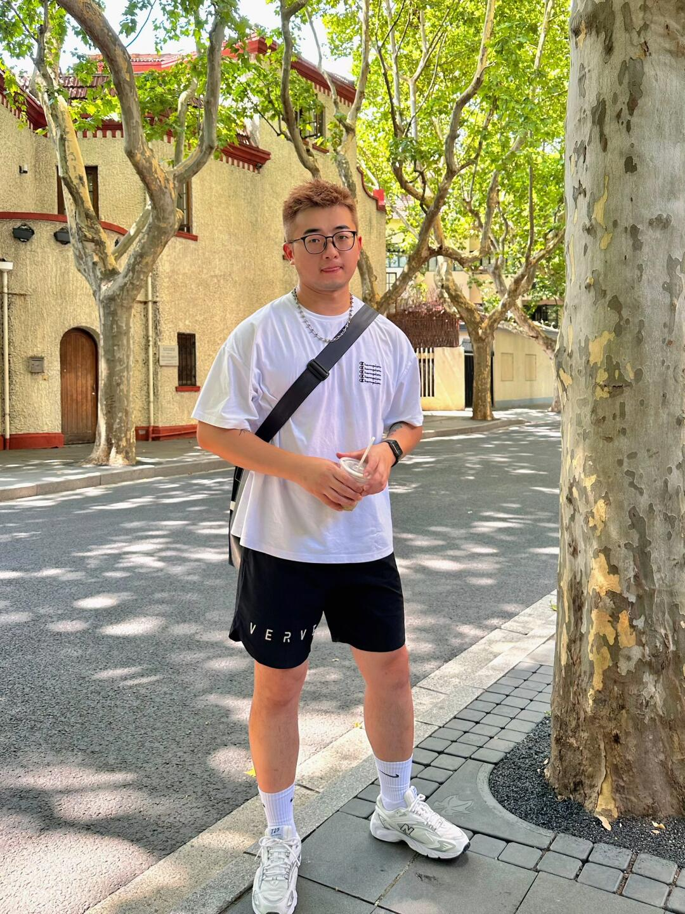
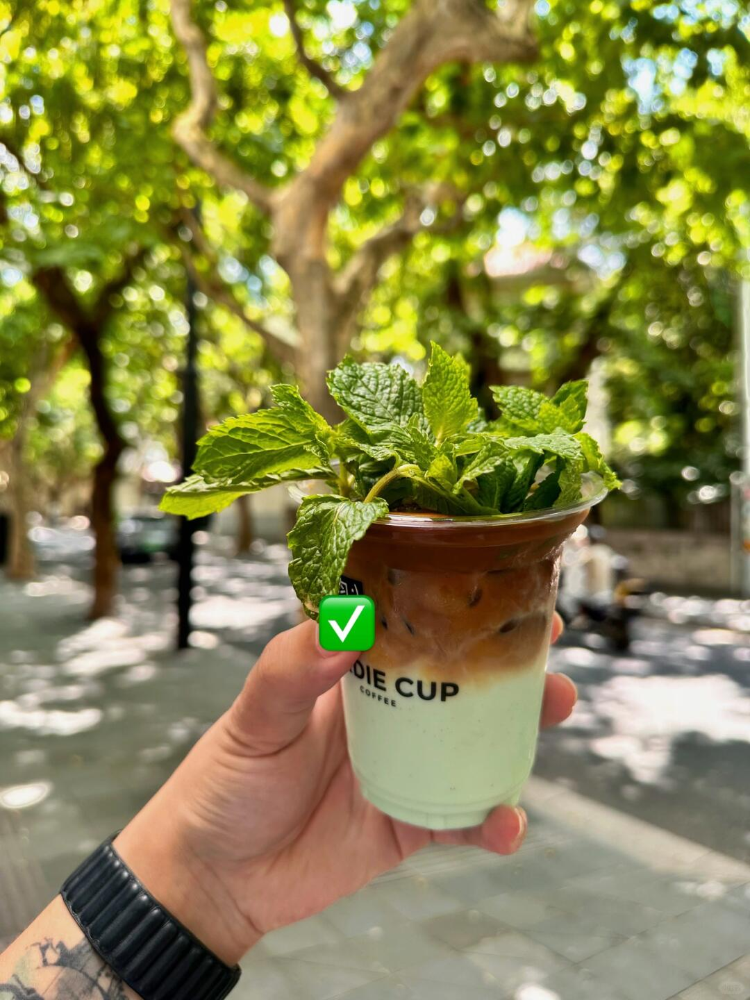
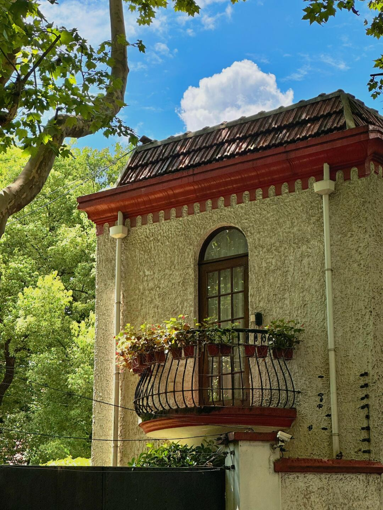
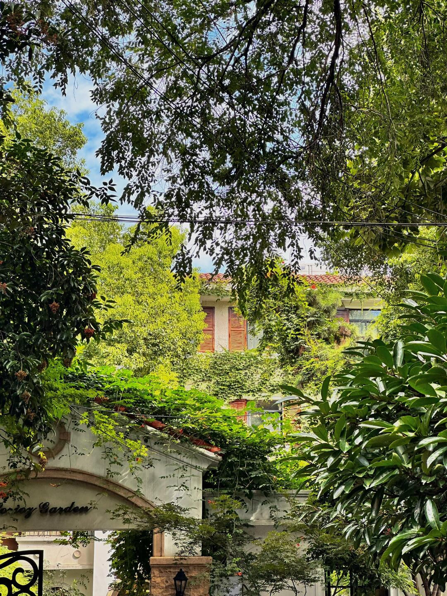
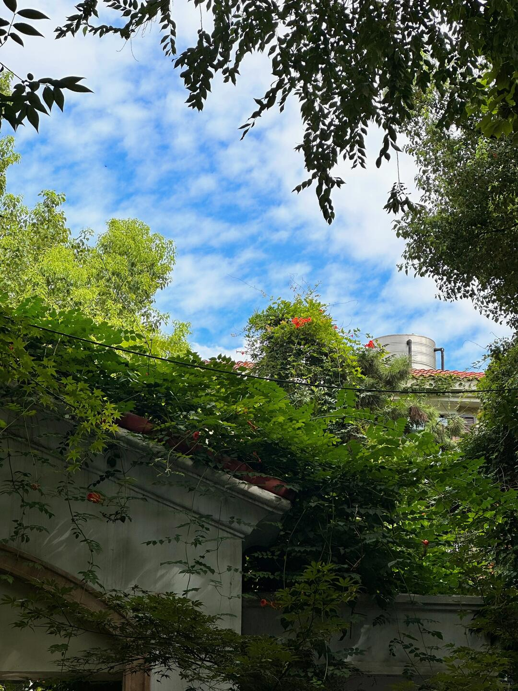

# 每日摄影教练 - 2026-06-02

---

# 风光/自然

## #1 风光/自然

**摄影师**: [Simon Lohmann](https://unsplash.com/@slohmann)
 | **来源**: [Unsplash](https://unsplash.com/photos/green-mountains-under-blue-sky-during-daytime-I_n_b44cqhk)

> EXIF: Camera Canon Canon EOS 5D Mark IV | f/4.0 | 1/500s | 16.0mm | ISO 100

---

# 人像/质感

## #2 人像/质感

**摄影师**: [Dinesh Lunked](https://unsplash.com/@idlunked)
 | **来源**: [Unsplash](https://unsplash.com/photos/a-person-sitting-next-to-a-pile-of-produce-h_kW-EcNbHY)

> EXIF: Camera Canon  EOS 200D II | f/2.2 | 1/640s | 50.0mm | ISO 100

## #3 人像/质感

**摄影师**: [laurence la madeleine](https://unsplash.com/@laurence_lmxo)
 | **来源**: [Unsplash](https://unsplash.com/photos/woman-in-yellow-and-white-polka-dot-shirt-and-blue-denim-jeans-sitting-on-white-wooden-POB_ncWVrgI)

> EXIF: Camera Canon Canon EOS 6D Mark II | f/2.8 | 1/2000s | 63.0mm | ISO 1000

## #4 人像/质感

**摄影师**: [Circling Sea](https://unsplash.com/@circlingsea)
 | **来源**: [Unsplash](https://unsplash.com/photos/a-woman-in-a-yellow-dress-is-posing-for-a-picture-8XwlZno0olo)

---

# 街头/人文

## #5 街头/人文

**摄影师**: [Kelvin Zyteng](https://unsplash.com/@zyteng)
 | **来源**: [Unsplash](https://unsplash.com/photos/a-building-with-many-windows-a0x84mkp4qs)

> EXIF: Camera Panasonic DC-GH5 | 1/125s | ISO 640

## #6 街头/人文

**摄影师**: [Tuaans](https://unsplash.com/@tuaans_)
 | **来源**: [Unsplash](https://unsplash.com/photos/person-riding-scooter-down-narrow-street-with-flags-g4q27u3aINU)

> EXIF: Camera RICOH IMAGING COMPANY, LTD. RICOH GR IIIx | f/8.0 | 1/250s | 26.0mm | ISO 800

---

# 极简/建筑

## #7 极简/建筑

**摄影师**: [Fer Troulik](https://unsplash.com/@fertroulik)
 | **来源**: [Unsplash](https://unsplash.com/photos/modern-sculpture-against-a-bright-blue-sky-1w9jxMoenaQ)

> EXIF: Camera Canon  PowerShot G7 X Mark II | f/5.6 | 1/1600s | 8.8mm | ISO 125

## #8 极简/建筑

**摄影师**: [Behnam Norouzi](https://unsplash.com/@behy_studio)
 | **来源**: [Unsplash](https://unsplash.com/photos/a-white-screen-with-a-black-background-2X8HBYEEEW8)

> EXIF: Camera Apple iPhone 12 | f/2.4 | 1/1150s | 1.6mm | ISO 25

## #9 极简/建筑

**摄影师**: [Peter F](https://unsplash.com/@peterf)
 | **来源**: [Unsplash](https://unsplash.com/photos/grayscale-photo-of-building-q0OALXu7LcE)

> EXIF: Camera FUJIFILM X100F | f/4.0 | 1/200s | 19.0mm | ISO 500

---

# 美食/静物

## #10 美食/静物

**摄影师**: [Usman Aslam](https://unsplash.com/@usmanframes)
 | **来源**: [Unsplash](https://unsplash.com/photos/a-close-up-of-a-pizza-on-a-table-u1WShzm_vwk)

> EXIF: Camera SONY ILCE-6400 | f/5.6 | 1/250s | 56.0mm | ISO 400

## #11 美食/静物

**摄影师**: [sheri silver](https://unsplash.com/@sheri_silver)
 | **来源**: [Unsplash](https://unsplash.com/photos/diced-sweet-potatoes-and-onions-with-rosemary-on-baking-sheet-HS6fmVJjWX0)

> EXIF: 0.0mm

## #12 美食/静物

**摄影师**: [mk. s](https://unsplash.com/@mk__s)
 | **来源**: [Unsplash](https://unsplash.com/photos/a-black-plate-topped-with-cut-up-fruit-62aBfbZb5EA)

> EXIF: Camera Apple iPhone 13 Pro | f/1.5 | 1/130s | 5.7mm | ISO 32

---

# 夜景/城市

## #13 夜景/城市

**摄影师**: [Sam Tsonis](https://unsplash.com/@philcat)
 | **来源**: [Unsplash](https://unsplash.com/photos/blurred-city-skyline-at-night-with-illuminated-buildings-wFU3hun3Jc0)

> EXIF: Camera Canon  EOS 200D II | f/1.8 | 0.6s | 50.0mm | ISO 400

## #14 夜景/城市

**摄影师**: [Soheb Zaidi](https://unsplash.com/@msohebzaidi)
 | **来源**: [Unsplash](https://unsplash.com/photos/people-walking-on-street-during-night-time-AYS2sSAMyhc)

> EXIF: Camera FUJIFILM X-T3 | f/1.8 | 1/40s | 35.0mm | ISO 200

## #15 夜景/城市

**摄影师**: [Ars M](https://unsplash.com/@arsenm)
 | **来源**: [Unsplash](https://unsplash.com/photos/city-street-at-night-with-glowing-lanterns-AjiqFbDZXy4)

---

# 微距/特写

## #16 微距/特写

**摄影师**: [Charlotte Kirkland](https://unsplash.com/@lottography)
 | **来源**: [Unsplash](https://unsplash.com/photos/close-up-of-a-fly-on-an-orange-flower-ihuIklWlXxU)

> EXIF: Camera OLYMPUS CORPORATION E-M1MarkII | f/8.0 | 1/640s | 60.0mm | ISO 640

## #17 微距/特写

**摄影师**: [Gabriel Lopez](https://unsplash.com/@something_gabe)
 | **来源**: [Unsplash](https://unsplash.com/photos/a-close-up-of-a-green-grass-with-a-blue-sky-in-the-background-c_Na188gO1s)

> EXIF: Camera NIKON CORPORATION NIKON D500 | f/2.8 | 1/3200s | 28.0mm | ISO 160

## #18 微距/特写

**摄影师**: [Amirreza Taqavi](https://unsplash.com/@a_tqv)
 | **来源**: [Unsplash](https://unsplash.com/photos/delicate-white-flower-with-blurred-dark-background-nAOeR7DBd54)

> EXIF: Camera Canon  EOS 6D | f/4.5 | 1/2000s | 50.0mm | ISO 800

---

# 黑白/光影

## #19 黑白/光影

**摄影师**: [Robert Guss](https://unsplash.com/@robertguss)
 | **来源**: [Unsplash](https://unsplash.com/photos/white-round-light-on-black-surface-oAICAyOGjiY)

> EXIF: Camera NIKON CORPORATION NIKON Z 50 | f/4.5 | 1/80s | 24.5mm | ISO 100

## #20 黑白/光影

**摄影师**: [Hongmei Zhao](https://unsplash.com/@justmine)
 | **来源**: [Unsplash](https://unsplash.com/photos/silhouette-of-a-person-walking-on-gray-concrete-floor-UMftJn4b9yM)

> EXIF: Camera Canon Canon EOS 500D | f/11.0 | 1/250s | 55.0mm | ISO 200

## #21 黑白/光影

**摄影师**: [Galt Museum & Archives](https://unsplash.com/@galtmuseum)
 | **来源**: [Unsplash](https://unsplash.com/photos/a-man-in-a-kilt-walking-through-a-room-WFw1ywkzxLA)

---

# 小红书｜人像写真

## #22 小红书｜人像写真

**摄影师**: [鯊魚喬納森.](https://www.xiaohongshu.com/user/profile/5a52302fe8ac2b3d2b212a76)
 | **来源**: [小红书](https://www.xiaohongshu.com/explore/64bfc48e000000000a01aeb4?xsec_token=ABSnHLvO9lnVSMKpZb-K1CpsR_tawRcS33LiHfRp3otRU%3D&xsec_source=pc_feed)

## 直觉
这张有很典型的夏日 cityboy 日常感：树荫、街道、白 T 和咖啡都很轻松。最舒服的是斑驳光影，但人物脸部被树影和背景稍微“吃掉”，主体存在感还可以再加强。

## 技法拆解
- 构图用竖幅全身，适合小红书穿搭记录，但人物略居中偏满，头顶和脚下空间可再精细。
- 右侧树干形成前景框架，有街拍感，但占比稍大，会分散视线。
- 光线是强烈夏日顶光加树荫，氛围好，但白 T 容易过曝，脸部也容易不均匀。
- 背景建筑和树影有上海街区味道，建议用更大光圈或更长焦距压一压背景，让人更突出。

## 实拍操作（佳能 R10）
模式拨盘选 **Av 光圈优先**，因为这类日常人像重点是控制景深和背景虚化，曝光交给相机更快。推荐 **f/2.8-f/4，1/500s 以上，ISO 100-400，评价测光，人眼检测 AF，伺服 AF，区域选全区域或灵活区域**。镜头建议 **RF-S 18-150mm 拉到 50-85mm**，或 **RF 50mm F1.8** 拍半身/全身更有虚化。现场先让人物站在完整阴影里，避开脸上碎光；摄影师退后用中长焦拍，人物微侧身、手拿咖啡；等背景无人、树影好看时连拍 2-3 张。

## 后期思路
整体往“小红书夏日清爽”走：提高亮度和阴影，压一点高光保护白 T。色彩可让绿色偏黄一点、肤色提亮，适度加暖色温和清晰度；用径向滤镜轻微提亮人物，背景略降饱和，突出少年感。

## #23 小红书｜人像写真

**摄影师**: [鯊魚喬納森.](https://www.xiaohongshu.com/user/profile/5a52302fe8ac2b3d2b212a76)
 | **来源**: [小红书](https://www.xiaohongshu.com/explore/64bfc48e000000000a01aeb4?xsec_token=ABSnHLvO9lnVSMKpZb-K1CpsR_tawRcS33LiHfRp3otRU%3D&xsec_source=pc_feed)

## 直觉
这张有很强的“沪上一日游”松弛感：老墙牌匾、树影、白T和咖啡，组合出夏天 cityboy 的日常气息。最加分的是斑驳光影，让普通打卡照有了时间感。

## 技法拆解
- 人物放在右侧，左上保留“巴金故居”牌匾，交代地点但画面略显上重下空。
- 树影很好看，但脸部若被明暗切割会影响人像质感，可让光影落在衣服和背景上。
- 白T在强光下容易过曝，拍摄时应优先保住高光细节。
- 色彩以浅墙、白衣、咖啡为主，适合走清爽夏日风，不必重饱和。

## 实拍操作（佳能 R10）
模式拨盘选 **Av 光圈优先**，适合街拍人像快速控制虚化和曝光。推荐 **f/4-f/5.6，1/250s 以上，ISO 100-400，评价测光，人眼检测伺服AF，区域AF/全区域追踪**；若阳光太强，可曝光补偿 -0.3EV。镜头建议 **RF-S 18-45mm 用 24-35mm 端**拍环境人像，或 **RF 35mm F1.8**获得更自然的街拍视角。现场先让人物离墙半步到一步，站在牌匾右下方；等树影落在背景而非脸上；引导他抱臂拿咖啡、身体微侧，表情放松时连拍两三张。

## 后期思路
整体往“小红书夏日胶片感”走：提亮中间调，压一点高光，保留墙面和白T细节。色温可略偏暖，降低绿色饱和度，增加少量颗粒和柔和对比，让画面更像轻松的一日游记录。

## #24 小红书｜人像写真

**摄影师**: [鯊魚喬納森.](https://www.xiaohongshu.com/user/profile/5a52302fe8ac2b3d2b212a76)
 | **来源**: [小红书](https://www.xiaohongshu.com/explore/64bfc48e000000000a01aeb4?xsec_token=ABSnHLvO9lnVSMKpZb-K1CpsR_tawRcS33LiHfRp3otRU%3D&xsec_source=pc_feed)

## 直觉
这张最打动人的是“树荫下的一杯夏天”：薄荷叶、冰咖啡和斑驳光影很有松弛感，符合小红书日常探店的快乐语境。

## 技法拆解
- 主体放在画面中下部，杯子与手形成明确视觉中心，背景虚化出街区氛围。
- 绿色薄荷和树叶呼应，色彩统一，夏日感很强。
- 顶部树冠光斑漂亮，但高光略散，拍摄时可避开最亮的白斑。
- 杯身贴纸遮挡稍抢眼，如果是成片发布，可换角度让品牌字样或杯型更完整。

## 实拍操作（佳能 R10）
模式拨盘选 **Av 光圈优先**，方便控制背景虚化，让饮品突出、街景保留氛围。推荐参数：光圈 **F2.8-F4**，快门不低于 **1/250s**，ISO 自动或 **100-400**，评价测光，曝光补偿 **-0.3EV** 防止树荫高光过曝；对焦用 **单次 AF / 小区域对焦**，对准薄荷叶或杯口。镜头建议 **RF-S 18-150mm** 拉到 50-80mm，或 **RF 50mm F1.8** 拍更强虚化。现场先站在树荫边缘，让杯子吃到柔和侧光；背景选有树、有路人但不杂乱的位置；手臂伸出一点，等光斑稳定、路人不重叠时连拍几张。

## 后期思路
整体往“清爽夏日胶片感”走：提高一点曝光和阴影，压住高光，绿色往黄绿微调但别过饱和。杯子可局部提亮、增加清晰度，背景降低纹理和清晰度，让主体更干净。

## #25 小红书｜人像写真

**摄影师**: [鯊魚喬納森.](https://www.xiaohongshu.com/user/profile/5a52302fe8ac2b3d2b212a76)
 | **来源**: [小红书](https://www.xiaohongshu.com/explore/64bfc48e000000000a01aeb4?xsec_token=ABSnHLvO9lnVSMKpZb-K1CpsR_tawRcS33LiHfRp3otRU%3D&xsec_source=pc_feed)

## 直觉
这张有很强的“沪上一日游”松弛感：老洋房、树荫、蓝天和阳台花盆组合在一起，夏天的明亮情绪很到位。画面像是人像写真里的环境空镜，适合用来铺垫少年感、cityboy 的生活氛围。

## 技法拆解
- 仰拍让建筑更有存在感，屋顶斜线把视线带向蓝天和云朵。
- 树叶形成天然前景框架，增加了夏日街拍的现场感。
- 红色屋檐与蓝天、绿色树叶形成互补，色彩很“小红书”。
- 高光略硬，白墙和天空反差较大，拍摄时可稍微压暗保护云层。
- 左侧树干较重，若再向右挪一点，建筑主体会更干净。

## 实拍操作（佳能 R10）
模式拨盘选 **Av 光圈优先**，适合扫街时快速控制景深和画质，让相机自动匹配快门。推荐 **F5.6-F8、ISO 100-400、评价测光、单次 AF、单点或小区域对焦**，对焦在窗户或阳台边缘；快门尽量保持 1/250s 以上防抖。镜头可用 **RF-S 18-45mm** 的 18-24mm，或 **RF-S 18-150mm** 的广角端，方便保留树叶、建筑和天空关系。现场先站到建筑斜前方，略微仰拍；等阳光打亮树叶、云朵进入屋顶上方时按快门；如果要接人像，让人物站在墙边阴影处，保留这栋楼作背景。

## 后期思路
整体走“清爽夏日胶片感”：提升暖色和绿色明度，蓝天稍加饱和但避免过艳。压一点高光、拉回云层细节，阴影略提亮，让墙面纹理更柔和；可加轻微颗粒和暗角，增强日常记录感。

## #26 小红书｜人像写真

**摄影师**: [鯊魚喬納森.](https://www.xiaohongshu.com/user/profile/5a52302fe8ac2b3d2b212a76)
 | **来源**: [小红书](https://www.xiaohongshu.com/explore/64bfc48e000000000a01aeb4?xsec_token=ABSnHLvO9lnVSMKpZb-K1CpsR_tawRcS33LiHfRp3otRU%3D&xsec_source=pc_feed)

## 直觉
这张最舒服的是“被绿意包围”的夏日感，像城市里突然闯进一座小花园。树叶、老房子、阳光共同营造出松弛的沪上 citywalk 氛围。

## 技法拆解
- 画面用树叶做天然前景框，把视线引向中间被藤蔓包裹的建筑。
- 高光天空和深色树荫反差较大，保住叶片层次比天空纯净更重要。
- 竖构图适合小红书浏览，但上方枝叶略密，可适当下压或裁掉一点。
- 色彩以绿色为主，阳光处偏黄，强化了“夏天快乐到账”的情绪。

## 实拍操作（佳能 R10）
模式拨盘选 **Av 光圈优先**，这类街拍风景光线变化快，先控制景深更稳。推荐 **f/5.6-f/8、1/250s 以上、ISO Auto、评价测光，单次 AF，单点或区域对焦**，对焦在中间建筑窗户或藤蔓处。镜头可用 **RF-S 18-45mm 的 18-24mm**，或 **RF-S 18-150mm 的广角端**。现场先站在树荫下，让枝叶形成边框；半按快门看高光不过曝，必要时曝光补偿 -0.3~-0.7EV；等阳光打亮中间建筑和叶片时再拍。

## 后期思路
后期往“清爽夏日胶片感”走：降低高光、提一点阴影，保住天空和暗部树叶。绿色不要一味加饱和，可微调 HSL，让绿偏黄一点、亮度提高，整体更像小红书里的松弛一日游记录。

## #27 小红书｜人像写真

**摄影师**: [鯊魚喬納森.](https://www.xiaohongshu.com/user/profile/5a52302fe8ac2b3d2b212a76)
 | **来源**: [小红书](https://www.xiaohongshu.com/explore/64bfc48e000000000a01aeb4?xsec_token=ABSnHLvO9lnVSMKpZb-K1CpsR_tawRcS33LiHfRp3otRU%3D&xsec_source=pc_feed)

## 直觉
这张最有“夏天抬头一瞬间”的松弛感：蓝天、树影、老房檐和一点红花，像城市里突然被绿意包住。画面没有人物，但很适合作为小红书日常/少年感穿搭组图里的环境铺垫。

## 技法拆解
- 构图用了树叶做天然框景，上方暗部压住天空，视线会自然落到中间的蓝天与屋顶。
- 亮部天空保留不错，但下方墙面和藤蔓略暗，整体反差偏大。
- 绿色层次丰富，红花是很好的小色点，让画面不至于只有绿和蓝。
- 画面中间的黑色电线稍抢眼，拍摄时可尝试换角度避开或让它成为更明确的线条元素。
- 如果是人像组图，这张可作为“环境氛围图”，后面接一张人物在树荫下的半身会更完整。

## 实拍操作（佳能 R10）
模式拨盘选 **Av 光圈优先**，因为这类街拍环境图主要控制景深和曝光补偿，让相机快速应对树荫与天空。推荐 **F5.6-F8，1/250s以上，ISO 100-400，评价测光，单次AF，单点或区域对焦**，对焦在屋檐/红花附近。镜头建议 **RF-S 18-45mm 的18-24mm**，或 **RF-S 18-150mm 的18mm端** 拍出抬头的空间感。现场先站到树荫边缘，利用枝叶围住天空；再轻微下蹲或后退，避开杂乱电线；等云层露出蓝色、叶子被侧光打亮时连拍两三张。

## 后期思路
后期走“清爽夏日胶片感”：提高一点曝光和阴影，压住高光，保留天空细节。绿色可稍微降低饱和、提高明亮度，避免荧光绿；蓝色增加一点明度和纯净感。最后用局部修复弱化电线，让画面更干净。