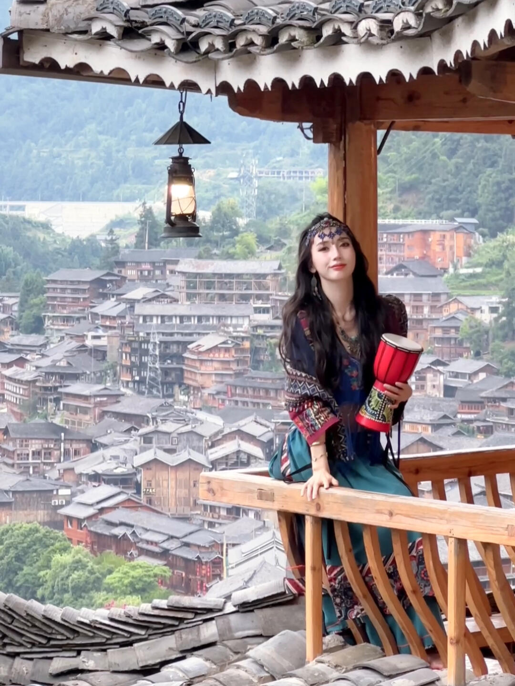

# 每日摄影教练 - 2026-06-22

---

# 风光/自然

## #1 风光/自然

**摄影师**: [Igor Omilaev](https://unsplash.com/@omilaev)
 | **来源**: [Unsplash](https://unsplash.com/photos/a-red-and-black-pattern-with-a-yellow-line-going-through-it-aqNdl7mlMHg)

> EXIF: 0.0mm

## #2 风光/自然

**摄影师**: [Mathew Benoit](https://unsplash.com/@benoitphoto)
 | **来源**: [Unsplash](https://unsplash.com/photos/a-tall-waterfall-with-a-forest-in-the-background-EzbX7eWD64Y)

## #3 风光/自然

**摄影师**: [Annie Spratt](https://unsplash.com/@anniespratt)
 | **来源**: [Unsplash](https://unsplash.com/photos/white-and-black-floral-textile-4vGjXjmS6vg)

> EXIF: Camera DJI FC220 | f/2.2 | 1/120s | 4.7mm | ISO 100

---

# 人像/质感

## #4 人像/质感

**摄影师**: [David Todd McCarty](https://unsplash.com/@davidtoddmccarty)
 | **来源**: [Unsplash](https://unsplash.com/photos/woman-covering-her-face-with-her-hands-i-Ysi0jsa0U)

> EXIF: Camera Canon Canon EOS 5D Mark III | f/11.0 | 1/125s | 35.0mm | ISO 100

## #5 人像/质感

**摄影师**: [Valna Studio](https://unsplash.com/@valnastudio)
 | **来源**: [Unsplash](https://unsplash.com/photos/woman-in-brown-and-white-floral-sleeveless-top-and-pants-WagogvSJK_Q)

> EXIF: Camera Canon Canon EOS 6D | f/2.8 | 1/2000s | 40.0mm | ISO 100

## #6 人像/质感

**摄影师**: [Lana Zorina](https://unsplash.com/@lana_zorina_ph)
 | **来源**: [Unsplash](https://unsplash.com/photos/brown-and-black-round-wall-ornament-VwZy3he6JEY)

> EXIF: Camera Apple iPhone 7 | f/1.8 | 1/20s | 4.0mm | ISO 40

---

# 街头/人文

## #7 街头/人文

**摄影师**: [Austin Curtis](https://unsplash.com/@afcurtis)
 | **来源**: [Unsplash](https://unsplash.com/photos/a-bus-driving-down-a-street-next-to-tall-buildings-mHlqXD1BxPk)

> EXIF: Camera FUJIFILM X-T30 | f/5.6 | 1/680s | 23.3mm | ISO 320

## #8 街头/人文

**摄影师**: [SALEH](https://unsplash.com/@shs3)
 | **来源**: [Unsplash](https://unsplash.com/photos/a-group-of-people-walking-across-a-wet-sidewalk-mDiUaBMtZqs)

> EXIF: Camera Canon  EOS 6D Mark II | f/1.4 | 1/60s | 35.0mm | ISO 100

## #9 街头/人文

**摄影师**: [Rocky Xiong](https://unsplash.com/@rocky_2496)
 | **来源**: [Unsplash](https://unsplash.com/photos/a-group-of-people-standing-in-front-of-a-building-8fxy_zztutE)

> EXIF: Camera NORITSU KOKI EZ Controller

---

# 小红书｜人像写真

## #10 小红书｜人像写真

**摄影师**: [小仙女周周](https://www.xiaohongshu.com/user/profile/5b9de124f110cc0001ad3c94)
 | **来源**: [小红书](https://www.xiaohongshu.com/explore/64ba91e5000000000800f849?xsec_token=ABbCLHT5s3qlM3EnEPlnWhUINrLLEnUQ51TY8T0KxqD2E%3D&xsec_source=pc_feed)

## 直觉
观景台的木檐、灯笼和苗寨层叠屋顶形成了很强的“旅行写真感”，人物站在右侧，既有环境交代，也有小红书式打卡氛围。

## 技法拆解
- 构图上利用屋檐做上方框架，背景苗寨铺满画面，地点辨识度很高。
- 人物略靠右是对的，但栏杆和柱子稍抢眼，身体下半部分被切得有些碎。
- 背景雾气偏亮，人物面部容易显暗，拍摄时需要给人脸适当补曝光。
- 灯笼是很好的前景元素，但位置可再靠左上，避免和人物视觉重心竞争。

## 实拍操作（佳能 R10）
模式拨盘选 **Av 光圈优先**，这类旅拍需要快速控制景深，让相机自动适配现场光。推荐 **f/4-f/5.6，1/250s 以上，ISO 400-800，评价测光，人眼检测 AF，伺服 AF，区域对焦**；若背景太亮，可曝光补偿 **+0.3 到 +0.7EV** 保住人脸。镜头建议 **RF-S 18-150mm** 用 35-50mm 段，或 **RF 50mm F1.8** 拍半身更干净。现场先让人物靠栏杆侧身，避开柱子压脸；等云雾柔光时拍；按快门时引导她微抬下巴、手扶栏杆或鼓，连拍抓自然表情。

## 后期思路
整体走“清透民族旅拍”方向：降低高光、提升阴影，让人脸和服饰更亮。背景可适度去雾、降饱和，人物用蒙版提亮肤色和眼神，保留苗寨木建筑的暖色质感。