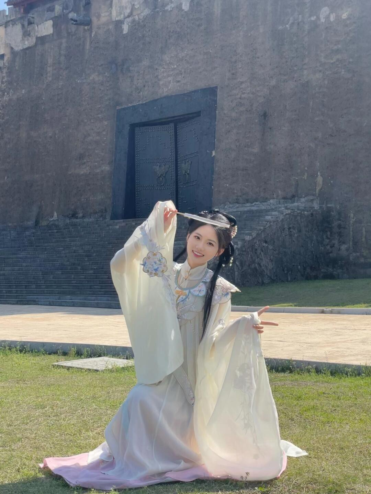
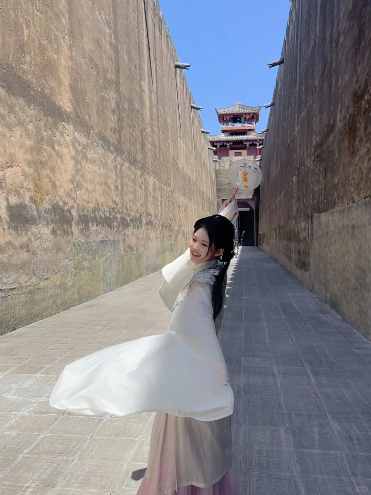
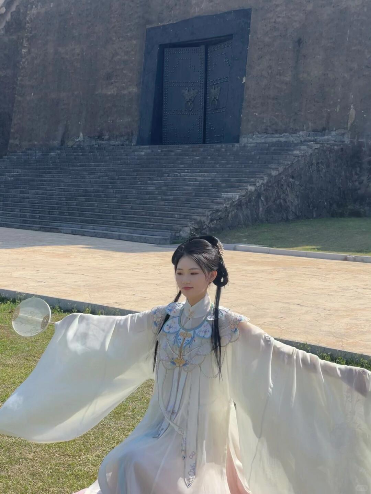
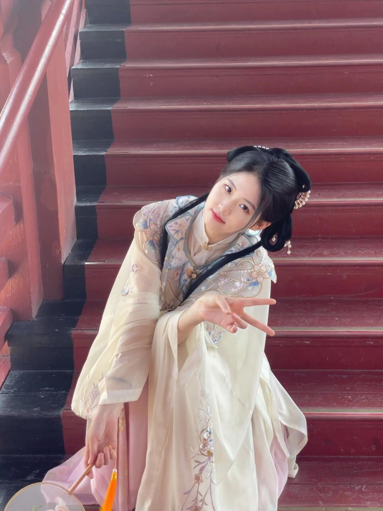
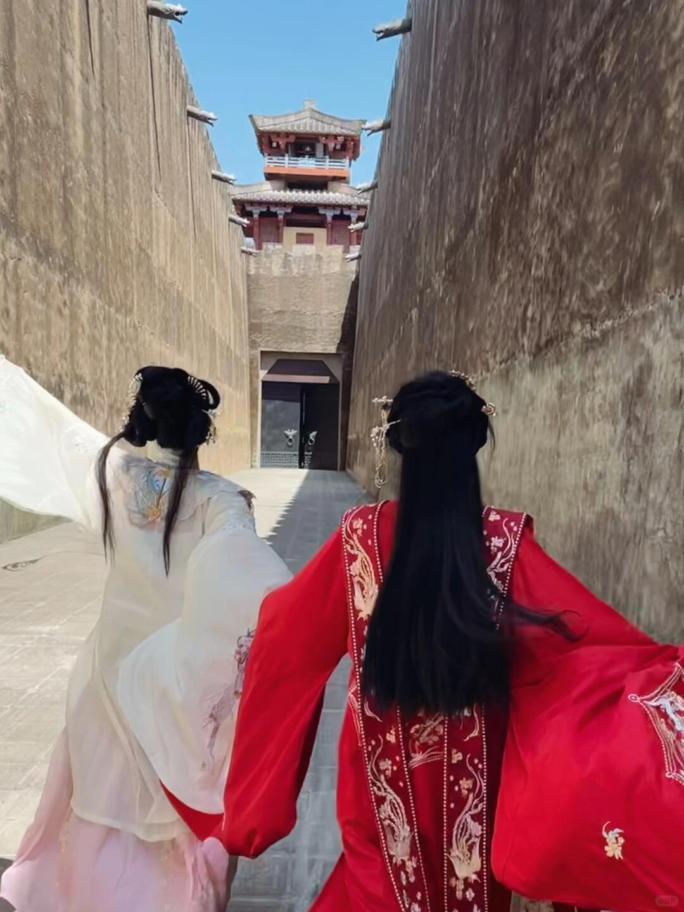
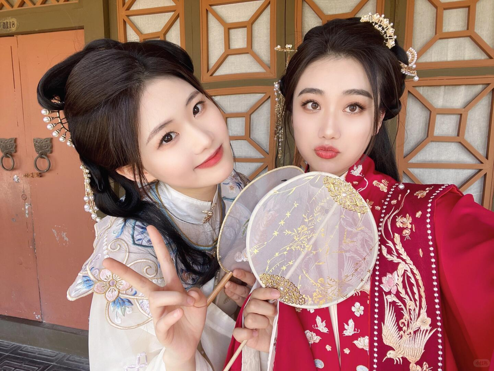
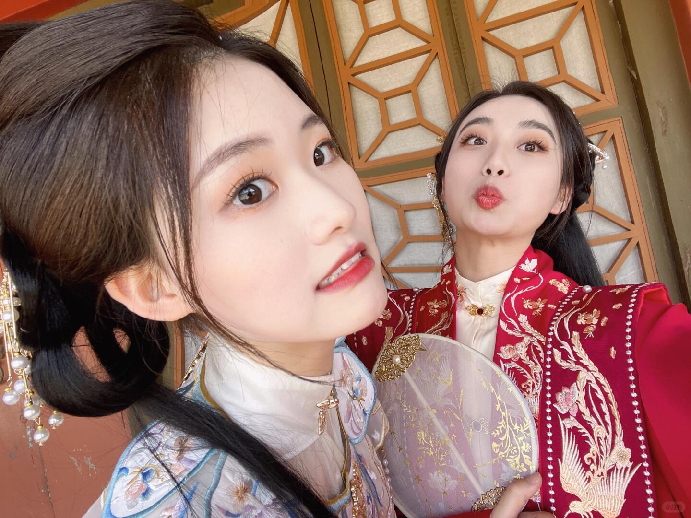

# 每日摄影教练 - 2026-07-30

---

# 风光/自然

## #1 风光/自然

**摄影师**: [Pawel Nolbert](https://unsplash.com/@hellocolor)
 | **来源**: [Unsplash](https://unsplash.com/photos/rock-mountain-during-starry-night-62OK9xwVA0c)

> EXIF: Camera SONY ILCE-7 | f/2.8 | 30s | 21.0mm | ISO 1250

## #2 风光/自然

**摄影师**: [Mike Hindle](https://unsplash.com/@mikehindle)
 | **来源**: [Unsplash](https://unsplash.com/photos/a-black-and-white-photo-of-a-tall-building-0-iobr2EMEs)

> EXIF: Camera Apple iPhone 14 Pro Max | f/1.8 | 1/4200s | 6.9mm | ISO 100

## #3 风光/自然

**摄影师**: [Alex Paganelli](https://unsplash.com/@alexpaganelli)
 | **来源**: [Unsplash](https://unsplash.com/photos/yellow-and-black-boat-on-water-0PizAzhRDuc)

---

# 人像/质感

## #4 人像/质感

**摄影师**: [sour moha](https://unsplash.com/@sour_moha)
 | **来源**: [Unsplash](https://unsplash.com/photos/person-holding-brown-wooden-box-XQ2uxrIZn94)

## #5 人像/质感

**摄影师**: [Rio Syhputra](https://unsplash.com/@lingkarphoto)
 | **来源**: [Unsplash](https://unsplash.com/photos/woman-wearing-blue-and-brown-long-sleeved-shirt-standing-near-white-wall-phpgvCPxmko)

> EXIF: Camera Canon Canon EOS 60D | f/2.8 | 1/125s | 11.0mm | ISO 100

## #6 人像/质感

**摄影师**: [Daniil Lobachev](https://unsplash.com/@danilal)
 | **来源**: [Unsplash](https://unsplash.com/photos/woman-in-black-crew-neck-shirt-yqJ0f1CCXso)

---

# 街头/人文

## #7 街头/人文

**摄影师**: [mk. s](https://unsplash.com/@mk__s)
 | **来源**: [Unsplash](https://unsplash.com/photos/two-windows-with-brown-shutters-and-curtains-psXewIDOdHQ)

> EXIF: Camera SONY DSC-RX100M6 | f/3.5 | 1/200s | 9.0mm | ISO 125

## #8 街头/人文

**摄影师**: [Richard Stachmann](https://unsplash.com/@stachmann)
 | **来源**: [Unsplash](https://unsplash.com/photos/a-row-of-parked-cars-on-a-street-next-to-a-building-JAJFDskSbsI)

> EXIF: Camera Canon  EOS RP | f/2.8 | 1/100s | 50.0mm | ISO 100

## #9 街头/人文

**摄影师**: [Daniel Stiel](https://unsplash.com/@danielstiel)
 | **来源**: [Unsplash](https://unsplash.com/photos/a-man-in-a-red-turban-stands-in-front-of-a-building-zxPkS3Fy2qA)

---

# 小红书｜人像写真

## #10 小红书｜人像写真

**摄影师**: [黄小人](https://www.xiaohongshu.com/user/profile/60f992ea000000000101de56)
 | **来源**: [小红书](https://www.xiaohongshu.com/explore/643631310000000011011932?xsec_token=AB6DeaQ6zZk4H1MBOXG_8A1JuIzflslThznKSGDFMJ2rM%3D&xsec_source=pc_feed)

## 直觉
汉服的轻盈白纱和古城墙的厚重灰面形成反差，很有“横店一日游写真”的氛围。人物姿态有戏曲感，袖摆和发饰让画面有流动感。

## 技法拆解
- 光线偏硬，白色衣料已有高光溢出，建议拍摄时优先保住衣服细节。
- 背景城墙质感好，但人物离背景太近，层次略平。
- 构图上人物居中可用，但头顶大面积墙面偏空，可稍微低机位或拉近。
- 草地、墙面、浅色汉服色彩统一，适合走柔和古风调。

## 实拍操作（佳能 R10）
模式拨盘选 **Av 光圈优先**，方便控制人像虚化，同时让相机自动应对户外光线。推荐参数：光圈 **f/4-f/5.6**，快门不低于 **1/500s**，ISO **100**，评价测光或高光优先测光，对焦用 **伺服AF + 人脸/眼睛检测**。镜头建议 RF-S 18-150mm 用 **50-80mm** 端，或 RF 50mm F1.8 拍半身更干净。现场先让人物离城墙远一些，站到斜侧光位置；让袖子展开形成线条；等风吹纱、手势到位时连拍，曝光补偿可设 **-0.3 到 -0.7EV** 保住白衣。

## 后期思路
整体往“小红书古风写真”方向走：降低高光、拉回白色衣料细节，适度提阴影让脸和衣纹更柔。色彩可压低绿色饱和度，墙面加一点暖灰，人物皮肤和汉服保持干净通透。

## #11 小红书｜人像写真

**摄影师**: [黄小人](https://www.xiaohongshu.com/user/profile/60f992ea000000000101de56)
 | **来源**: [小红书](https://www.xiaohongshu.com/explore/643631310000000011011932?xsec_token=AB6DeaQ6zZk4H1MBOXG_8A1JuIzflslThznKSGDFMJ2rM%3D&xsec_source=pc_feed)

## 直觉
高墙夹出的纵深感很强，汉服白袖一甩，瞬间有了“穿越片场”的动势。横店场景的硬朗线条和人物的柔软衣袂形成了不错的反差。

## 技法拆解
- 两侧墙面形成天然引导线，把视线推向远处楼阁，空间感成立。
- 人物站位略居中，袖子向左展开，让画面有流动感，但脸部位置稍被袖子和暗部压住。
- 正午硬光明显，白衣高光容易过曝，拍摄时要优先保住衣服细节。
- 背景建筑很好，但人物离镜头较近，广角透视会放大袖子、压缩脸部，需要控制角度。

## 实拍操作（佳能 R10）
模式拨盘选 **Tv 快门优先**，因为这类汉服甩袖动作关键是抓住动态瞬间。推荐 **1/800s，ISO 自动，光圈由相机控制，评价测光，曝光补偿 -0.3 至 -0.7EV**，避免白袖死白；对焦用 **伺服 AF + 人眼识别/全区域 AF**。镜头可用 **RF-S 18-45mm 或 RF-S 18-150mm**，焦段建议 **18-24mm** 拍出高墙纵深。现场让模特站在巷道中轴偏前，你蹲低一点顺着墙线拍；先试甩两次观察袖子轨迹，等袖子完全展开、身体微转时连拍；尽量让脸朝有光的一侧，避免全黑。

## 后期思路
整体走小红书清透古风感：降低高光、拉回白衣细节，适度提阴影让脸和头发不闷。色彩上可把天空蓝压干净，墙面稍加暖，人物皮肤提亮但别磨得太假；用局部蒙版强化袖子和远处楼阁的层次。

## #12 小红书｜人像写真

**摄影师**: [黄小人](https://www.xiaohongshu.com/user/profile/60f992ea000000000101de56)
 | **来源**: [小红书](https://www.xiaohongshu.com/explore/643631310000000011011932?xsec_token=AB6DeaQ6zZk4H1MBOXG_8A1JuIzflslThznKSGDFMJ2rM%3D&xsec_source=pc_feed)

## 直觉
汉服大袖展开的姿态很有“横店一日游写真”的仪式感，背景台阶和大门也强化了古装场景。画面最可惜的是人物被强光压住，脸部和衣服细节不够干净。

## 技法拆解
- 构图上人物放得偏低，后方大门体量太重，容易抢走汉服主体。
- 光线是偏硬的侧逆光，白衣容易过曝，脸部却显暗，建议找阴影边缘拍。
- 大袖动作很好，但手臂被画面边缘切掉，留白再多一点会更舒展。
- 背景台阶线条有气势，可以让人物站远一点，用长焦压缩出“宫墙感”。

## 实拍操作（佳能 R10）
模式拨盘选 **Av 光圈优先**，方便控制虚化和曝光，适合旅行写真快速抓拍。推荐 **光圈 F2.8-F4，快门不低于 1/500s，ISO 100-400，评价测光，人物眼睛检测 AF，伺服 AF，区域选全区域或人像追踪**。镜头可用 **RF-S 18-150mm 的 50-100mm 段**，或 **RF 50mm F1.8** 拍半身更干净。现场先让人物离背景远一些，站到光线柔和的阴影边；摄影师略蹲低，用台阶做引导线；等袖子展开、头发和衣摆有动势时连拍。

## 后期思路
整体往“小红书汉服写真”的清透暖调走：降低高光、拉回白衣层次，适度提亮人物面部。背景可压暗一点、降低蓝灰饱和度，让主体更突出；用局部蒙版加强眼部、妆造和衣服刺绣细节。

## #13 小红书｜人像写真

**摄影师**: [黄小人](https://www.xiaohongshu.com/user/profile/60f992ea000000000101de56)
 | **来源**: [小红书](https://www.xiaohongshu.com/explore/643631310000000011011932?xsec_token=AB6DeaQ6zZk4H1MBOXG_8A1JuIzflslThznKSGDFMJ2rM%3D&xsec_source=pc_feed)

## 直觉
红色楼梯和浅色汉服形成很漂亮的反差，人物俯身比手势有“打卡抓拍”的轻松感。整体很适合小红书汉服体验分享，氛围比正式棚拍更自然。

## 技法拆解
- 构图上利用楼梯横线做背景，能强化场景感，但人物头部略贴近画面中线，可再留一点上方空间。
- 红楼梯色彩浓，浅色汉服被衬得更干净，是这张图最有效的配色关系。
- 机位偏高，拍出了俯看的俏皮感，但脸部角度容易显短，建议让下巴微抬一点。
- 光线偏柔，衣料细节保留不错；但白色袖口略亮，拍摄时可稍微压曝光。

## 实拍操作（佳能 R10）
模式拨盘选 **Av 光圈优先**，适合人像打卡时快速控制虚化和曝光。推荐参数：光圈 **F2.8-F4**，快门保持 **1/250s 以上**，ISO 自动或 **ISO 400-800**，评价测光，曝光补偿 **-0.3EV**；对焦用 **伺服 AF + 人眼识别/全区域 AF**。镜头可用 **RF-S 18-150mm** 的 35-50mm 段，或 **RF 50mm F1.8** 拍更有压缩感。现场先站在楼梯上方斜侧，避开杂乱扶手；让模特身体向一侧倾、手势伸向镜头；等她笑或摆完动作的瞬间连拍 3-5 张。

## 后期思路
后期可走“小红书汉服打卡”的清透暖调：略提亮人物、降低红色楼梯的饱和度，避免背景抢戏。重点用曲线提一点柔和对比，HSL 中压红色亮度/饱和，局部增强衣服刺绣和发饰细节。

## #14 小红书｜人像写真

**摄影师**: [黄小人](https://www.xiaohongshu.com/user/profile/60f992ea000000000101de56)
 | **来源**: [小红书](https://www.xiaohongshu.com/explore/643631310000000011011932?xsec_token=AB6DeaQ6zZk4H1MBOXG_8A1JuIzflslThznKSGDFMJ2rM%3D&xsec_source=pc_feed)

## 直觉
最打动人的是“两位汉服少女奔向城楼”的沉浸感，像横店一日游里的古装剧入场镜头。高墙形成强烈纵深，红白服装一冷一热，把画面情绪撑起来了。

## 技法拆解
- 两侧墙面是天然引导线，把视线推向远处城楼，场景感很强。
- 采用背影拍法，减少表情压力，更适合小红书旅行写真。
- 红衣人物占比更大，成为视觉主角；白衣袖摆提供了动态。
- 正午光较硬，白衣部分略容易过曝，拍摄时要重点保护高光。
- 人物稍靠下，城楼留在上方，能交代“横店古风场景”。

## 实拍操作（佳能 R10）
模式拨盘选 **Av 光圈优先**，方便边走边拍时稳定控制景深，让相机自动适配光线。推荐 **f/5.6-f/8，1/500s 以上，ISO 100-400，评价测光，伺服自动对焦，人物/全域追踪或区域 AF**；若白衣太亮，曝光补偿降到 **-0.3~-0.7EV**。镜头可用 **RF-S 18-45mm 的 18-24mm** 拍出高墙纵深，或 **RF-S 18-150mm 的 24-35mm** 减少边缘变形。现场让两人从你前方 2-3 米处向前走或小跑，你站在巷道中线略低机位；等袖摆扬起、两人步伐错开时连拍；注意把城楼放在两墙夹出的中心位置。

## 后期思路
整体走“小红书古风旅行写真”方向：提高暖色氛围，适当增强红色饱和和明度，让服装更抓眼。压高光、拉回白衣细节，墙面可降低清晰度与纹理，人物背影稍加亮，天空保持干净通透即可。

## #15 小红书｜人像写真

**摄影师**: [黄小人](https://www.xiaohongshu.com/user/profile/60f992ea000000000101de56)
 | **来源**: [小红书](https://www.xiaohongshu.com/explore/643631310000000011011932?xsec_token=AB6DeaQ6zZk4H1MBOXG_8A1JuIzflslThznKSGDFMJ2rM%3D&xsec_source=pc_feed)

## 直觉
这张很有“小红书打卡感”：汉服妆造、团扇、姐妹合照都很有游玩氛围。最吸引人的是红白服饰的对比和手势互动，轻松、不端着。

## 技法拆解
- 构图偏自拍视角，人物靠得很近，亲密感强，但画面上方和左右背景稍杂。
- 红色汉服很抢眼，适合作为视觉主角，白色服饰起到柔和陪衬。
- 团扇挡住一部分身体线条，也增加了古风道具感，但位置再低一点会更显脸和妆造。
- 背景门窗有中式纹样，和汉服匹配，但竖线、门缝略多，拍摄时可找更干净的一块背景。

## 实拍操作（佳能 R10）
模式拨盘选 **Av 光圈优先**，适合旅行人像，能快速控制背景虚化和曝光。推荐 **光圈 f/4-f/5.6，快门不低于 1/250s，ISO 自动，评价测光，人眼检测 AF，伺服 AF，区域选全域或大区域**。镜头可用 **RF-S 18-45mm** 的 18-24mm 拍双人近景，或 **RF-S 18-150mm** 的 24-35mm 更自然不变形。现场先让两人靠近中式门窗，摄影者稍微后退半步；团扇放在胸前偏下，露出妆造和发饰；等两人手势、眼神都放松时连拍 3-5 张，避免表情错位。

## 后期思路
整体往“小红书古风写真”方向走：提亮肤色、降低背景杂色存在感，让红色和金色刺绣更精致。可适当提高曝光和阴影，降低高光，微调红色饱和度，最后加一点暖色调和轻微锐化，让妆造与服饰细节更突出。

## #16 小红书｜人像写真

**摄影师**: [黄小人](https://www.xiaohongshu.com/user/profile/60f992ea000000000101de56)
 | **来源**: [小红书](https://www.xiaohongshu.com/explore/643631310000000011011932?xsec_token=AB6DeaQ6zZk4H1MBOXG_8A1JuIzflslThznKSGDFMJ2rM%3D&xsec_source=pc_feed)

## 直觉
汉服的红、金、珍珠配饰很抢眼，和横店式木窗背景很搭，有“小红书打卡照”的热闹感。画面亲近，但左侧人物贴得太满，稍显拥挤。

## 技法拆解
- 服装细节丰富，是这张照片的主要看点，适合用近景突出妆造。
- 背景窗格有古风氛围，但线条倾斜，后期可适当校正。
- 光线偏自然散射，脸部不会太硬，适合一日游随拍。
- 构图上左边头发占比过大，建议两人都往中间收一点，留出头顶和肩部空间。

## 实拍操作（佳能 R10）
模式拨盘选 **Av 光圈优先**，方便控制景深，同时让相机自动处理快门。推荐 **f/4-f/5.6，快门不低于1/250，ISO Auto 100-800，评价测光，人脸/眼睛检测 AF，区域选全区域或大区域**。镜头可用 **RF-S 18-45mm 的18-24mm**，空间够的话用 **RF-S 18-150mm 的24-35mm** 更自然。现场先找木窗或门框做背景，两人离背景半米到一米；相机略高于眼睛向下拍，避免仰拍变形；等衣袖、团扇、发饰都露出来，再连拍几张抓自然笑。

## 后期思路
后期走“明亮古风打卡”方向：提高曝光和阴影，略降高光，保留衣服金线细节。色彩上加强红色与金色饱和度，肤色保持干净，不要磨皮过度；最后做轻微透视校正和裁切，让人物更居中。