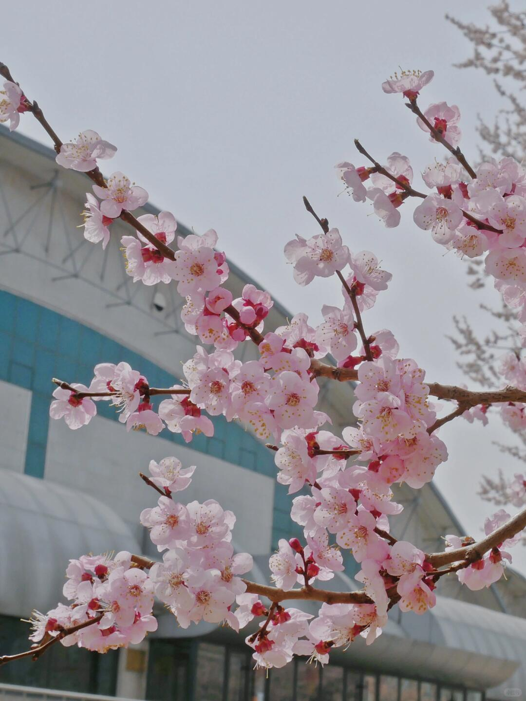
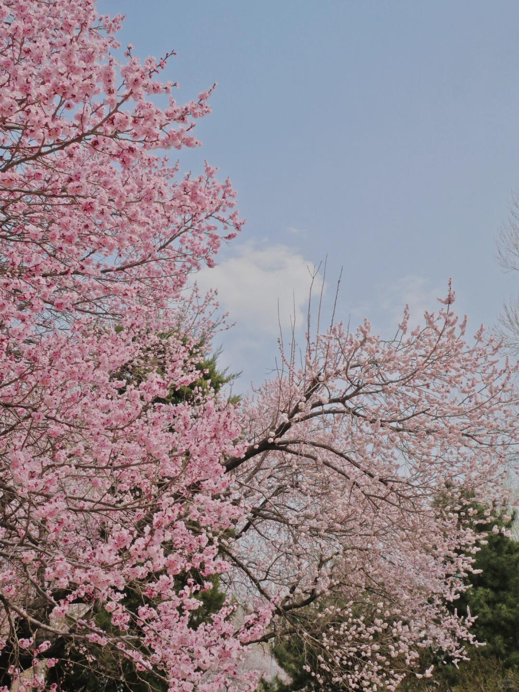
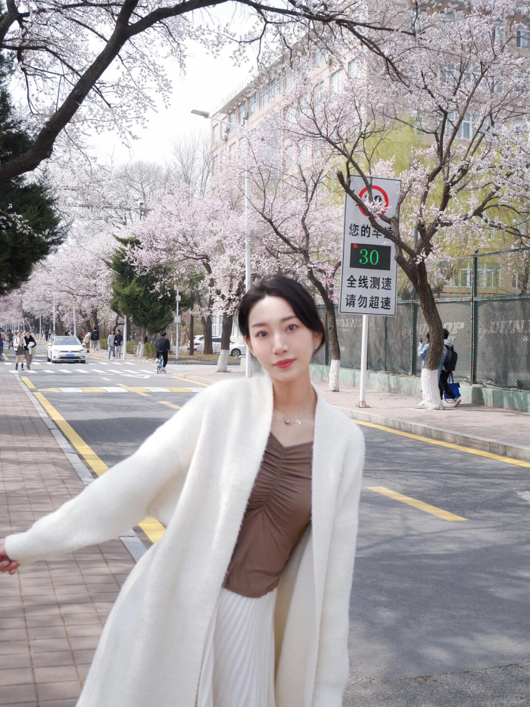
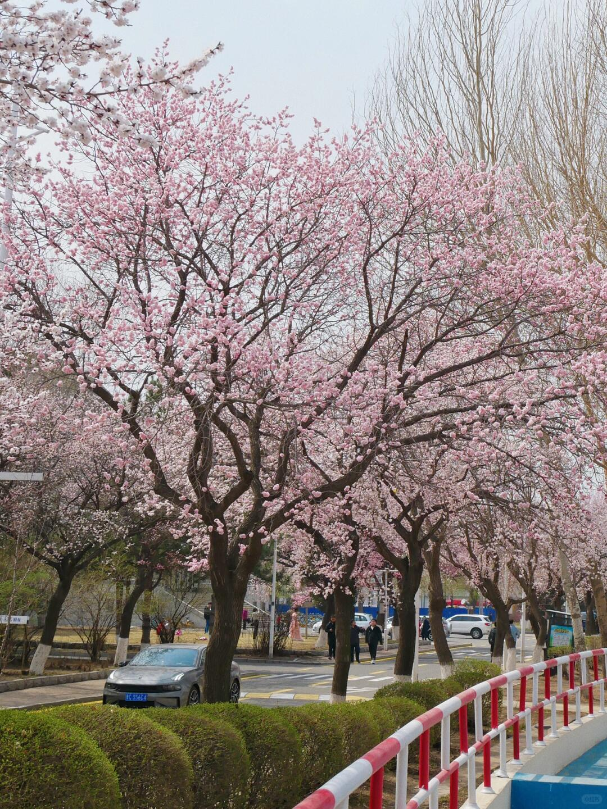
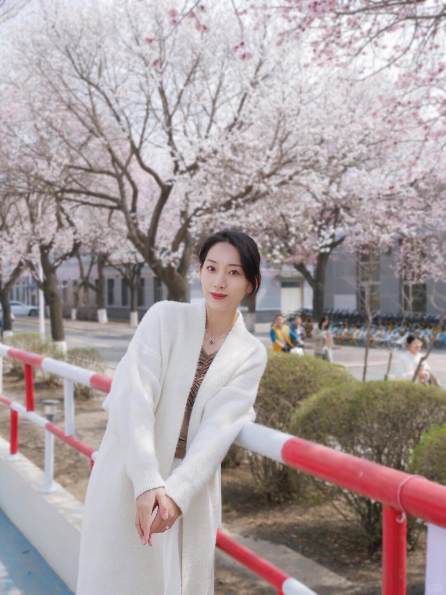
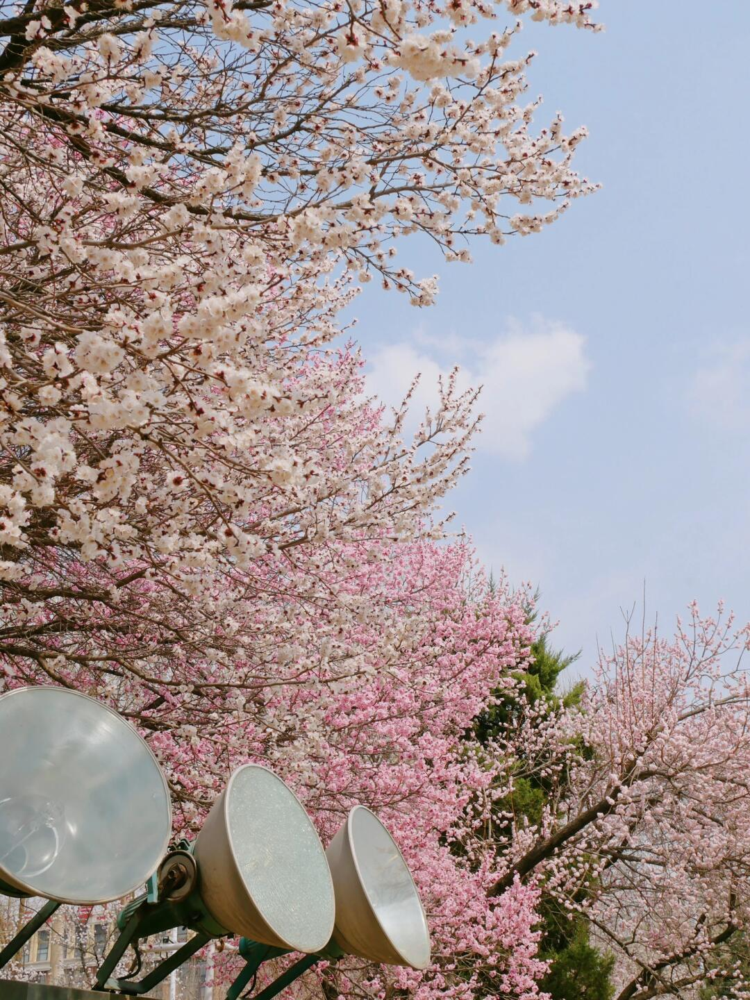
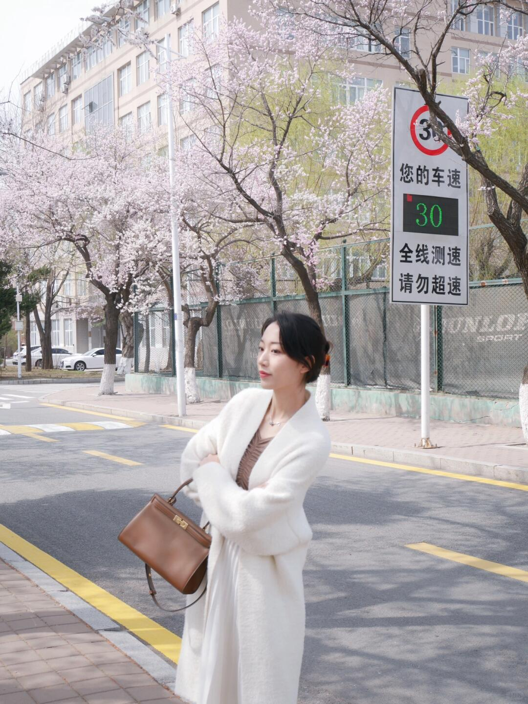
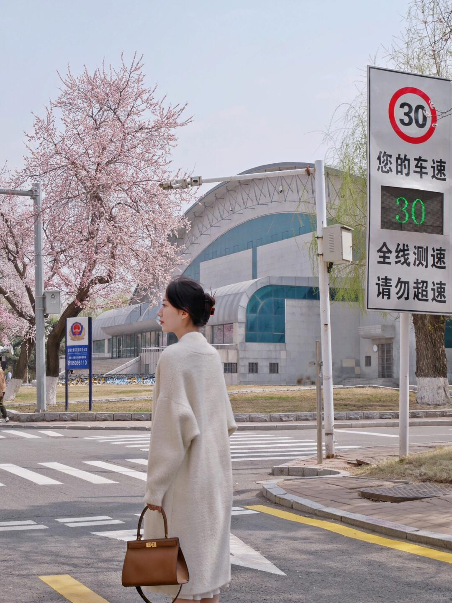

# 每日摄影教练 - 2026-08-10

---

# 风光/自然

## #1 风光/自然

**摄影师**: [Wolfgang Hasselmann](https://unsplash.com/@wolfgang_hasselmann)
 | **来源**: [Unsplash](https://unsplash.com/photos/body-of-water-near-mountain-under-blue-sky-during-daytime-4QmWIFKwL0g)

> EXIF: Camera SONY SLT-A77V | 1/100s | ISO 100

## 直觉
这张卢加诺湖最动人的是“日落后的蓝调宁静”：山体剪影、湖面倒影和远处城市灯感，形成很舒服的层次。天空留白充足，让画面有呼吸感。

## 技法拆解
- 1/100s、ISO100 保证了画质干净，也避免手持拍摄时湖岸建筑轻微发虚。
- 山体被压成剪影是合理选择，重点放在天空余晖与水面反光。
- 构图上地平线略低于中线，湖面倒影占比足够，增强了宁静感。
- 左侧树影较重，但也起到前景框景作用，可稍微裁掉一点避免压迫。
- 色彩以蓝色为主、暖色云霞点缀，冷暖对比自然耐看。

## 实拍操作（佳能 R10）
模式拨盘选 **Av 光圈优先**：风光拍摄优先控制景深，相机会自动给出合适快门。推荐 **f/8，1/80s 以上，ISO100-400，评价测光，单次自动对焦 AF-S，单点或小区域对焦**，对焦在远处山体/建筑交界处。镜头可用 **RF-S 18-45mm 或 RF-S 18-150mm**，焦段建议 **18-24mm** 拍广阔湖景；若想压缩山城层次，用 **35-50mm**。现场先贴近湖边降低机位，把倒影纳入画面；等太阳落山后 10-20 分钟蓝调出现；云彩和水面反光最亮时连拍 2-3 张，避免水纹破坏倒影。

## 后期思路
后期方向是保留清冷蓝调，同时找回天空和湖面细节。可降低高光、提升阴影少许，白平衡略偏冷，适度增加自然饱和度与清晰度。局部用渐变工具压暗天空、提亮湖面反光，让山体剪影更稳。

## #2 风光/自然

**摄影师**: [Daniel J. Schwarz](https://unsplash.com/@danieljschwarz)
 | **来源**: [Unsplash](https://unsplash.com/photos/white-van-on-road-during-daytime-x9cKqofUATo)

> EXIF: Camera Canon Canon EOS 6D Mark II | f/2.8 | 1/250s | 51.0mm | ISO 100

## 直觉
这张照片最迷人的是“旅途将停未停”的氛围：夕阳染亮远山，车停在路边，故事感很强。公路白线把视线自然引向山体和旅馆，画面有明确的目的地感。

## 技法拆解
- 51mm 视角压缩了车辆、建筑与远山的距离，让背景更有存在感。
- f/2.8 让车身清晰、远山略柔，强化了前景主体的旅行叙事。
- 1/250s、ISO100 在黄昏仍保持干净画质，也避免手持抖动。
- 构图上车占右侧大面积，左侧道路留出引导线，平衡且有方向。
- 暖色夕照与冷灰车身形成对比，提升了情绪层次。

## 实拍操作（佳能 R10）
模式拨盘选 **Av 光圈优先**，因为这类风光旅拍更需要控制景深与氛围，快门交给相机即可。建议用 **RF-S 18-150mm** 或 **RF 50mm F1.8**；在 R10 上可用 32-35mm 获得接近全画幅 50mm 的视角。参数可设 **f/2.8-f/4、1/250s以上、ISO100-400、评价测光、单次自动对焦 One Shot、单点或小区域对焦**，对在车身窗框或后部边缘。现场先低机位靠近路肩，让白线进入画面；等夕阳打到山峰最暖时拍；按快门前检查车尾不要贴边太死，保留一点呼吸感。

## 后期思路
后期重点保留黄昏暖调，适当降低高光、拉回天空层次，提升阴影让车身细节出来。色彩可往橙青方向微调：山峰和云偏暖，暗部略冷。用局部蒙版轻提远山清晰度，车身反光不要过度锐化。

## #3 风光/自然

**摄影师**: [Scott Lord](https://unsplash.com/@darkcatimages)
 | **来源**: [Unsplash](https://unsplash.com/photos/a-very-large-star-in-the-middle-of-the-night-sky-P3MsdSRWprA)

## 直觉
这张 IC2118 最迷人的是“女巫头”暗淡反射星云被拉出丝状结构，像烟雾漂浮在密集星场里。蓝白色星云与暖色恒星形成了很好的冷暖对比。

## 技法拆解
- 这类深空题材核心不是单张曝光，而是长时间累计曝光与后期叠加。
- 构图上星云斜向贯穿画面，有流动感，但右下略满，可再留一点呼吸空间。
- 星点控制较好，说明跟踪、对焦和叠加精度不错。
- 星云层次已经显现，但背景略偏灰，暗部反差还可更干净。

## 实拍操作（佳能 R10）
模式拨盘选 **M 手动模式**，因为深空摄影需要固定光圈、快门和 ISO，避免相机自动改变曝光。推荐使用赤道仪：光圈 f/5.6-f/7.1，单张 60-180 秒，ISO 800-1600，评价测光即可，对焦用 MF，放大 10 倍对亮星精确对焦。镜头可选 RF 100-400mm，或 RF 70-200mm；R10 有 1.6 倍裁切，200-400mm 很适合拍 IC2118 这类目标。现场先极轴对准，再用猎户座附近亮星完成构图和对焦，连续拍摄 1-3 小时，并补拍暗场、平场、偏置场。

## 后期思路
后期重点是“校准叠加 + 拉伸星云”，先去噪、去渐变，再小心提升曲线和对比度。色彩方向保持冷蓝星云与暖色星点，不要过度饱和；可用星点缩小、局部对比和蒙版让女巫头结构更突出。

---

# 人像/质感

## #4 人像/质感

**摄影师**: [mehrab zahedbeigi](https://unsplash.com/@estoymhrb)
 | **来源**: [Unsplash](https://unsplash.com/photos/a-woman-in-a-black-jacket-and-red-sunglasses-o2GpKJuFCpI)

> EXIF: Camera Canon  EOS 760D | f/1.4 | 1/100s | 24.0mm | ISO 400

## 直觉
这张人像最有吸引力的是“黑色质感 + 红色眼镜”的反差，人物从暗背景里跳出来。左侧文字墙提供了街头感，但不会抢走主体。

## 技法拆解
- EXIF：f/1.4、1/100s、ISO400，浅景深很好地虚化了左侧文字，突出人物脸部。
- 24mm 在 APS-C 上约等效 38mm，既有人像亲近感，又保留环境信息。
- 黑衣黑背景容易糊在一起，这张靠脸部亮度和红色眼镜建立视觉焦点。
- 构图上人物偏右，左侧文字形成引导与平衡，画面不空。
- 快门 1/100s 略保守，拍人像建议再快一点，避免轻微糊脸。

## 实拍操作（佳能 R10）
模式拨盘选 **Av 光圈优先**，因为这类照片核心是控制背景虚化和人物质感。推荐参数：光圈 f/1.8-f/2.2，快门尽量不低于 1/160s，ISO 400-800，评价测光，伺服 AF，人物眼睛检测 + 全区域 AF。镜头建议用 **RF 24mm F1.8**，想更压缩脸型可用 **RF 35mm F1.8**。现场先让模特靠近深色墙面，身体微侧、脸转向有光的一边；等待柔和侧光或橱窗光落在脸上；对焦眼睛，在笑容最自然时连拍 2-3 张。

## 后期思路
后期走低饱和、暗调街头质感：压暗背景和黑位，但保留衣服层次。适当提亮脸部曝光与眼神光，红色眼镜和橙色文字可单独增强一点饱和度，形成视觉记忆点。

## #5 人像/质感

**摄影师**: [mehrab zahedbeigi](https://unsplash.com/@estoymhrb)
 | **来源**: [Unsplash](https://unsplash.com/photos/a-woman-in-a-white-coat-and-hat-leaning-against-a-wall-mwYoLp0UFHY)

> EXIF: Camera Canon  EOS 760D | f/1.8 | 1/250s | 50.0mm | ISO 100

## 直觉
白色绒外套和深绿墙面形成很强的质感反差，人物姿态放松但有气场。墨镜、帽子和低饱和背景，让画面有街拍时尚感。

## 技法拆解
- f/1.8 大光圈让背景墙面轻微虚化，突出人物脸部与服装纹理。
- 1/250s 足够冻结人物姿态，适合这种轻微摆拍人像。
- ISO 100 保证了干净画质，白色衣服的细节保留较好。
- 构图上人物略偏左，墙面线条形成斜向延伸，增加画面张力。
- 光线偏柔，适合表现皮肤和绒毛材质，但白衣高光要注意别过曝。

## 实拍操作（佳能 R10）
模式拨盘选 **Av 光圈优先**，因为这类人像重点是控制虚化和质感。推荐参数：f/1.8-f/2.2，快门不低于 1/250s，ISO 100-400，评价测光，伺服 AF 或单次 AF，眼部检测+人脸追踪。镜头建议用 **RF 50mm F1.8 STM**，在 R10 上等效约 80mm，很适合半身人像。现场让模特靠近深色墙面，摄影师略低机位拍摄；等柔和侧光或阴天光，提示模特抬手、转头，在姿态最松弛的一瞬间连拍。

## 后期思路
整体往低饱和、冷调时尚感走，压暗背景、保留白衣层次。重点调整高光、白色色阶和纹理，人物皮肤可轻微提亮，墨镜和墙面适当加对比，强化酷感。

## #6 人像/质感

**摄影师**: [Birgith Roosipuu](https://unsplash.com/@msbirgith)
 | **来源**: [Unsplash](https://unsplash.com/photos/womens-brown-leather-peep-toe-heeled-shoes-NepvJNg0iXU)

> EXIF: Camera Canon Canon EOS 6D | f/5.0 | 1/180s | 25.0mm | ISO 200

## 直觉
这张平铺静物最吸引人的是“裸色高跟鞋 + 时尚杂志”的质感呼应，画面有轻奢、女性化的生活方式氛围。高光反射让漆皮鞋成为视觉主角。

## 技法拆解
- 俯拍构图干净，鞋子形成对角线，把视线从左下引到右上。
- 白色床品作为背景，降低干扰，但保留轻微褶皱，画面不死板。
- EXIF 为 f/5、1/180s、ISO200，景深足够覆盖鞋和杂志，手持也安全。
- 25mm 在全画幅上有轻微广角感，适合平铺，但边缘需注意变形。
- 色彩以奶白、裸粉、淡肤色为主，统一且有高级感。

## 实拍操作（佳能 R10）
模式拨盘选 **Av 光圈优先**，因为这类静物重点是控制景深和画面质感，快门交给相机即可。推荐参数：光圈 **f/5.6-f/8**，快门保持 **1/125s 以上**，ISO **100-400**，评价测光，曝光补偿 **+0.3 到 +0.7EV**，对焦用 **单次 AF + 单点/小区域 AF** 对准鞋头或鞋面反光边缘。镜头可用 **RF-S 18-45mm** 的 18-24mm，或 **RF 24mm F1.8**；R10 上等效约 29-38mm，比较适合平铺。现场先靠近窗边用柔和侧光，把杂志斜放，再让两只鞋形成交叉对角线；站到正上方，保持相机与画面平行，等云层柔光或用白纱柔化阳光后再拍。

## 后期思路
后期走明亮、柔和、轻奢方向：提高曝光和白色，压一点高光保住漆皮反射。适当降低杂色、提升清晰度/纹理在鞋面，色温微暖，裸粉色可稍加饱和但避免过艳。

---

# 街头/人文

## #7 街头/人文

**摄影师**: [L'Odyssée Belle](https://unsplash.com/@lodyssee_belle)
 | **来源**: [Unsplash](https://unsplash.com/photos/boy-sitting-on-bench-beside-bookshelf-IMtEliM53Lc)

## 直觉
这张有很好的街头人文气质：流动书摊、树荫、低头阅读的人，安静而有故事。最动人的是“城市公共空间里的阅读感”，人物不摆拍，状态自然。

## 技法拆解
- 构图上书摊居中，人物放在右侧长椅，形成“书与读者”的关系，叙事清楚。
- 树叶作为上方前景，制造遮挡和层次，也让画面更像被偶然看见。
- 光线是强烈日光加树荫，反差较大，亮部地面略抢眼，拍摄时可稍微压曝光。
- 色彩偏淡、带一点胶片感，适合街头人文，不必追求过高饱和。
- 人物动作很好，低头阅读让画面有停顿感，比看镜头更自然。

## 实拍操作（佳能 R10）
模式拨盘建议用 **Av 光圈优先**，街头环境变化快，先控制景深，让相机自动匹配快门。推荐 **f/5.6-f/8，1/250s 以上，ISO 100-400，评价测光，曝光补偿 -0.3EV 到 -0.7EV**，避免阳光地面过曝；对焦用 **单次 AF 或伺服 AF，区域 AF/单点 AF 对准人物或书摊**。镜头可用 **RF-S 18-45mm 的 24-35mm 段**，或 **RF 35mm F1.8**，在 R10 上接近标准视角。现场先站到书摊正前略远处，保持画面水平；等人物低头阅读、周围路人不干扰时按快门；可连拍两三张，选动作最安静的一张。

## 后期思路
后期方向走清淡胶片感：降低高光、稍提阴影，保留树荫的柔和层次。白平衡可略偏暖，绿色适当降低饱和，避免公园背景太抢。最后可轻微加颗粒和暗角，把视线收回书摊与读者。

## #8 街头/人文

**摄影师**: [Guillaume Meurice](https://unsplash.com/@sliceisop)
 | **来源**: [Unsplash](https://unsplash.com/photos/a-sunset-behind-a-building-jhQdoH53uJo)

> EXIF: Camera SONY ILCE-7M2 | f/1.8 | 1/5000s | 55.0mm | ISO 50

## 直觉
夕阳把门洞、树影和行人压成剪影，画面有很强的“偶遇感”。最动人的是人物刚好走进金色光带，形成街头人文的瞬间戏剧性。

## 技法拆解
- 逆光曝光处理果断，暗部几乎全黑，让视线集中在夕阳与人物轮廓上。
- EXIF 用 f/1.8、1/5000s、ISO50，说明现场光很强，浅景深同时保住高光。
- 门洞和两侧黑影形成天然框架，中间亮区像舞台。
- 地面反光增加了纵深，也把人物与环境连接起来。
- 人物略小，但位置准确，正好落在光线最亮的视觉中心附近。

## 实拍操作（佳能 R10）
模式拨盘选 **Av 光圈优先**：这类逆光街拍变化快，先控制光圈和曝光补偿，让相机自动给快门。推荐 **f/2-f/2.8，ISO100，评价测光或高光优先测光，曝光补偿 -1 到 -2EV，伺服 AF，区域对焦**；快门尽量保持在 **1/1000s 以上**。镜头可用 **RF 35mm F1.8 Macro IS STM**，在 R10 上接近 56mm 视角；或 RF-S 18-150mm 拉到 35-50mm。现场先站在阴影里找门洞框架，压低曝光等人物进入光带，人物脚步与身体轮廓完整时连拍。

## 后期思路
后期重点保留剪影感，不要强行拉亮暗部。可降低高光、加强暖色温与对比，适度加一点去雾和暗角，让夕阳更浓、街头氛围更沉静。

## #9 街头/人文

**摄影师**: [Norbert Braun](https://unsplash.com/@medion4you)
 | **来源**: [Unsplash](https://unsplash.com/photos/people-walking-on-a-sidewalk-in-front-of-a-building-uN2XWF26rFA)

> EXIF: Camera SONY ILCE-7RM3 | f/3.2 | 1/4000s | 85.0mm | ISO 100

## 直觉
巨大的圆形建筑像一个舞台框，底部行人被压得很小，形成强烈的尺度反差。几何秩序与街头瞬间结合，是这张照片最有力量的地方。

## 技法拆解
- 构图核心是“圆中有线、线下有人”，建筑图形先抓眼，人物提供故事和比例。
- 原片 85mm 视角压缩空间，让墙面更平整，几何感更强。
- f/3.2、1/4000s、ISO100 保证画质和凝固行人，但建筑题材其实不需要这么大光圈。
- 光线偏硬，阴影弧线正好强化了圆形结构，是关键时机。
- 人物分布在画面底部，留出大量建筑空间，街头感更冷静克制。

## 实拍操作（佳能 R10）
模式拨盘选 **Av 光圈优先**：这类建筑街头需要先控制景深和画质，让相机自动给快门。推荐 **f/5.6-f/8，ISO100，快门不低于1/500s，评价测光，伺服AF，区域AF或小区域AF**；若光很强可自动达到高速快门。镜头建议用 **RF-S 18-150mm** 的 70-100mm 端，或 **RF 85mm F2**，在 R10 上等效更长，适合压缩建筑立面。现场先退远，保持相机水平，让圆形边缘尽量端正；观察阳光阴影是否形成好看的弧线；等人物走到圆下方、彼此有间距时连拍 3-5 张。

## 后期思路
后期以“干净、冷静、几何感”为方向。适当提升对比度和清晰度，压低高光，拉开墙面与百叶窗的层次；用透视校正保持垂直线笔直，轻微裁切让圆更居中，人物不要提亮过度。

---

# 小红书｜人像写真

## #10 小红书｜人像写真

**摄影师**: [Yeeton](https://www.xiaohongshu.com/user/profile/5a450c704eacab1b35e76f42)
 | **来源**: [小红书](https://www.xiaohongshu.com/explore/643a5d6900000000130363ba?xsec_token=ABwMlOi53Bwe0jUAImDKByPTtTgJa-beEud-VpuGweXr4%3D&xsec_source=pc_feed)

## 直觉
春日校园感很明确：杏花、白色针织和浅色建筑一起，营造出柔和、干净的“小红书踏春照”氛围。人物手势轻松，有赴一场花事的生活感。

## 技法拆解
- 画面整体偏高调，白衣与杏花统一，适合春日写真，但人物脸部位置略暗，建议拍摄时适当补光或加曝光补偿。
- 右侧测速牌信息量太强，抢走了杏花和人物的注意力，构图上可再向左移动或用更大光圈虚化。
- 人物站在斑马线前，线条有一定引导性，但背景建筑、路牌、树枝较杂，主体分离不够。
- 色彩以白、粉、浅灰为主，氛围柔和，符合校园杏花主题。

## 实拍操作（佳能 R10）
模式拨盘建议用 **Av 光圈优先**，方便控制背景虚化和春日高调感。参数可设 **F2.8-F4、1/500s 以上、ISO 100-400、评价测光、人像/眼部检测 AF，区域用全区域或灵活区域**；若背景太亮，曝光补偿 +0.3EV 到 +0.7EV。镜头推荐 **RF 50mm F1.8** 拍半身，或 **RF-S 18-150mm 拉到 50-80mm** 压缩背景。现场先让人物离背景花树远一点，避开右侧大路牌；摄影师稍微后退，用中长焦拍半身；等微风吹花枝、人物抬手回头或微笑时连拍。

## 后期思路
后期走清透春日感：提高曝光和阴影，压一点高光，保持白衣细节。色彩上降低黄绿饱和度，提升粉色/洋红亮度，让杏花更柔；可用局部蒙版提亮人物脸部，并适当裁掉右侧干扰物。

## #11 小红书｜人像写真

**摄影师**: [Yeeton](https://www.xiaohongshu.com/user/profile/5a450c704eacab1b35e76f42)
 | **来源**: [小红书](https://www.xiaohongshu.com/explore/643a5d6900000000130363ba?xsec_token=ABwMlOi53Bwe0jUAImDKByPTtTgJa-beEud-VpuGweXr4%3D&xsec_source=pc_feed)

## 直觉
这张最舒服的是“校园建筑 + 杏花”的春日语境：花枝轻盈、粉色柔和，有赴一场花事的清淡氛围。背景里的教学楼交代了吉大南岭校区，但没有抢走花的主体。

## 技法拆解
- 构图用斜向花枝贯穿画面，形成自然引导线，比正面拍一团花更有生长感。
- 背景建筑略虚、色彩偏冷，反衬杏花的粉白，校园感成立。
- 逆光/侧逆光让花瓣有通透感，但天空偏亮，花瓣高光略容易溢出。
- 画面右侧花量较密，左上留白多，适合小红书封面加标题文字。

## 实拍操作（佳能 R10）
模式拨盘选 **Av 光圈优先**，拍花需要优先控制虚化和通透感，交给相机匹配快门更稳。推荐 **F4-F5.6、1/500s 以上、ISO 100-400、评价测光、单次AF，单点/小区域对焦**，对准最前方花蕊。镜头可用 **RF-S 18-150mm 的 70-120mm 段**，或 **RF 50mm F1.8** 靠近拍，压缩背景更干净。现场先站到花枝下方一点，仰拍带入教学楼；等阳光从花瓣背后透过时拍；按快门前微调角度，避开杂乱枝条，让主花落在画面中上或右侧三分线。

## 后期思路
整体往“小红书春日清透感”走：提高曝光一点、压高光，保住花瓣层次。色彩上降低蓝青饱和度，轻提粉色/洋红明度，让杏花更柔；最后加少量锐化和轻微颗粒，保持自然校园纪实感。

## #12 小红书｜人像写真

**摄影师**: [Yeeton](https://www.xiaohongshu.com/user/profile/5a450c704eacab1b35e76f42)
 | **来源**: [小红书](https://www.xiaohongshu.com/explore/643a5d6900000000130363ba?xsec_token=ABwMlOi53Bwe0jUAImDKByPTtTgJa-beEud-VpuGweXr4%3D&xsec_source=pc_feed)

## 直觉
粉色杏花从左侧铺满画面，右上留出大面积蓝天，春天的轻盈感很直接。它更像一张“小红书赏花打卡”的环境铺垫图，适合接在人像组图前面交代氛围。

## 技法拆解
- 构图上用左侧密集花枝和右上天空形成疏密对比，画面有呼吸感。
- 低机位略微仰拍，让花枝伸向天空，避开地面杂乱和人群。
- 粉花、蓝天、深绿树丛形成春日配色，但整体曝光略保守，花色稍灰。
- 枝条线条较多，主体不够集中；若做人像写真，可让人物站在右下或花枝空隙处。

## 实拍操作（佳能 R10）
模式拨盘选 **Av 光圈优先**，方便控制景深和背景虚化，适合边走边拍花景与人像。推荐 **f/4-f/5.6，1/500s 以上，ISO 100-400，评价测光，曝光补偿 +0.3EV；伺服 AF 或单次 AF，区域对焦/人眼识别按有无人切换**。镜头可用 **RF-S 18-150mm** 的 35-70mm 段拍环境压缩感，或 **RF 50mm F1.8** 拍人像半身。现场先找花枝最密的一侧，站在树下向上取景；等云薄、光线柔和时拍；按快门时让花枝做前景，人物可侧身抬头看花，避开正午硬光。

## 后期思路
整体往清透春日感走：提高曝光和阴影，轻降高光，保住蓝天层次。粉色可在 HSL 中适度提高明度、降低一点饱和，避免俗艳；再加少量暖色温和柔化，让画面更贴近“小红书花事写真”的温柔氛围。

## #13 小红书｜人像写真

**摄影师**: [Yeeton](https://www.xiaohongshu.com/user/profile/5a450c704eacab1b35e76f42)
 | **来源**: [小红书](https://www.xiaohongshu.com/explore/643a5d6900000000130363ba?xsec_token=ABwMlOi53Bwe0jUAImDKByPTtTgJa-beEud-VpuGweXr4%3D&xsec_source=pc_feed)

## 直觉
这张有很强的“春日校园赴花约”氛围，杏花大道、白色针织和轻微摆动的身体，让画面很像小红书里的随拍写真。最可惜是人物脸部位置被路牌和树枝环境抢了注意力，主体不够干净。

## 技法拆解
- 构图用了道路纵深线，把视线带向花树深处，校园感很自然。
- 人物放在前景偏右，身体动态不错，但路牌贴近头部，背景信息略杂。
- 光线是阴晴交界的柔光，适合拍浅色穿搭，皮肤和白衣不会太硬。
- 色彩以粉白、灰绿、米白为主，符合“杏花春日”调性，但整体略灰，可再提亮通透感。
- 若想更写真，建议再靠近人物、压低机位，让花枝形成更明显的上方框景。

## 实拍操作（佳能 R10）
模式拨盘选 **Av 光圈优先**，方便在行走抓拍中优先控制背景虚化和人像质感。推荐 **f/2.8-f/4，1/500s 以上，ISO Auto，评价测光，Servo AF，人物眼部识别+全区域/灵活区域**；若逆光偏亮，曝光补偿加 **+0.3 到 +0.7EV**。镜头可用 **RF-S 18-150mm 的 50-85mm 段**，或 **RF 50mm F1.8** 拍更柔和背景。现场先让人物站到花树下、避开路牌贴头；摄影师退到马路斜前方，用道路线条做引导；让人物轻轻转身或拉袖口，等衣摆有动态时连拍。

## 后期思路
整体走“清透春日校园”方向：提高曝光和阴影，适度降低高光，保住白衣细节。色彩上粉色花朵可轻微提高饱和和明度，绿色压一点黄绿，背景杂物可用裁切或修复工具弱化，让人物和杏花更突出。

## #14 小红书｜人像写真

**摄影师**: [Yeeton](https://www.xiaohongshu.com/user/profile/5a450c704eacab1b35e76f42)
 | **来源**: [小红书](https://www.xiaohongshu.com/explore/643a5d6900000000130363ba?xsec_token=ABwMlOi53Bwe0jUAImDKByPTtTgJa-beEud-VpuGweXr4%3D&xsec_source=pc_feed)

## 直觉
粉白杏花铺满校园道路，春天的“赶赴花事”氛围很到位。最可惜的是红白护栏和车辆偏抢眼，削弱了小红书人像写真的清爽感。

## 技法拆解
- 构图上花树占比足，形成繁花压顶的沉浸感，但右下护栏颜色太跳，建议避开或虚化。
- 光线是阴天散射光，适合拍花和人像，反差柔和，不容易死白。
- 画面层次有前景花枝、中景树干、远处校园路面，但主体人物不明确。
- 粉色花朵与灰蓝天空偏淡，适合走“日系校园春日”色调。

## 实拍操作（佳能 R10）
模式拨盘选 **Av 光圈优先**，方便控制背景虚化和花枝层次，适合边走边拍。推荐 **f/2.8-f/4、1/500s 以上、ISO 100-400、评价测光，伺服 AF，人眼识别/区域对焦**；若拍纯风景可用 f/5.6。镜头建议 **RF-S 18-150mm** 拉到 50-85mm，或 **RF 50mm F1.8** 拍半身人像。现场先站到护栏外侧，避开车和杂物；让人物站在花树下或道路弯曲处，等风小、路人少时按快门；略微仰拍，把花冠压进画面，保留一点天空呼吸感。

## 后期思路
整体往清透、柔粉、校园春日方向调：提高曝光和阴影，压一点高光，避免花瓣过白。HSL 里降低红色/橙色饱和，提升粉色明度；用裁剪或修复工具弱化护栏、车牌和杂乱路人，让画面更像“杏花大道写真”。

## #15 小红书｜人像写真

**摄影师**: [Yeeton](https://www.xiaohongshu.com/user/profile/5a450c704eacab1b35e76f42)
 | **来源**: [小红书](https://www.xiaohongshu.com/explore/643a5d6900000000130363ba?xsec_token=ABwMlOi53Bwe0jUAImDKByPTtTgJa-beEud-VpuGweXr4%3D&xsec_source=pc_feed)

## 直觉
杏花大道的浅粉花海和白色开衫很搭，有一种“赶赴春天”的轻柔感。人物微微侧靠栏杆，姿态自然，适合小红书春日写真氛围。

## 技法拆解
- 背景花量充足，虚化让画面更梦幻，但红白栏杆存在感偏强，稍微抢视线。
- 人物放在画面中下部，头顶留出大片花枝，春日环境交代得好。
- 白衣和浅粉花容易过曝，当前亮度舒服，但脸部若保留应注意不要被阴影压暗。
- 机位略高或人物前倾，身体线条有点被压短，可稍低机位改善比例。

## 实拍操作（佳能 R10）
模式拨盘选 **Av 光圈优先**，方便控制背景虚化和春日通透感。推荐参数：光圈尽量开大，RF-S 套头用 45-70mm、f/5.6-f/6.3；若有 RF 50mm F1.8，可用 f/2-f/2.8，快门保持 1/500s 以上，ISO Auto，评价测光，曝光补偿 +0.3EV，伺服 AF + 人眼识别。镜头建议 RF 50mm F1.8 或 RF-S 18-150mm 拉到 50-80mm。现场先让人物离背景花树远一点，靠近栏杆但避开红色横杆穿过身体；摄影师后退用中长焦压缩花海；等风小、表情放松时连拍 3-5 张。

## 后期思路
整体往“清透春日、低饱和粉白”方向走。降低红色栏杆饱和度和明度干扰，适当提升曝光、阴影和肤色亮度；花朵可加一点粉色饱和与柔和清晰度，保留空气感。

## #16 小红书｜人像写真

**摄影师**: [Yeeton](https://www.xiaohongshu.com/user/profile/5a450c704eacab1b35e76f42)
 | **来源**: [小红书](https://www.xiaohongshu.com/explore/643a5d6900000000130363ba?xsec_token=ABwMlOi53Bwe0jUAImDKByPTtTgJa-beEud-VpuGweXr4%3D&xsec_source=pc_feed)

## 直觉
这张照片有很强的“校园春日赴约感”：杏花从左上铺满画面，蓝天留白干净，路灯作为前景让场景不只是花海，而有了南岭校园的识别度。

## 技法拆解
- 构图上用花枝形成斜向包围，右侧蓝天留白，让画面不闷，适合小红书春日氛围。
- 前景路灯有些抢眼，但也增加了校园感；如果拍人像，可让人物站在灯后或花树下形成层次。
- 光线偏柔，花的白粉色保留较好，但整体略灰，可适当增加明亮度和通透感。
- 色彩核心是粉、白、蓝，后期不要过度加饱和，否则杏花会显脏。

## 实拍操作（佳能 R10）
模式拨盘建议选 **Av 光圈优先**，春日花树/人像场景最方便控制虚化和亮度。推荐参数：光圈 **F4-F5.6**，快门保持 **1/250s 以上**，ISO 自动或 **100-400**，评价测光，曝光补偿 **+0.3EV**；对焦用 **伺服 AF + 人眼识别**，若只拍花景用单点/区域 AF 对准前景花枝。镜头可用 **RF-S 18-150mm** 的 35-70mm 段，或 **RF 50mm F1.8** 拍人像。现场先站在花树下略仰拍，把蓝天放进背景；等风小、花枝稳定时拍；若有人入镜，让人物穿浅色站在花影边缘，脸朝柔光方向。

## 后期思路
整体往“清透春日、校园写真”走：提高曝光和阴影，轻压高光保住白花层次。白平衡略偏暖，粉色/洋红适度提亮但降低一点饱和，蓝天可用 HSL 轻微提亮，让画面更干净。

## #17 小红书｜人像写真

**摄影师**: [Yeeton](https://www.xiaohongshu.com/user/profile/5a450c704eacab1b35e76f42)
 | **来源**: [小红书](https://www.xiaohongshu.com/explore/643a5d6900000000130363ba?xsec_token=ABwMlOi53Bwe0jUAImDKByPTtTgJa-beEud-VpuGweXr4%3D&xsec_source=pc_feed)

## 直觉
春日校园的杏花氛围很轻盈，白色外套和淡粉花树形成了“小红书感”的柔和调性。人物姿态自然，有一种错峰赏花、随手记录生活的松弛感。

## 技法拆解
- 整体走高调曝光，适合表现杏花的清透，但人物白衣有些接近过曝，层次略薄。
- 背景中的测速牌文字和红圈太抢眼，会分散人像主体注意力。
- 构图上人物偏下、头部靠近画面中心，若再靠近花树或压低机位，画面会更有“花路”包围感。
- 人物略有虚或快门偏慢的感觉，人像写真建议优先保证眼部清晰。
- 色彩以白、粉、浅绿为主，方向正确，可继续强化春日柔雾感。

## 实拍操作（佳能 R10）
模式拨盘选 **Av 光圈优先**，方便控制背景虚化和明亮氛围，适合这种春日人像。推荐 **光圈 F2.8-F4、快门不低于 1/500s、ISO 100-400、评价测光，曝光补偿 +0.3EV；伺服 AF + 人眼识别，对焦区域选全区域或人物追踪**。镜头可用 **RF-S 18-150mm 拉到 50-85mm**，或 **RF 50mm F1.8** 拍半身。现场先避开测速牌、垃圾桶等硬信息背景，让人物站到花树前 2-3 米；摄影师稍微后退用中长焦压缩花枝；等风小、人物转头或整理衣服的一瞬间连拍，表情和衣摆会更自然。

## 后期思路
后期建议保留高调清新感，但把高光压回一点，恢复白衣和花瓣细节。可适当提升曝光、降低对比度，微加粉色/洋红饱和度，绿色往浅黄绿偏移。局部用蒙版提亮人物脸部，弱化背景招牌和道路杂色，让画面更像“杏花大道写真”。

## #18 小红书｜人像写真

**摄影师**: [Yeeton](https://www.xiaohongshu.com/user/profile/5a450c704eacab1b35e76f42)
 | **来源**: [小红书](https://www.xiaohongshu.com/explore/643a5d6900000000130363ba?xsec_token=ABwMlOi53Bwe0jUAImDKByPTtTgJa-beEud-VpuGweXr4%3D&xsec_source=pc_feed)

## 直觉
这张有“下班后赴一场花事”的松弛感，杏花、白色大衣和校园街口共同营造出春日小红书氛围。人物背身停在斑马线前，像是故事里的一个暂停瞬间。

## 技法拆解
- 构图上用人物居中偏左，右侧测速牌形成生活化反差，增强校园街拍真实感。
- 白色大衣与浅粉杏花、淡蓝天空色调统一，画面很适合“春日温柔”方向。
- 背景信息略多，右侧牌子视觉权重很强，若想更写真，可稍微避开或用大光圈虚化。
- 光线是柔和日光，阴影不硬，适合拍浅色穿搭，但人物面部方向若再有一点侧光会更立体。

## 实拍操作（佳能 R10）
模式拨盘选 **Av 光圈优先**，方便控制背景虚化和春日氛围，街拍时也更快。推荐 **F2.8-F4、1/500s 以上、ISO 100-400、评价测光，伺服 AF + 人眼/人物识别，区域 AF**。镜头可用 **RF-S 18-150mm 的 50-80mm 段**压缩花树与人物，或 **RF 50mm F1.8**拍更柔的背景。现场先让模特站在斑马线边缘，避开杂乱路人；摄影师退后用中长焦取半身到全身；等风吹动发丝或模特回头前一瞬连拍，保留自然感。

## 后期思路
整体往“低饱和、奶油春日”走：降低高光、轻提阴影，让白衣不死白。粉色花朵可单独提高一点明度和饱和，绿色压低饱和避免抢戏；右侧标牌可适度降低清晰度或裁切弱化。